# 用 Keras 解释深度学习中激活函数的类型

> 原文：<https://blog.devgenius.io/types-of-activation-functions-in-deep-learning-explained-with-keras-cd1e0b85e003?source=collection_archive---------1----------------------->

激活是指通过点击来激活你的车吗(当然，如果有的话)，这是相同的概念，但在神经元方面，神经元就像在人脑中一样吗？，再近一点，神经元不过在人工神经网络(ANN)中。

激活函数决定一个神经元是否应该被激活。

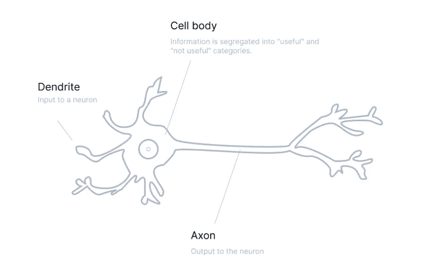

人脑中的生物神经元

如果你见过人工神经网络，我真诚地希望你见过，你已经看到它们在本质上是线性的，所以为了在它们中使用非线性，我们使用激活函数并从输入网络的输入值产生输出。

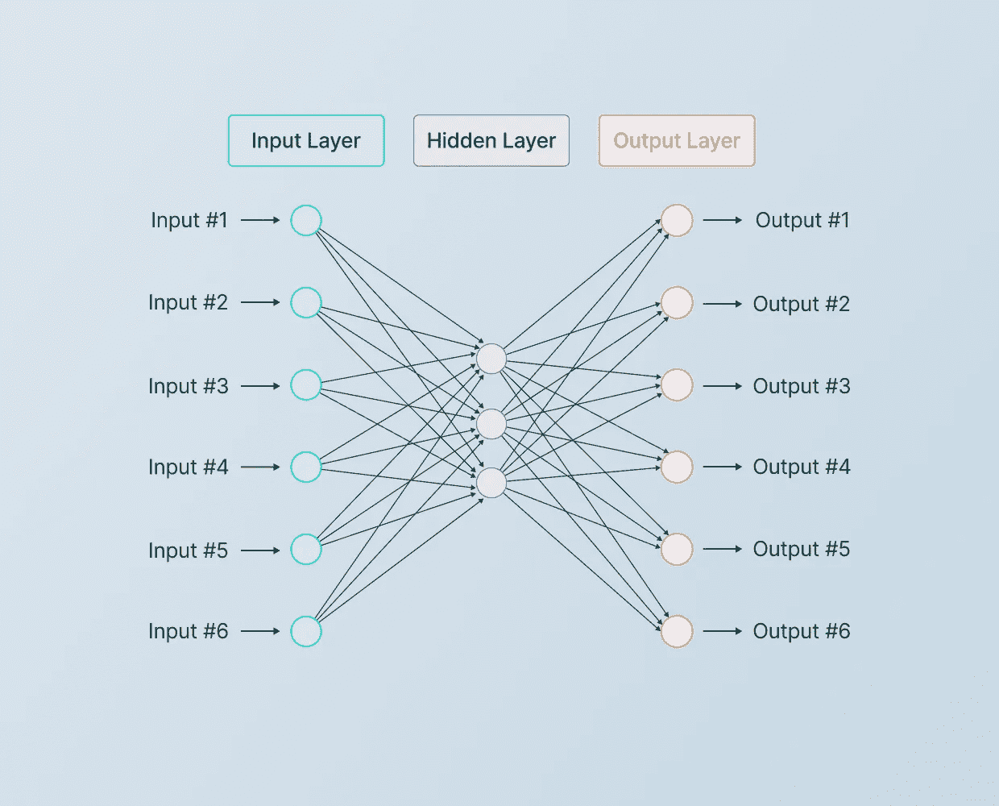

一个样本人工神经网络

激活功能可以分为三种类型

1.  **线性激活功能**
2.  **二进制步进激活功能**
3.  **非线性激活功能**

# **线性激活功能**

它与输出值成比例，它只是将加权总和添加到输出中。范围从(-∞到∞之间)。

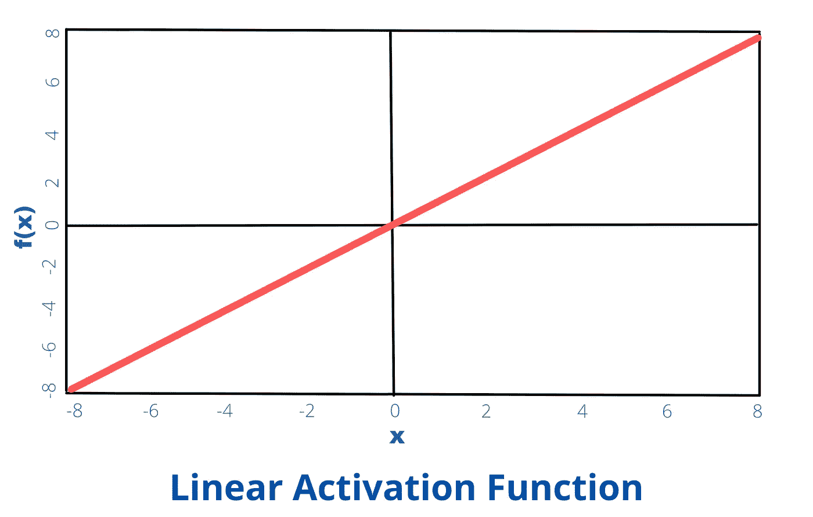

显示线性激活函数的图形

**数学上的**，同样可以写成

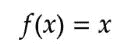

线性激活方程

Keras 中的实现如下所示，

Keras 中的线性激活函数

# 二元阶跃激活函数

它有一个特定的阈值，决定一个神经元是否应该被激活。

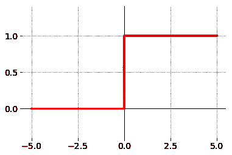

二元阶跃激活函数图

**数学上的**，这是函数的方程式

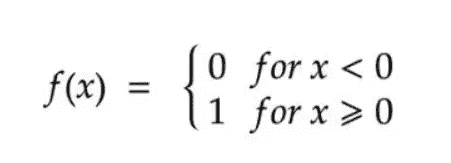

二元阶跃激活函数方程

Keras 中没有相同的实现，因此使用 TensorFlow 创建一个自定义函数，如下所示

TensorFlow 中的自定义二元步进激活函数

# 非线性激活函数

它允许人工神经网络根据各种数据进行调整，并区分输出。它允许多层的堆叠，因为输出是通过多层神经网络的输入的组合。

下面讨论各种非线性激活函数

## Sigmoid 激活函数

该函数接受输入(数字)并返回一个介于 0 和 1 之间的数字。它主要用于二进制分类，因为输出范围在 0 和 1 之间，例如，你训练一只狗和猫的分类器，不管那只狗有多毛茸茸，它都将其分类为狗而不是猫，没有中间值，sigmoid 非常适合它。

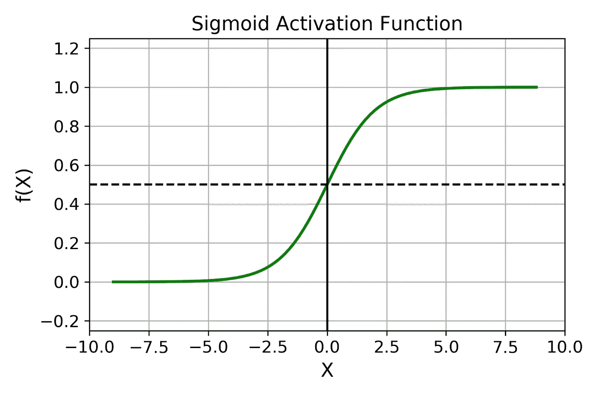

Sigmoid 函数的图形

**数学上**，等式看起来是这样的

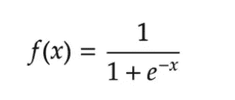

Sigmoid 函数方程

Keras 中的实现如下所示，

Keras 中的乙状结肠激活功能

## TanH 激活函数

该激活函数将该值映射到范围[ -1，1 ]中。输出以零为中心，这有助于将负输入值映射为强负值，零值映射到绝对零。

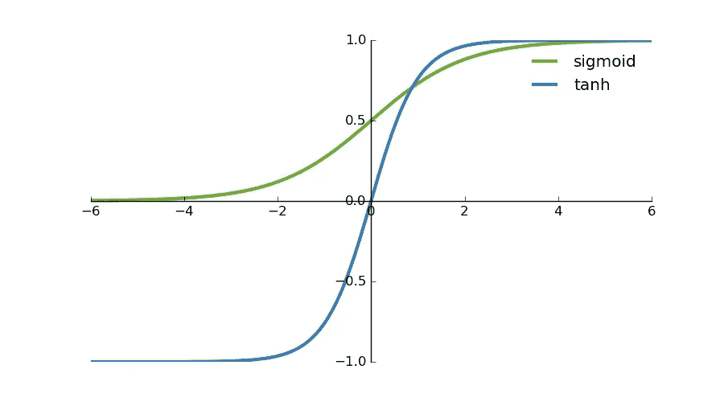

tanh 与乙状结肠的比较

**数学上**，等式看起来是这样的

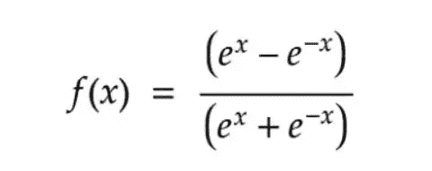

双曲正切方程

Keras 中的相同实现如下所示

Keras 中的 tanh 激活功能

## **ReLU(整流线性单元)**

它是最常用的激活函数之一，解决了函数最大值为 1 时梯度消失的问题。ReLU 的范围是[ 0，∞ ]。

比较 Sigmoid 和 ReLU 的图形

**数学上**，等式看起来是这样的

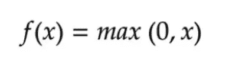

ReLU 方程

Keras 中的实现如下所示，

Keras 中的 ReLU 实现

## 泄漏 ReLU

ReLU like Covid 变体的升级版本..敏感话题…好吧..回到泄漏的 ReLU，它被升级，因为它解决了垂死的 ReLU 问题，因为它在负区域具有小的正斜率。

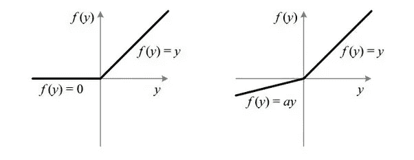

ReLU(左)和泄漏 ReLU(右)的比较

**数学上的**，等式看起来是这样的

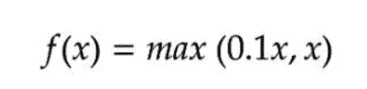

下面是 Keras 的实现

喀拉斯的漏雨

## SoftMax 激活功能

让我们猜猜看..是 tanh 吗，嗯不完全是，ReLU？没有或其泄漏的对应物..嗯，不完全是…好吧，让我们揭示它..它是许多乙状结肠的组合。它决定了相对概率。

在多类分类中，它最常用于分类器的最后一层。它给出了当前类相对于其他类的概率。

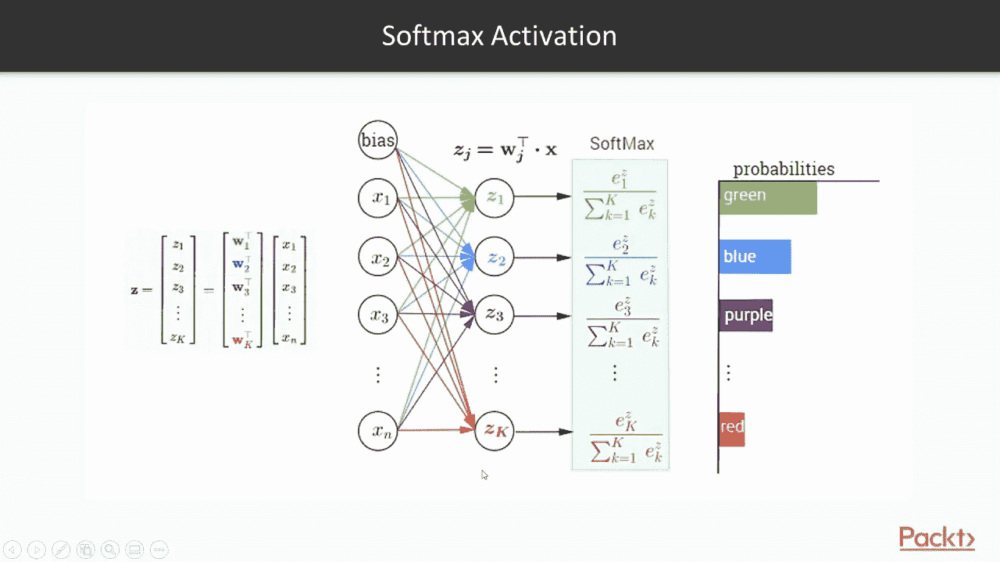

Softmax 函数示例

数学上，这个等式看起来像这样

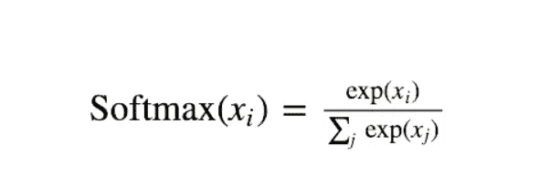

Softmax 函数方程

Keras 的实施情况如下

Keras 中的 Softmax 函数

包含上述所有代码的整个笔记本

 [## 谷歌联合实验室

### 编辑描述

colab.research.google.com](https://colab.research.google.com/drive/1PPhCPSfPrM-8Bk5fbD_GPZAckjC5bGG3?usp=sharing) 

如果你想联系我，让我们在下面的 LinkedIn 链接上联系

[https://www.linkedin.com/in/tripathiadityaprakash/](https://www.linkedin.com/in/tripathiadityaprakash/)