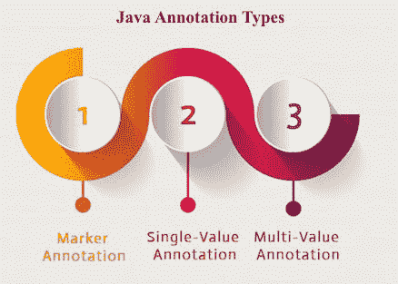
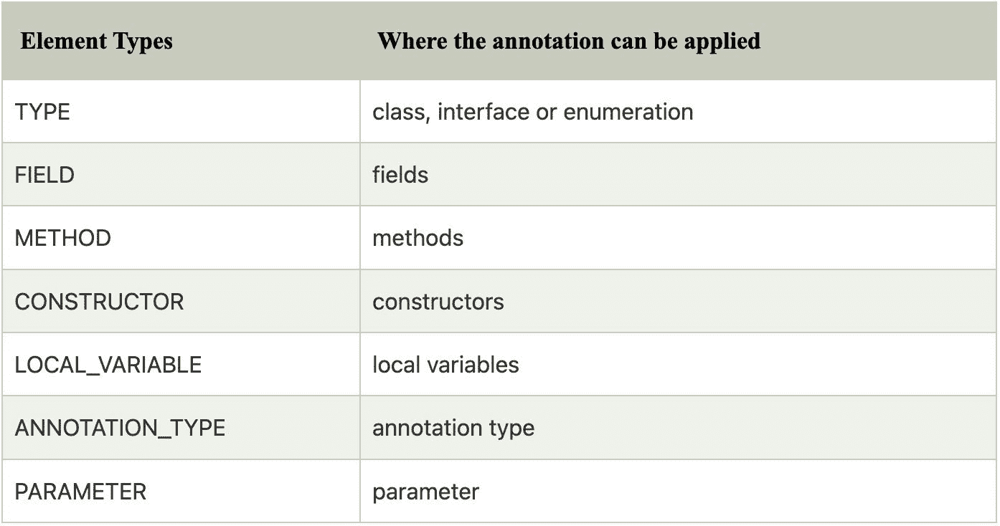
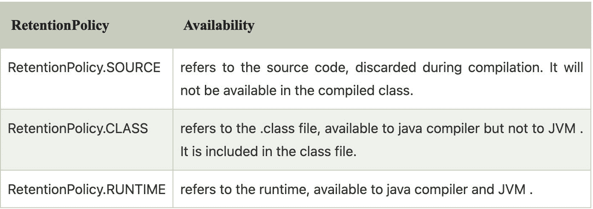

# 注释的类型

> 原文：<https://blog.devgenius.io/types-of-annotation-524b0b974adb?source=collection_archive---------3----------------------->

有三种类型的注释。

1.  标记注释
2.  单值注释
3.  多值注释



# 1)标记注释

标记注释是没有方法的注释。例如:

```
@interface MyAnnotation{}
```

使用标记注释@Override 和@Deprecated。

# 2)单值注释

单值注释是一种只包含一种方法的注释。例如:

```
@interface MyAnnotation{
int value();
}
```

我们也可以提供默认设置。例如:

```
@interface MyAnnotation{
int value() default 0;
}
```

单值注释的应用

让我们看看使用单值注释的代码。

```
@MyAnnotation(value=10)
```

该值可以是任何值。

# 3)多值注释

具有多种方法的注释称为多值注释。举个例子:

```
@interface MyAnnotaion{
int value1();
String value1();
String value2();
String value3();
}
}
```

我们还可以提供默认值。举个例子:

```
@interface MyAnnotation{
int value1() default 1;
String value2() default "";
String value3() default "xyz";
}
```

# 如何应用多值注释

让我们看看使用多值注释的代码。

```
@MyAnnotation(value1 = 10, value2 = "Arun Kumar", value3 = "Ghaziabad")
```

# java 中自定义注释中使用的内置注释

*   @目标
*   @保留
*   @继承
*   @已记录

# @目标

@Target 标记用于指定注释应用于哪种类型。

java.lang 中的注释

ElementType 枚举声明了许多常量，这些常量指定将应用批注的元素的类型，如类型、方法、字段等。让我们看看 ElementType 枚举常量:



为类指定注释的示例

```
@Target(ElementType.TYPE)
@interface MyAnnotation{
int value1();
String value2();
}
```

为类、方法或字段指定注释的示例

```
@Target({ElementType.TYPE, ElementType.FIELD, ElementType.METHOD})
@interface MyAnnotation{
int value1();
String value2();
}
```

# @保留

@Retention 注释指定了可用的注释级别。



# 指定 RetentionPolicy 的示例

```
@Retention(RetentionPolicy.RUNTIME)
@Target(ElementType.TYPE)
@interface MyAnnotation{
int value1();
String value2();
}
```

# 自定义注释示例:创建、应用和访问注释

让我们看一个创建、应用和访问注释的基本例子。

```
//Creating annotation
import java.lang.annotation.*;
import java.lang.reflect.*;@Retention(RetentionPolicy.RUNTIME)
@Target(ElementType.METHOD)
@interface MyAnnotation{
int value(();
}//Applying annotation
class Hello{
@MyAnnotation(value = 10)public void sayHello(){System.out.println("hello annotation");}
}//Accessing annotation
class TestCustomAnnotation1{
public static void main(String args[])throws Exception{Hello h = new Hello();
Method m = h.getClass().getMethod("sayHello");MyAnnotation manno = m.getAnnotation(MyAnnotation.class);
System.out.pirntln("value is:" + manno.value());
}}
```

**输出:**

```
value is: 10
```

# 内置注释在真实场景中是如何使用的？

实际上，java 程序员只需要使用注释。他或她不需要创建或访问注释。实现提供者负责创建和访问注释。java 编译器或 JVM 代表注释执行一些额外的操作。

# @继承

默认情况下，子类不会继承注释。@Inherited 注释表明该注释将被子类继承。

```
@Inherited
@interface ForEveryone{}//Now it will be available to subclass also @interface ForEveryone{}
class Superclass{}class Subclass extends Superclass{}
```

# @已记录

@Documented 标记了包含在文档中的注释。