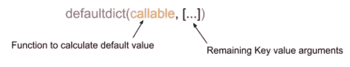

# Python 中的字典类型

> 原文：<https://blog.devgenius.io/types-of-dictionaries-in-python-575f9e2fe93b?source=collection_archive---------5----------------------->


[Jeena paradise](https://unsplash.com/@jeena?utm_source=unsplash&utm_medium=referral&utm_content=creditCopyText)在 [Unsplash](https://unsplash.com/s/photos/winter-crocus?utm_source=unsplash&utm_medium=referral&utm_content=creditCopyText) 上拍摄的照片

当我了解到字典的重要性时，我就想把它写下来，尤其是在 Python 语言中。事不宜迟，让我们快速浏览一下这个无处不在的数据结构。

python 中有 5 种不同类型的专用字典。它们都出现在`collections`模块中。

0. **defaultdict** :顾名思义，我们可以给当前不存在的键一个默认值。

1.  **OrderedDict** :保证按键顺序(基于插入顺序)
2.  **计数器**:计算项目的频率。该项必须能够是字典中的一个键(可散列的)。
3.  ChainMap:一种将不同的字典组合在一起的方式，排序很重要
4.  用户字典:创建自定义字典的基类

好了，让我们看看这些字典的作用。

用 Python 实例化字典的一种常用方法是`{}`或`dict()`。这些是针对不同用例的特殊字典。

0.**默认规则**



默认语法

你认为键`e`的值会是多少？让我们检查输出:

```
defaultdict(<class 'int'>, {'a': 97, 'b': 98, 'c': 99, 'e': 0})
```

看，是`0`。这是因为我们正在访问一个没有设置值的键，因此`defaultdict`设置为默认值。在这种情况下`0`。`int`是可调用的，其默认值为`0`。因此，如果你做`int()`，它给出`0`。

你能想到在普通字典中设置默认值的类似场景吗？

输出是:

```
{'N': 1, 'a': 3, 'm': 1, 's': 1, 'k': 1, 'r': 1}
```

第 4 行基本上是设置默认值`0`，如果该值不存在。默认字典只需设置一次默认值。

1.  **已订购商品**

如果需要键的顺序，你瞧，Python 3.6 和更高版本已经为你准备好了。

输出是:

```
Ordered Dict
OrderedDict([('uno', 1), ('dos', 2), ('tres', 3), ('cuatro', 4), ('cinco', 5)])After move_to_end
OrderedDict([('dos', 2), ('tres', 3), ('cuatro', 4), ('cinco', 5), ('uno', 1)])After move_to_end is False
OrderedDict([('uno', 1), ('dos', 2), ('tres', 3), ('cuatro', 4), ('cinco', 5)])
```

我们还使用了`move_to_end`方法将条目移动到字典的末尾或开头。

这听起来和其他数据结构相似吗？您好，`deque`。也驻留在`collections`模块中。`move_to_end`和`move_to_end`与`last=False`对应的`deque`的方法分别是`pop`和`popleft`。

2.**计数器**

您可能遇到过需要计算项目频率的场景，例如计算句子中单词的频率。Python 有`Counter`字典来为你做这项工作。

输出是:

```
Counter dict
Counter({'peace': 2, 'prevail': 2, 'on': 2, 'earth.': 2, 'Let': 1, 'and': 1, 'love': 1, 'May': 1})
```

有了这种魔力，`Counter`字典也有了许多方法，如`update`、`subtract`与另一个字典。看看他们！

我们也可以使用`min`和`max`函数来获得一个具有最小和最大频率的键。

3.**链图**

您可能遇到过需要组合不同的项目集合的情况。我们有从`itertools`模块到链表的`chain`方法，那么字典呢？我们有链图。

输出是:

```
ChainMap dict
ChainMap({'Daffodil': 'gradient yellow', 'Primrose': 'gradient crimson', 'Iris': 'purple'}, {'Allum': 'purple', 'Begonia': 'gradient pink', 'Delphinium': 'varied color', 'Black-Eyed-Susan': 'yellow and dark brown'}, {'Aster': 'yellow and purple', 'Dianthus': 'gradient maroon', 'Black-Eyed-Susan': 'yellow and dark brown'}, {'Crocus': 'purple', 'Snowdrop': 'white', 'Primrose': 'gradient crimson'})change of color occurs only in first occurrence
ChainMap({'Daffodil': 'gradient yellow', 'Primrose': 'gradient crimson', 'Iris': 'purple', 'Black-Eyed-Susan': 'orange and black'}, {'Allum': 'purple', 'Begonia': 'gradient pink', 'Delphinium': 'varied color', 'Black-Eyed-Susan': 'yellow and dark brown'}, {'Aster': 'yellow and purple', 'Dianthus': 'gradient maroon', 'Black-Eyed-Susan': 'yellow and dark brown'}, {'Crocus': 'purple', 'Snowdrop': 'white', 'Primrose': 'gradient crimson'})dictionaries in the chain maps are references to the original dictionary
flowers.maps[1] == summer_flowers => True
```

你添加字典到`ChainMap`的顺序很重要。孩子是第一本字典，其余都是父母。

`ChainMap`中的词典是对原始词典的引用。如果您对某个键进行了更新，则只会更新第一个匹配项。你可以看到`Black-Eyed-Susan`的例子，夏秋两季都有的花只在`summer_flower`字典中更新。

4.**用户词典**

有时候你需要自己的自定义字典，例如拥有自己的字典允许键集。我们可以从一个普通的`dict`类派生出子类，但是，设置和获取条目并不能保证使用邓德方法`__setitem__`，`__getitem__`。因此，Python 提供了`UserDict`。

输出是:

```
SpringBouquet dict
{'Daffodil': 2, 'Glory of the Snow': 3}setting not spring flower should raise an error
Traceback (most recent call last):
  File "/Users/dichha/Documents/Projects/medium/dict/ex.py", line 93, in <module>
    sb['crocus'] = 4
  File "/Users/dichha/Documents/Projects/medium/dict/ex.py", line 82, in __setitem__
    raise KeyError(f'Flower {key} is not a spring flower. Sorry.')
KeyError: 'Flower crocus is not a spring flower. Sorry.'
```

看，我们做了自己的自定义词典！😍

这就是我对这个关于字典的帖子的全部看法！我希望这有助于了解 Python 中不同类型的专业词典，并相应地使用它们，当然，还要探索更多。

感谢您的阅读。2022 新年快乐！🦋

灵感:

*   [巨蟒深潜](https://www.udemy.com/course/python-3-deep-dive-part-3/)

你可以在 [Patreon](https://www.patreon.com/dkhambu) 上支持我。