# 用 Keras 解释深度学习中损失函数的类型。

> 原文：<https://blog.devgenius.io/types-of-loss-functions-in-deep-learning-explained-with-keras-70b79acdbe5d?source=collection_archive---------5----------------------->

损失函数是让 ANN(人工神经网络)了解哪里出了问题以及如何达到黄金精度范围的东西，就像损失让你珍惜利润并识别出哪里出了问题一样。

因为利润会随之而来，对吗？..对吗？？

现在来看损失函数的**数学**定义，它用来衡量预测值(^y)和实际标签(y)之间的不一致性。它是一个非负值，模型的稳健性随着损失函数值的减小而增加。

实际上很简单，它基本上是你的算法对数据集建模的好坏，如果它的预测完全错误，你的损失函数将输出一个更高的数字。如果它很好，它会输出一个较低的数字。

在这篇文章中，他们被分为**三种**类型

1.  **分类亏损**
2.  **回归损失**
3.  **车型特定损失**

让我们深入讨论一下，

# 分类损失

在这方面，又有各种不同的类别，

## 二元交叉熵损失/对数损失

该损失函数主要用于二进制分类器的训练，它将每个预测概率与可能为 0 或 1 的实际类输出进行比较。

然后，它根据与期望值的距离计算惩罚概率的分数。

其背后的**数学**在下面讨论，

这意味着离实际值有多近或多远。

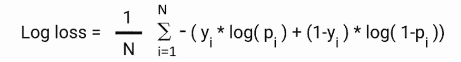

原木损失方程

这里 pi 是类 1 的概率，(1-pi)是类 0 的概率。

当观察值属于类别 1 时，公式的第一部分变为有效，第二部分消失，反之亦然，此时观察值的实际类别为 0。

Keras 中的实现如下所示

批次大小为 1 和样本数量为 4 时的 BCE(Keras)

## **铰链损耗**

它用于分类问题，是交叉熵的替代方案，主要是为支持向量机(SVM)开发的，铰链损失和交叉熵损失之间的区别在于，前者来自于**试图最大化我们的决策边界和数据点之间的差距。**

**数学上**等式如下所示，

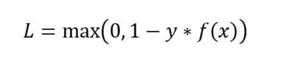

铰链损耗方程

在 **Keras** 中的实现如下:

Keras 中的铰链损耗

## 范畴交叉熵

这是一个 SoftMax **激活**加上**交叉熵损失**。如果我们使用这个损失，我们将使用 CNN 训练一个图像分类器来预测每一个存在的类别，例如一个鸟图像分类器属于哪个鸟类别。

用于**多级分类**。

由于本文没有讨论激活函数，如果你不了解它，我有一篇文章介绍了深度学习中使用 Keras 的激活函数，链接如下…

 [## 用 Keras 解释深度学习中激活函数的类型

### 激活是指点击激活你的车(如果它有，当然)，同样的概念，但在…

medium.com](https://medium.com/@tripathiadityaprakash/types-of-activation-functions-in-deep-learning-explained-with-keras-cd1e0b85e003) 

**数学上，**公式如下

分类交叉熵损失方程

在 **Keras** 的实现如下所示:

Keras 中的范畴交叉熵损失

## **稀疏分类交叉熵损失**

稀疏 CCEL(分类交叉熵损失)和 CCEL 都计算分类交叉熵，唯一的区别是目标/标签应该如何编码。

当使用稀疏分类交叉熵时，目标由类别的索引表示(从 0 开始)。

您的输出具有 4x2 的形状，这意味着您有两个类别。因此，目标应该是一个条目为 0 或 1 的四维向量。这与分类交叉熵相反，在分类交叉熵中，标签应该是一位热编码的。

**数学上**，等式是

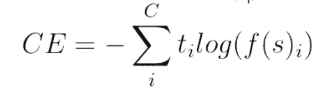

稀疏交叉熵损失方程

何时使用哪个，

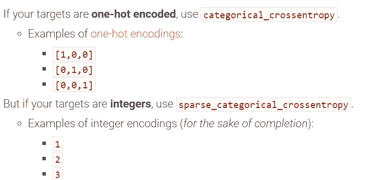

什么时候使用分类交叉熵，什么时候使用稀疏

在 **Keras** 中的实现如下所示:

稀疏分类交叉熵的 Keras 实现

## 库尔贝克-莱布勒发散损失

简单地说，它是一个概率分布与另一个概率分布的不同程度的度量。

**数学上的**，可以用以下公式解释

两个分布 P 和 q 之间的 KL 散度。

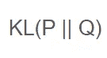

库尔贝克-莱布勒方程

“||”运算符表示从 q 开始的“*发散*”或 Ps 发散。

KL 散度可以计算为 P 中每个事件的概率的负和乘以 Q 中事件的概率对 P 中事件的概率的对数。

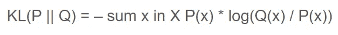

给定事件的分流

在 **Keras** 中实现如下:

# 回归损失

在这方面，又有各种不同的类别，

## 均方误差/二次损耗/ L2 损耗

它是观察值和预测值之间的平均平方差。例如，在线性回归中，我们找到最好地描述所提供的数据点的直线。许多线可以描述数据点，但是使用 MSE 可以找到选择哪条线最好地描述它。

在下图中，预测值在直线上，实际值用小圆圈表示。

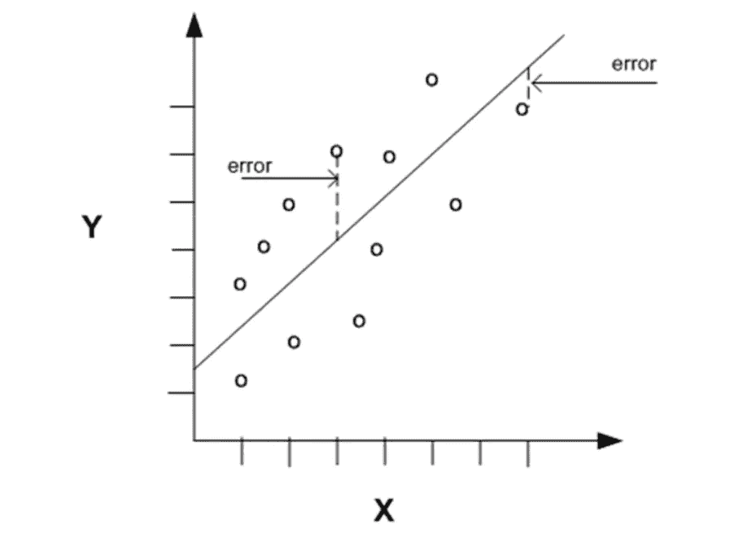

显示线性回归的图表

误差是数据点和拟合线之间的距离。

**数学上**，可以表述为

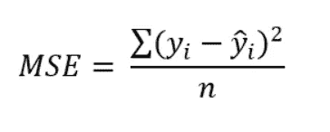

均方差方程

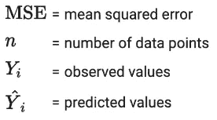

在 **Keras** 中的实现如下所示:

Keras 中的均方误差

## 平均绝对误差/ L1 损耗

现在我们继续讨论绝对值别闹了，现在集合！

它计算标记数据和预测数据之间的误差的均方值。它计算当前输出和预期输出之间的绝对差值除以输出数量。

与均方误差不同，它对异常值不敏感。

**数学上的**，可以写成

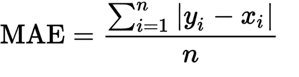

均方差方程

如公式所示，增加了模块，仅给出了误差的绝对值。

在 **Keras** 的实现如下所示:

Keras 中的平均绝对误差

## Huber 损失/平滑平均值

两全其美，iOS 和 Android 两款手机一起？不了..

它的 Huber 损失函数，它结合了 MSE 和 MAE，如果损失值大于δ使用 MAE，如果小于δ使用 MSE。

**数学上的**，可以写成

胡伯损失方程

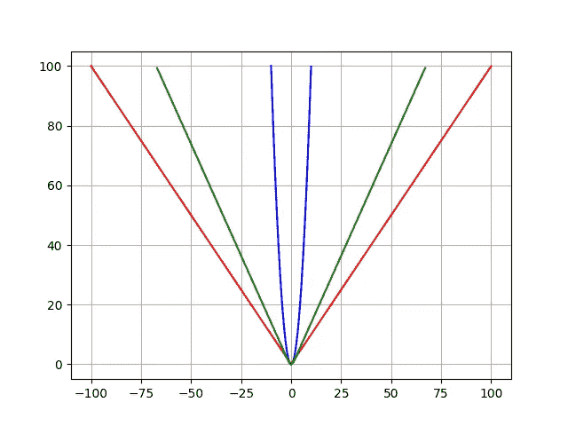

Hubber(绿色)、MAE(红色)和 MSE(蓝色)的比较

Keras 的实施情况如下

胡伯损失的 Keras 实现

现在来看**模型特定损耗**它们与下面使用它们的模型一起被提及，

## 最小最大值(GAN 损耗)

生成敌对网络利用了这种特殊的损失，这很简单(他们是这么说的)。

在这次损失之前，需要对 GAN 有一点了解，所以让我们在下面的总结中描述一下

*   涉及到两个神经网络。
*   其中一个网络，即生成器，从随机数据分布开始，并试图复制特定类型的分布。
*   另一个网络，鉴别器，通过随后的训练，可以更好地将伪造的分布从真实的分布中区分出来。
*   这两个网络都在玩一个最小-最大游戏，其中一个试图智胜另一个。

现在回到最小-最大损失，**数学上**它的等式是

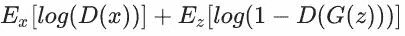

最小—最大损失方程

发生器试图最小化该函数，而鉴别器试图最大化该函数，它对发生器饱和，使其停止训练它落后于鉴别器… *sad 发生器噪声* …。

这可以进一步分为两部分 1) **鉴别器**损耗和 2) **发电机**损耗

**鉴别器损耗**

鉴别器训练 by 对来自发生器的真实数据和虚假数据进行分类。

通过最大化下面提到的函数，它惩罚自己将一个真实的实例误分类为假，或者将一个假实例(由生成器创建)误分类为真实。

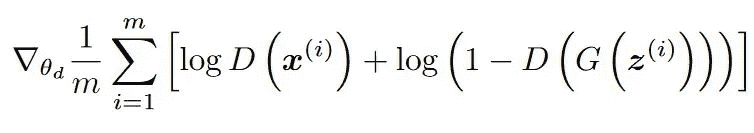

鉴频器损耗公式

*   **log(D(x))** 指生成器正确分类真实图像的概率，
*   最大化 **log(1-D(G(z)))** 将帮助它正确标记来自生成器的假图像。

**发电机损耗**

当生成器被训练时，它对随机噪声进行采样，并从该噪声中产生输出。然后，输出通过鉴别器，并根据鉴别器的辨别能力被分类为“真”或“假”。

然后，根据鉴别器的分类计算发电机损耗——如果成功骗过鉴别器，将获得奖励，否则将受到惩罚。

下面的等式被最小化以训练发生器，

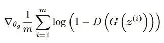

最小化以训练发电机

深层 GAN 网络的整个实现以及下面提到的损耗，因为损耗是相对于模型定义的，所以需要参考整个实现。

 [## 主 tensorflow/docs 上的 docs/dcgan.ipynb

### 张量流文档。通过在 GitHub 上创建帐户，为 tensorflow/docs 的开发做出贡献。

github.com](https://github.com/tensorflow/docs/blob/master/site/en/tutorials/generative/dcgan.ipynb) 

## 焦点丢失(物体检测)

这是交叉熵损失函数的扩展，它降低了简单例子的权重，并集中训练硬否定。

焦点损失将调制项应用于交叉熵损失，以便将学习集中在硬错误分类的例子上。这是一种动态缩放的交叉熵损失，其中缩放因子随着正确类别的置信度增加而衰减到零。

数学马上就来，

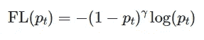

焦点损失方程

焦点损失给标准交叉熵标准增加了一个因子(1−pt)^γ。设置γ>0 会减少分类良好的示例(pt>.5)的相对损失，从而将更多注意力放在困难的、错误分类的示例上。这里有可调的*聚焦*参数γ≥0。

在 **Keras** 的实现如下所示:

焦点损失函数的实现

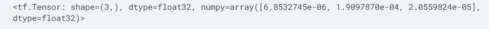

上述损失函数的输出

每项损失实施的整个笔记本如下所述，

 [## 谷歌联合实验室

### 编辑描述

colab.research.google.com](https://colab.research.google.com/drive/1XIZBm8eQ-tTVV0D6xqa2QI6Jnvo_ATXP?usp=sharing) 

> **参考文献**
> 
> [https://towards data science . com/understanding-the-3-most-common-loss-functions-for-machine-learning-regression-23 e0e F3 e 14d 3](https://towardsdatascience.com/understanding-the-3-most-common-loss-functions-for-machine-learning-regression-23e0ef3e14d3)
> 
> [https://medium . com/nerd-for-tech/what-loss-function-to-use-for-machine-learning-project-b5 C5 BD 4a 151 e](https://medium.com/nerd-for-tech/what-loss-function-to-use-for-machine-learning-project-b5c5bd4a151e)
> 
> [https://neptune.ai/blog/gan-loss-functions](https://neptune.ai/blog/gan-loss-functions)
> 
> [https://www . analyticsvidhya . com/blog/2020/08/a-初学者指南-焦点丢失物体检测/](https://www.analyticsvidhya.com/blog/2020/08/a-beginners-guide-to-focal-loss-in-object-detection/)

如果你喜欢这篇文章，并想阅读更多，你可以访问我的媒体简介，如果你想连接这里是我的 LinkedIn 简介

[https://www.linkedin.com/in/tripathiadityaprakash/](https://www.linkedin.com/in/tripathiadityaprakash/)