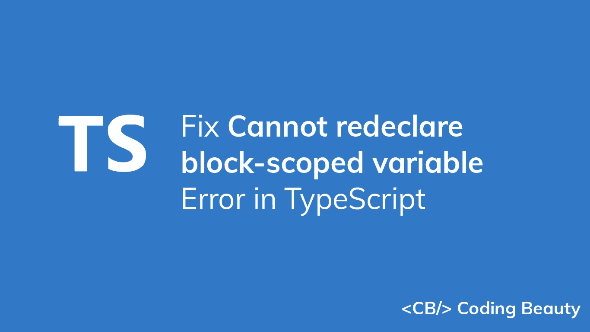
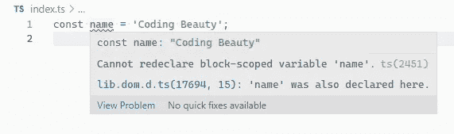
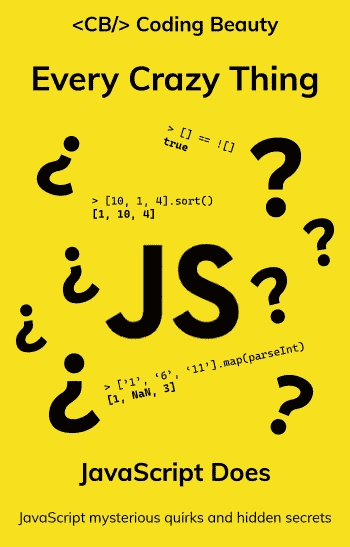

# 如何修复 TypeScript 中的“无法重新声明块范围的变量”错误

> 原文：<https://blog.devgenius.io/typescript-cannot-redeclare-block-scoped-variable-8f7036182355?source=collection_archive---------10----------------------->



您在 TypeScript 中遇到过“无法重新声明块范围的变量”错误吗？出现此错误有两个原因:

1.  使用与 TypeScript 全局类型冲突的变量名。
2.  在同一块范围内重新声明变量。



VS 代码中出现“无法重新声明块范围的变量”错误。

在本文中，我们将探讨这些可能原因的解决方案。

# 修复:使用与 TypeScript 全局类型冲突的变量名

如果您声明的变量名称与 TypeScript 全局类型中声明的名称冲突，则会出现“无法重新声明块范围的变量”错误。

**索引. ts**

```
// ❌ Cannot re-declare block-scoped variable "name".
const name = 'Coding Beauty';console.log(name);
```

要修复这种情况下的错误，请将您的文件转换为一个 [ES 模块](https://www.typescriptlang.org/docs/handbook/modules.html)，如下所示:

**索引. ts**

```
// ✅ variable declared successfully
const name = 'Coding Beauty';console.log(name); // Coding Beautyexport {};
```

`export {}`语句表明该文件是一个 es 模块。在 TypeScript 中，任何包含顶级`import`或`export`的文件都被认为是一个模块。

如果没有顶级的`import`或`export`声明，该文件将被视为一个脚本，其内容在全局范围内(以及其他模块)都是可用的。这就是导致我们的`name`变量和 TypeScript 全局类型中声明的`name`变量之间的名称冲突的原因。

解决这个问题的另一种方法是使用另一个名称来声明不与全局类型冲突的变量。

**索引. ts**

```
// ✅ variable declared successfully
const theName = 'Coding Beauty';console.log(theName); // Coding Beautyexport {};
```

# 修复:在同一块范围内重新声明变量

如果您尝试使用以前在同一块范围内使用的名称来声明变量，也会出现“无法重新声明块范围内的变量”错误。

```
const language = 'JavaScript';// ❌ Cannot redeclare block-scoped variable 'language'.
const language = 'PHP';
```

通过对新变量使用不同的名称，可以很容易地修复这种情况下的错误。

```
const language = 'JavaScript';// ✅ variable declared successfully
const language2 = 'PHP';
```

如果你想给这个变量赋一个新值，正确的方法是用`let`关键字声明这个变量，并在不重新声明的情况下改变它的值。

```
// declare with "let" keyword
let language = 'JavaScript';// reassign without redeclaring
language = 'PHP';console.log(language); // PHP
```

## 注意

与`const`或`let`不同，`var`关键字不会抱怨重新声明的变量。

```
var language = 'JavaScript';// No error thrown
var language = 'PHP';
```

重新声明变量会导致代码中出现棘手的错误，这也是避免使用`var`关键字的一个原因。

可以在嵌套块中声明同名的变量。嵌套块中的变量与外部范围中声明的变量是分开的。

```
let color = 'red';if (true) {
  let color = 'yellow'; console.log(color); // yellow
}console.log(color); // red
```

## 注意

如果你使用`var`关键字来做这件事，它将覆盖外部作用域中变量的值。

```
var color = 'red';if (true) {
  var color = 'yellow'; console.log(color); // yellow
}console.log(color); // yellow
```

避免使用`var`的另一个原因。

它不一定是一个`if`块，我们可以在任何用花括号(`{`和`}`)指定的嵌套块中这样做。

```
let color = 'red';{
  let color = 'yellow'; console.log(color); // yellow
}console.log(color); // red
```

# 解决方法:利用生活

另一种修复错误的方法是用一个[立即调用函数表达式(life)](https://developer.mozilla.org/en-US/docs/Glossary/IIFE)包装包含变量的代码。IIFEs 是一定义就运行的函数，它们有助于避免导致此错误的名称冲突。

```
const fruit = 'Apple';(() => {
  const fruit = 'Banana'; // ✅ variable declared successfully
  console.log(fruit); // Banana
})();console.log(fruit); // Apple
```

此修复还解决了我们之前看到的 TypeScript 全局类型冲突问题。

**index.ts**

```
(() => {
  const name = 'Coding Beauty'; console.log(name); // Coding Beauty
})();
```

*最初发表于*[*codingbeautydev.com*](https://cbdev.link/d44ade)

# JavaScript 做的每一件疯狂的事情

一本关于 JavaScript 微妙的警告和鲜为人知的部分的迷人指南。



[报名](https://cbdev.link/d3c4eb)立即免费领取一份。