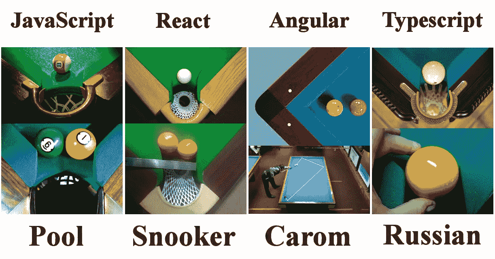

# 打字稿双“notnot”！！操作员

> 原文：<https://blog.devgenius.io/typescript-double-notnot-operator-486d9f6d0c8f?source=collection_archive---------1----------------------->

设计决策与代码的复杂性和灵活性。



试想一下，我们如何比较前端开发和台球游戏的复杂程度。

我总是喜欢强类型的 Typescript 和使代码紧凑的操作符。

众所周知，夏尔！符号仅仅意味着值的还原逻辑状态。Java，Kotlin，Typescript 广泛使用:

```
const myValue: boolean = true;
if (!myValue) { console.log(myValue); }
if (myValue === false) { console.log(myValue); }
```

居然，双感叹**！！**不是操作员。只是炭而已！重复两次。一种使代码可读性更好的有用符号。因为我们也可以用同样的效果写布尔值。

```
!!false === false
!!true === true
```

让我们使用布尔运算符:

```
Boolean(false) === false // they really equals to each other
Boolean(true) === true
```

**理论和最价差组合**

“not not”符号的思想是将变量转换为布尔型:

```
let v = 0;
v ? true : false  //equals false 
v ? true : false  //equals true
!!v === false     //falsev = 1;
v ? true : false  //equals true
!v ? true : false //equals false
!!v === true      //true
if (typeof !!v)   // boolean!!false === false
!!true === true!!0 === false     // 0 is the exception value in TS
!!1 === true      // TS inverts that, so you can get it as a boolean
```

Typescript 认为下列值为假:

*   空字符串: ""
*   0
*   空
*   不明确的
*   圆盘烤饼

```
!!"" === false            // empty string is false
!!undefined === false     // undefined primitive is false
!!null === false          // null is false
!!isNaN(value) === falseprivate getExpected(): number {
  const value = parseInt(this.expectedQuote.value, 1);
  return isNaN(value) ? null : value;
}
```

Typescript 将下列值视为真理:

*   对象:{}
*   数组:[]
*   非空字符串:“值”
*   非零数字
*   Date:new Date()；

执行代码的 JavaScript 引擎会在必要时尝试将一个值转换(或强制)为布尔值，比如在 if 语句中进行计算。

```
!!"not empty string" === true
!!{} === true;                 // an (empty) object is truthy
!![] === true;                 // an (empty) array is truthyconst array = [1,2,3];
!!array[0];                    // true
!!array[3];                    // falseconst obj = {
  value: 1,
  item: undefined
};
!!obj.value;                   // true
!!obj.item;                    // falseconst fibonacci: number = 1.6180339887;
!!fibonacci === true;const dt = new *Date*();
!!dt === true;
```

**一些实际方面使用的“不是不”。**

这只是一个虚拟脚本来显示逻辑是如何工作的！！

用！！在 **if** 语句内:

```
userData: UserData = null;ngOnInit(): void {
  this.userData = this.serviceCall.getData();
}routeAhead(): void {
  if (!!this.userData) {
    this.router.navigateByUrl("vault");
  }
}
```

无论使用什么函数，只有 false 或 true 将作为**布尔值**返回:

```
function isFound(): boolean {
  return !!(charge as PricedCharge).spotCharge
    || !!(charge as ChargeState).charge;
}
```

使用它**λ**返回:

```
const isChargeSelected = (charge: PricedCharge): boolean => {
  const found = charge?.find(item => 
    item.chargeUniqueId === charge?.chargeUniqueId); return !!found && charge.length === 1;
};
```

当转换为布尔型时，一些类似的对象:

```
private hasMapContacts(charge: PricedCharge): boolean {
  return !!charge.departmentContact
      || !!charge.archivedContact
      || !!charge.users?.emailAddress
      || !!charge.charge?.distributions;
}
```

**结论**

简化的符号使源代码更加紧凑，可读性更强。我已经添加了一些这种用法有用的实际例子。但是当然，你可以写 Boolean(变量)来检查。这是一个品味和你的项目设计决策的问题。

返回 true 或 false 值是一个不错的想法，但是社区中对这种表示法有一些批评，它增加了代码的复杂性，降低了灵活性，等等。当然，0 数字作为一个假值增加了许多开发者的讽刺。