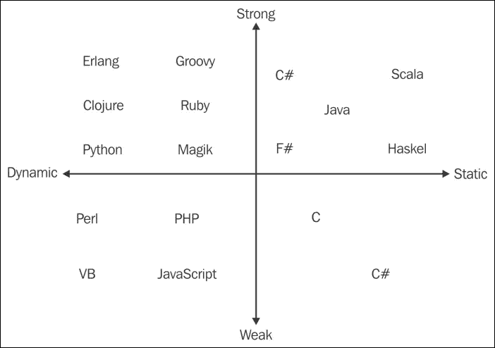
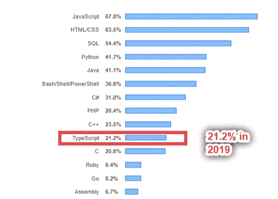
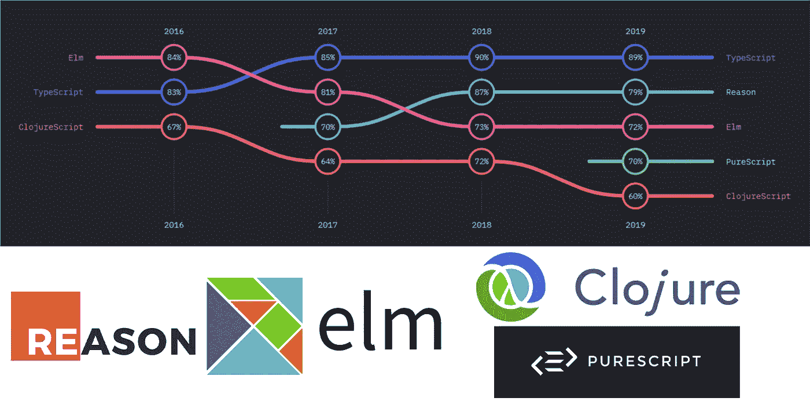

# 初学者打字稿

> 原文：<https://blog.devgenius.io/typescript-for-beginners-ad4a920bf2af?source=collection_archive---------32----------------------->

## 初学者指南

打字稿现在越来越流行了。我相信每一个代码初学者都会在他或她的代码之旅中了解到它与 JavaScript 有关。这篇文章将与你分享 TS 给我们带来了哪些额外的功能，以及如何编写 TS。


由 Kinng 创建

# 什么是 TypeScript？

简而言之，TypeScript 是 JavaScript 的超集，这意味着它是一种基于 JavaScript 的语言。JavaScript 和 TypeScript 之间最大的区别是在 props 之后附加了静态类型化特性。

```
const sum = (a: number; b: number) =>{
    return a + b
}
```

## 静态类型语言和动态类型语言

动态类型语言不会在代码编写期间检查变量的属性，而静态类型语言会。相反，动态类型语言将检查运行时的属性，并自己“获取”这些属性。

```
Dynamic:
var a = 1234Static:
int a;
a = 1234;
```

和上面的例子一样，静态类型语言是一种自文档化的语言，在大型应用程序产品中很有帮助。想象一下，在你的程序中有太多的函数，你可以在代码编写过程中通过代码编辑器得到通知，而不是在测试过程中得到参数错误。

另一方面，与构造 params 类型的动态类型语言相比，编写静态类型语言更耗时。同时，它也给程序员带来了另一层复杂性。

## 弱类型和强类型语言

这里的弱和强是一种语言看参数类型的严格程度。

```
In JavaScript:
var a = "hello"
a + 10
#=> "hello10" In Python:
a = "hello"
a + 10
#=> error 
```

下面是一个简单的图片，显示了一些语言按照强、弱、动态和静态进行分类。



从掌握 C#和。NET 框架

# 为什么打字稿？不是其他静态特性的 JavaScript 语言？

有调查显示，TypeScript 在其他静态 JavaScript 类语言中变得越来越流行，如 reason、elm 和 flow。根据 2020 年的堆栈溢出调查，显示 TypeScript 在编程语言战斗中的受欢迎程度有 4.2%的增长。


2020 年部分流行语言由 [StackOverflow](https://insights.stackoverflow.com/survey/2020#technology-programming-scripting-and-markup-languages-professional-developers)



2019 年部分流行语言由 [StackOverflow](https://insights.stackoverflow.com/survey/2019#technology)

同样在 JS State 发布的报告中，TypeScript 坐拥其他类似的函数式语言。



JS 的[状态创建的图形](https://2019.stateofjs.com/javascript-flavors/)

## 那么，为什么它会流行呢？

在我看来，这是因为 TypeScript 为 JavaScript writer 带来了简单的迁移特性。与其他基本上变成另一种不同语法的语言不同，TypeScript 只是在原始 JavaScript 代码上添加了一些代码。它使学习过程更容易和更快。

就 TypeScript 语法本身而言，与每一种静态类型化语言一样，变量和错误检查节省了时间，同时也增加了代码的可读性。

# 一些动手练习~

要编写类型脚本代码，您需要在本地机器上设置一个环境。所有 JavaScript 开发人员都知道，JavaScript 代码在浏览器之外是不可执行的。因此，你需要在这个神奇的时刻之前[安装 NodeJs](https://nodejs.org/en/) 。

NodeJs 之后，您需要通过下载`.exe`或者通过终端`npm install -g typescript`将 TypeScript 安装到您的机器上。

注意，我们保存的打字稿文件的扩展名是`.ts`。此外，有两种方法可以在终端上与 TypeScript 文件交互。

```
tsc file.ts ----1
node file.ts ---2
```

第一段代码将把 TypeScript 文件编译成 JavaScript ES5 语法文件，并保存在与存储 file.ts 相同的文件夹中

第二个代码将执行该文件。

## 要使编译过程自动化，请执行以下操作:

运行`tsc --init` 和`tsc file.ts --watch.`，保存时会自动编译 file.ts。

感谢您的阅读。希望你对 TypeScript 有更好的理解。没有必须学习的科目。知道新的语言是一件好事，但是如果学习过程没有路径，那么它可能会变得混乱。