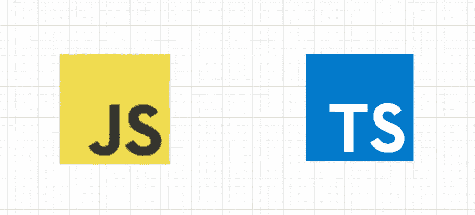
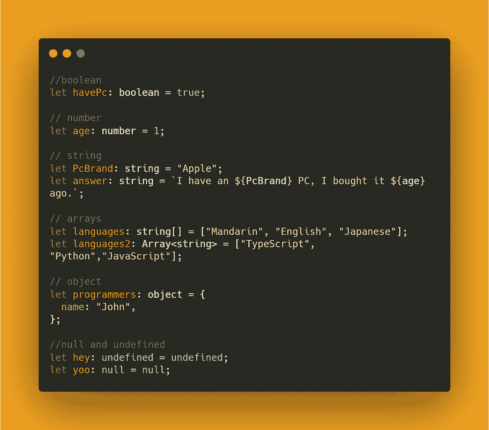
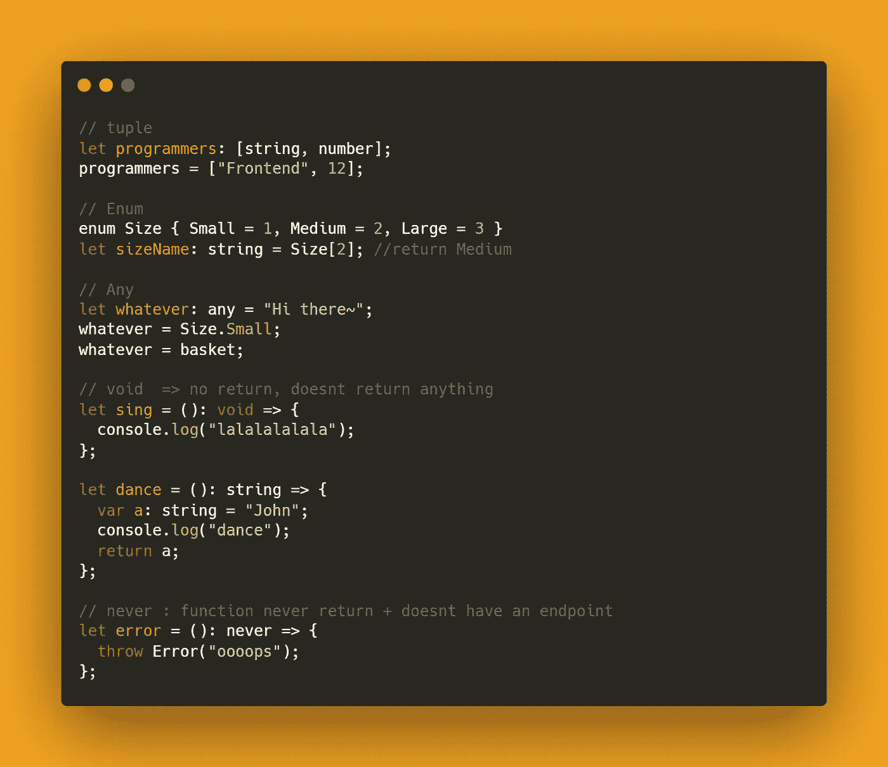
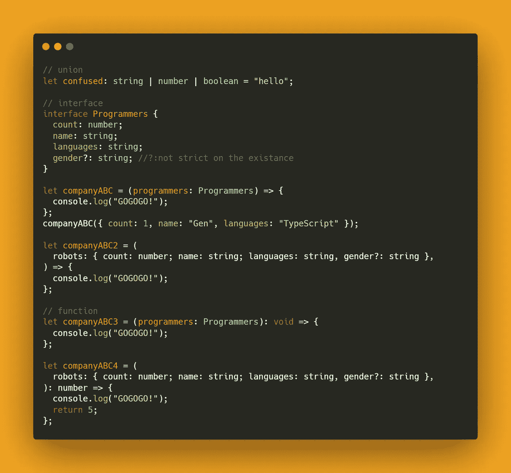

# 面向初学者的打字稿代码

> 原文：<https://blog.devgenius.io/typescript-for-beginners-codes-v-cd604c8d1552?source=collection_archive---------33----------------------->

## 初学者指南

与上一篇文章做 90%的文字分享不同，本文将使用代码来展示 TypeScript 的一些特性。



由 Kinng 创建

[](https://medium.com/dev-genius/typescript-for-beginners-ad4a920bf2af) [## 初学者打字稿

### 打字稿现在越来越流行了。我相信每个初学代码的人都会知道它与 JavaScript 有关…

medium.com](https://medium.com/dev-genius/typescript-for-beginners-ad4a920bf2af) 

前一篇文章分享了为什么 TypeScript 变得越来越流行，在文章的最后，我们在本地机器上安装了 TypeScript。在本文中，我们将看到 TypeScript 从 JavaScript 继承的一些语法和一些使 TypeScript 与众不同的额外功能语法。

## 提醒:

每次保存时，`tsc file.ts --watch`会自动将您的 ts 文件编译成 js 文件，并显示是否有错误发生。

`node file.ts`或`node file.js`来执行文件。

# TypeScript 中的 JavaScript 语法

> 让我们开始吧
> 
> 在 TypeScript 中，您将看到并使用术语“let”而不是“var”，根据 TypeScript 文档，“let”术语比“var”术语更安全，因此建议在 TypeScript 中使用“let”。

由于 TypeScript 具有静态类型语言的特性，JavaScript 和 TypeScript 之间的最大区别是对象和函数后面的“类型”。



看一下上面的内容，我们需要在创建对象的过程中分配每个对象类型。在这种情况下，我们忘记了分配一个类型，TypeScript 将通过我们设置的第一个值来自动设置类型。

```
let x = 100;  #TypeScript will auto set it as x: numberx = *"Hello"  * #This will return error
```

它可能与“对象”类型相混淆。这有点复杂，将在另一篇关于 TypeScript 的文章中详细解释。敬请期待！然而，简而言之,“对象”类型意味着“程序员”返回一个不属于`string, boolean, number, bigint, symbol, null, and undefined.`的东西

# TypeScript 额外语法

下面的语法使 TypeScript 成为另一种级别的语言，帮助程序员构建错误较少的应用程序。



## 元组

Pythonist 一定知道元组。元组是数组，但是一旦创建就不能改变。它可以追加和弹出，但是`[“Frontend”, 12]`不会改变。当你想把一些东西设定并存储为不可改变的真理时，这是很有用的。

## 列举型别

这是一个有趣的特性，它允许我们声明一组相关值的命名常量，这些值可以是数字或字符串值。在这个例子中，我们给`Small`赋值为`1`，因此当你调用`Size[1]`时，它将返回`Small`。此外，如果您希望返回`1`而不是`Small`，请将代码替换为`let sizeName: number`。另外，请注意 `enum`项总是大写。

## 任何的

作为术语本身，它表示任何类型脚本类型。当您希望将 JavaScript 文件转换为 TypeScript 文件并且对象可以返回任何内容时，这很有用。请记住，如果我们进行了赋值，TypeScript 将自动设置类型，`any` 将告诉 TypeScript 让它返回，即`string`或有时`number`。

## 空的

Java 程序员必须知道`void`。它基本上告诉 TypeScript 带有`void`的函数不会`return`任何东西。PS `console.log()`不是`return`。`return`意思是将一些信息从自己的作用域传递给其他函数。

在您想要返回的情况下，即函数中的字符串，`let dance = (): string => {}.`

# 从不

`never`当你期望函数永远不会遇到端点或者总是抛出异常时使用。换句话说，`never` 有一个 keep going 循环，当函数结束时，这意味着您的应用程序有问题。

`void`的区别:`never`不能将数值设定为`null`，而`void`可以。表示`void`有端点。



## 联盟

`union`是数学概念，说的是那个对象的值既可以是 a & b，比如`let x : string | number | boolean;` 。

## 连接

这是一个有用的特性，它首先创建一组值类型，然后进一步将它分配给函数。界面使代码干净漂亮。PS 了？当您想要为对象添加另一层灵活性时，可以使用。

请注意，函数可以像往常一样在 props 括号中分配值类型，但这会使代码太长，缺乏可读性。

此外，函数也可以通过`function = (): type=> {}`为其返回值分配值类型。

## 感谢您的阅读。希望您已经学习了 TypeScript 的基本代码语法。这些额外的特性使得 TypeScript 成为一种健壮的、更少错误的语言。正如您可能意识到的，TypeScript 使用的基本上与 JavaScript 编写代码的方式相同，我个人喜欢它，因为我不需要像其他 JavaScript 超集那样学习额外的编码方式和语法。日安！