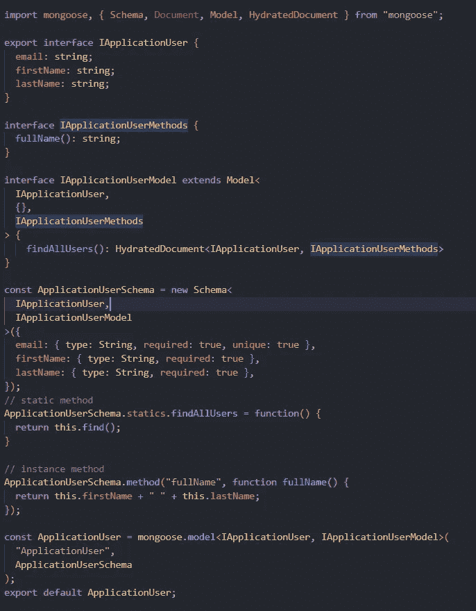
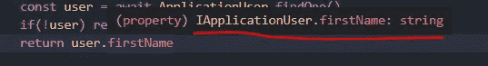
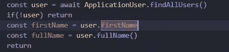
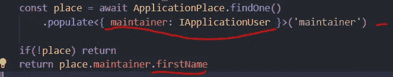

# 猫鼬语打字稿

> 原文：<https://blog.devgenius.io/typescript-in-mongoose-9994fca6987b?source=collection_archive---------1----------------------->


照片由[阿诺·弗朗西斯卡](https://unsplash.com/@clark_fransa?utm_source=medium&utm_medium=referral)在 [Unsplash](https://unsplash.com?utm_source=medium&utm_medium=referral) 拍摄

# 在 Mongoose 中使用 typescript

Mongoose 是一个非常好的用于 NodeJS 运行时的 ODM 包，它帮助你创建一个更加面向对象的方法来处理数据库。另一方面，typescript 是 Javascript 的类型化版本，但是我看到许多人对如何使用 mongoose 和 typescript 感到困惑，因为它是嵌套的和基本的

## 我们需要猫鼬的打字稿吗？

这个问题的答案与你的项目方法有关，但是如果你选择了 typescript，那么使用你的改进类型是必须的，否则你仍然可以在没有定义任何模式的情况下使用 mongoose 和 typescript，你的救世主将是`any`关键字

## typescript 可以使用 mongoose 自定义方法和属性吗？

是的，它是。Mongoose 提供了开箱即用的接口，让我们可以创建各种接口，并帮助我们定义必要的属性和方法。如果你想了解 mongoose 和自定义方法，那么请阅读我之前的文章

[](https://javascript.plainenglish.io/encrypt-fields-with-mongoose-method-and-plugin-7c2452263e2d) [## 如何用 Mongoose 方法和插件加密字段

### 关于我们如何使用 mongoose 方法来管理需要加密的密码或类似密码的字段的指南…

javascript.plainenglish.io](https://javascript.plainenglish.io/encrypt-fields-with-mongoose-method-and-plugin-7c2452263e2d) [](https://javascript.plainenglish.io/create-own-method-in-mongoose-model-5fefa7975b9d) [## 如何使用 Mongoose 创建一个方法

### 使用 Mongoose 创建比较密码或获取已删除记录的方法指南。

javascript.plainenglish.io](https://javascript.plainenglish.io/create-own-method-in-mongoose-model-5fefa7975b9d) 

# 用 typescript 和 mongoose 创建项目

我有一个用于 mongoose 和 typescript 的引导项目，其中安装了依赖项。出于本文的考虑，我将使用两个数据库模型

*   应用程序用户
*   申请地点

我们会用它们来创造变化

## 定义模式类型

从项目开始，我们可以从定义模式和创建第一个接口开始，让我们从`ApplicationUser`开始并定义它的属性

```
export interface IApplicationUser {
  email: string;
  firstName: string;
  lastName: string;
}
```

> 主要文章建议使用和扩展来自`Document`mongose 的接口，但是如果你想定义自定义方法或关系，你不应该使用它们。例如`interface ApplicationUser extends Document`

现在我们的模型有了一些属性，让我们向模式中添加一些实例方法和静态方法

## 添加类型化实例和静态 mongoose 方法类型

我们可以用我们想要的自定义方法再创建一个接口，我们将在稍后的实现中使用这个接口

```
interface IApplicationUserMethods {
  fullName(): string;
}
```

现在，你应该知道的一件事是实例方法不是模型本身的属性，但另一方面，结果静态方法是模型的属性，所以对于任何静态方法或查询帮助器，我们需要覆盖模型接口

```
interface IApplicationUserModel extends Model<
  IApplicationUser,
  {},
  IApplicationUserMethods
> {
    findAllUsers(): HydratedDocument<IApplicationUser, IApplicationUserMethods>
}
```

为了覆盖模型接口，我们将在前面创建的接口的帮助下创建我们的模型定义，并将它们从 mongoose 传递给`Model` type，然后附加自定义声明

> HydratedDocument 是 mongoose 在计算后将返回的实例类型。它将拥有模型的模式定义，而不是实例定义

## 创建模型架构

在创建实际模型之前，我们有 3 个接口，我们将使用它们来创建模式。schema 方法有三个接口`Model definition, overrided model and instance methods interface`，因为我们已经定义了覆盖模型，所以我们不需要传递第三个参数

```
const ApplicationUserSchema = new Schema<
  IApplicationUser,
  IApplicationUserModel
>({
  email: { type: String, required: true, unique: true },
  firstName: { type: String, required: true },
  lastName: { type: String, required: true },
});

// static method
ApplicationUserSchema.statics.findAllUsers = function() {
  return this.find();
}

// instance method
ApplicationUserSchema.method("fullName", function fullName() {
  return this.firstName + " " + this.lastName;
});

// exporting the schema and model
const ApplicationUser = mongoose.model<IApplicationUser, IApplicationUserModel>(
  "ApplicationUser",
  ApplicationUserSchema
);
export default ApplicationUser;
```

就是这个，文件现在看起来像这样，差不多是我们刚刚讨论的所有内容的总和



主模型的模式定义

## 使用模型

现在，让我们使用我们的模型来查看和检查字段是否是自动填充的。如果您将鼠标悬停在属性上，您将不会看到任何错误和字段的定义，这对于自定义方法和静态方法也是如此，并且 typescript 将编译时不会出现任何错误



现场人口的结果



属性检查器的结果

现在一切都编译好了，没有错误，让我们来看看文章的另一个问题陈述。*“如何使用 typescript 填充字段？”*

## *使用带有类型脚本的填充字段*

这有点棘手，因为填充的字段使用相同的键来填充和存储实例的 id。为了解决这个问题，我们有几种方法，让我们逐一讨论

为了开始这个解决方案，让我们使用一个名为`ApplicationPlace`的新模型，其中`maintainer`是将被映射到`ApplicationUser`模型的键，并从中填充数据

定义模式——我们将有一个名为 location 的字段，另一个是 maintainer，它将从`ApplicationUser`模型中填充

```
// schema
const ApplicationPlaceSchema: Schema = new Schema({
  location: { type: String, required: true },
  maintainer: { type: Schema.Types.ObjectId, required: true },
});

// interface
export interface IApplicationPlace extends Document {
  location: string;
  maintainer: HydratedDocument<IApplicationUser>['_id']
}

export default mongoose.model<IApplicationPlace>(
  "ApplicationPlace",
  ApplicationPlaceSchema
);
```

要在界面中定义一个填充的字段，我们可以使用`HydratedDocument<ModelInterface>[fieldname]`将字段映射到我们选择的模型。既然我们使用默认关系，那么我们可以使用`_id`字段。

现在，这两个字段都有可用的选项，但是默认情况下，它将指向 ObjectId 定义。我们可以在使用 populate 方法时改变这一点



使用填充字段的结果

这种用法的关键在于，我们显式定义了下面函数的输出，该函数与 typescript 中的关键字`as`的作用相同

## 定义填充字段的另一种方法

还有一种方法，我们可以通过使用`PopulatedDoc`类型并传递具有预期类型的其他模型接口来定义字段，如下例所示

```
export interface IApplicationPlace extends Document {
  location: string;
  maintainer: PopulatedDoc<Document<ObjectId> & IApplicationUser>
}
```

这种方法的缺点是，我们必须总是在处理程序中检查预期的类型，这可能会更加繁琐。

```
 if (maintainer == null || maintainer instanceof ObjectId) {
    throw new Error('should be populated');
  } else {
    // Works
    doc.maintainer.firstName.trim();
  }
```

## 结论

在项目中使用 typescript 将提高错误处理能力，并对未来的错误有更好的了解。Mongoose 是一种我们可以充分利用的类型化 ODM。我希望我们都能从这篇文章中学到一些新的东西，并且您可以在[mongose typescript 库](https://github.com/Piyush-Use-Personal/mongoose-typescript)中找到源代码。快乐编码。