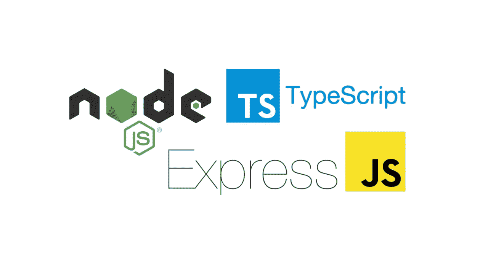
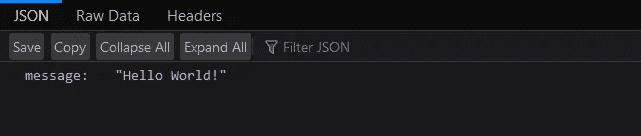
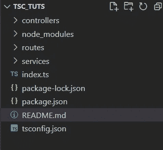

# TypeScript 与 NodeJS 的集成

> 原文：<https://blog.devgenius.io/typescript-integration-with-nodejs-a2c49247e21f?source=collection_archive---------10----------------------->



Pic 信用开发至

## 什么是 TypeScript？

如您所知，JavaScript 不是一种强类型语言。因此，TypeScript 过去常常在 JavaScript 之上添加静态类型。TypeScript 是 JavaScript 的语法超集，增加了静态类型。

这基本上意味着 TypeScript 在 JavaScript 之上添加了语法，允许开发人员添加**类型**。

**为什么要使用 TypeScript？**

JavaScript 是一种松散类型的语言。很难理解 JavaScript 中传递的是什么类型的数据。

在 JavaScript 中，函数参数和变量没有任何信息。所以开发者需要看文档，或者根据实现来猜测。

TypeScript 允许指定在代码中传递的数据类型，并且能够在类型不匹配时报告错误。

## TypeScript 项目设置

首先用以下命令初始化 NodeJS 项目

```
npm init -y
```

现在将 typescript 安装为开发依赖项

```
npm install typescript --save-dev
```

您可以通过键入以下命令来验证是否安装了 typescript。通过运行以下命令，您将在系统中安装 typescript 版本。

```
npx tsc --version
```

现在，您必须通过键入以下命令来启动 typescript 项目

```
npx tsc --init
```

上述命令将生成`tsconfig.json`文件，该文件将指定编译项目所需的根文件和编译器选项。你可以在这里了解这个文件[的更多信息。](https://www.typescriptlang.org/docs/handbook/tsconfig-json.html)

## 安装所需的 Npm 依赖项

因为我们要使用 express 来开发 rest API，所以让我们先安装 express。

```
npm install --save express
npm install --save-dev @types/express
```

在这里，我还安装了 express for typescript，这是在 typescript 应用程序中使用所必需的。如果您不安装@types/express，那么在应用程序中导入 express 时，您将会得到 package not found 错误。

现在安装`ts-node-dev`,它用于观察应用程序中的变化，并在我们做出任何改变时自动重启。这与`nodemon`的工作原理相同。你可以在这里了解这个包[的更多信息。](https://www.npmjs.com/package/ts-node-dev)

完成以上安装后，你的`project.json`看起来会像这样

```
{
  "name": "tsc_tuts",
  "version": "1.0.0",
  "description": "",
  "main": "index.js",
  "scripts": {
    "start": "ts-node-dev --respawn --transpile-only app.ts"
  },
  "keywords": [],
  "author": "",
  "license": "ISC",
  "devDependencies": {
    "ts-node-dev": "^2.0.0",
    "typescript": "^4.9.3"
  },
  "dependencies": {
    "@types/express": "^4.17.14",
    "express": "^4.18.2"
  }
}
```

请注意这里的开始命令，我在`node-dev`文档中添加了建议的命令。你可以参考我上面提到的链接。

用以下代码更新`app.js`文件

```
import express from 'express';
const app = express();
const PORT = 3000;

app.get("/", (req, res) => {
    res.send({message: "Hello World!"});
});

app.listen(PORT, () => {
    console.log(`Server is listening to port: ${PORT}`);
})
```

这里，我们的应用程序运行在 3000 端口上。尝试用`npm start`命令运行项目。现在可以打开[http://localhost:3000](http://localhost:3000)/。您将获得以下输出



产出 1

## 用 MVCS 架构构建一个简单的任务 API

现在为 Api 创建三个文件夹`controllers`、`routes`和`services`。现在你的文件夹结构看起来像这样。



现在在`routes` 文件夹中添加`task.route.ts`。

```
// task.route.ts
import express from "express";
import { TaskController } from "../controllers";

const router = express.Router();

router.route('/task').post(TaskController.createTask);

export default router;
```

如果你能注意到我已经从控制器文件夹中导入了任务控制器。所以我们也必须创建控制器。所以现在让我们创建`task.controller.ts`和`index.ts`

```
// task.controller.ts
import { Express, Request, Response, NextFunction } from "express"
import { TaskService } from "../services";

const createTask = async (req: Request, res: Response, next: NextFunction) => {
    const task = TaskService.createTask();
    res.json({ status: 'success', task });
};

export default { createTask };
```

在**异步函数**中，我们像往常一样传递了三个参数，但这里有一点需要注意。我已经添加了参数类型。对于`req`我添加了类型**请求**，对于`res`添加了类型**响应**，对于`next`函数添加了类型**下一个函数**。这是 typescript 定义变量或对象类型的主要用例。

在 typescript 中，类型有两种定义方式

1.  使用`**type**`

```
// type declaration
type Person = {
    name: string,
    age: number
}

// example 1
const person1: Person = {name: 'ajay', age: 25};

// example 2
const person2: Person = {name: 'ajay', age: "25"}; // will show following error
// Error Type 'string' is not assignable to type 'number'.ts(2322)
```

2.使用`**interface**`

```
interface Person {
    name: string,
    age: number
}

// example 1
const person1: Person = {name: 'ajay', age: 25};

// example 2
const person2: Person = {name: 'ajay', age: "25"}; // will show following error
// Error Type 'string' is not assignable to type 'number'.ts(2322)
```

这里我们已经看到了如何给对象分配类型。你也可以用同样的方式给变量赋值。但是有一点你必须记住，你不能分配使用**接口**创建的类型，你只能分配使用 **type** 关键字创建的类型。这就是类型和接口的不同。

现在让我们为控制器创建`index.ts`,以直接从`controllers`文件夹中访问它

```
// index.ts
export {default as TaskController} from './task.controller';
```

如果您在 task.controller.ts 文件中注意到我们正在使用 TaskService。所以现在让我们创建`task.service.ts`和`index.ts`

```
// task.service.ts
const createTask = () => {
    // write your logic here. You can write all DB related operations here and any third party connections also
    return { name: 'New Task' };
}

export default { createTask };
```

```
// index.ts
export {default as TaskService} from './task.service';
```

现在将`task` route 添加到`app.ts`中，并将`/api/v1`添加到我们已经创建的 api 中。所以现在我们更新的`app.ts`文件看起来会像这样。

```
import express from 'express';
// added this line
import taskRoute from "./routes/task.route";

const app = express();
const PORT = 3000;

app.get("/", (req, res) => {
    res.send({ message: "Hello World!" });
});

// added this line
app.use("/api/v1", taskRoute);

app.listen(PORT, () => {
    console.log(`Server is listening to port: ${PORT}`);
})
```

现在你可以使用`npm start`命令运行项目。要测试 API 是否工作，你可以使用 postman 或 curl。我在这里添加了 curl 命令

```
curl -XPOST http://localhost:3000/api/v1/task
```

您将获得以下输出

```
{
    "status": "success",
    "task": {
        "name": "New Task"
    }
}
```

**结论**

在这篇博客中，我们看到了如何将 typescript 集成到 NodeJS 应用程序中。在这里，我使用 MVCS 架构构建了简单的任务 API。

感谢你阅读这篇博客，希望你会喜欢。如果是的话，请鼓掌并跟随我看更多这样的博客。**我有自己的 YouTube 频道，我在那里创建基于 NodeJS 的项目，你可以在这里查看**[](https://www.youtube.com/channel/UCvEB7wXUEXGFE9lCx0USR3Q)****。同样的博客也将在 https://ajaykrp.me/[发布](https://ajaykrp.me/)****