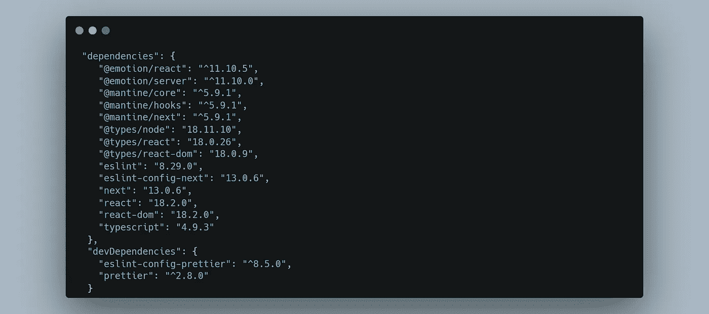
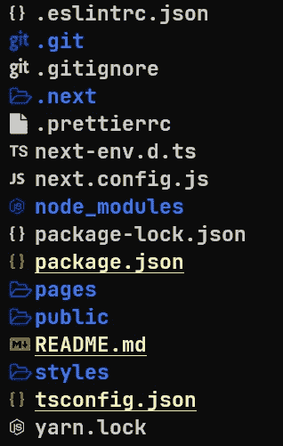
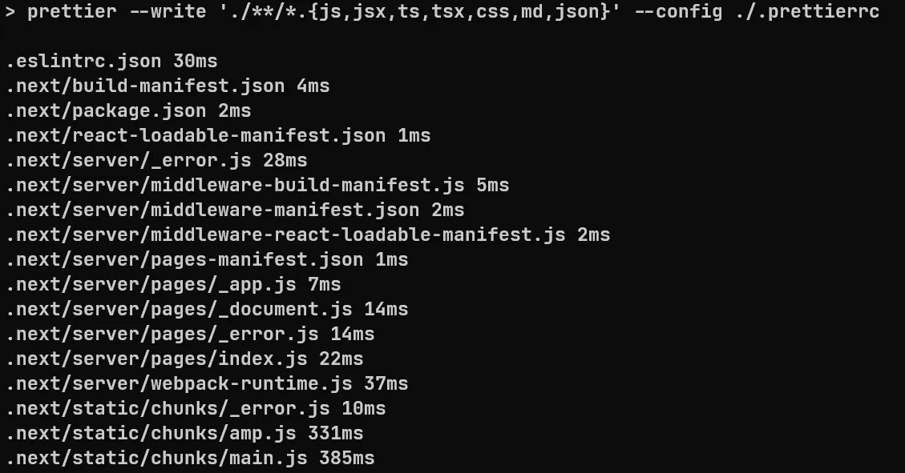
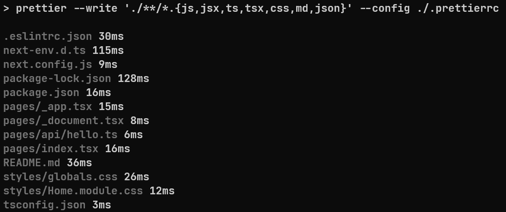
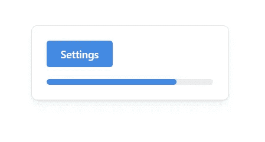

# NextJS 中的 TypeScript+prettle+ESLint+Mantine

> 原文：<https://blog.devgenius.io/typescript-prettier-eslint-mantine-in-nextjs-984a83494cc5?source=collection_archive---------3----------------------->



NextJS 改变了我们构建 Web 的方式，因为它做了许多其他框架和库做的事情，但将所有这些都封装在一个地方，为了在蛋糕上添加樱桃，NextJS 使用了 ReactJS 库的所有功能。

ESLint 是 NextJS 的默认 linter，它已经嵌入到默认的 NextJS 项目中，尽管如此，有一个包通常与 ESLint 并行，而且这个包更漂亮。

Mantine 是一个极其丰富的库，可以与 NextJS、ReactJS、Gatsby、Remix 等一起使用。包含多种类型的 UI 组件和 40 种不同的挂钩来满足您的需求。

今天，你将学习如何为 2023 年建立一个具有更漂亮和 Mantine 的 NextJS 项目，首先我们将建立一个没有 Mantine 的 NextJS，这样你就可以为任何 NextJS 项目使用这个设置。

[ESLint+prettle+Typescript 和 React in 2022 |作者 Marco Antonio Bet | Dev Genius(medium.com)](https://medium.com/dev-genius/eslint-prettier-typescript-and-react-in-2022-e5021ebca2b1)

首先让我们初始化 NextJS 项目:

```
npx create-next-app@latest --typescript
# or
yarn create next-app --typescript
```

我们需要配置的第一个包更漂亮。更漂亮的是非常简单的设置，只需要几个步骤。

在您的根目录中，请运行下面的代码片段来为 NextJS 安装更漂亮的。

```
npm install prettier eslint-config-prettier --save-dev
# or 
yarn add prettier eslint-config-prettier -D
```

*   更漂亮:是官方更漂亮的包装。
*   eslint-config-appellister:帮助禁用一些与 appellister 冲突的 ESLint 规则。
*   — save-dev 或-D: flag 将这些包存储在`devDependencies`而不是`dependencies`中。

安装后创建一个名为`.prettierrc`的文件:

```
touch .prettierrc
```

那么您的项目结构应该如下所示:



如果您已经创建了该文件，则将以下内容粘贴到`.prettierrc`文件中:

```
{
  "semi": false,
  "tabWidth": 2,
  "printWidth": 100,
  "singleQuote": true,
  "trailingComma": "all",
  "jsxSingleQuote": true,
  "bracketSpacing": true
} 
```

这些是我使用的简单漂亮的规则，但你应该去漂亮的网站，了解更多关于每一个规则，并添加你认为需要的规则。

要运行得更漂亮，我们可以使用两个路径，一个是命令行，另一个是设置您的编辑器在保存时运行得更漂亮。

我将向您展示如何设置命令行，因为这是访问更漂亮功能的通用方式。

在最后一个脚本下面的`package.json`文件中添加`format`命令:

```
"scripts": {
  "dev": "next dev",
  "build": "next build",
  "start": "next start",
  "lint": "next lint",
  "format": "prettier --write './**/*.{js,jsx,ts,tsx,css,md,json}' --config ./.prettierrc"
},
```

现在运行更漂亮的命令:

```
npm run format
# or
yarn format
```



您可以注意到,`.next`文件夹被格式化了，为了解决这个问题，我们添加一个`.prettierignore`文件来选择我们不想格式化的文件夹和文件。

```
touch .prettierignore
echo ".next" >> .prettierignore
npm run format # to check if the .next folder will be included
```



[使用 Git 别名的生产力。从我……的那天起已经一年了](https://medium.com/dev-genius/productivity-with-git-aliases-4829a118eb2)

现在一切都在按预期运行。

如果需要，您可以向`.prettierignore`文件添加更多文件。

至此，您的 NextJS 项目已经完全可以使用 ESLint 和 Prettier 运行了。我们可以更进一步，设置 Mantine 来访问 UI 组件和钩子。

在您的根目录中，请运行以下代码片段来安装 Mantine 和 emotion for NextJS。情感被 Mantine 项目用于造型。

```
npm install @mantine/core @mantine/hooks @emotion/react
# or
yarn add @mantine/core @mantine/hooks @emotion/react
```

现在我们需要用`MantineProvider`包装我们的应用程序组件:

```
import '../styles/globals.css'
import type { AppProps } from 'next/app'
import { MantineProvider } from '@mantine/core'

export default function App({ Component, pageProps }: AppProps) {
  return (
    <MantineProvider
      withGlobalStyles
      withNormalizeCSS
      theme={{
        /** Put your mantine theme override here */
        colorScheme: 'light',
      }}
    >
      <Component {...pageProps} />
    </MantineProvider>
  )
}
```

你也可以用`MantineProvider`包装**另一个**组件，如果你已经有了一些 UI 组件库，全局 CSS，或者只想在项目的特定部分使用 Mantine，这将非常有用。

为了完成 Mantine 的 NextJS 设置，我们需要创建或更新`_document.tsx`文件。`_document.tsx`应该是这样的:

```
import { createGetInitialProps } from '@mantine/next';
import Document, { Head, Html, Main, NextScript } from 'next/document';

const getInitialProps = createGetInitialProps();

export default class _Document extends Document {
  static getInitialProps = getInitialProps;

  render() {
    return (
      <Html>
        <Head />
        <body>
          <Main />
          <NextScript />
        </body>
      </Html>
    );
  }
}
```

保存所有文件后，我们需要再次运行`npm run dev`:

```
npm run dev
```

为了测试 **Mantine** 是否正常工作，我们将编辑`pages/index.tsx`并添加一个卡片、按钮和进度:

```
import { Button, Card, Center, Container, Progress } from '@mantine/core'

export default function Home() {
  return (
      <Container size={300} my={50}>
        <Card shadow='sm' p='lg' radius='md' withBorder>
          <Button styles={{ root: { marginBottom: '1rem' } }}>Settings</Button>
          <Progress value={78} />
        </Card>
      </Container>
  )
}
```

访问`localhost:3000`您应该会看到:



在这一点上，你可能已经有了一个与林挺和曼宁合作的完整的 NextJS 项目。如果你遇到一些错误或问题，不要犹豫，在下面评论。

你想要一篇关于别的东西的文章吗？别等了，在下面留下评论，我会努力的。

如果你喜欢关于 Git、Linux、生产力技巧和 Typescript 的内容，请关注我的 Medium [Marco Antonio Bet](https://medium.com/u/d708e403f9f9?source=post_page-----4829a118eb2-----------------------------------) 。

如果你觉得这篇文章很有用，请与你的朋友分享，保存起来以备后用，并给出一个👏。

回头见。

**Git 存储库:**

[it sbetma/boilerplate-nextjs-mantine(github.com)](https://github.com/itsbetma/boilerplate-nextjs-mantine)

[如何构建惊人的视差效果| Dev Genius(medium.com)](https://medium.com/dev-genius/parallax-effect-in-reactjs-b304fd5f9a67)

使用 Git 别名的生产力。从我……的那一天起已经一年了。作者:Marco Antonio Bet | Dev Genius(medium.com)

[2022 年 ESLint+beauty+Typescript and React |作者 Marco Antonio Bet | Dev Genius](/eslint-prettier-typescript-and-react-in-2022-e5021ebca2b1)

要了解更多信息:

*   [入门| Mantine](https://mantine.dev/pages/getting-started/)
*   【nextjs.org 入门| next . js
*   [什么更漂亮？更漂亮](https://prettier.io/docs/en/index.html)