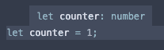
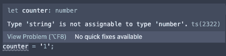
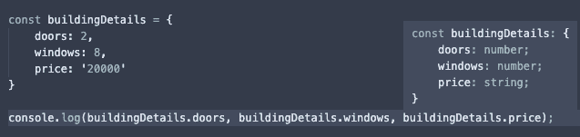
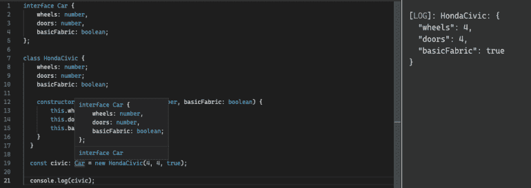
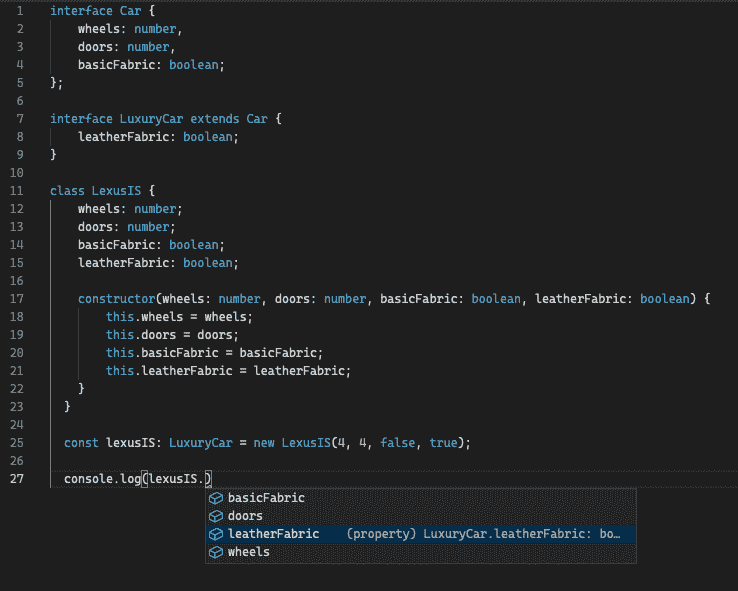
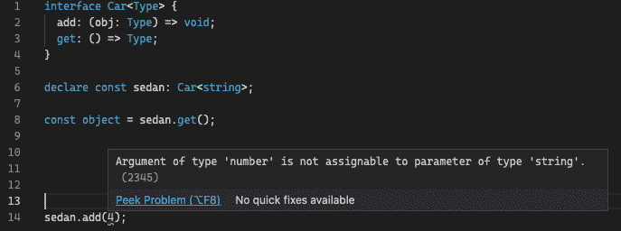

# Typescript —了解基础知识

> 原文：<https://blog.devgenius.io/typescript-understanding-the-basics-a2264759cd2d?source=collection_archive---------17----------------------->


照片由来自[佩克斯](https://www.pexels.com/photo/snow-covered-forest-field-1571442/?utm_content=attributionCopyText&utm_medium=referral&utm_source=pexels)的[詹姆斯·惠勒](https://www.pexels.com/@souvenirpixels?utm_content=attributionCopyText&utm_medium=referral&utm_source=pexels)拍摄

在网络开发的世界里，当你建立自己的网站时，有大量的选项可供选择。如果你进入谷歌搜索可用的工具，你会看到大量的选项。刚开始时，这可能会让人不知所措。从哪里开始，我们选择什么？如果你正在寻找一种工具，可以帮助你的代码保持有组织，不容易出错，我不能推荐 TypeScript。TypeScript 通过类型批注提供静态类型。

在本文的整个过程中，我将展示我在使用 TypeScript 时最喜欢的一些事情，以及我为什么亲自将它添加到我的所有项目中。

# 类型

## 类型推理

在 TypeScript 中，可以为变量分配类型。在一个小项目中，这可能看起来有点过了，但是随着项目的增长，这可以防止出现问题。

如果您在一个相当大的代码库中工作，能够以一种保持可维护性和易于管理的方式来组织我们的代码是一个巨大的优势。理论上，这使得调试和编写新代码更加容易。当开发人员能够更容易地浏览代码库时，他们会更有效率，通常也会更开心。



正如你在上面看到的，值 1 是一个数字。既然我们没有指定这个，它是怎么知道的？嗯，使用 typescript 的一大好处是它能够推断变量类型。

当更多的开发人员加入进来，并且他们开始在一个新的文件中工作时，这就变得有益了。假设一个新开发人员要在应用程序的不同部分编写一些新代码。他们试图重新分配变量 counter，但这次他们试图给它一个字符串值。如下图所示，这就是结果。



TypeScript 会发现这一点，并让他们知道。他们能够纠正方向，继续工作，而不会编写错误的代码。预先预防可以省去很多后续的麻烦。我们都知道解决一个难以发现的问题的痛苦。

正如你在下面看到的，TypeScript 非常擅长给我们一个类型的细分。



# TypeScript 中的接口

TypeScript 中另一个强大的工具是创建接口的能力。一个接口可以被看作是一个我们可以使用的框架。下面，我们的汽车界面包含了一些使汽车成为现在这个样子的东西。通过一些深思熟虑的架构，我们可以设计出干净的、可重用的代码。



## 扩展我们的接口

我们还可以让一个接口扩展另一个接口。我们可以从一个基本接口开始，我们知道这个接口在我们的应用程序中是一致的，然后构建使用原始接口属性的新接口。下面的例子展示了这一点:



如你所见，我们有我们的基本汽车接口。这个基本接口包含任何汽车都应该具有的属性。然后，我们可以使用这个基本的汽车界面，并将其扩展到我们的 LuxuryCar 界面。这使得 LuxuryCar 能够完全接触到车内的所有物品。如果我们想使某些属性成为选项，我们可以这样写属性:

```
// adding a ? at the end of the name of our property makes it optional, which means we don't have to include it when we use this interface. This leads to smarter interfaces interface Car { 
  wheels: number, 
  doors: numbers, 
  basicFabric?: boolean, 
}
```

# TypeScript 中的泛型

泛型允许我们将一个变量赋给一个类型。最常见的例子是数组。没有泛型的数组可以包含任何东西。没有泛型的数组可能包含数字、字符串、对象等。具有泛型的数组可以描述数组包含的值。正如你在下面看到的，我们可以给一个数组分配一个数字的泛型，这将限制该数组只包含数字。

```
type ArrayOfTypeNumber = Array<number>; 
type ArrayOfTypeString = Array<string>; 
type ObjectWithAgeArray = Array< 
  { age: number } 
>;
```



在上面的例子中，我创建了另一个名为 Car 的接口，但是这次我将它赋给了一个 string 类型的泛型。如果我试图添加字符串以外的任何内容，TypeScript 会通知我。我不能将 number 类型的值传递给 sedan。

# 从这里去哪里

虽然这只是 TypeScript 所能做的一小部分，但我建议继续阅读官方的[文档](https://www.typescriptlang.org)。

如果你想阅读更多的 JavaScript 基础知识，我写了一篇文章[在这里](https://aveteranwhocodes.com/2021/05/07/javascript-understanding-the-basics/)

关于这个主题，并不缺乏可用的资源，我计划在以后深入研究一些更基础的内容。一如既往，我希望这篇文章已经令人愉快。如果您有任何反馈、意见或问题，请在下面的评论区留下。

*杰瑞米·格莱斯。如果你想关注我，这里是我的* [*推特*](https://twitter.com/veteranwhocodes) *账号..*

*原载于 2021 年 5 月 13 日 https://aveteranwhocodes.com*[](https://aveteranwhocodes.com/2021/05/13/typescript-understanding-the-basics/)**。**