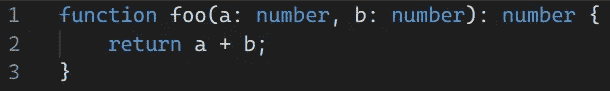
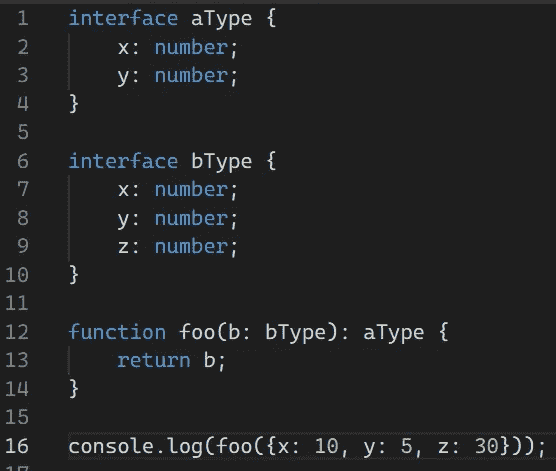

# TypeScript vs JavaScript——有什么区别？

> 原文：<https://blog.devgenius.io/typescript-vs-javascript-whats-the-difference-333a37359238?source=collection_archive---------9----------------------->

## TypeScript 与 JavaScript 有什么关系，为什么要创建它？

照片由[胡安乔·哈拉米略](https://unsplash.com/@juanjodev02?utm_source=medium&utm_medium=referral)在 [Unsplash](https://unsplash.com?utm_source=medium&utm_medium=referral) 上拍摄

JavaScript 是万维网背后的核心技术之一。然而，越来越多的 web 项目实际上是用 TypeScript 编写的。这种较新的语言是为了解决 JavaScript 在大型项目中难以使用的一些问题而创建的。但是 JavaScript 和 TypeScript 有多大不同，TypeScript 对前者有什么改进？

TypeScript 是 JavaScript 的一个**超集**。这意味着任何 JavaScript 代码也是类型脚本代码，但反之则不然。因此，如果您想将您的 JavaScript 项目迁移到 TypeScript，您可以简单地从**更改文件扩展名。js** 到**。ts** 和一切仍将编译和功能相同。有了正确的插件，你也可以有一个 JS 和 TS 混合的项目。与其他编译成 JavaScript 但不共享任何像 Kotlin 这样的语法的语言相比，这使得 TypeScript 在移植时成为更好的选择。

TypeScript 有时也被称为“类型化超集”，因为附加的语法都与类型化有关。JavaScript 是动态类型化的(类型检查在运行时完成)，而 TypeScript 是静态的。参数、函数和变量都可以用类型来注释，并且类型检查是在编译时完成的。虽然在这个简单的例子中，类型可能没有做太多的事情来防止错误，但是你的代码 get 的更复杂的类型检查被发现在确保代码正确性方面非常有用。

具有类型的简单 TypeScript 函数

编译时类型评估的另一个好处是，TypeScript 提供了比 JavaScript 更好的自动完成和建议。这可以让开发人员减少输入和查找文档的时间。

由于与 JavaScript 的关系，类型系统和类型检查的工作方式有一些有趣的地方。即使代码有类型错误，代码生成仍然会成功；这实际上在做网站开发时非常有用，因为这意味着即使网站的某个部分有类型错误，你仍然可以看到网站的大部分内容。因为在生成 JavaScript 时所有的类型信息都被删除了，所以类型化实际上对性能也没有影响，事实上它不会以任何方式影响代码的运行。由于这种删除，当使用 typescript 时，您必须意识到在运行时调用函数的类型可能不同于它的注释参数类型。

TypeScript 保留了 JavaScript 的“鸭式输入”。这个术语指的是“如果它看起来像鸭子，叫起来像鸭子，那它就是鸭子！”这意味着无论类型名称如何，如果值具有正确的属性和方法，则它们被认为是正确的类型。

演示鸭子打字的代码示例