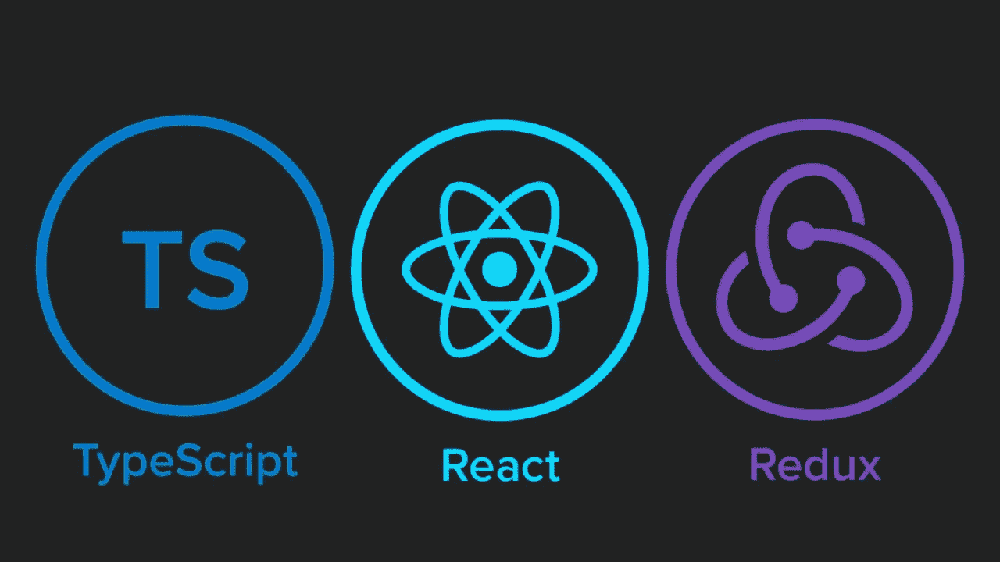
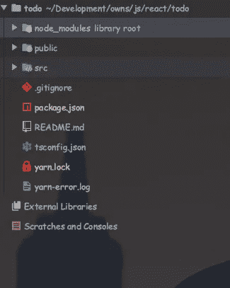
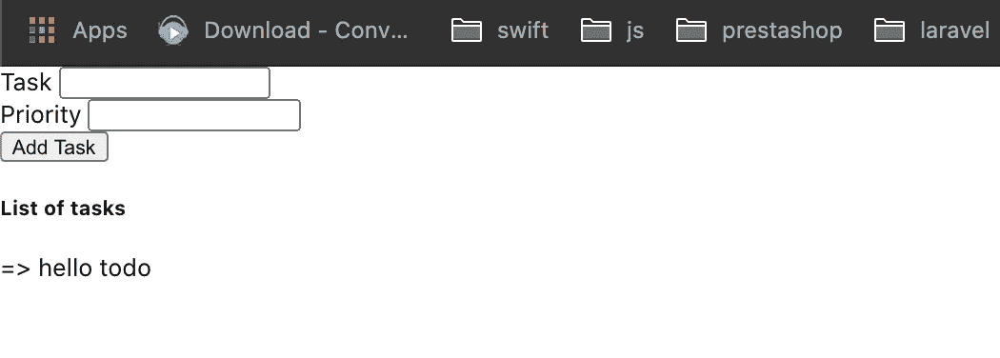
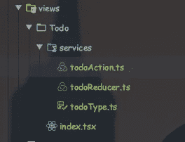

# 带有 React Redux 的类型脚本

> 原文：<https://blog.devgenius.io/typescript-with-react-redux-1a1c2f5c23ce?source=collection_archive---------15----------------------->



react-typescript-redux

# 什么是 TypeScript？

TypeScript 是 JavaScript 的超集，这意味着它是添加了额外特性的 JavaScript。从技术上讲，所有的 JavaScript 代码也是类型脚本代码。TypeScript 是一种强类型、面向对象的编译语言，由微软的**安德斯·海尔斯伯格**(c#的设计者)设计。类型脚本支持 ECMAScript6 (ES6)。

# 先决条件

了解 react、redux 和 react-router-dom。理解 html，css 和 Scss。

必须有纱线或 npm。

create-react-app 必须安装。

## 设置

在本课程中，我们将学习简单的待办事项应用程序。

安装项目。运行命令

```
create react-app todo --typescript
```

然后转到创建的文件夹，即 todo，并添加这些包。react-router-dom 来自 routing，redux 用于状态管理，其中 redux-thunk 是一个中间件。

```
yarn add @types/react-router-dom @types/redux @types/react-redux @types/redux-thunk
```

然后输入命令 yarn start 来运行项目。你会得到这样的结果

查看我们拥有的项目文件夹结构，



文件夹结构

所以现在在 src 中添加文件夹，

*   存储->状态
*   视图->用于视图页面

正在连接到存储，使用类型脚本还原。在 index.tsx 中，更新代码，如。

```
*const* app = (
    <Provider *store*={store}>
        <BrowserRouter>
            <App/>
        </BrowserRouter>
    </Provider>
)
ReactDOM.render(
    app,
    document.getElementById('root')
);
```

在存储文件夹中创建 store.ts，并将其更新为:

商店. ts

在存储文件夹中创建 reducers 文件夹。然后在 reducer 文件夹中添加 index.ts。并将 index.ts 更新为

```
*import* { *combineReducers* } *from* "redux";

*export default combineReducers*({
})
```

现在我们有了导入联合收割机减速器，一旦我们创建了其他减速器，我们就在这里注册其他减速器组件。

现在，您的应用程序将成功运行，但没有任何更改。

现在让我们在视图中创建 todo 文件夹，在 todo 中创建索引文件


视图

在 **index.tsx** 中创建组件:

你会得到这样的结果:



任务型外观

现在在 Todo 中创建服务文件夹。在服务中，我们将添加待办事项操作、待办事项缩减器和待办事项类型。



待办事项视图

现在让我们更新这些文件

todoType.ts

```
*export const* GET_TASK = "GET_TASK"
```

**todoReducer.ts:**

**todoAction.ts:**

这里*接口 ITodo 定义了*任何实体都必须遵守的语法。简单地说，它验证数据的类型。

在主存储文件夹中注册动作和减速器。

**action.ts:**

```
*export* {
    *getTask*,
    *storeTask* } *from* '../../views/Todo/services/todoAction'
```

**reducer.ts:**

```
*import* { *combineReducers* } *from* "redux";
*import todoReducer from* "../../views/Todo/services/todoReducer";
*export default combineReducers*({
    *todoReducer* })
```

我们必须更新 **index.tsx** 以便连接商店:

最后运行应用程序，我们将得到结果。你可以在 [github](https://github.com/rajeevrajchal/ts-todo) 中找到代码。

这是我在 react redux 下编写 typescript 的方法。