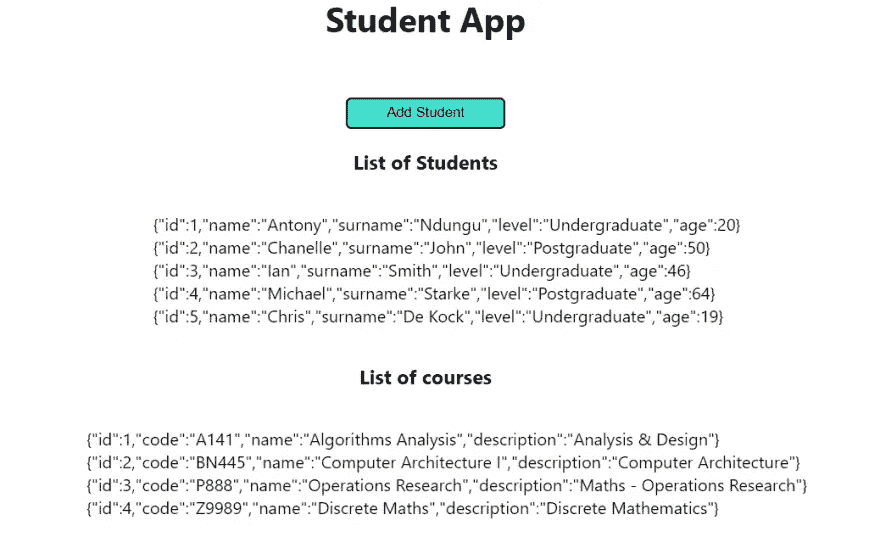

# 类型脚本与反应教程

> 原文：<https://blog.devgenius.io/typescript-with-react-tutorial-8a147b36903d?source=collection_archive---------0----------------------->


**反应类型脚本教程**

# 介绍

TypeScript 已经发展成为 web 开发中最流行和最广泛使用的编程语言之一。TypeScript 是 JavaScript 的超集。这仅仅意味着 TypeScript 本质上是带有一些附加功能的 JavaScript。TypeScript 的目标是编写强类型的 JavaScript。强大的打字功能有助于以最小的错误扩展 web 应用程序。类型脚本代码通过使用像类型脚本编译器或巴贝尔这样的编译器被转换成 JavaScript。

为了更好地理解，我们将使用 React 和 TypeScript 开发一个学生应用程序。本教程将为您提供在下一个项目中开始使用 TypeScript 所需的一切。

如果您想在 YouTube 上学习本教程，请访问以下链接。

**反应型初学者脚本教程**

最终的解决方案可以在 GitHub 上找到。

[](https://github.com/tndungu/React-TypeScript-StudentApp) [## git hub-TN dungu/React-type script-StudentApp:React type script 学生应用程序

### 使用反应类型脚本的学生应用程序。包括类型推理、类型注释、联合类型、接口等功能…

github.com](https://github.com/tndungu/React-TypeScript-StudentApp) 

# 先决条件

本教程假设您对[反应](https://reactjs.org/)有一些基本知识

**为什么使用打字稿？**

使用 typescript 有许多好处。主要如下所示:

*   强类型确保错误在开发过程中被捕获，而不是在应用程序处于生产过程中被捕获。也使得调试代码变得容易。
*   文档——它作为 JavaScript 代码的文档，易于阅读和维护。
*   节省开发时间。
*   TypeScript 中的泛型提供了一个强大的类型系统，为开发人员提供了很大的灵活性。

# 打字稿中的学生应用程序

我们将使用 React 构建一个应用程序，它将涵盖 TypeScript 的以下方面。

*   小道具
*   类型推理与类型注释
*   联合类型
*   组织界面
*   Enums
*   无商标消费品

# 应用程序开发:分步指南

要启动新的 typescript 应用程序，请使用以下命令

*   **纱线**:

```
yarn create-react-app student-app --template typescript
```

*   **npm** :

```
npx create-react-app student-app --template typescript
```

如果使用 npm，将 cd 导入学生应用程序和`yarn start`或`npm start`。

## 小道具

我们将从传递一个道具到`<App/>`组件开始。它将是一个字符串，包含应用程序的名称。在这里，我们将看到我们的第一个 TypeScript 用例。
修改`App.tsx`、`index.tsx`文件如下:删除`App.test.tsx`文件。

```
//Index.tsx
import React from 'react';
import ReactDOM from 'react-dom/client';
import './index.css';
import App from './App';const root = ReactDOM.createRoot(
  document.getElementById('root') as HTMLElement
);
root.render(
  <React.StrictMode>
    <App name="Student App" />
  </React.StrictMode>
);//App.tsx
export interface AppName {
  name: string;
}function App({ name }: AppName) {
  return (
    <div className="App">
      <h1>{name}</h1>
    </div>
  );
}export default App;
```

在您的浏览器上，您应该能够看到显示的学生应用程序。正如我们所见， **AppName** 是一个**接口**，它有一个名为 Name 的属性。
一个**接口**是一个抽象类型，编译器用它来知道一个给定对象可以有哪些属性名。它用于类型检查。
在`AppName`接口中，属性名是一个字符串，这就是为什么我们要将一个字符串传递给`App`组件。如果你试图传递任何其他类型，如整数或布尔应用程序将给出一个错误。它甚至不能编译。如果您没有使用 TypeScript，应用程序将编译，但在部署后会产生意外的结果。

## 类型推理与类型注释

```
const [studentId,setStudentId] = useState(0)setStudentId('test')
```

如果您尝试上面的代码，它将不会编译，typescript 将给出一个错误。这是因为 typescript 已经推断出`studentId`的类型是整数(数字)。如果你试图将一个字符串赋值给`studentId`将会在编译时产生一个错误。这在 TypeScript 中被称为**类型推断**。

同样，下面的代码也不会在 TypeScript 中运行。

```
const [student, setStudent] = useState(null)setStudent({
  name: 'Antony',
  surname: 'Ndungu',
  age: 15
})
```

这是因为 TypeScript 推断 student 对象是 null 类型，因此我们必须显式定义 student 对象，并且在`useState()`钩子中，我们必须告诉 TypeScript 用户可以是 null 或 student 对象。这被称为**类型注释**。我们将使用`Student`接口来完成。我们的`App.tsx`的最终代码将如下所示:

```
import { useState } from "react";
import './App.css'export interface AppName {
  name: string;
}export interface Student {
  name: string;
  surname: string;
  age?: number;
  address?: {
    houseNo: number;
    street: string;
    Town: string;
  }
}function App({ name }: AppName) {
  const [student, setStudent] = useState<Student | null>(null) const addStudent = () => {
    setStudent({
      name: 'Antony',
      surname: 'Ndungu',
      age: 20
    })
  } return (
    <div className="App">
      <h1>{name}</h1>
      <p><b>{student?.name} {student?.surname}</b></p>
      <button onClick={addStudent}> Add Student</button>
    </div>
  );
}
export default App;
```

从上面的代码来看，学生既可以是`null`也可以是`Student`对象。这由代码`useState<Student | null>(null)`表示。这引入了另一个叫做**联合类型**的概念。

## 工会类型

这是当你有一个对象，可以有不同的类型。例如，你可能有`const [student, setStudent] = useState<Student | null | boolean>(null)`。在这种情况下，`Student | null | boolean`是联合类型。

## 组织界面

就我们的界面而言，有两个问题:

*   我们不应该像在`Student`接口中那样嵌套对象。相反，我们应该有另一个地址接口。
*   接口应该在它们独立的模块上，以便于维护和重用。

我们将为`Address`创建一个新的界面。然后，我们将通过在`src`文件夹中创建一个`interfaces.ts`文件并将接口移动到那里来为接口创建一个新的模块。然后我们将在`App.tsx`文件中导入我们的接口。最终的`App.tsx`和`Interfaces.ts`文件如下所示:

```
//App.tsx
import { useState } from "react";
import './App.css'
import { Student, AppName } from './interfaces'function App({ name }: AppName) {
  const [student, setStudent] = useState<Student | null>(null) const addStudent = () => {
    setStudent({
      name: 'Antony',
      surname: 'Ndungu',
      age: 20
    })
  } return (
    <div className="App">
      <h1>{name}</h1>
      <p><b>{student?.name} {student?.surname}</b></p>
      <button onClick={addStudent}> Add Student</button>
    </div>
  );
}export default App;//interfaces.tsx
export interface AppName {
  name: string;
}export interface Address {
  houseNo: number;
  street: string;
  Town: string;
}export interface Student {
  name: string;
  surname: string;
  age?: number;
  address?: Address
}
```

## 枚举

**枚举**是用于保存常量值的类型。在我们的例子中，学生级别可以是“本科”或“研究生”。

```
export enum Level {
  Undergraduate = "Undergraduate",
  Postgraduate = "Postgraduate"
}
```

上述枚举可用于根据学生的级别有条件地显示学生的年龄，如下所示:

```
{
  student?.level === Level.Undergraduate &&
  <p><b>Age: {student.age}</b></p>
}
```

## 无商标消费品

泛型是 TypeScript 的一个重要特性，用于创建可重用的组件。相同的组件可用于处理不同的数据类型，如下所示。

**使用相同的组件显示学生和课程列表。**



对于我们的学生应用程序，我想显示 2 个列表:一个是学生列表，另一个是课程列表。如果没有泛型，我将创建两个组件来显示这两个列表。然而，对于泛型，我将只使用一个组件来显示两个列表。即使我们的应用程序越来越大，也可以重用`DisplayData`组件来显示任何项目列表。

在`src`文件夹中，我已经创建了`DisplayData.tsx`组件。该文件如下所示:

```
interface Item {
  id: number;
}interface DisplayDataItem<T> {
  items: Array<T>
}export const DisplayData = <T extends Item>({ items }: DisplayDataItem<T>) => {
  return (
    <>
      <ul>
        {items.map((item) => (
          <li key={item.id}>{JSON.stringify(item)}</li>
        ))}
      </ul>
    </>
  )
}
```

接口`Item`有一个属性`id`，这意味着任何使用这个组件的对象都必须有一个`id`属性。接口`DisplayDataItem<T>`是一个代表类型`T`的`Array<T>`的对象，这意味着它可以被任何包含一个项目数组的对象使用。`DisplayData`是一个接受项目数组并显示列表的函数。
以下是`App.tsx`、`App.css`和`data.ts`文件的最终代码。

```
//App.tsx
import { useState } from "react";
import './App.css'
import { Student, AppName, Level } from './interfaces'
import { studentList, coursesList } from "./data";
import { DisplayData } from "./DisplayData";function App({ name }: AppName) {
  const [student, setStudent] = useState<Student | null>(null) const addStudent = () => {
    setStudent({
      name: 'Antony',
      surname: 'Ndungu',
      age: 20,
      level: "Undergraduate"
    })
  } return (
    <div className="App">
      <h1>{name}</h1>
      <p><b>{student?.name} {student?.surname}</b></p>
      {student?.level === Level.Undergraduate &&
        <p><b>Age: {student.age}</b></p>
      }
      <button onClick={addStudent}> Add Student</button>
      <h3>List of Students</h3>
      <div>
        <DisplayData items={studentList} />
      </div>
      <h3>List of Courses</h3>
      <div>
        <DisplayData items={coursesList} />
      </div>
    </div>
  );
}export default App;//data.ts
export const studentList = [
  { id: 1, name: 'Antony', surname: 'Ndungu', level: 'Undergraduate', age: 20 },
  { id: 2, name: 'Chanelle', surname: 'John', level: 'Postgraduate', age: 50 },
  { id: 3, name: 'Ian', surname: 'Smith', level: 'Undergraduate', age: 46 },
  { id: 4, name: 'Michael', surname: 'Starke', level: 'Postgraduate', age: 64 },
  { id: 5, name: 'Chris', surname: 'De Kock', level: 'Undergraduate', age: 19 },
]export const coursesList = [
  { id: 1, code: 'A141', name: 'Algorithms Analysis', description: 'Analysis & Design' },
  { id: 1, code: 'BN445', name: 'Computer Architecture I', description: 'Computer Architecture' },
  { id: 1, code: 'P888', name: 'Operations Research', description: 'Maths - Operations Research' },
  { id: 1, code: 'Z9989', name: 'Discrete Maths', description: 'Discrete Mathematics' }
].App {
  display: flex;
  width: 100%;
  align-items: center;
  justify-content: center;
  flex-direction: column;
}li{
  list-style-type: none;
}button {
  height: 30px;
  width: 150px;
  background-color: turquoise;
  border-radius: 5px;
}
```

**通用搜索功能**

最后，我们将添加一个通用搜索，通过单击按钮，可以根据学生姓名或年龄对学生列表进行排序。
创建一个`GenericSort.ts`文件，并确保你有下面的代码。这段代码接受一个数组项列表和一个用于排序的键，然后返回排序后的列表。例如，如果我想根据学生姓名对学生列表进行排序，我将调用函数`GenericSort(studentList,"name")`
这是一个强大的泛型用例，如果我想根据不同的排序列对学生记录列表进行排序，我可以使用它。在没有 TypeScript 的情况下实现这一点最终会产生许多难以扩展的函数。

```
//GenericSort
export const GenericSort = <T,>(items: Array<T>, key: keyof T) => { items.sort((a, b) => {
    if (a[key] > b[key]) {
      return 1;
    }
    if (a[key] < b[key]) {
      return -1;
    }
    return 0;
  })
  return items
}//App.tsx
import { useState } from "react";
import './App.css'
import { Student, AppName, Level } from './interfaces'
import { studentList, coursesList } from "./data";
import { DisplayData } from "./DisplayData";
import { GenericSort } from "./GenericSort";function App({ name }: AppName) {
  const [student, setStudent] = useState<Student | null>(null)
  const [list, setList] = useState(studentList) const addStudent = () => { setStudent({
      name: 'Antony',
      surname: 'Ndungu',
      age: 20,
      level: "Undergraduate"
    })
  } const sortData = () => { GenericSort(studentList, "age")
    setList([...studentList])
  }
  return (
    <div className="App">
      <h1>{name}</h1>
      <p><b>{student?.name} {student?.surname}</b></p>
      {student?.level === Level.Undergraduate &&
        <p><b>Age: {student.age}</b></p>
      }
      <button onClick={addStudent}> Add Student</button>
      <br />
      <button onClick={sortData}>Sort Data</button>
      <h3>List of Students</h3>
      <div>
        <DisplayData items={list} />
      </div>
      <h3>List of Courses</h3>
      <div>
        <DisplayData items={coursesList} />
      </div>
    </div>
  );
}export default App;
```

# 结论

厉害！至此，您已经完成了使用 TypeScript 构建 React 应用程序的核心构建块。在项目的最后一部分，我们介绍了 TypeScript 和泛型的一些高级特性。
用打字稿快乐编码。
如果您需要进一步的帮助，请随时在下面发表评论。