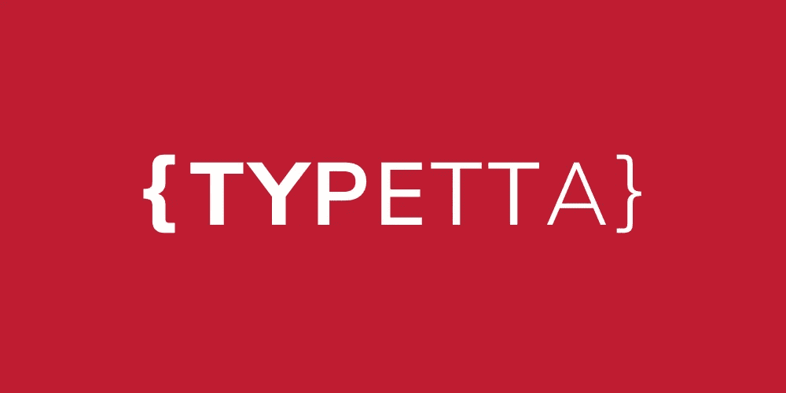

# Typetta |打字爱好者的打字格式

> 原文：<https://blog.devgenius.io/typetta-470c627631af?source=collection_archive---------13----------------------->

[Typetta](https://twinlogix.github.io/typetta/) 是一个用 TypeScript 编写的**开源 ORM** ，旨在允许以类型化的方式无缝访问所有**主要 SQL 数据库** (MySQL、PostgreSQL、Microsoft SQL Server、SQLLite3、CockroachDB、MariaDB、Oracle e Amazon Redshift)以及 NoSQL 数据库 **MongoDB** 。



Typetta 可插入任何 TypeScript 后端(包括无服务器应用程序和微服务)，但就收益而言，我们完全建议在所有 **GraphQL** 后端中使用它，因为……因为我们就是喜欢 GraphQL。

# 我如何使用 Typetta？

使用 Typetta，一切都围绕着数据模型、描述应用程序域的实体以及它们之间的所有底层关系。这个模型用标准的 GraphQL 描述，使用了所有的基本概念(标量、类型、枚举等)和一些自定义指令。

从领域分析的模型输出开始，Typetta 提供了一系列代码生成器，用于:

*   模型中每个实体的 TypeScript 语言类型定义。
*   每个实体类型的数据访问对象(又名 DAO ),它有一个相应的数据源。每个 DAO 都是一个对象，开发人员也可以使用高级 CRUD 操作对其进行查询。
*   DAOContext 是一个上下文对象，开发人员可以在其中配置每个数据源并检索任何 DAO 的引用。主要功能

下面是对 Typetta 令人敬畏之处的简要描述:

*   完全支持主要的 SQL 数据库和 MongoDB。
*   多个数据库，包括交叉查询不同数据库的能力。
*   多重连接和连接池。
*   实体关系:一对一，一对多，多对多。
*   动态类型和相应的数据投影。
*   分页。
*   可以使用中间件进行扩展。
*   数据库的定制标量和序列化。
*   自动生成的 id。
*   验证规则。
*   虚拟字段、计算字段和计算字段。
*   聚合查询。
*   能够构建自定义查询。
*   定义数据访问安全策略。
*   MongoDB 和 SQL 都支持嵌入式文档。
*   自动化代码生成。
*   轻松集成 GraphQL 后端。
*   交易。
*   伐木。
*   嘲讽。
*   审计。
*   多租户分区。
*   软删除。

# 为什么是泰佩塔？

Typetta 满足了一个连接到 SQL 和 NoSQL 数据库的类型化 ORM 的需求，它的设计考虑了生产率和灵活性。

Typetta 组件背后的理念是确保易用性和开发时间的优化，仅在严格需要时增加复杂性(直接访问数据源)。

万一你还不确定，为什么用 Typetta 而不用其他 ORM 呢？

*   它是唯一完全支持 SQL 和 MongoDB 数据库的 TypeScript ORM。
*   一个非常**严格的类型化**系统，100%利用 TypeScript 根据请求的数据类型提供类型作为响应。
*   使用标准的 **GraphQL** ，你可以定义模型。使用该标准为基于该标准的一整套工具和第三方框架打开了大门。

# 入门指南

Typetta 是一个很小的包，可以使用 npm 安装在任何 TypeScript 项目上。唯一的显式依赖项是 GraphQL。两者都可以非常简单地使用 npm 添加到项目中:

```
npm install [@twinlogix/typetta](http://twitter.com/twinlogix/typetta) — save
```

## **项目结构**

Typetta 不依赖于特定的项目结构，因此是完全可配置的。对于我们的示例，我们可以考虑使用如下的 TypeScript 项目结构:

```
MyProject
 ┣ src
 ┃ ┗ index.ts 
 ┣ package.json
 ┗ tsconfig.json
```

您需要做的就是用 GraphQL 语言添加一个应用模型，通常可以在 src 目录下的一个名为 *schema.graphql* 的文件中找到，也可以在根目录下的一个名为 *codegen.yml* 的配置文件中找到，用于代码生成。

更新后的项目结构如下:

```
MyProject
 ┣ src
 ┃ ┣ **schema.graphql**
 ┃ ┗ index.ts 
 ┣ package.json
 ┣ tsconfig.json
 ┗ **codegen.yml**
```

## **数据模型**

在文件 *schema.graphql* 中，你必须用 graphql 语言插入应用模型。有关完整的 GraphQL 语法指南，请直接参考官方网站[graphql.org](http://graphql.org)。

Typetta 依靠定制的指令来扩展标准模型定义，允许开发人员在绑定到数据源时指定非常有用的细节。

在下面你可以看到一个用户的简单定义，包括名字和姓氏。

```
type User @entity [@mongo](http://twitter.com/mongoEntity) {
  id: ID! [@id](http://twitter.com/id)
  firstName: String
  lastName: String
}
```

## **代码生成**

使用 Typetta，使用 GraphQL 之类的标准语言来建模应用程序使开发人员能够使用许多第三方工具和库。因此，开发应用程序变得更快、更有成效。

Typetta 中的代码生成依赖于 [GraphQL 代码生成器](https://www.graphql-code-generator.com/)，这是一个非常可定制和可扩展的库。GraphQL 代码生成器使开发人员能够从许多标准生成器以及我们的嵌入式生成器中进行选择，后者自动提供了 TypeScript 语言中的 DAO。

Typetta 已经包含了使用 TypeScript 生成器的所有默认依赖项，但是也可以按照官方指南添加其他生成器。

现在是时候用最少的努力来配置我们的第一个 *codegen.yml* 了。此操作将启用代码生成。

```
schema: "src/schema.graphql"
generates:
   src/models.ts:
     plugins:
       — "typescript"
   src/dao.ts:
     config:
       schemaImport: "./schema.graphql"
       tsTypesImport: "./models"
     plugins:
       — "[@twinlogix/typetta](http://twitter.com/twinlogix/typetta)"
```

为了允许代码生成，还可以编辑 package.json 文件，插入以下脚本:

```
{
  "scripts": {
    "generate": "graphql-codegen"
  }
}
```

现在，让我们运行以下命令，进行第一次代码生成:

```
npm run generate
```

使用上面的设置，代码生成命令将创建两个文件: *src/models.ts* 包含所有包含在 *schema.graphql* 中的类型脚本类型，另一个文件 *src/dao.ts* 包含 dao 和 DAOContext。这两个文件以后会有用的。

## **一个简单的应用**

下面的初始 Typetta 示例在 MongoDB 数据库上读写一个实体(在 ab SQL DB 上几乎是一样的)。这个例子和其他例子可以在一个[专用存储库](https://github.com/twinlogix/typetta-examples)中找到。

首先…使用官方驱动程序打开到 MongoDB 数据库的连接:

```
import { MongoClient } from 'mongodb';
import { DAOContext } from './dao';const main = async () => {
  const mongoConnection = 
     await MongoClient.connect(process.env.MONGODB_URL!);
  const mongoDb =
     mongoConnection.db(process.env.MONGODB_DATABASE_NAME);
};
main();
```

让我们做我们的第一个 DAOContext，我们的第一个 Typetta 代码生成的类。此类代表应用模型的所有实体的中央报告。

```
const daoContext = new DAOContext({
  mongo: {
    default: mongoDb
  }
});
```

现在是时候对用户实体进行第一次 CRUD 简单操作了。

```
const user1 = await daoContext.user.insertOne({
  record: {
    firstName: "Mattia",
    lastName: "Minotti"
  }
});const user2 = await daoContext.user.insertOne({
  record: {
    firstName: "Edoardo",
    lastName: "Barbieri"
  }
});const users = await daoContext.user.findAll();
users.forEach(user => 
  console.log(`${user.firstName} ${user.lastName}`)
);
```

我们个人版本的 Hello World 示例将在控制台上打印以下两个名称:

```
Mattia Minotti
Edoardo Barbieri
```

这是连接到 MongoDB 的初始 Typetta 示例的完整源代码:

```
import { MongoClient } from 'mongodb';
import { DAOContext } from './dao';const main = async () => { const mongoConnection = 
    await MongoClient.connect(process.env.MONGODB_URL!);
  const mongoDb = 
    mongoConnection.db(process.env.MONGODB_DATABASE_NAME); const daoContext = new DAOContext({
    mongo: {
      default: mongoDb
    }
  }); const user1 = await daoContext.user.insertOne({
    record: {
      firstName: "Mattia",
      lastName: "Minotti"
    }
  }); const user2 = await daoContext.user.insertOne({
    record: {
      firstName: “Edoardo”,
      lastName: “Barbieri”
    }
  }); const users = await daoContext.user.findAll();
  users.forEach(user => 
    console.log(`${user.firstName} ${user.lastName}`)
  );
};main();
```