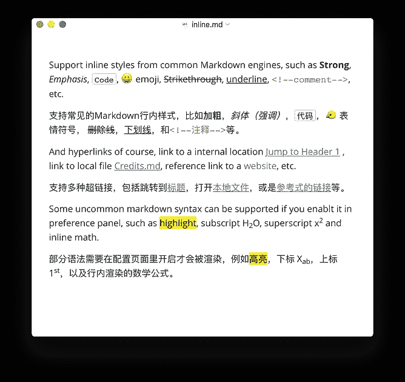

# 非常简单的降价编辑器

> 原文：<https://blog.devgenius.io/typora-very-simple-markdown-editor-8030a1feba04?source=collection_archive---------19----------------------->

## 这个 markdown 编辑器将使你取代你的旧文本编辑器

图片截图作者来自 [Typora.io](https://typora.io/)

周日下午，我试图找到最简单的应用程序来编辑 markdown 文件。我计划编辑我的一些 [Github](https://github.com/nunenuh) 库，但是不打开 PyCharm IDE，那会占用我很多内存。所以我决定用关键字***“markdown editor Ubuntu”****在谷歌搜索，在搜索建议图片的顶部，左边有 typora。至于那张图片中出现的其他图像，如 Atom，Sublime Text，我一直在使用它，我知道它们对我来说不够简单。*

**

*作者图片截图*

*作为参考，我使用 ubuntu 已经很多年了，从 2006 年开始。但我一直使用 Ubuntu OS，因为我的主要操作系统大约是在 2010 年。所以对于 gedit，我已经用了很长时间，当然，记事本不是 Linux 的选择，不是吗？而对于另一个，光看图片我觉得不够简单。*

*所以，我去了 typora.io 网站，我发现它的登陆页面就像应用程序本身一样简单，我环顾了一下网站，想了解更多关于应用程序的信息，然后我爱上了它的简单性。所以，我就试着在 snap store 中找到应用程序，并把它安装在我的笔记本电脑上。*

**

*作者图片截图*

******

*图片最初来自 [typora.io](https://typora.io/) 网站*

******

*图片来源于 [typora.io](https://typora.io/) 网站*

*这是我的笔记本电脑中 typora 应用程序的第一个外观。看起来棒极了！我喜欢干净的外观，它更像一个文本编辑器，而不是 IDE，这就是我想要的！*

**

*作者图片截图*

*所以，我只是尝试这些应用程序，看看里面有什么，这让我更喜欢这些应用程序。它的简单性让我感到惊讶，这就是我所寻找的，我想要一个简单的文本编辑器软件，可以用它的简单性取代 gedit，但具有编辑 markdown 文件的功能。*

**

*作者图片截图*

*好吧，如果你想知道更多关于这些应用的信息，直接去网站，它是多平台的，所以你可以在你的 Windows 或 Mac OSX 上安装它。我希望你喜欢这篇文章。感谢你阅读这篇文章，我希望你发现它对你有用，就像我发现它对我有用一样。享受你的一天，祝你愉快。*