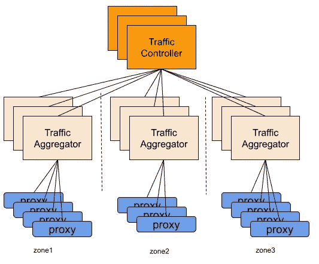

# 优步服务网状架构

> 原文：<https://blog.devgenius.io/uber-service-mesh-architecture-58267817387d?source=collection_archive---------5----------------------->

汤姆·莫比在 [Unsplash](https://unsplash.com?utm_source=medium&utm_medium=referral) 上的照片

## 优步=普遍更经济的乘坐方式

> [如果你觉得我为你贡献了价值，请支持我！](https://ko-fi.com/jinlowmedium)

上个月，我感觉我的收入几乎立刻减少了。我越来越难获得我想要的收入，但如果我停下来，我会为我推荐的会员感到难过。请告诉我原因以及如何改进。

*   服务网格基础设施通过 [**远程过程调用**](https://en.wikipedia.org/wiki/Remote_procedure_call)(RPC)处理服务间通信，并提供连接、管理和保护微服务的平台
*   它通过处理需要复杂编码的功能减轻了应用程序开发人员的负担，这可以在网格级别而不是在应用程序中完成
*   它提供了分布式服务所需的关键功能环境，如弹性、服务发现、负载平衡、加密、授权和容错(通过服务重试和断路器)。

*你可以看一下我的文章有更好的理解。*

 [## 服务网格简介

### 它是一种网络模型，位于 TCP/IP 之上的抽象层。

jinlow.medium.com](https://jinlow.medium.com/the-introduction-of-service-mesh-710d9b566df0) 

文章“ [**优步系统架构**](https://medium.com/interviewnoodle/uber-system-architecture-40201134aaea) ”将业务需求抽象为系统模块或系统组件。这篇文章将解释更多的技术知识。

由 [**廖建志**](https://www.linkedin.com/in/chien-chih-l-11049a1b?trk=public_profile_browsemap_profile-result-card_result-card_full-click)[**Pawel Krolikowski、**](https://www.linkedin.com/in/krolikowskipawel/)****[**Sangeeta Kundu**](https://www.linkedin.com/in/sangeeta-kundu-a448118)撰写的文章《 [**优步目前的服务网状架构》提出了一个实时动态子集解决方案。子集算法是大规模分布式系统负载平衡中常用的技术。随着集群规模的增加，性能瓶颈往往会逐渐暴露出来，这会给应用程序带来一定的开销。**](https://www.uber.com/en-MY/blog/better-load-balancing-real-time-dynamic-subsetting/)****

****优步决定将其整体架构分成多个代码库，以形成微服务架构。****

****然而，优步微服务系统也面临着诸多挑战。****

1.  ****很多微服务都要互相调用才能完成一个任务。一旦其中一个过程出错，就很难排除故障****
2.  ****微服务可以进一步分为许多组件。如果单个部件存在故障，整个系统的误差将非常复杂。如果在调用服务时没有错误处理机制，就不容易排除故障****
3.  ****如果版本升级更改了 API，服务可能不会被调用。在新版本发布时，需要控制不同的版本访问不同的地址。它需要智能流量控制机制。****

****一个微服务通过远程过程调用与另一个微服务通信，而不用担心基础设施的细节。它需要的只是目标服务名、过程和请求。服务网格解决了其余的问题。****

1.  ******发现**——找到最新、最健康的后端服务****
2.  ******负载平衡** —将负载适当地分配给可用的服务****
3.  ******认证** —服务之间的安全通信****
4.  ******流量整形** —当出现服务故障时，避免将请求转发到特定区域/集群****
5.  ******可观察性** —观察延迟和流量模式****
6.  ******可靠性** —节流、速率限制、自动故障转移****

******优步技术概述******

****优步基础设施在全球多个地区运营。它涵盖内部数据中心和公共云提供商。每个控制平面组件都被划分，并且每个都有几个子组件。****

********

****图片来源:[**优步科技有限公司**](https://www.uber.com/en-MY/blog/better-load-balancing-real-time-dynamic-subsetting/)****

******服务 A 通过主机代理向服务 B 发出 RPC 请求。在网络层，优步的服务网状架构是基于*第 7 层(应用层负载平衡)构建的——基于 URL 等应用层信息。*******

> ******第 7 层负载平衡通过虚拟 URL 或主机名接收请求，然后将它们分发到真实的服务器。它根据第 4 层信息或第 7 层信息转发流量。没有第四层负载均衡是绝对不可能有第七层负载均衡的。可以根据 URL、浏览器类别和语言来确定正在转发的流量。例如，web 服务器可以分为两组，中文用户和英文用户。然后，第七层负载均衡可以在用户访问你的域名时自动识别用户语言，并选择相应的服务器组。因此，它主要分析应用层信息，如 HTTP 协议 URL 或 cookie 信息。******

******你可以读一下我的文章来更好地理解。******

****** [## 系统设计基础知识——(9)——负载均衡器

### 负载平衡—将一组任务分配给一组资源的过程。有两种主要方法…

medium.com](https://medium.com/thedevproject/the-fundamental-knowledge-of-system-design-9-load-balancer-c55ff4feae5)****** ************

******图片来源: [**大可对 IBM**](https://developer.ibm.com/blogs/istio-15-release/)******

******在高层，代理通过控制平面 API 连接到控制平面组件。******

************

******图片来源: [**优步科技有限公司**](https://www.uber.com/en-MY/blog/better-load-balancing-real-time-dynamic-subsetting/)******

********主机代理********

*   ******调用者服务将 RPC 请求发送到本地端口，由主机代理监听******
*   ******主机代理将 RPC 请求直接转发给后端服务******
*   ******代理连接到控制平面组件，以从流量控制服务接收流量分布，从而了解流量如何在服务的不同区域/组之间分割******
*   ******从发现服务获取任务******
*   ******在可用的后端服务之间执行负载平衡******

********服务发现系统********

*   ******它与集群管理接口以更新后端服务的任务。******
*   ******组件 A 与多个组件通信。但是当组件数量增加时，为每个组件添加单独的负载平衡器变得太复杂和不切实际。因此，组件 A 必须知道仍能正常提供服务的多个组件的确切位置。服务发现用于查找其他组件的位置，并将组件位置信息返回给代理，以便代理可以对任务进行负载平衡。******

********交通控制系统********

*   ******它是整个系统的指挥官******
*   ******它生成流量分配，包括每个后端任务池应该接受的流量分配******
*   ******它定义了控制服务请求如何在服务网格中路由的规则******
*   ******它为服务所有者配置策略集。******
*   ******它允许服务所有者创建一个漏极来避免某些后端任务池，或者跨数据中心故障转移流量******

******现在，您应该对优步的服务网格体系结构有了大致的了解。******

******此外，本文还讨论了高效的负载平衡技术。******

********负载均衡概念********

********子集********

******在一个集群中，服务器通常有不同的标签，那么如何将一个请求路由到一组有指定标签的服务器呢？通常，根据服务的类别将服务器分组到一个服务下，以形成多个子集。******

> ******负载平衡中的子集化指的是将潜在的后端任务集划分为重叠的“子集”，以便所有后端服务都接收流量，并且每个代理都正确地加载任务。******

******为了避免为每个请求重复建立和断开 TCP 连接，代理通常与后端服务保持长期连接。每个连接在两端都消耗一些计算资源(CPU、内存等)，即使它是空闲的。******

******理论上来说，维护成本很低。然而，当横向扩展微服务试图处理更多请求时，维护成本会迅速上升。子集化可以解决这个问题。******

********方法论**:目的地规则根据标签将流量划分为不同的子集，为调度提供虚拟服务，设置相关负载百分比，实现流量控制。******

******由于服务网格的大小，主机上的代理需要使用子集。******

******然而，有许多不平衡的问题。******

1.  ********随机任务选择导致的不平衡** —代理可以从可用池中随机挑选后端服务，并对这些任务进行负载平衡，而无需依赖控制平面******
2.  ********主机共址导致的不平衡** —代理由同一服务器上的所有后端服务共享。因此，服务发出一个请求，一个随机挑选的后端任务子集将比其他任务接收更多的请求。******

********改进**:实时动态子集化******

*   ******当代理知道被调用者服务接收的 QPS 的数量时，它可以计算它的负载占整个流量的比例。因此，它可以按比例动态确定其子集的大小。******

************

******图片来源: [**优步科技有限公司**](https://www.uber.com/en-MY/blog/better-load-balancing-real-time-dynamic-subsetting/)******

************

******图片来源: [**优步科技有限公司**](https://www.uber.com/en-MY/blog/better-load-balancing-real-time-dynamic-subsetting/)******

*   ******代理定期向流量控制系统上传流量负载报告。******

******要横向扩展，有两层聚合:******

*   ******1)交通管理员—利用交通分布的全局视图******
*   ******2)流量聚合器—随着代理数量的增加而横向扩展******

******代理有 3 种类型的信息******

*   ******1)流量分配—发送到每个后端服务的流量百分比******
*   ******2)负载—发送的流量******
*   ******3)总负载—服务接收的总流量******
*   ******该信息允许工程师动态调整每个代理的子集大小******

********参考文献********

****** [## 为什么我们在优步的微服务架构中利用多租户

### 优步服务的性能依赖于我们在平台上快速稳定地推出新功能的能力…

www.uber.com](https://www.uber.com/en-MY/blog/multitenancy-microservice-architecture/)  [## 更好的负载平衡:实时动态子集设置

### 子集化是大规模分布式系统负载平衡中常用的技术。在这篇博文中，我们将…

www.uber.com](https://www.uber.com/en-MY/blog/better-load-balancing-real-time-dynamic-subsetting/)  [## 远程过程调用-维基百科

### 在分布式计算中，远程过程调用(RPC)是指计算机程序使一个过程(子例程)执行…

en.wikipedia.org](https://en.wikipedia.org/wiki/Remote_procedure_call)  [## 目的地规则

### DestinationRule 定义在路由发生后应用于服务流量的策略。这些规则…

istio.io](https://istio.io/latest/docs/reference/config/networking/destination-rule/)  [## 什么是服务网格，为什么要关注它

### 在过去的两年中，您可能听说过一个叫做“服务网格”的东西和相关的开源技术…

www.plugandplaytechcenter.com](https://www.plugandplaytechcenter.com/resources/what-service-mesh-and-why-should-you-care-about-it/)  [## 优步基于无服务器的服务网格 Catalyst 加快了应用程序开发

### 当肖恩·伯克在 2015 年被优步聘为员工工程师时，他走进了一家正在经历…

thenewstack.io](https://thenewstack.io/ubers-catalyst-service-mesh-provides-visibility-speed/) 

如果你发现我的任何文章有帮助或有用，那么请考虑给我一杯咖啡，帮助支持我的工作或给我赞助😊·通过使用和

[**Patreon**](https://www.patreon.com/jinlowmedium)

[**Ko-fi.com**](https://ko-fi.com/jinlowmedium)

[buymeacoffee](https://www.buymeacoffee.com/jinlowmedium)

最后但同样重要的是，如果你还不是一个中等会员，并打算成为一个，我恳请你使用下面的链接。我将收取你的一部分会员费，不增加你的额外费用。

 [## 用我的引荐链接-金加入 Medium

### 阅读金(以及其他成千上万的作家)的每一篇小说。你的会费直接支持金和…

jinlow.medium.com](https://jinlow.medium.com/membership)******