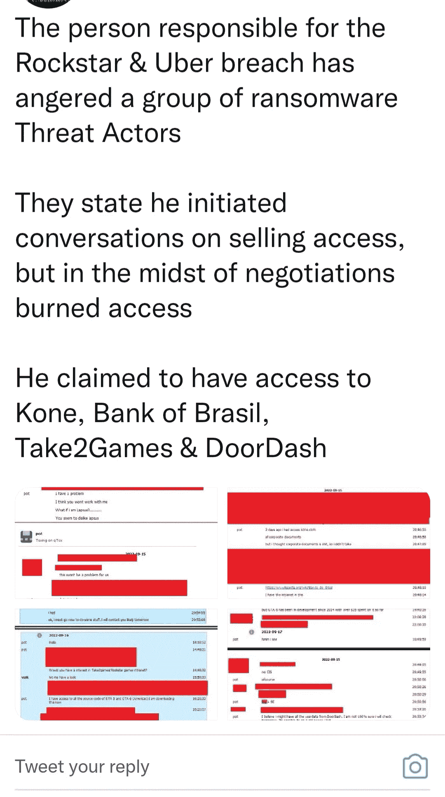

# 优步:个人恩怨

> 原文：<https://blog.devgenius.io/uber-the-personal-vendetta-fda7a8e3124?source=collection_archive---------2----------------------->

## 永远不要低估某人的能力

玛丽亚·沙拉巴耶娃在 [Unsplash](https://unsplash.com?utm_source=medium&utm_medium=referral) 上的照片

每个人都听说过最糟糕的优步黑客事件。周四，优步获悉其计算机网络遭到入侵，促使该公司关闭了大量内部通信和工程系统，以调查攻击的范围。

一名声称对此次攻击负责的人向网络安全专家和《纽约时报》提供了电子邮件、云存储和代码库的截图，看起来优步的许多内部系统已经被渗透。

这名黑客提供了优步内部系统的截图来证明他的访问，他说**他 18 岁**并且已经在他的网络安全技能上下了几年功夫。他说他侵入优步的系统是因为该公司的安全薄弱。在宣布违规的 Slack 消息中，该人士还表示**优步司机应该获得更高的工资**。

黑客发来的真实文本

很快，我们可以判断出这不是一个以英语为母语的人，这将使优步更难调查一个外国人。此外，他对自己的成就感到非常自豪，不管是对是错。如果你了解他的动机，他在短信中说他这么做是因为优步的安全薄弱，优步的司机应该挣更多。

在网络安全领域待的时间够长，你就会知道 bug bounty 并没有大家想象的那么好看。一旦进入这个世界，你会遇到很多黑幕的个人，公司，国家代表。这些人会利用许多试图在这个行业谋生的年轻人和成年人。不需要专家也能看出这是私人恩怨。如果他们开始调查他们的黑客报告，他们可能会找到是谁干的线索。难怪这是他第一次以钓人为乐的地方。

hackerone.com 优步

嗯，我理解那个孩子的动机，他可以用很多方法来利用他的发现并获得报酬，但他没有。他想惩罚他们。公司有这种愚蠢的政策，不支付社会工程黑客。不知何故，他们觉得碰不得。他们认为这永远不会发生在他们身上。

几个月前，我在美国联邦政府有过同样的经历。我给他们发了十份报告，五份标着已验证，最后，他们连谢谢都没说。这种情况引发了激烈的对抗，使他们禁止我接触他们的基础设施。他们说；*我们觉得和你一起工作不安全。其中一些报告至今仍未结案。我本可以和这个人走同样的路，但我知道我是在失败的一端。*

侠盗猎车手

不管他们什么时候找到这个人，相信我，他们会的。他将感受到“*正义*的愤怒，因为触动了像优步这样的大科技公司。由于他是 GTA 泄密事件的幕后黑手，**FBI**刚刚加入调查。他走得太远了吗？也许吧，但不是每个人感觉被耍时的反应都一样。这种情况应该唤醒公司和政府更加认真地对待研究人员。

**编辑更新**:这篇文章写完的第二天，攻击优步的人被逮捕了(是的，没多久)。他的被捕揭露了许多我们不知道的事情。这个人，一个住在英国的 17 岁的孩子，也是革命和许多其他黑客的幕后黑手。他试图在黑市上卖掉他的许多废品。

