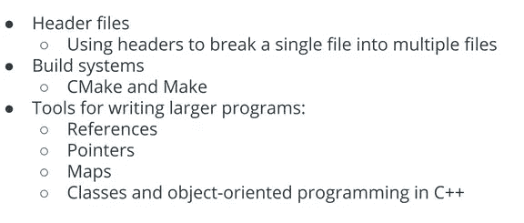
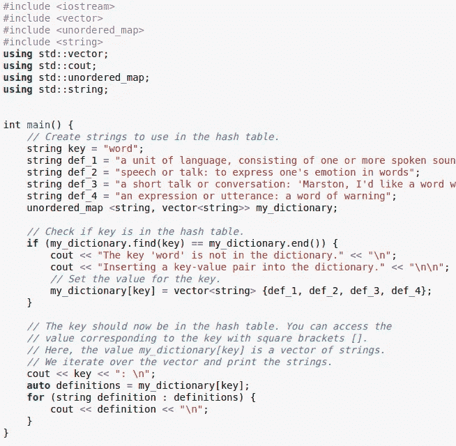
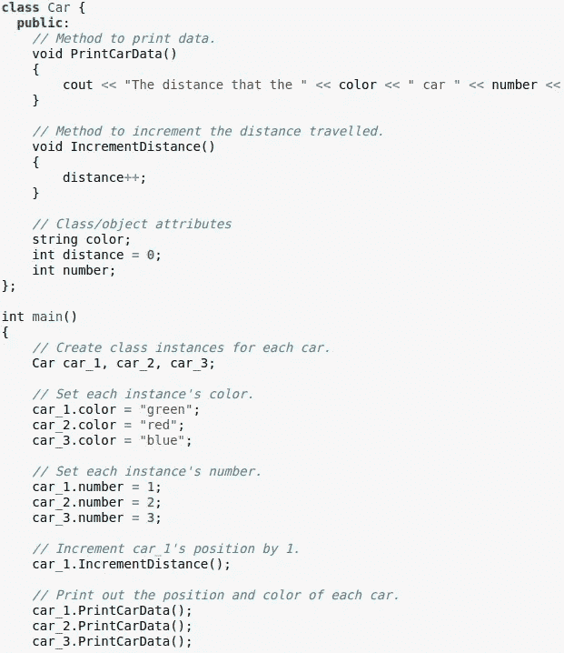
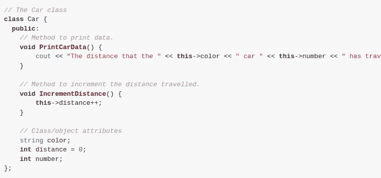

# Udacity C++开发人员 nanodegree(基础-第 4 课-partC : Maps，OOP)

> 原文：<https://blog.devgenius.io/udacity-c-developer-nanodegree-foundation-lesson4-partc-maps-oop-e6d0bca4c74d?source=collection_archive---------8----------------------->


照片由[最大聚焦](https://unsplash.com/@maximalfocus?utm_source=medium&utm_medium=referral)在[未飞溅](https://unsplash.com?utm_source=medium&utm_medium=referral)上拍摄

**课程大纲**



**地图**

到目前为止，在本课程中，我们已经看到了容器数据结构，如`vector`和`array`。容器数据结构非常适合存储有序数据，类对于将相关数据和函数组合在一起非常有用，但是这两种数据结构都不适合存储相关数据。

映射(或者是[哈希表](https://en.wikipedia.org/wiki/Hash_table)、哈希映射或字典)是一种数据结构，它使用*键/值*对来存储数据，并提供高效的数据查找和插入。`unordered_map`是映射的 C++标准库实现(也存在其他实现)。



使用地图示例

**类和 OOP**

如果你正在学习这门课程，你可能以前在另一种语言中使用过面向对象编程(OOP)。如果你使用 OOP 已经有一段时间了，OOP 是一种编码风格，它将相关数据(对象*属性*和函数(对象*方法*)收集在一起，形成一个单一的数据结构，称为*对象*。这允许属性和方法的集合在您的程序中重复使用，而没有代码重复。

在 C++中，组成对象的属性和方法在代码*类*中指定，程序中的每个对象都是该类的一个*实例*。

考虑一个具有属性的“Car”类；距离、颜色、数量和功能；incrementDistance()，printCarData()。



汽车类别定义

如果我们计划构建一个更大的程序，此时最好将类定义和函数声明放在一个单独的文件中。正如我们之前讨论头文件时一样，将类定义放在单独的头文件中有助于组织代码，并防止在定义类之前试图使用类对象时出现问题。

**改进建议:**

1.  当类方法在类之外定义时，必须使用*范围解析操作符* `::`来指示该方法属于哪个类。例如，在`PrintCarData`方法的定义中你看到:

*   `void Car::PrintCarData()`

如果有两个类的方法同名，这可以防止任何编译器问题。

2.我们可以改变构造函数初始化变量的方式。代替前面的构造函数:

*   `Car(string c, int n) { color = c; number = n; }`

构造函数现在使用一个 [*初始化列表*](https://en.cppreference.com/w/cpp/language/initializer_list) :

*   `Car(string c, int n) : color(c), number(n) {}`

这里，类成员在构造函数体(现在是空的)之前被初始化。初始化列表是在构造函数中初始化许多类属性的快速方法。此外，编译器处理在列表中初始化的属性与在构造函数体中初始化的属性略有不同。由于超出本课程范围的原因，如果一个类属性是一个引用，它必须使用初始化列表进行初始化。

3.不需要在类外可见的变量被设置为`private`。这意味着它们不能在类外被访问，这[防止它们被意外更改](https://github.com/isocpp/CppCoreGuidelines/blob/master/CppCoreGuidelines.md#Rc-private)。

4.箭头操作符`->`可用于同时

*   解引用一个指向对象的指针
*   访问属性或方法。

例如，在下面的代码中，`cp`是一个指向汽车对象的指针，下面两个是等价的:

```
// Simultaneously dereference the pointer and 
// access IncrementDistance().
cp->IncrementDistance();// Dereference the pointer using *, then 
// access IncrementDistance() with traditional 
// dot notation.
(*cp).IncrementDistance();
```

**这个指针**

当使用类时，能够引用当前的类实例或对象通常是有帮助的。例如，给定前面课程中的下面的`Car`类，`IncrementDistance()`方法隐式引用当前`Car`实例的`distance`属性:



**继承**

一个类可以通过类继承使用另一个类的方法和属性。例如，如果您想创建一个带有泛型`Car`类中没有的附加属性或方法的`Sedan`类，您可以使用冒号创建一个从`Car`继承而来的`Sedan`类:

```
class Sedan : public Car {
    // Sedan class declarations/definitions here.
};
```

通过这样做，每个`Sedan`类实例将可以访问`Car`的任何*公共*方法和属性。在上面的代码中，它们是`IncrementDistance()`和`PrintCarData()`。你也可以给`Sedan`类添加额外的特性。在上面的例子中，`Car`通常被称为*父类*，而`Sedan`被称为*子类*或*派生的*类。