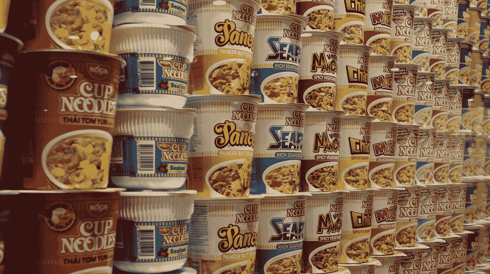

# 使用 Chakra UI Vue 的 UI 开发—菜单

> 原文：<https://blog.devgenius.io/ui-development-with-chakra-ui-vue-menu-378c44bf8413?source=collection_archive---------5----------------------->



马特&克里斯·普阿在 [Unsplash](https://unsplash.com?utm_source=medium&utm_medium=referral) 上的照片

Chakra UI Vue 是一个为 Vue.js 制作的 UI 框架，让我们可以将好看的 UI 组件添加到我们的 Vue 应用程序中。

本文将介绍如何开始使用 Chakra UI Vue 进行 UI 开发。

# 菜单

组件让我们可以在 Vue 应用程序中添加一个菜单。

为了补充它，我们写道:

```
<template>
  <c-box>
    <c-menu>
      <c-menu-button right-icon="chevron-down"> Actions </c-menu-button>
      <c-menu-list>
        <c-menu-item>Download</c-menu-item>
        <c-menu-item>Create a Copy</c-menu-item>
        <c-menu-item>Mark as Draft</c-menu-item>
        <c-menu-item>Delete</c-menu-item>
        <c-menu-item as="a" href="#"> Attend a Workshop </c-menu-item>
      </c-menu-list>
    </c-menu>
  </c-box>
</template><script>
import {
  CBox,
  CMenu,
  CMenuButton,
  CMenuList,
  CMenuItem,
  CMenuGroup,
  CMenuDivider,
  CMenuOptionGroup,
  CMenuItemOption,
} from "@chakra-ui/vue";export default {
  components: {
    CBox,
    CMenu,
    CMenuButton,
    CMenuList,
    CMenuItem,
    CMenuGroup,
    CMenuDivider,
    CMenuOptionGroup,
    CMenuItemOption,
  },
};
</script>
```

我们注册了`CMenu`、`CMenuButton`、`CMenuList`、`CMenuItem`组件来添加菜单。

`CMenu`是主菜单容器。

`CMenuButton`是打开和关闭菜单的按钮。

`CMenuList`是菜单列表容器。

`right-icon`设置显示在菜单文本右侧的图标。

我们可以用`c-menu-group`组件对菜单项进行分组:

```
<template>
  <c-box>
    <c-menu>
      <c-menu-button right-icon="chevron-down" variant-color="pink">
        Profile
      </c-menu-button>
      <c-menu-list>
        <c-menu-group title="Profile">
          <c-menu-item>My Account</c-menu-item>
          <c-menu-item>Payments </c-menu-item>
        </c-menu-group>
        <c-menu-divider />
        <c-menu-group title="Help">
          <c-menu-item>Docs</c-menu-item>
          <c-menu-item>FAQ</c-menu-item>
        </c-menu-group>
      </c-menu-list>
    </c-menu>
  </c-box>
</template><script>
import {
  CBox,
  CMenu,
  CMenuButton,
  CMenuList,
  CMenuItem,
  CMenuGroup,
  CMenuDivider,
  CMenuOptionGroup,
  CMenuItemOption,
} from "@chakra-ui/vue";export default {
  components: {
    CBox,
    CMenu,
    CMenuButton,
    CMenuList,
    CMenuItem,
    CMenuGroup,
    CMenuDivider,
    CMenuOptionGroup,
    CMenuItemOption,
  },
};
</script>
```

`variant-color`设置菜单按钮的背景颜色。

`c-menu-divider`是菜单组分隔线。

`title`显示为组的标题。

# 结论

我们可以通过 Chakra UI Vue 轻松添加菜单。