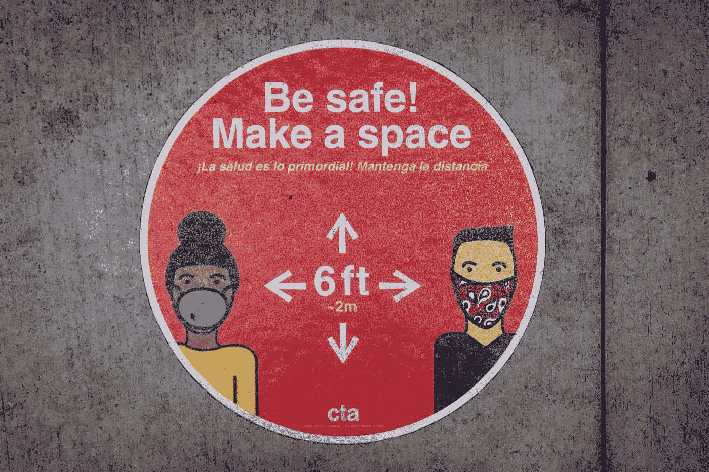

# 使用 Chakra UI Vue 进行 UI 开发— Text

> 原文：<https://blog.devgenius.io/ui-development-with-chakra-ui-vue-text-3f0c18c59def?source=collection_archive---------6----------------------->



照片由[伊丽莎白·麦克丹尼尔](https://unsplash.com/@elizabeth_mcdaniel?utm_source=medium&utm_medium=referral)在 [Unsplash](https://unsplash.com?utm_source=medium&utm_medium=referral) 上拍摄

Chakra UI Vue 是一个为 Vue.js 制作的 UI 框架，让我们可以将好看的 UI 组件添加到我们的 Vue 应用程序中。

本文将介绍如何开始使用 Chakra UI Vue 进行 UI 开发。

# 文本

我们可以使用 Chakra UI Vue 的`c-text`组件将文本添加到 Vue 应用程序中。

例如，我们可以写:

```
<template>
  <c-box>
    <c-text>Text</c-text>
  </c-box>
</template><script>
import { CBox, CText } from "@chakra-ui/vue";export default {
  components: {
    CBox,
    CText,
  },
};
</script>
```

用`c-text`添加样式文本。

文本样式将匹配 Chakra UI Vue 样式。

我们可以用`fontSize`道具改变字体大小:

```
<template>
  <c-box>
    <c-text fontSize="6xl">Text</c-text>
  </c-box>
</template><script>
import { CBox, CText } from "@chakra-ui/vue";export default {
  components: {
    CBox,
    CText,
  },
};
</script>
```

`fontSize`的值可以是`xs`、`sm`、`md`、`lg`、`xk`、`2xl`、`3xl`、`4xl`、`5xl`或`6xl`，从最小到最大排序。

当文本比视窗或`maxWidth`属性的值宽时，我们可以用`is-truncated`属性截断文本:

```
<template>
  <c-box>
    <c-text is-truncated>
      Lorem ipsum dolor sit amet, consectetur adipiscing elit. Pellentesque a
      lobortis sapien, nec viverra elit</c-text
    >
  </c-box>
</template><script>
import { CBox, CText } from "@chakra-ui/vue";export default {
  components: {
    CBox,
    CText,
  },
};
</script>
```

我们还可以使用`as`属性将文本呈现为给定的元素:

```
<template>
  <c-box>
    <c-text as="s">Strikethrough</c-text>
  </c-box>
</template><script>
import { CBox, CText } from "@chakra-ui/vue";export default {
  components: {
    CBox,
    CText,
  },
};
</script>
```

我们将`as`设置为`s`，因此我们将文本呈现为`s`元素，该元素呈现为删除线文本。

# 结论

我们可以使用 Chakra UI Vue 的`c-text`组件向我们的 Vue 应用程序添加样式文本。