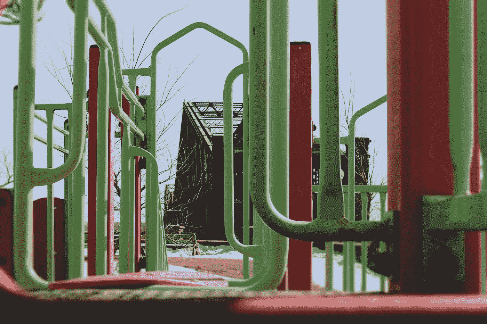

# 使用 Chakra UI Vue 进行 UI 开发—文本区域

> 原文：<https://blog.devgenius.io/ui-development-with-chakra-ui-vue-text-area-79a5b475184f?source=collection_archive---------5----------------------->



[西格蒙德](https://unsplash.com/@sigmund?utm_source=medium&utm_medium=referral)在 [Unsplash](https://unsplash.com?utm_source=medium&utm_medium=referral) 上拍照

Chakra UI Vue 是一个为 Vue.js 制作的 UI 框架，让我们可以将好看的 UI 组件添加到我们的 Vue 应用程序中。

本文将介绍如何开始使用 Chakra UI Vue 进行 UI 开发。

# 文本区域

我们可以用 Chakra UI Vue 添加一个文本区域。

为了补充它，我们写道:

```
<template>
  <c-box> <c-textarea placeholder="Here is a sample placeholder" /> </c-box>
</template><script>
import { CBox, CTextarea } from "@chakra-ui/vue";export default {
  components: {
    CBox,
    CTextarea,
  },
};
</script>
```

我们设置`placeholder`属性来设置占位符文本。

我们可以使用`is-disabled`属性禁用文本区域:

```
<template>
  <c-box>
    <c-textarea is-disabled placeholder="Here is a sample placeholder" />
  </c-box>
</template><script>
import { CBox, CTextarea } from "[@chakra](http://twitter.com/chakra)-ui/vue";export default {
  components: {
    CBox,
    CTextarea,
  },
};
</script>
```

另外，我们可以用`is-invalid`道具在文本区域周围添加一个红色边框:

```
<template>
  <c-box>
    <c-textarea is-invalid placeholder="Here is a sample placeholder" />
  </c-box>
</template><script>
import { CBox, CTextarea } from "@chakra-ui/vue";export default {
  components: {
    CBox,
    CTextarea,
  },
};
</script>
```

# 结论

我们可以用 Chakra UI Vue 轻松添加一个文本区域。