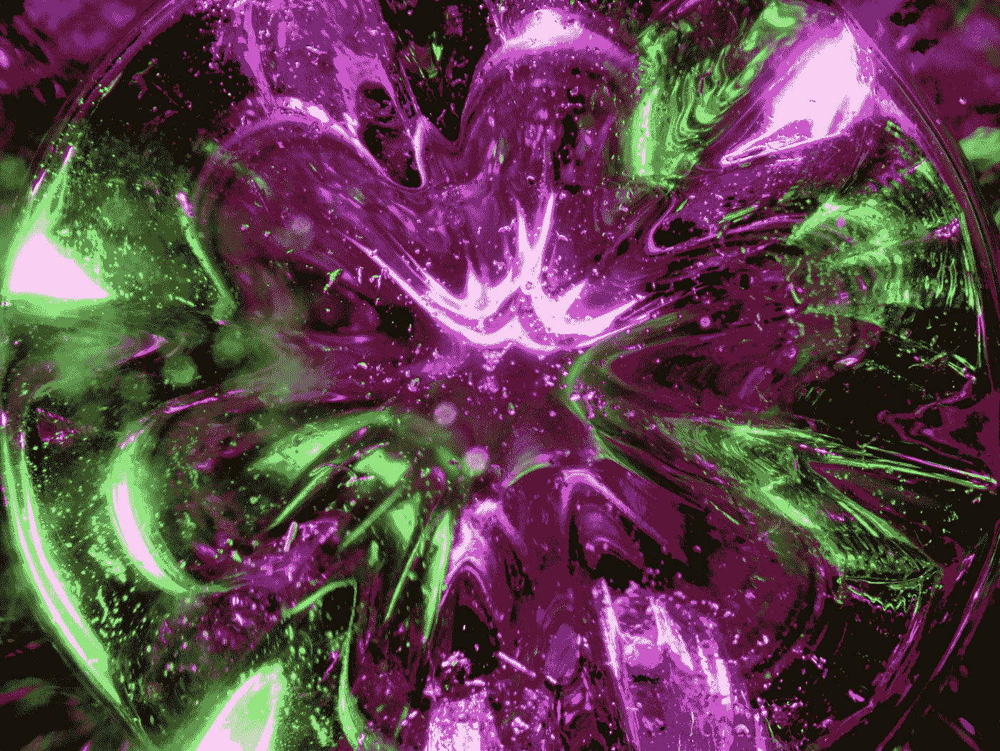

# 使用脉轮 UI Vue 开发 UI——v-脉轮指令

> 原文：<https://blog.devgenius.io/ui-development-with-chakra-ui-vue-v-chakra-directive-f2b4582e649d?source=collection_archive---------8----------------------->



照片由 [Michael Dziedzic](https://unsplash.com/@lazycreekimages?utm_source=medium&utm_medium=referral) 在 [Unsplash](https://unsplash.com?utm_source=medium&utm_medium=referral)

Chakra UI Vue 是一个为 Vue.js 制作的 UI 框架，让我们可以将好看的 UI 组件添加到我们的 Vue 应用程序中。

本文将介绍如何开始使用 Chakra UI Vue 进行 UI 开发。

# v 轮指令

我们可以使用`v-chakra`指令让我们用查克拉 UI Vue 道具来设计非查克拉 UI Vue 元素。

例如，我们可以写:

```
<template>
  <c-box>
    <div
      v-chakra
      p="3"
      bg="red.100"
      rounded="md"
      color="red.500"
      font-weight="bold"
    >
      Welcome
    </div>
  </c-box>
</template><script>
import { CBox } from "@chakra-ui/vue";export default {
  components: {
    CBox,
  },
};
</script>
```

`p`道具设置填充。`bg`设置背景颜色。

`rounded`设置要应用的圆角断点。

`color`有文字色彩。

`font-weight`有字体粗细。

我们也可以用`v-chakra`来设计子元素的样式。

为此，我们写道:

```
<template>
  <c-box>
    <div
      v-chakra="{
        p: 3,
        shadow: 'sm',
        header: {
          bg: 'blue.100',
          fontSize: 'lg',
          fontWeight: 'bold',
        },
        '& > p': {
          fontStyle: 'italic',
        },
      }"
    >
      <header>Title</header>
      <p>Text</p>
    </div>
  </c-box>
</template><script>
import { CBox } from "@chakra-ui/vue";export default {
  components: {
    CBox,
  },
};
</script>
```

`header`属性具有标题元素样式。

`& > p`拥有`p`元素样式。

我们还可以通过传入一个回调来添加计算的样式，该回调返回一个带有样式值的对象:

```
<template>
  <c-box>
    <div
      v-chakra="
        (theme) => ({
          shadow: 'sm',
          bg: theme.colors.blue[800],
          color: theme.colors.yellow[300],
          p: {
            fontWeight: 'bold',
            p: 3,
          },
        })
      "
    >
      <header>Title</header>
      <p>Text</p>
    </div>
  </c-box>
</template><script>
import { CBox } from "@chakra-ui/vue";export default {
  components: {
    CBox,
  },
};
</script>
```

我们使用`theme`参数来获得我们想要设置的颜色值。

我们用它们来设置`bg`和`color`属性。

# 结论

我们可以使用`v-chakra`指令将 Chakra UI Vue 样式直接应用于非 Chakra UI Vue 元素。