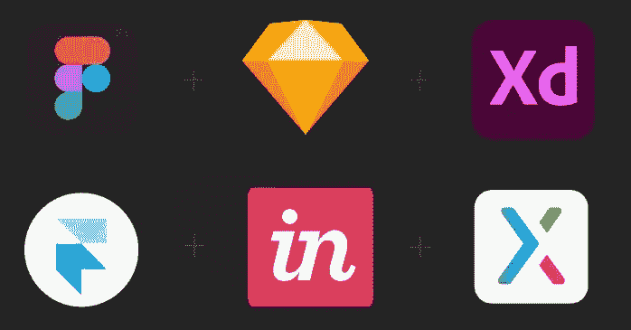
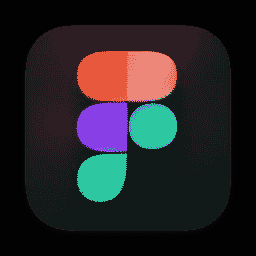
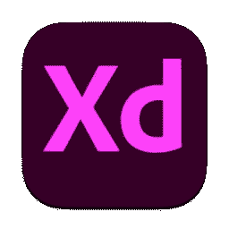

# 用户界面/UX 设计工具

> 原文：<https://blog.devgenius.io/ui-ux-design-tools-f6ced1ff1421?source=collection_archive---------7----------------------->

用户界面/UX 工具

现代设计师有各种工具来满足他们在界面设计中的需求。让我们来看看其中的一些。

## 1.视觉

InVision 是一个基于网络的原型工具。它是 UX 和 UI 开发行业中非常流行和知名的工具。InVision 的基本概念是提供快速简单的原型。

在这里，用户可以上传一个静态设计文件，并快速将其转化为高保真原型。此外，Vision 还允许用户添加高级过渡和动画。因此。InVision 被认为是原型制作的最佳工具之一。Vision 的另一个重要特性是它支持团队之间的协作。

然而，InVision 并不被认为是用于线框化的好工具。

## 2.巴尔萨米克

Balsamiq 是 UI 设计过程中使用的另一个工具。这是一个众所周知的工具，用于快速、轻松地开发线框。Balsamiq 工具有一个 UI 库，里面有各种 UI 元素。这些元素可以拖放到线框设计中，因此设计可以在短时间内轻松完成。Balsamiq 工具的一个关键优势是能够更容易地进行修改和快速更改。

## 3.菲格玛

Figma 是第一个使用中的基于浏览器的界面设计工具。Figma 的一个独特特性是它允许多个用户实时地同时处理同一个项目文件。

Figma 中有各种特性，如组件特性和约束特性，这些特性对于设计者开发响应原型非常有价值。组件特性允许轻松重用元素。约束功能允许设计适应屏幕尺寸。由于 Figma 是一个基于浏览器的工具，文件共享在 Figma 中也更容易。

毫不奇怪，Figma 是现代设计师使用最多的设计工具之一。

## 4.素描

Sketch 是仅适用于 Mac 电脑的工具。这是一个基于矢量的工具。因此，用户能够容易地调整设计的大小而不损失其清晰度。草图被认为是线框和原型制作的重要工具之一。它可以用来创建线框，原型，模型和完整的项目。

草图工具最大的一个优势就是可以添加数百个插件。因此，设计开发过程变得容易得多，并且可以非常高效地开发设计。尽管它只适用于 Mac 电脑，但草图工具被认为是 UX 和 UI 开发的最佳工具之一，尤其是线框工具。

## 5.Adobe XD

Adobe XD 是另一个基于矢量的工具，用于设计和原型制作。它是一个非常通用的工具，因为 Adobe XD 包含许多用于设计、原型制作和共享完整设计项目的功能。此外，Adobe XD 还具有可重用元素和可响应调整大小的设计的功能。因此，Adobe XD 是一个在开发线框和响应原型时非常有用的工具。除了桌面版本，Adobe XD 也可以在 Android 和 iOS 设备上使用。

这些工具有各种优点和缺点。有些工具更适合设计线框，而有些工具更适合设计响应原型。

确保根据您的需求正确选择它们。

观看以下视频了解更多关于这个话题的信息。

你对此有什么想法？如果你有任何问题或其他事实，请在下面评论。敬请关注下一篇文章。

*业务查询，可以在这里* ***找我* [***。***](https://linktr.ee/Chamod_Kavishka)**