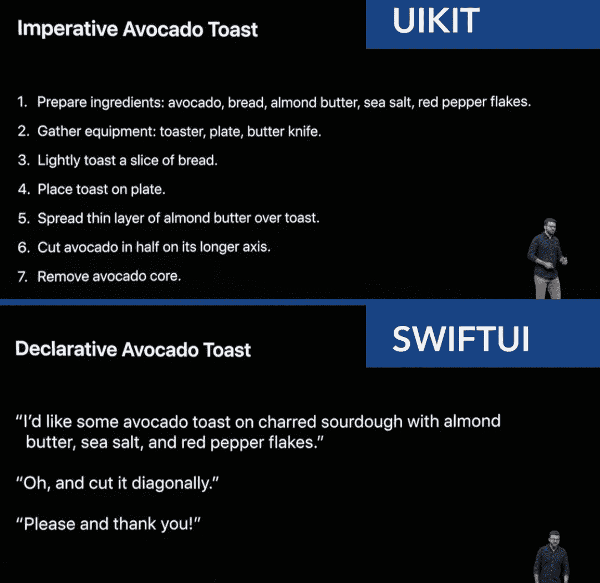
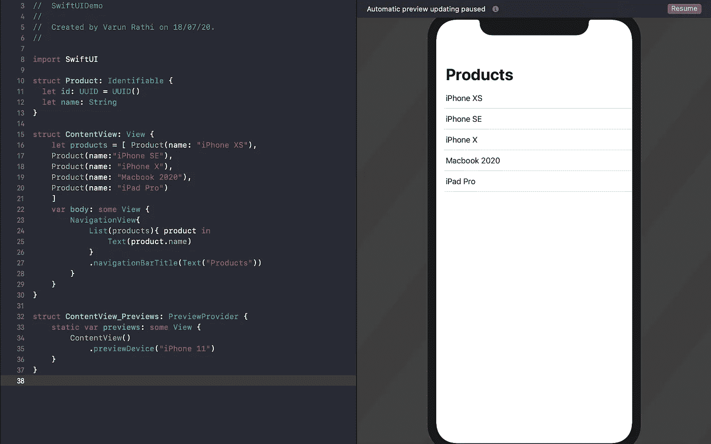

# UI 表视图与 SwiftUI 列表

> 原文：<https://blog.devgenius.io/uitableview-vs-swiftui-list-610ba234f832?source=collection_archive---------3----------------------->

## 从常绿表视图中振作起来，节省时间

演职员表:Pinterest(克里斯的代码)

在 iOS 开发中，UITableView 是一个 app 的基本构建块。每当我们想要显示一个列表，显示动态内容和在列表上执行一些操作，如显示列表项的详细页面或删除它们，TableViews 是最好的工具。

你可以使用下面的链接在我的个人博客上阅读完整的故事:

 [## SwiftUI 列表与 UI 表格视图-

### 在 iOS 开发中，UITableView 是一个 app 的基本构建块。每当我们想显示一个列表，显示动态…

theswiftnerd.com](https://theswiftnerd.com/swiftui-vs-uitableview/) 

# UITableView

## 命令方式

当我学习 iOS 开发时，我发现 UITableViews 非常灵活，但是非常复杂。表格视图的工作方式很简单，但是构建表格视图需要太多的步骤。让我们看看在表格视图中添加简单列表的过程:-

1.  确定要显示的数据
2.  将表格视图添加到视图控制器
3.  将原型单元格添加到表格视图中
4.  在表格单元格中添加元素并设置约束
5.  子类 UITableviewCell，并设置用于配置单元格的方法。
6.  连接表格视图、单元格的插座。
7.  如果使用 xib/All 检查小区标识符，则注册小区。
8.  实现 UITableView 委托和数据源方法。
9.  此外，将 TableView 的委托和数据源连接到视图控制器。
10.  对于动态内容:确保设置自动高度。

> 唷！！最后，如果所有的步骤都做得正确，我可能会看到一个项目列表。

嗯，这些步骤只是针对一个基本的列表，对于任何自定义操作，如选择、页眉/页脚、行添加/删除，这些步骤会不断增加。另外，如果您想在任何内容更新后重新加载表格，不要忘记 tableView.reloadData()。

## 声明:在 TableView 爱好者开始用令人生厌的评论攻击我之前，我知道可以用更少的步骤设置表格视图或以编程方式设置。但是总的来说，要显示一个 UITableView，还需要正确完成许多步骤。

# 斯威夫特伊

## 陈述方式

SwiftUI 是一个用户界面工具包，让我们以声明的方式设计应用程序。当苹果在 WWDC 19 发布 SwiftUI 时，我震惊地看到我可以在不到 2 分钟的时间内轻松地制作一个表格视图。这就像纯粹的巫术！！SwiftUI 在所有平台上都可用，所以现在，您的 UI 代码可以跨平台同步，包括 iOS、macOS、TvOS、watchOS。让我们看看在 SwiftUI 中构建 Listview 所需的步骤:-

1.  确定要显示的数据和声明。
2.  在主内容视图的主体中提供一个 ListView 对象。
3.  设置要为每个元素显示的属性。

就是这样！！真的吗？你说真的吗？。是的，当我看到 SwiftUI 列表和来自 UIKit 代码模式时，我也感到震惊，因为我的 UIKit-self 习惯于在获得可见列表之前定义 TableView 的每个方面。不信可以看看下面的代码。

Swift 用户界面列表

大约 15 行代码，你可以看到一个表格视图列表。由于 SwiftUI 提供实时预览，您甚至不必运行您的代码。您的预览会随着您更改代码而更新。多神奇啊！

以声明的方式做事节省了我们在平台和 UI 更改上的努力，让我们专注于设计应用的核心组件。这也是为什么我觉得 SwiftUI 是 iOS 开发的未来。

在下一篇文章中，我们将了解更多关于 SwiftUI 组件的内容，并构建一个复杂的列表。

感谢您的阅读。如果你喜欢这篇文章，并发现它很有用，请分享并像野火一样传播它！

可以在[LinkedIn](https://www.linkedin.com/in/varunrathi28/)|[Github](https://github.com/varunrathi28)|[stack overflow](https://stackoverflow.com/users/6593648/varunrathi28)上找到我