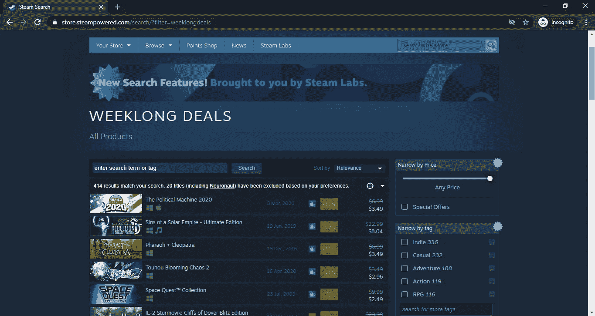
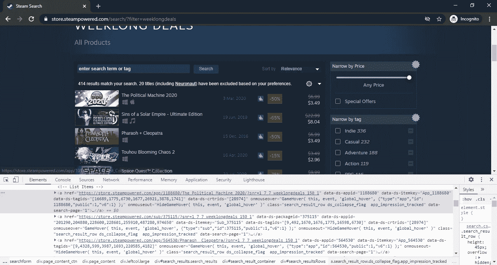
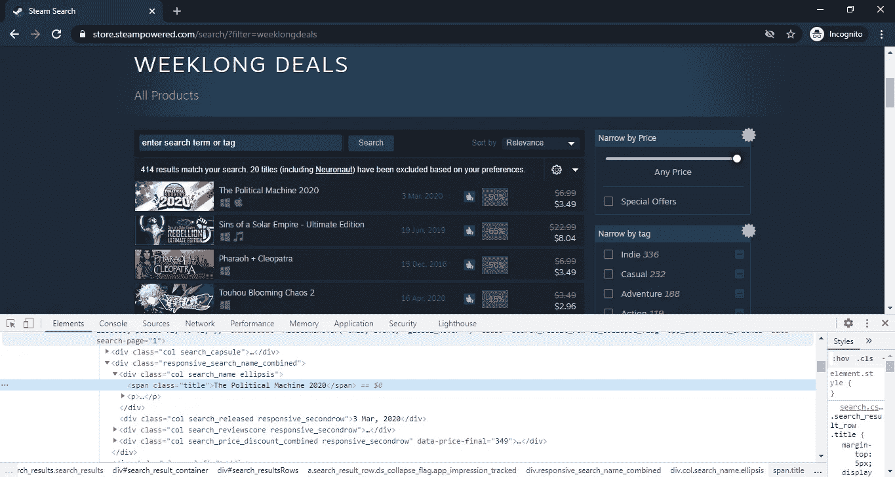
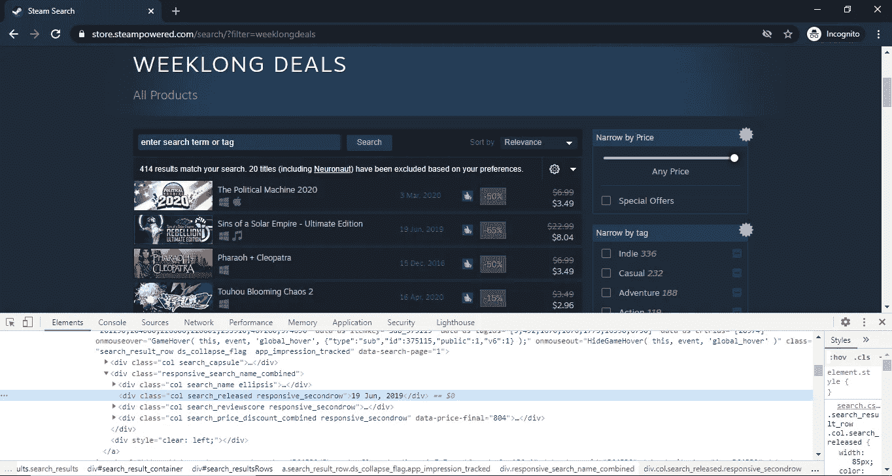
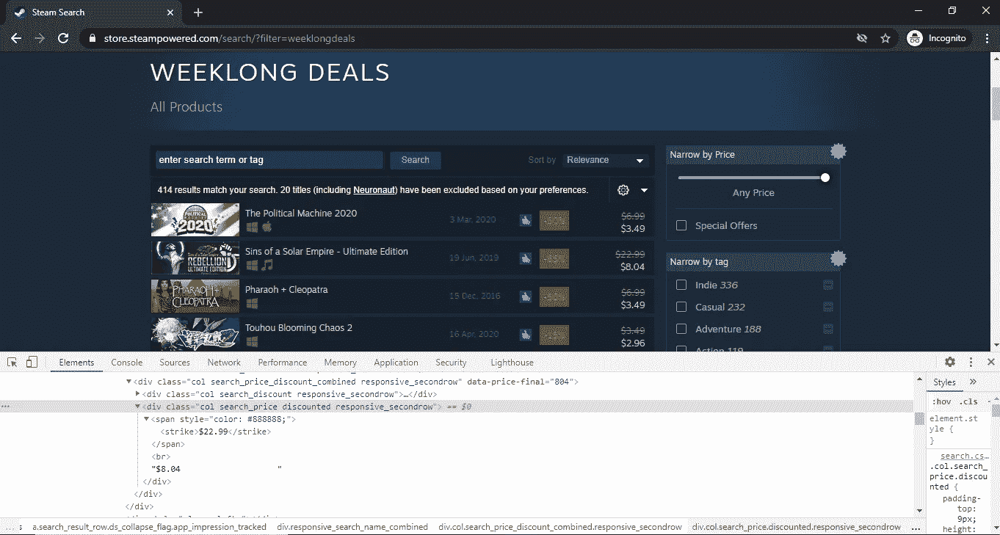

# Node.js 网络抓取终极指南

> 原文：<https://blog.devgenius.io/ultimate-guide-to-web-scraping-with-node-js-8311f6f6cd49?source=collection_archive---------3----------------------->

JavaScript 是最著名的 web 编程语言，其著名的 js 包包括 NodeJs、AngularJs、ReactJs 等。Nodes 是一个广泛使用的 JavaScript 包，也是命令行中 javaScript 的编译器。我们将使用 Node.js 进行 web 抓取。为什么网络抓取很重要，为什么我们需要它。网页抓取基本上是用来报废网页数据的。网站每天保存大量数据，以 bbc.com 的一个新闻网站为例。每分钟都有新闻信息更新，假设我们想获得文本形式的新闻。做好手动抓取并不是解决办法，在这种情况下，网页抓取工具就开始发挥作用了。不仅 JavaScript 可以废弃网页，你还可以使用任何编程语言和 HTTP 请求模块来废弃网页。web 抓取的开始可以分为两个简单的步骤。

***1:使用任意 Http 请求模块*** 请求网页源代码

***2:从网页源代码中解析所需数据***

本指南将引导您使用著名的 node.js 库 **CheerioJs** 和 **request_process** 完成整个抓取过程。完成本文中展示的示例将使您成为从网站收集数据的专家。首先:如果您的系统中没有安装 NodeJs，请从 NodeJs 官方网站下载最新版本，在成功安装 NodeJs 后，使用以下命令安装所需的库。我们的目标网站如下图所示。

***npm i cheerio***

我们编码的第一步是我们需要获取页面的 HTML 源代码，通过使用 node.js 中的 **Axios** 模块，我们可以获取页面并将其传递给 cheerio 进行数据解析和提取。检查下面的命令来安装带有 npm 的 Axios 并创建一个 js 文件，我正在创建一个 Js 文件，文件名为 **scrape.js** 。

***npm i 轴***

在第一行代码中，我们使用 ***require("axios")*** 函数将 Axios 模块加载到一个常量变量中。接下来，我们创建了一个名为 **fetchHTML** 的函数，用于保存获取任何网站页面的代码。正如您注意到的，在函数内部，我们有 axios.get()函数。这是获取过程的主要部分。get()方法向网页发送一个请求，请求它们的源代码，作为响应，网页返回一个 HTML 源代码，其中保存了当前出现在页面上的所有信息。下一部分是抓取当前页面上所有游戏的数据。使用 google chrome inspect 模式查看网页的源代码。为此，只需按下键盘上的 **F12** 。

正如你所看到的，每个游戏数据都在一个***<一个>*** 标签元素中，所以为了解析这个数据，我们将使用 **cheerio 模块**来解析和提取我们需要的数据。

如果你看过上面的代码，在第一行我们在 scrape.js 中导入了 cheerio 模块，接下来我们创建了一个函数名 **scrapSteam** 来保存所有的获取部分。
`***const searchResults = selector(“body”).find(“#search_result_container > #search_resultsRows > a”);***`

在那一行中，我们告诉 cheerio ""集合位于 id 为' search_resultsRows '的 div 中，而这个 div 位于 id 为' search_result_container '的 other 中。因此，“searchResults”是一个包含“”元素的 cheerio 对象数组。我们的下一个挑战是获得每个游戏的标题，在检查模式下寻找 Html 代码。

好了，现在是时候让我们在 scraper.js 中的新函数 extractTitle 检查下面的代码了。

使用同样的方法，我们可以获取每款游戏的发布日期，使用 google chrome 的 inspect 模式并找到正确的日期元素。

我们的目标数据在具有类`***responsive_search_name_combined***` 的 div 标签中，我们再次使用 find()函数来查找具有该特定类的 div 元素，在我们找到该类后，我们注意到数据在另一个 div 中，因此我们再次执行相同的方法并选择具有`**class=col search_released responsive_secondrow**` **的 div。接下来**，我们使用 **text()** 和 **trim()** 方法来获取数据的文本形式。下面是一个简单的指南，告诉我们如何在 div 元素中获取数据。

`*div[class=responsive_search_name_combined] → div[class=’col search_released responsive_secondrow’]→ Date Data*`

现在是时候获取每个游戏的价格了，再看一下 inspect 模式，寻找任何游戏的价格元素。

嗯，折扣价和原价在同一个 div 标签中，所以对我们来说是一个新的挑战，让我们思考一下如何处理这种情况。让代码成为价格 ***div 标签*** 的自定义选择器检查下面的扩展代码。

因为我们看到价格元素在两个 div 标签中，所以我们再次使用 **selector.find()** 方法来逐个选择标签，但是现在我们需要分别获取原价和折扣价。

原始价格数据在 *span 标签*中，所以我们只使用 **find()** 方法来查找特定的 span 标签并提取价格数据。最后，我们会得到折扣价的财产。但是请注意，这个值不在特定的 HTML 标记中，所以我们有一些不同的方法来获取这个值，但是我将使用正则表达式。检查下面的代码

首先，我将从第 1 行的 cheerio 对象获取 HTML，在获取与这个正则表达式匹配的组之后，我将获取最后一个组的值。最后，我们从 steam 网站上删除我们需要的数据。下面是完整的代码。

这是使用 **cheeio.js** 和 **node.js** 进行网页抓取的指南，但事情并没有到此结束。在数据提取领域，我们需要发现更多的东西。希望这篇文章有一天能帮到你。请随意分享你的观点。