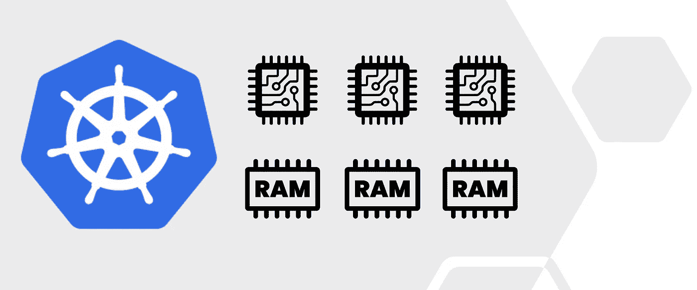
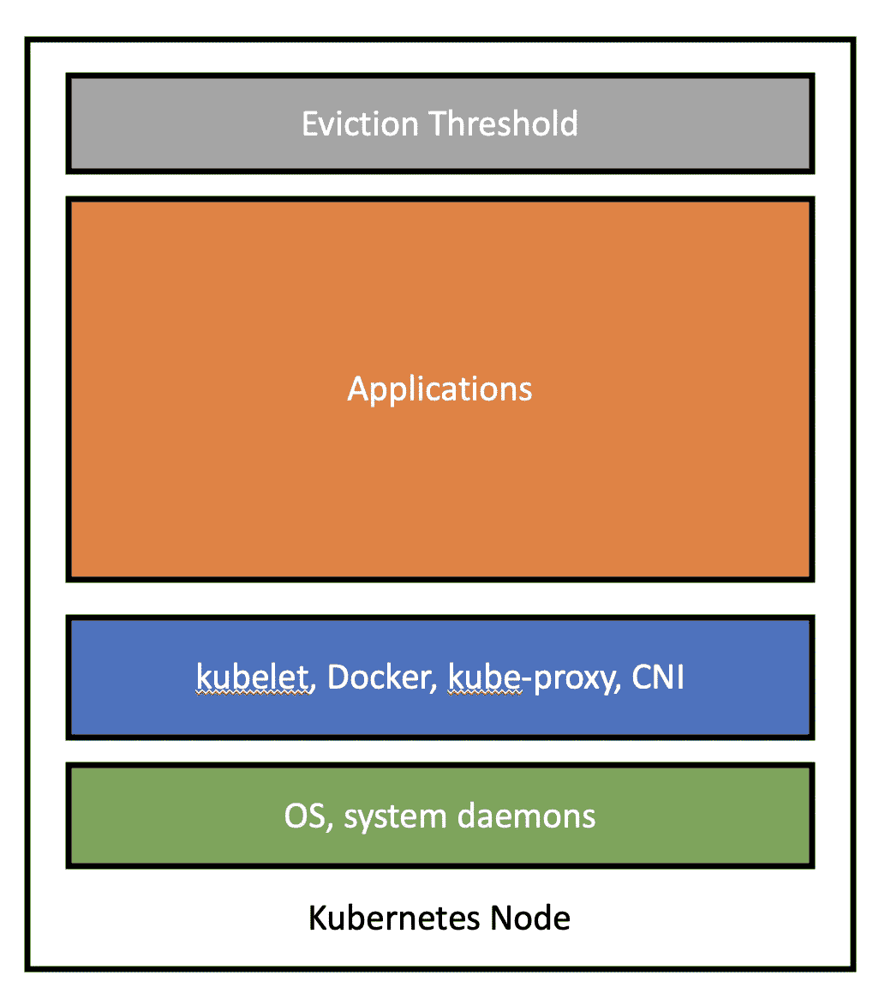
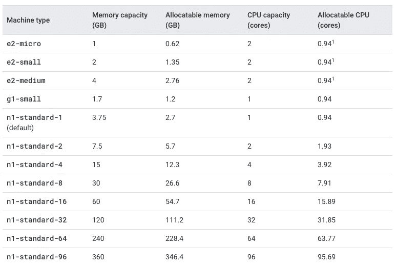
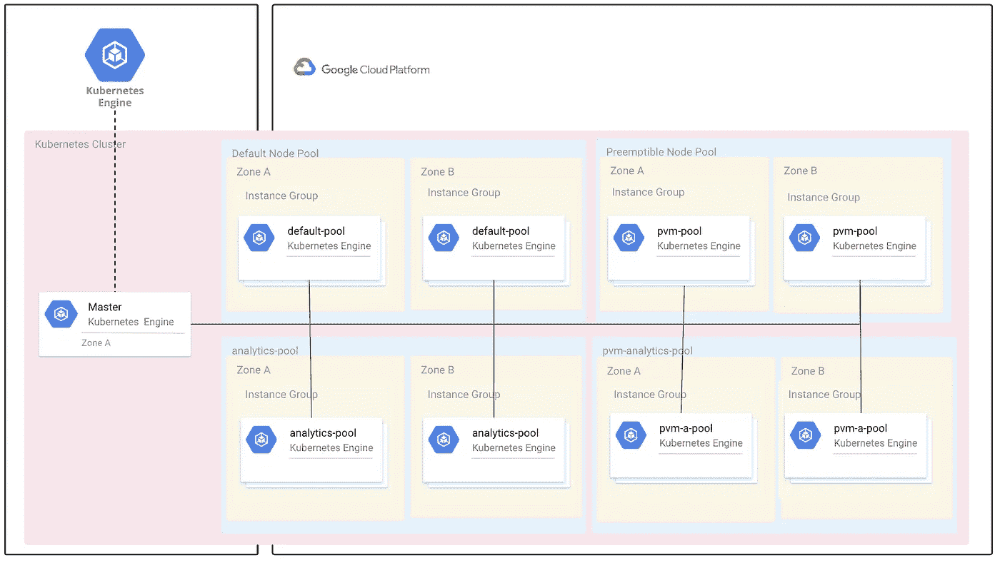
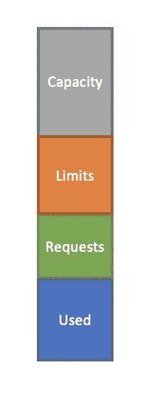
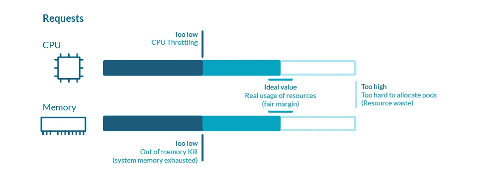
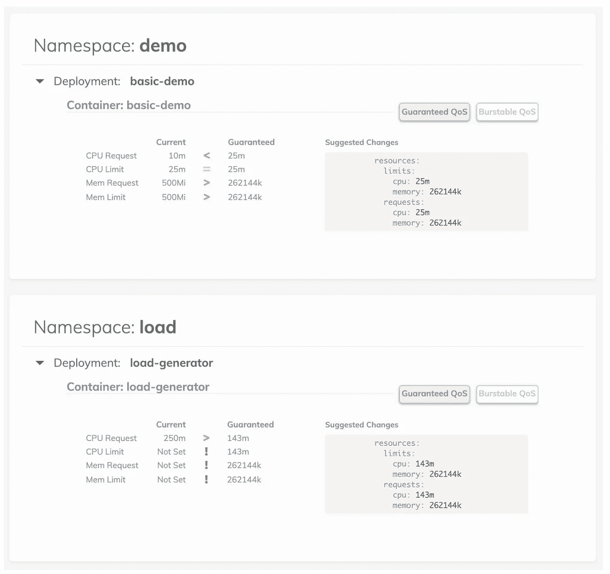

# 终极 Kubernetes 资源规划指南

> 原文：<https://blog.devgenius.io/ultimate-kubernetes-resource-planning-guide-449a4fddd1d6?source=collection_archive---------2----------------------->

了解 Kubernetes 节点上可分配的 CPU/内存并优化资源使用。

Kubernetes 的容量规划是在针对性能和成本优化的集群上运行生产工作负载的关键步骤。如果资源太少，Kubernetes 可能会开始抑制 CPU 或因内存不足(OOM)错误而终止 pods。另一方面，如果 pod 需求过多，Kubernetes 将难以分配新的工作负载，并浪费闲置资源。

不幸的是，Kubernetes 的容量规划并不简单。可分配的资源取决于底层节点类型以及保留的系统和 Kubernetes 组件(例如 OS、kubelet、监控代理)。此外，pod 需要对资源请求和限制进行一些微调，以获得最佳性能。在本指南中，我们将回顾一些 Kubernetes 资源分配概念和优化策略，以帮助估计容量使用情况并相应地修改集群。

# 可分配的 CPU 和内存

首先要理解的一件事是**Kubernetes 节点上并非所有的 CPU 和内存都可以用于您的应用程序**。每个节点中的可用资源按以下方式划分:

1.  为底层虚拟机保留的资源(例如操作系统、sshd、udev 等系统守护程序)
2.  运行 Kubernetes 所需的资源(例如 [kubelet](https://kubernetes.io/docs/reference/command-line-tools-reference/kubelet/) 、[容器运行时](https://kubernetes.io/docs/setup/production-environment/container-runtimes/)、 [kube-proxy](https://kubernetes.io/docs/reference/command-line-tools-reference/kube-proxy/) )
3.  其他 Kubernetes 相关附加组件的资源(例如[监控代理](https://github.com/Stackdriver)、[节点问题检测器](https://github.com/kubernetes/node-problem-detector)、 [CNI 插件](https://docs.projectcalico.org/getting-started/kubernetes/managed-public-cloud/gke))
4.  我的应用程序可用的资源
5.  由驱逐阈值确定的容量，以防止系统 OOMs

节点分配

对于自管理集群(例如 kubeadm)，这些资源中的每一个都可以通过[系统保留、kube 保留和驱逐阈值标志](https://kubernetes.io/docs/tasks/administer-cluster/reserve-compute-resources/#node-allocatable)进行配置。对于托管的 Kubernetes 集群，云提供商详细说明了每种虚拟机类型的节点资源分配( [GKE](https://cloud.google.com/kubernetes-engine/docs/concepts/cluster-architecture#node_allocatable) 和[AK](https://docs.microsoft.com/en-us/azure/aks/concepts-clusters-workloads#resource-reservations)明确说明了使用情况，而 EKS 值是根据 [EKS AMI](https://github.com/awslabs/amazon-eks-ami/pull/367) 或 EKS [引导注释](https://github.com/awslabs/amazon-eks-ami/blob/master/files/bootstrap.sh#L171)估算的)。

让我们以 GKE 为例。首先，GKE 在每个节点上为驱逐阈值保留 100 MiB 内存。

对于 CPU，GKE 保留:

*   第一个核心的 6%
*   下一个内核的 1%(最多 2 个内核)
*   接下来 2 个内核的 0.5%(最多 4 个内核)
*   4 个核心以上的任何核心的 0.25%

对于记忆，GKE 保留:

*   255 MiB 内存，适用于内存小于 1 GB 的机器
*   前 4GB 内存的 25%
*   20%的下一个 4GB 内存(最高 8GB)
*   10%的下一个 8GB 内存(最高 16GB)
*   下一个 112GB 内存的 6%(最高 128GB)
*   128GB 以上内存的 2%

使用通用 n1-standard-1 虚拟机类型(1 个 vCPU，3.75GB 内存)，我们剩下的是:

*   可分配的 CPU = 1 vCPU-(0.06 * 1 vCPU)= 0.94 vCPU
*   可分配内存= 3.75 GB-(100 兆字节- 0.25 * 3.75GB) =2.71GB

在运行任何应用程序之前，我们可以看到我们只有大约 75%的底层节点内存和大约 95%的 CPU。另一方面，较大的节点受系统和 Kubernetes 开销的影响较小。如下所示，n1-standard-96 节点为您的应用程序留出 99%的 CPU 和 96%的内存。

(*每种机器类型的可分配内存和 CPU 资源的完整列表可在* [*此处*](https://cloud.google.com/kubernetes-engine/docs/concepts/cluster-architecture#memory_cpu) *找到，附带 Windows 服务器节点的说明*。)

GKE 可分配的 CPU 和内存资源—图像信用: [GKE 文档](https://cloud.google.com/kubernetes-engine/docs/concepts/cluster-architecture#memory_cpu)

# 资源不对称

既然我们理解了可分配的资源，下一个挑战是处理资源不对称。一些应用可能是 CPU 密集型的(例如机器学习工作负载、视频流)，而一些应用可能是内存密集型的(例如 Redis)。在这种资源不对称的情况下，kube-scheduler 会尽力将每个工作负载调度到给定资源约束的最优节点上。Kube-scheduler 在不同节点上调度 pods 的决策是由受资源需求、反/相似性规则、数据局部性和工作负载间干扰影响的评分算法指导的。虽然可以根据延迟(即调度新 pod 的时间)和用于调度决策的节点评分阈值来调整调度器的性能，但是选择正确的节点类型对于避免每个节点上不必要的扩展和未使用的资源是至关重要的。

处理资源不对称的一种方法是为不同的应用程序类型创建多个节点池。例如，无状态应用程序可能运行在通用的、可抢占的节点上，而数据库可能被调度运行在 CPU 或内存优化的节点上。这可以通过[节点污染和相似性规则](https://kubernetes.io/docs/concepts/scheduling-eviction/taint-and-toleration/)来控制，以便仅将特定的工作负载调度给受污染的节点。

GKE 多节点池示例—图片来源: [GCP 博客](https://cloud.google.com/blog/products/containers-kubernetes/cutting-costs-with-google-kubernetes-engine-using-the-cluster-autoscaler-and-preemptible-vms)

考虑到 Kubernetes 的动态特性，即使有多个节点池和关联性规则集，随着时间的推移，Kubernetes 的资源使用也可能变得不太理想:

*   可以向集群添加新节点来处理更高的负载。
*   节点可能会出现故障，或者需要为集群升级重新创建节点。
*   污点或 pod/节点关联性规则可能会改变，以处理新的应用程序需求。
*   删除或添加应用程序后，一些节点可能会变得利用不足或过度利用。

要跨节点重新平衡 pod，请在 Kubernetes 集群中作为作业或 CronJob 运行 [descheduler](https://github.com/kubernetes-sigs/descheduler) 。Descheduler 是一个 kubernetes-sig 项目，它包括七种策略(`RemoveDuplicates`、`LowNodeUtilization`、`RemovePodsViolatingInterPodAntiAffinity`、`RemovePodsViolatingNodeAffinity`、`RemovePodsiolatingNodeTaints`、`RemovePodsHavingTooManyRestarts`和`PodLifeTime`)，用于自动优化节点资源的使用。

# 资源范围和配额

最后，我们必须理解并定义应用程序的资源范围。Kubernetes 为资源管理提供了两个基本的可配置参数:

*   **请求**:每个工作负载的资源使用下限
*   **限制**:每个工作负载的资源使用上限

Kubernetes 调度程序接受每个工作负载的请求参数，并分配指定的 CPU 和内存。这是工作负载的最小资源使用量，但应用程序实际使用的资源可能少于或多于此阈值。另一方面，限制设置了最大资源使用量。当工作负载使用超过限制时，kubelet 将限制 CPU 或发出 OOM kill 消息。在理想世界中，资源利用率将是 100%，但在现实中，资源的使用往往是无规律的，难以预测的。

另一件要考虑的事情是应用程序的服务质量(QoS)。结合请求和限制，我们可以提供以下 QoS:

*   **有保证的**:对于相对可预测的工作负载(例如，受 CPU 限制的 web 服务器、调度的作业)，我们可以明确地为有保证的 QoS 提供资源。要启用此功能，请指定限制或将请求设置为等于限制。
*   **可突发**:对于需要根据流量或数据消耗更多资源的工作负载(如 Elasticsearch、数据分析引擎)，我们可以根据稳态使用情况设置请求资源，但会给出更高的限制，以允许工作负载纵向扩展。
*   **Best Effort** :最后，对于资源使用情况未知的工作负载，不指定请求和限制，以允许工作负载使用节点上的所有可用资源。从调度程序的角度来看，这些工作负载被视为最低优先级，将在有保证的或突发的工作负载之前被驱逐。

那么，我们如何设置合理的要求和限制，以避免性能下降并优化成本呢？一个很好的经验法则是对典型使用进行基准测试，并给出 25%的界限。我们不希望将请求或限制设置得太高，以阻止其他应用程序利用资源，并使调度程序更难为我们的工作负载分配资源。从初始资源配置开始，运行一些负载测试来记录性能下降或故障。如果工作负载开始变慢或者被终止，将限制加倍并继续测试。另一方面，如果性能没有显著变化，尝试减少请求和限制，为集群释放资源。

图片来源: [Sysdig](https://sysdig.com/blog/kubernetes-limits-requests/)

最后，我们可以使用[垂直 Pod 自动缩放器(VPA)](https://github.com/kubernetes/autoscaler/tree/master/vertical-pod-autoscaler) 来自动设置请求，并根据历史使用情况维护限制和请求之间的比率。VPA 可以自动缩小过度请求资源的单元，并扩大请求不足的单元。然而，VPA 也有一些限制:

*   更新跑步舱是 VPA 的一项实验性功能。来自 VPA 的更新会导致所有正在运行的容器重新启动。
*   VPA 目前不能与 CPU 或内存上的水平 Pod 自动缩放器一起使用。一种解决方法是指定[自定义或外部指标](https://kubernetes.io/docs/tasks/run-application/horizontal-pod-autoscale/#support-for-custom-metrics)来组合 VPA 和 HPA。
*   由于实际内存使用的可见性有限，VPA 还不能用于基于 JVM 的工作负载。

如果您不希望依靠 VPA 来更新正在运行的工作负载，我们可以在推荐模式下使用 VPA，或者使用类似费尔温德索普的[金发女孩这样的工具在仪表板上查看推荐值。VPA 只知道集群上的资源使用情况，所以我们仍然需要运行一些负载测试来更好地描述我们的应用程序。](https://github.com/FairwindsOps/goldilocks/)

图片来源:[金发女郎](https://github.com/FairwindsOps/goldilocks/)

# 结论

仔细的资源规划和容量分析将增加可预测性并提高系统弹性。不要等到生产中出现问题时才发现应该为您的工作负载设置什么资源请求和限制。对典型资源利用率进行分析和基准测试，选择适当的节点类型和节点池，并使用资源范围定义 QoS。利用 VPAs 或 Goldilocks 等验证工具为您的应用精心打造优化的集群。