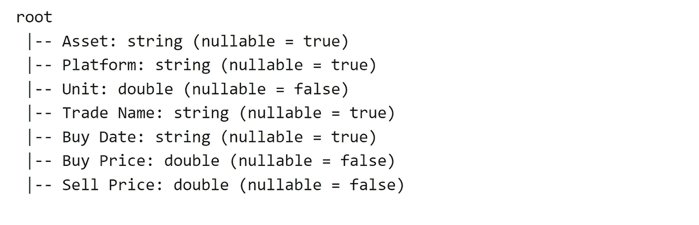
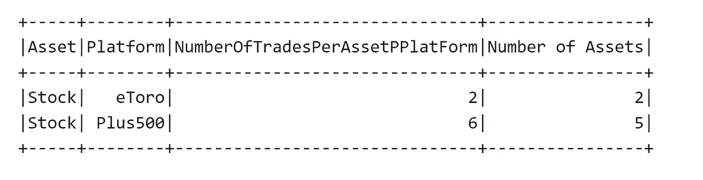

# 数据工程师的 Spark (Scala)备忘单

> 原文：<https://blog.devgenius.io/ultimate-spark-scala-cheat-sheet-for-data-engineers-and-scientists-9f30d2f79841?source=collection_archive---------2----------------------->

# 介绍

Spark 已经成为业内最基本、最广为接受的大数据编程框架之一。处理大量数据的大公司使用 Spark Scala API 或 Python API 来处理大量数据。大多数数据工程师角色要求您具备 Spark 知识，并为构建处理管道编写高效的 Spark 脚本。因此，非常有必要记住 Spark 代码片段，或者在需要时有地方参考它们。在这篇文章中，我想通过将最常用的语句和命令以备忘单的形式呈现来实现这个目标。

# 在以下情况下，此备忘单会很有帮助

1.  人们需要快速更新他/她的火花知识
2.  在审查 Spark 代码片段的面试之前
3.  为您的日常工作参考，以防您正在搜索特定的语法
4.  通过查看备忘单，保持语法活跃

# 本备忘单涵盖的主题包括:

_ 在 Spark 中创建数据帧

_ 应用过滤器

_ 各种选择方法，包括选择、动态选择和选择表达式

_ Spark groupBy 和聚合函数，包括百分点、平均值、最大值、最小值和百分点

_ 火花窗口

_ 火花旋转

_ 排名和排序依据

_ Spark UDF

_ Spark SQL

_ Spark 输入/输出拼花/CSV

> 我每周都会在这个频道发表技术文章，所以请关注我，订阅我的频道。请查看我列表中与 [*Spark*](https://medium.com/@clever.tech.memes/list/internalspark-62fda9e00b36?source=my_lists---------1-------62fda9e00b36---------------------) *和*[*Scala*](https://medium.com/@clever.tech.memes/list/internalscala-40c96bf7addd?source=my_lists---------11-------40c96bf7addd---------------------)*[*Streamlit*](https://medium.com/@clever.tech.memes/list/internalstreamlit-8638d94cd666?source=my_lists---------8-------8638d94cd666---------------------)*[*React*](https://medium.com/@clever.tech.memes/list/internalreact-79590e57fc46?source=my_lists---------9-------79590e57fc46---------------------)*[*Django*](https://medium.com/@clever.tech.memes/list/internaldjango-8eb3f062efcd?source=my_lists---------12-------8eb3f062efcd---------------------)*[*aw*](https://medium.com/@clever.tech.memes/list/internalamazonwebservices-805665b5bf42?source=my_lists---------13-------805665b5bf42---------------------)****
> 
> **请使用此链接加入 medium[](https://medium.com/@clever.tech.memes/membership)**。谢谢你的大力支持。****

****

**Matheus Bertelli 摄:[https://www . pexels . com/photo/person-holding-sparkler-silhouette-573241/](https://www.pexels.com/photo/person-holding-sparkler-silhouette-573241/)**

# **准备和设置**

**当然，这个帖子是一个备忘单，不需要设置环境；但是，您可能想测试本教程的代码片段。使用 Docker 启动 Spark 比以往任何时候都容易。你可以看看[我的另一篇帖子](https://medium.com/@clever.tech.memes/starting-with-spark-and-zeppelin-in-2-minutes-using-docker-create-your-first-data-frame-f83b65fced1c)只用两分钟就能启动 Spark！**

**开始时，创建一个假的数据帧，备忘单的其余部分基于相同的数据帧。请注意，在引入代码片段之后，会显示相应的输出。**

# **创建数据帧**

**在下面，我想创建一个假的数据框架，其中包含假的股票资产买卖。**

## **创建数据帧的第一种方法—使用元组和。toDF()函数**

**使用 Scala 语法在 Spark 中创建数据框的第一种方法是使用*Spark . implicit。***

**在这种方法中，数据帧的每一行都对应于一个元组，在这个元组中，我们将。toDF()函数。让我们使用以下代码片段创建一个包含几行的数据帧:**

```
**import spark.implicits._

val data = Seq(
    ("Stock", "Plus500", 0.5938, "Amazon", "01/11/2021", 3368.000, 4000.0),
 ("Stock", "Plus500", 0.6, "Facebook", "01/11/2021", 160.0, 200.0),
 ("Stock", "Plus500", 0.68, "Amazon", "01/11/2021", 160.0, 200.0),
 ("Stock", "eToro", 1.5, "Facebook", "12/11/2021", 180.0, 250.0),
 ("Stock", "Plus500", 0.065, "LinkedIn", "12/11/2021", 80.0, 140.0),
 ("Stock", "eToro", 1.3, "Pfeizer", "01/12/2021", 34.0, 85.5),
 ("Stock", "Plus500", 0.01, "Bitcoin", "01/11/2021", 45000.0, 48000.0),
 ("Stock", "Plus500", 0.08, "Sand", "29/11/2021", 5.4, 8.9)
    )

val firstApproachDF = data.toDF("Asset", "Platform", "Unit", "Trade Name", "Buy Date", "Buy Price", "Sell Price")

firstApproachDF.show()

firstApproachDF.printSchema** 
```

**上述代码片段的输出如下:**

****

**创建了 8 行 7 列的数据框架**

****

**创建的数据帧的模式**

## **创建数据帧的第二种方法—使用 createDataFrame()函数**

**在第二种方法中，我们使用 spark.createDataFrame()创建一个数据帧。数据仍然包含 Scala 中的元组序列，如下所示:**

```
**val data = Seq(
    ("Stock", "Plus500", 0.5938, "Amazon", "01/11/2021", 3368.000, 4000.0),
 ("Stock", "Plus500", 0.6, "Facebook", "01/11/2021", 160.0, 200.0),
 ("Stock", "Plus500", 0.68, "Amazon", "01/11/2021", 160.0, 200.0),
 ("Stock", "eToro", 1.5, "Facebook", "12/11/2021", 180.0, 250.0),
 ("Stock", "Plus500", 0.065, "LinkedIn", "12/11/2021", 80.0, 140.0),
 ("Stock", "eToro", 1.3, "Pfeizer", "01/12/2021", 34.0, 85.5),
 ("Stock", "Plus500", 0.01, "Bitcoin", "01/11/2021", 45000.0, 48000.0),
 ("Stock", "Plus500", 0.08, "Sand", "29/11/2021", 5.4, 8.9)
    )

 val secondApproachDF =  spark.createDataFrame(data)

 secondApproachDF.show()
 secondApproachDF.printSchema**
```

**但是，在输出中有所不同，您可以看到我们不再有列名，如下面的输出所示:**

****

**使用 CreateDataFrame()创建了 dataframe**

****

**输出-没有列名的模式**

**在上述情况下，可能需要重命名列或定义一个模式。**

# **数据帧的模式和列**

**在 Spark 中，始终可以使用以下方法查看数据帧的模式和列。让我们考虑前面小节中定义的 firstAppachDF，如下所示:**

## ****数据帧的模式****

```
**firstApproachDF.schema**
```

****

**输出-。模式来查看数据类型方面的模式**

## ****打印数据帧的模式****

```
**firstApproach.printSchema**
```

****

**输出—打印模式**

## ****数据帧的列****

```
**firstApproachDF.columns**
```

****

**输出 firstApproachDF 列**

## ****单列****

```
**firstApproachDF.col("Asset")**
```

****

**输出—访问单个列**

## **使用映射函数迭代数据帧的列并追加值**

**有时，需要遍历数据帧的每一列并附加一个后缀。可以使用如下所示的 map()函数来实现:**

```
**firstApproachDF.columns.map(col => col + "_suffix")**
```

****

**输出—_ 后缀在列名中可见**

**从现在开始，让我们用 **DF** 代替 **firstApproachDF** 。**

# **选择数据帧列的各种方法**

**有各种方法来选择数据帧的列。选择数据帧的列很重要，因为有两个方面:**

1.  **您可能会在代码中看到各种方法，所以最好是看到这些格式。**
2.  **为了扩展数据帧，您可能需要在代码中添加某种动态。**

## ****走近 1。使用选择和列名****

```
**DF.select("Asset","Platform"l).show(5)**
```

****

**显示 5 行资产和平台列**

## ****接近 2 和 3。使用带$符号或 col( )** 的选择**

**我提出了第二种和第三种方法，因为可以像下面这样一起使用它们:**

```
**DF.select($"Asset", $"Platform", $"Unit", col("Trade Name"), 
col("Buy Date")).show(5)**
```

****

**输出—使用$和 col 选择列**

## ****方法四。使用表达式**和 spark 隐含**

```
**DF.select(expr("Asset"), $"Trade Name").show(5)**
```

****

**输出-使用表达式选择**

**也可以使用*表达式*进行计算。让我们考虑以下情况:**

```
**DF.select($"Unit",expr("Unit * 2").as("Unit Multiplied by 2"), 
$"Trade Name").show(5)**
```

****

**输出—使用 expr 将单位乘以 2**

## **方法 5。使用 selectExpr**

**让我们考虑以下使用 *selectExpr* 函数从*买价*和*卖价*的差额中计算利润的例子。请注意，对于带空格的列，我们应该使用` ':**

```
**DF.selectExpr("Asset", "Platform", """`Trade Name`""", """`Buy Date`""", 
"Unit", """ `Sell Price` - `Buy Price` as profit""" ).show(5)**
```

****

**使用 selectExpr**

## **重命名列和创建新列**

**可以使用*重命名列名。withColumnRenamed()* 函数，所以让我们通过向带有空格的列名添加下划线(_)来看看它:**

```
**val renamedColumns = DF.withColumnRenamed("Trade Name","Trade_Name")
.withColumnRenamed("Buy Price","Buy_Price")
.withColumnRenamed("Sell Price","Sell_Price")

renamedColumns.show()**
```

****

**输出—重命名的列**

**要创建新列，我们可以使用函数*。withColumn()* 在其中我们也可以指定列名。在下面的示例中，我们创建了名为“*利润*”和“*利润百分比*”的两列**

```
**val profitDF = DF.withColumn("Profit", col("Sell Price") - col("Buy Price"))
.withColumn("Profit Percentage", col("Sell Price") / col("Buy Price"))

profitDF.show()**
```

****

**输出—添加两个名为利润和利润百分比的新列**

# **在 Spark 中过滤行**

**通常，需要根据某些标准过滤数据帧的行。为此，可以使用*过滤*功能，在下文中，我将回顾一些过滤功能的示例:**

## **示例 1**

```
**DF.filter(col("Platform") === "Plus500").show()**
```

****

**仅保留 Plus500 行**

## **例 2。使用 OR 运算符(||)**

```
**val orExampleDF = DF.filter(col("Trade Name") === "Amazon" 
|| col("Trade Name") ==="Facebook")

orExampleDF.show()**
```

****

**过滤脸书或亚马逊**

## **例 3。使用 AND 运算符(&&)**

**只保留*商品名*的*脸书*和*加 500* 为平台；**

```
**val andExampleDF = DF.filter(col("Trade Name") === "Facebook" 
&& col("Platform") ==="Plus500")

andExampleDF.show()**
```

****

**输出—和示例**

## **例 4。不等于且大于(>)**

**让我们选择所有超过 0.5 单位的交易，其中商品名称不是 Amazon:**

```
**val demoDF = DF.filter(col("Unit") >= 0.5 && col("Trade Name") =!= "Amazon")

demoDF.show()**
```

****

**输出-不等于和大于(>)的示例**

# **Spark 分组和聚合函数**

**对多组数据计算多个统计数据是非常常见的。Spark 对此类计算有非常丰富的支持。考虑到前面章节中的 DF，让我们计算几个统计数据:**

## **计数示例()**

**这里我们按照*资产*和*平台*分组，统计交易笔数。**

```
**// Calculating number of trades per platform

val numberOfTradesPerPlatform = DF.groupBy("Asset", "Platform")
.agg(count("*").as("NumberOfTradesPerAssetPPlatForm"))

numberOfTradesPerPlatform.show()**
```

****

**输出**

## **countDistinct()的示例**

**在这里，我们按资产和平台分组，并计算交易项目的不同价值:**

```
**// Count distinct of number of traded items
val numberOfAssets = DF.groupBy("Asset","Platform")
.agg(countDistinct("Trade Name").as("Number of Assets"))

numberOfAssets.show()**
```

****

**输出—计数不同**

## **总和、AVG、中值、最小值、最大值的示例**

**在下文中，我们计算资产、平台和商品名称的买入和卖出价格的总和*、平均值、最小值、最大值和 P50* :**

```
**val agg_df = DF.groupBy("Asset", "Platform", "Trade Name").agg(

    sum("Buy Price").as("buy_price_sum"),
    sum("Sell Price").as("sell_price_Sum"),

    min("Buy Price").as("buy_price_min"),
    min("Sell Price").as("sell_price_min"),

    max("Buy Price").as("buy_price_max"),
    max("Sell Price").as("sell_price_max"),

    avg("Buy Price").as("buy_price_avg"),
    avg("Sell Price").as("sell_price_avg"),

    expr("percentile(`Sell Price`, 0.5)").as("sell_price_P50"),
    expr("percentile(`Buy Price`, 0.5)").as("buy_price_P50")
    )

 z.show(agg_df)** 
```

****

**输出—仅显示部分列**

# **Spark 动态分组和聚合**

**在许多情况下，您希望对许多列执行聚合，例如 10 到 100 列，并且您希望应用不同的聚合函数，因此编写所有代码是不实际的，因此使用 map 函数使用一点语法糖会更有效。[在另一篇教程](https://medium.com/@clever.tech.memes/application-of-map-function-in-dynamic-spark-groupby-and-aggregations-cbe67f4ca753)中，我已经详细解释了 Spark 动态 groupBy 聚合。我试着用一个例子来解释，但是如果你需要进一步的解释，请参考上面的链接。**

**现在让我们执行与上一节完全相同的 groupBy 和 aggregation，如下所示:**

```
**val intended_columns = List("Sell Price","Buy Price", "Unit")

val sumExpr = intended_columns.map(col => sum(col).as(col + "_sum"))
val avgExpr = intended_columns.map(col => avg(col).as(col + "_avg"))
val minExpr = intended_columns.map(col => min(col).as(col + "_min"))
val maxExpr = intended_columns.map(col => max(col).as(col + "_max"))

val aggExpression = sumExpr ++ avgExpr ++ minExpr ++ maxExpr

val agg_df_v2 = DF.groupBy("Asset", "Platform", "Trade Name")
.agg(aggExpression.head, aggExpression.tail: _*)

agg_df_v2.printSchema**
```

**我们定义了一个对执行聚合感兴趣的列列表，即*卖价、买价和单位*。现在，我们定义表达式。一个例子是 *sumExpr* ，它遍历 *intended_columns* 中的所有列，对列值求和，并将其重命名。之后，我们创建一个最终的 *aggExpression* ，它是所有其他表达式的串联。我们在 agg()函数中使用 *aggExpression.head 和 aggExpression.tail 以及“:_ *”*来考虑所有的表达式。**

**输出非常大，所以我不能打印所有的列，但是下面是模式:**

****

**创建的 df 的模式**

**所以，你可以想象如果我们有很多列，这种方法可以给我们带来多大的灵活性。我们还可以在 *groupBy* 表达式中为列名列表增加同样的灵活性。**

# **火花接合**

**您可以用两种方式执行联接，这由一个示例提供:**

**我们在前面的章节中看到了这两个数据帧:**

```
**val numberOfTradesPerPlatform = DF.groupBy("Asset", "Platform")
.agg(count("*").as("NumberOfTradesPerAssetPPlatForm"))

val numberOfAssets = DF.groupBy("Asset","Platform")
.agg(countDistinct("Trade Name").as("Number of Assets"))** 
```

**现在，让我们看看如何执行连接:**

****使用 Seq()进行连接的第一种方法****

```
**// First approach for join

val joinedDF = numberOfTradesPerPlatform
.join(numberOfAssets, Seq("Asset","Platform"))

joinedDF.show()**
```

****

**使用 Seq()联接**

****第二种连接方式****

```
**// Second approach for join

val joinedDF2 = numberOfTradesPerPlatform.join(numberOfAssets, 
numberOfTradesPerPlatform.col("Asset") === numberOfAssets.col("Asset") 
&& numberOfTradesPerPlatform.col("Platform") === numberOfAssets.col("Platform"))
joinedDF2.show()**
```

****

**输出—第二种方法的结果**

**在第二种方法中，可以看到一些列是重复的，因此建议在连接之前重命名它们。我们可以如下重复第二种方法来消除重复的列:**

```
**// First renaming the columns in join and creating a new DF

val numberOfAssets_renamed = numberOfAssets
.withColumnRenamed("Asset","AssetV2")
.withColumnRenamed("Platform","PlatformV2")

// performing the join with the new DF and dropping the renamed columns

val joinedDF3 = numberOfTradesPerPlatform
.join(numberOfAssets_renamed, 
numberOfTradesPerPlatform.col("Asset") === numberOfAssets_renamed.col("AssetV2") 
&& numberOfTradesPerPlatform.col("Platform") === numberOfAssets_renamed.col("PlatformV2"))
.drop("AssetV2","PlatformV2")

joinedDF3.show()**
```

**在上面的例子中，可以看出首先“资产”和“平台”列被重命名为“资产 2”和“平台 2”。然后，新的数据帧用于连接，最后，删除重命名的列。现在，应该可以看到没有任何重复的输出:**

****

**输出—无重复**

# **窗口函数 groupBy()的替代方法**

**窗口功能允许对数据的特定维度执行某些计算，并将结果添加到数据帧中。事实上，除了执行 groupBy/aggregation 并将数据与原始数据帧联接起来之外，您还有机会通过使用 Window 函数来执行相同的操作。如果这还不清楚，让我们用一个例子来研究一下:**

```
**import org.apache.spark.sql.expressions.Window

val custom_partition = Window.partitionBy($"Asset", $"Platform", $"Trade Name")

val resulting_df = DF.withColumn("sum_buy_price", 
sum("Buy Price").over(custom_partition))
.withColumn("sum_sell_price", sum("Sell Price").over(custom_partition))
.withColumn("min_sell_price", min("Sell Price").over(custom_partition))
.withColumn("min_buy_price", min("Buy Price").over(custom_partition))
.withColumn("avg_sell_price", avg("Sell Price").over(custom_partition))
.withColumn("avg_buy_price", avg("Buy Price").over(custom_partition))

resulting_df.show()**
```

****

**resulting_df 的输出—窗口函数，而不是 groupBy/aggregation 和 join back**

**从上面可以看出，它看起来像一个 groupBy/aggregation，并与原始数据帧连接在一起。让我们通过执行 groupBy/aggregation 和 joining back 来证明这一点，看看我们是否能看到相同的结果:**

```
 **val groupBy_aggregation_df = DF.groupBy($"Asset", $"Platform", $"Trade Name")
.agg(sum("Buy Price").as("sum_buy_price"), 
sum("Sell Price").as("sum_sell_price"), 
min("Buy Price").as("min_buy_price"), 
min("Sell Price").as("min_sell_price"), 
avg("Sell Price").as("avg_sell_price"),
avg("Buy Price").as("avg_buy_price"))

val joined_back_df = DF.join(groupBy_aggregation_df, 
Seq("Asset", "Platform","Trade Name"))

joined_back_df.show()**
```

**正如我们在下面的输出中看到的，我们得到了与使用窗口函数完全相同的结果:**

****

**groupBy/aggregation 和 join back 结果**

# **火花排序依据()**

**通常，在 groupBy 和聚合之后，可能需要以特定的列顺序查看结果，尽管此操作非常耗时，并且 group by 产生的数据帧不应太大。但是，也可以对原始数据帧应用 orderBy()。如上所述，如果数据帧很大，则不建议使用该操作。让我们将 orderBy()应用于 DF:**

```
**DF.orderBy(col("Buy Price").desc).show()**
```

****

**输出-按购买价格降序排序**

**也可以按多列排序，并使用 *$* 代替 *col()* ，如下所示:**

```
**DF.orderBy(col("Buy Price").desc, $"Sell Price".desc).show()**
```

****

**输出-按多列排序**

> **请使用此链接加入 https://medium.com/@clever.tech.memes/membership*。谢谢你的大力支持。***

# **等级函数**

**Rank 函数和 Window 一起允许根据我们想要的分区中的特定列对行进行排序/分级。让我们借助*窗口*和 *orderBy* 定义一个等级函数，如下所示:**

```
**import org.apache.spark.sql.expressions.Window

val custom_partition_rank = Window.partitionBy($"Asset", $"Platform")
                            .orderBy($"Sell Price".desc)

val resulting_df = DF.withColumn("rank_col", 
                      row_number().over(custom_partition_rank))

resulting_df.show()**
```

**因此，我们可以看到，对于每个平台，我们可以在下面看到基于*销售价格*的排名:**

****

**输出-等级列**

**您可以始终保留您想要的等级的行，如下图所示，我们使用*保留等级为 1 或 2 的行。filter(col(" rank _ col ")<= 2)*:**

```
**import org.apache.spark.sql.expressions.Window

val custom_partition_rank = Window.partitionBy($"Asset", $"Platform")
                            .orderBy($"Sell Price".desc)

val resulting_df = DF.withColumn("rank_col", 
                  row_number().over(custom_partition_rank))
                  .filter(col("rank_col")<=2)

resulting_df.show()**
```

****

**输出-仅保留等级为 1 或 2 的行**

# **火花中的旋转**

**Spark 中的透视是一个非常有用的操作，在某些时候您可能需要透视数据。关于 Spark 中的[旋转，我已经写了一篇专门的帖子。下面，我简单地展示了一个旋转的例子:](https://medium.com/@clever.tech.memes/spark-scala-pivoting-explained-a-crucial-topic-for-big-data-scientists-8e7d96733d16)**

```
**val dfPrivot = DF.groupBy("Asset", "Trade Name").pivot("Platform",List("Plus500", "eToro"))
.agg(sum("Buy Price").as("sum_buy_price"), sum("Sell Price").as("sum_sell_price"))

dfPrivot.show()**
```

**在上面的例子中，pivot 出现在 *groupBy()* 之后， *agg()* 函数之前。同样，pivot 的输入是列名，即*平台*，以及列名中相应的值列表，即*加上 500* 和 *eToro* 。**

****

**输出-透视示例的结果**

# **火花中的 UDF**

**UDF 对于编写可以在 Spark 数据帧上优化应用的自定义函数非常有帮助。为了定义 udf，我们需要 a .导入"*org . Apache . spark . SQL . functions . UDF " b .*定义我们自己的函数 *c.* 将我们的函数包装在 *udf( _) d.* 中，并应用 UDF 来创建新列。让我们通过下面这个简单的例子来看看如何在 Spark 中使用 UDF:**

```
**import org.apache.spark.sql.functions._

// Defining a simple multiplyByTwo function

def multiplyByTwo(x: Float) : Float =  x*2

// Wrap the function inside the udf( function_name _)

val multiplyByTwoUDF = udf(multiplyByTwo _)

// Apply the UDF on our intended colum names
val dfDoubled = DF.withColumn("buy_price_doubled", 
                  multiplyByTwoUDF(col("Buy price")) )
                  .withColumn("sell_price_doubled", 
                    multiplyByTwoUDF(col("Sell Price")))
dfDoubled.show()** 
```

**让我们看看输出:**

****

**输出—应用 multiplyByTwoUDF 创建两个新列**

**让我们看一个使用多输入的更复杂的例子，稍微复杂一点的函数和使用 *$* 符号来使用 UDF:**

```
**def custom_function(unit: Float, buy: Float, sell: Float) : Float = {

    val diff = (sell - buy ) 

    val res =  unit * diff

    res
}

val custom_udf = udf(custom_function _)

val dfUDFExample = DF.withColumn("profit", 
custom_udf($"Unit", $"Buy Price", $"Sell Price"))

dfUDFExample.show()**
```

**这个函数有三个输入，相应的 UDF 也接受三个参数。因此，输出如下所示:**

****

**输出——UDF 的另一个例子**

# **Spark SQL**

**可以编写 SQL 查询并利用 Spark 分布式计算功能。为此，需要创建一个临时视图，并在相应的视图上应用 SQL 查询。让我们使用数据帧 DF 来展示 Spark SQL 的用法:**

```
**val resulting_df = spark.sql("SELECT Platform, 
`Trade Name`, sum(`Buy Price`) AS sum_buy_price, 
sum(`Sell Price`) AS sum_sell_price FROM DF_View 
group by Platform, `Trade Name`")

resulting_df.show()**
```

**在上面的例子中，我们使用了 *spark.sql(…)* ，并在里面编写了 sql 查询。我们按平台和*商品名*分组，计算*买价*和*卖价*之和，输出如下所示。**

****

**输出— Spark SQL**

# **火花输入和输出**

**这里，我想介绍一下在 Spark 中读写 Parquet 和 CSV 文件的代码**

## **读取拼花文件的各种方法**

```
 **val df_ = spark.read.parquet(file_path)

// Reading a list of paths with Parquet Files with same schemaVarious ways of reading CSV file

val df = spark.read.parquet(path_list:_*)**
```

## **读取 CSV 文件的各种方法**

```
**// Reading csv files using a map of options

val df_csv_v1 = spark.read.options(Map("inferSchema"->"true","delimiter"->","))
.csv(file_path)

// Reading csv file in a single folder path

val df_csv_v2 = spark.read.options(Map("inferSchema"->"true","delimiter"->","))
.csv(folder_path)

// A list of file paths with same schema

val df_csv_v3 = spark.read.options(Map("inferSchema"->"true","delimiter"->","))
.csv(file_path:_*)

// An example with a single option

val df_csv_v4 = spark.read.option("delimiter", ",").csv(file_path)

// Using option() sequentially

val df_csv_v5 = spark.read.option("delimiter", ",").option("inferSchema, "true")
.csv(file_path)

// Reading CSV file with a specific schema

val df_csv_v6 = spark.read.format("csv").option("header", "true")
      .schema(schema)
      .load(file_path)** 
```

## **编写拼花和 CSV 文件**

```
 **// writes by the predefined number of partitions

DF.spark.write.parquet(folder_path)

// defining some options and number of partitions using coalesce()

DF.coalesce().spark.write.mode('append').parquet(folder_path)

// Using partition by

DF.write.mode('append').partitionBy('col_name').parquet(folder_path)

// writing CSV files

DF.write.csv(folder_path)**
```

# **摘要**

**Spark 在当今的大数据世界中非常重要。如果您是数据科学家或数据工程师，此备忘单可能会有所帮助:**

1.  **人们需要快速更新他/她的火花知识**
2.  **在审查 Spark 代码片段的面试之前**
3.  **为您的日常工作参考，以防您正在搜索特定的语法**
4.  **通过查看备忘单，保持语法活跃**

> **我每周都会在这个频道发表技术文章，所以请关注我，订阅我的频道。请查看我列表中与 [*Spark*](https://medium.com/@clever.tech.memes/list/internalspark-62fda9e00b36?source=my_lists---------1-------62fda9e00b36---------------------) *和*[*Scala*](https://medium.com/@clever.tech.memes/list/internalscala-40c96bf7addd?source=my_lists---------11-------40c96bf7addd---------------------)*[*Streamlit*](https://medium.com/@clever.tech.memes/list/internalstreamlit-8638d94cd666?source=my_lists---------8-------8638d94cd666---------------------)*[*React*](https://medium.com/@clever.tech.memes/list/internalreact-79590e57fc46?source=my_lists---------9-------79590e57fc46---------------------)*[*Django*](https://medium.com/@clever.tech.memes/list/internaldjango-8eb3f062efcd?source=my_lists---------12-------8eb3f062efcd---------------------)*[*aw*](https://medium.com/@clever.tech.memes/list/internalamazonwebservices-805665b5bf42?source=my_lists---------13-------805665b5bf42---------------------)******
> 
> **请使用此链接加入 medium[](https://medium.com/@clever.tech.memes/membership)**。谢谢你的大力支持。****