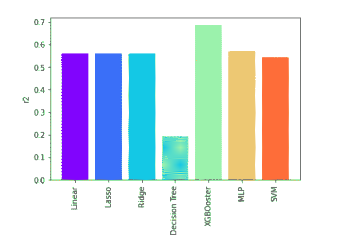
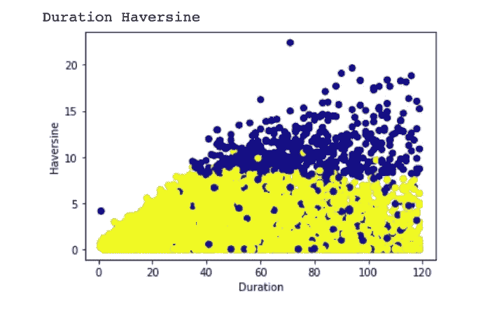
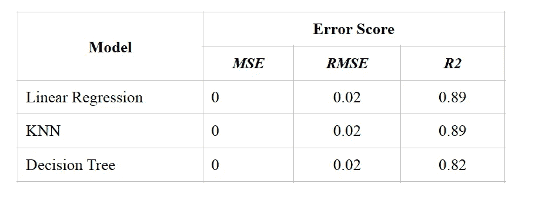
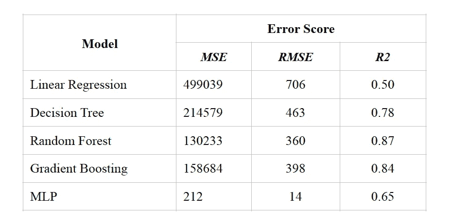

# 了解电动滑板车骑手的行为

> 原文：<https://blog.devgenius.io/understand-e-scooter-rider-behavior-baee49933bac?source=collection_archive---------13----------------------->

***摘要*——如今，电动滑板车被人们用于交通和娱乐，世界上大多数主要城市都开始了这一领域的研究和开发。用户可以很容易地使用任何提供商的应用程序来减少找到最近的滑板车的机会，并去他们想去的地方。这些服务的设计方式产生了大量关于如何以及在哪里使用服务的数据。通过评估这些数据和预测用户行为，旨在促进电动滑板车提供商和地方政府的运营研究。为此，已经尝试通过使用机器学习模型进行持续时间、距离和经纬度估计来预测用户行为。根据这些估计，为滑板车供应商和当地政府做出了推论。**

## 1.介绍

大部分操作都是在熊猫文库中进行的。Matplotlib 和 Seaborn 用于显示数据的图形表示。其他与 JSON、CSV、Datetime 和 Numpy 相关的库也被用于较小的任务。colab 环境是首选，因为数据发现中的所有步骤都可以在笔记本中轻松描述性地显示，并且可以进行地图可视化。

数据集中的每一行都包含踏板车的骑行信息。这些信息包括骑行时间、骑行距离、起始经纬度、到达经纬度、骑行日期和时间以及天气信息。通过使用这些信息，人们试图理解用户行为。滑板车用了多久，能估算出来吗？开车距离是多少？目的地的经纬度能否预测等问题，一直在尝试回答。根据这些答案，旨在为滑板车供应商和当地政府提供结论。

这里看到的问题是可用资源的低效使用。它旨在通过更好地理解用户的行为，使低效的流程变得更加高效。滑板车提供商使用运营团队来定位滑板车。考虑到这些团队使用的工具和劳动力，高效使用是必然的。通过这种方式，旨在提高材料和劳动效率，并减少能源消耗。由于正确的运行选择需要更少的移动和组织，运行团队使用的车辆的能源消耗也将减少。例如，当用户行为被更好地理解时，滑板车将不会被定位在不必要的区域。此外，如果代步车停车场能够设在合适的地方，将方便用户，这将旨在解决城市的停车问题。这里的停车问题可以认为是一些滑板车在路中间或人行道上占用过多。这些现在是一个问题，随着滑板车数量的增加，这个问题会变得更加严重。我认为这是非常重要的，为未来防止这些与工作要做。到目前为止，我们已经讨论了它对滑板车供应商的好处。此外，据认为，这将为地方政府，即市政当局带来许多好处。例如，如果可以观察到经常使用的路线，则可以通过公共交通向这些区域提供支持。由于缺乏公共交通而产生的困难可能已经消除了。它还可以通过在这些路线上修建自行车道来支持电动汽车的使用，从而以更环保的方式减少能源消耗。这将是一个更环保的方法。可以保证在人口密集区域扩大滑板车停放区域。

根据这些目标，首先，尝试使用回归模型来估计驾驶距离。由于数据集中有太多的数据，使用随机抽样方法的模型训练时间更快。当使用所有数据时，模型训练的持续时间可能相当长。

在估计行驶距离时，首先使用线性回归算法，然后使用多层感知器、决策树、XGbooster、SVM 算法。在对数据集进行随机采样之后，数据集被分成 20%的测试数据和 80%的训练数据。然后，对其进行缩放，因为特征之间的值差异很大。通过这种方式，旨在防止某些特征抑制其他特征。比较了这些回归模型的结果。性能指标是根据 MSE，RMSE 和 R2 值。

然后，通过在数据集上使用聚类算法来尝试发现模式。由于认为某些行为可能具有某些群集，所以应用了群集方法。为此，应用了 Kmeans、DBScan、分层、高斯混合聚类算法。因此，无法获得所需的数据。尽管使用了采用不同方法的聚类算法，但大多数数据是相互交织的。这将在下面的章节中详细解释。

尝试使用多输出机器学习模型来估计到达经纬度。为此，使用线性回归、K-最近邻、决策树算法。MSE、RMSE 和 R2 被用作性能指标。通过使特征重要来检查特征对结果的影响。因此，如果可以以某种方式预测行驶距离，也可以预测其目的地。这样，可以获得这些点的半径，并且可以有效地确定区域。这将在下面的章节中详细讨论。

骑行的时间已经试着估算过了。为此，使用线性回归和 XGBooster 算法。RMSE、MSE、MAE 和 R2 被用作性能指标。

最后，试图估计每小时使用多少辆踏板车。为此，在数据集中做了一些小的处理。它已经被改造成适合训练。然后，检查特征之间的相关性。它旨在了解每月和每小时的用户行为。从用户行为的角度来看，捕捉任何基于小时和月的模式都是很重要的。这样，滑板车供应商和地方政府就更容易接受公理。分析数据后，试图估算每小时使用滑板车的次数。为此，使用了线性回归、决策树、随机森林、梯度推进回归、多层感知器算法。性能指标是 RMSE、MSE 和 R2。然后，对随机森林和多层感知器进行模型调整。其目的是通过尝试不同的参数来提高模型性能。然后，直观地绘制图形，并从误差中得出结论。

## 2.文学研究

这方面的研究试图根据起点和终点来检测滑板车使用密集的地方。他们专注于这种紧张的原因，并试图理解它。总的来说，已经对数据分析进行了研究。也有少数研究试图使用机器学习模型来估计骑行距离和骑行持续时间。有人建议如何将人工智能模型与这些数据结合使用，以提高微型移动领域的能效。检查了踏板车定位在能量消耗方面效率低下的过程，并就如何相应地组织现场团队提出了想法。根据在研究中观察到的情况，现场团队管理对这一部门具有重大影响。他们已经表明，他们可以利用数据来很好地管理这种影响。因此，滑板车提供商不仅希望从数据中获得洞察力并更快地做出决策，还希望根据客户行为、需求预测和外部因素做出更明智的决策。

美国的一些地方政府已经迫使滑板车供应商通过遵守某些规则来公开共享数据。虽然这些数据中包含了一些关于游乐设施的信息，但考虑到用户隐私，有些数据是不共享的，或者共享时只进行了少量操作[2]。

在一项研究中，对机器学习模型如何用于踏板车定位进行了研究[3]。通过使用地理数据，通过计算靠近起点和终点的重要地点(公共汽车站、学校等)来确定属性。已经创建了诸如最近公路、超市计数 1000 米的属性。然后，使用随机森林和梯度推进分类器模型，因为基于树的模型被认为能够处理倾斜的数据，捕捉重要的特征交互并提供特征重要性。根据特征重要性对结果进行解释，并提出相应的公理。通过使用地理图像，尝试确定踏板车定位中缺失的区域，并尝试理解其原因。

在另一项研究中，给地理起点和终点起了名字，比如起点站和终点站。后来，确定了它们在这些区域的密度，并对其原因进行了研究[4]。

在这一领域，研究主要集中在数据挖掘和用地理图像解释结果上[5]。总的来说，对分散的数据进行清理、处理和可视化，并对结果进行解释。

## 3.数据集、数据属性和特征

出于隐私方面的考虑，该数据集被轻微处理过，并不完全准确。例如，开始和结束时间四舍五入到最接近的小时。关于地理位置，纬度和经度点没有准确提供。相反，非常接近的位置的值是通过小的操作给出的。换句话说，位置、开始和结束时间并不完全正确。准确性本身对这项研究并不重要，但重要的是要意识到数据集的局限性。滑板车供应商维持运营的地方政府已经要求公开这些数据。也就是说，当开始在一个地区工作时，踏板车提供商需要提供一些基本的能力。这些能力包括技术和软件内容。后来，当他开始行动时，他重视用户个人数据的隐私，并要求他公开展示他获得的数据。在公开展示这些数据时，他们考虑到数据隐私法，提供了这样的操作。这项研究的目的不是准确预测任何事情。其目的是利用最接近其位置的数据来预测用户的行为，并确保相应地指导运营团队，以及确保地方政府可以根据这些行为来采取公理。

深入了解它的结构和内容。数据集由 9601139 行和 26 列组成[1]。它包含首尔市出租自行车和踏板车的数据。数据集取自 kaggle。(以 P 开头的数据表示开始，以 D 开头的数据表示结束)

*   ***持续时间*** :骑行时间(分钟)
*   ***距离*** :骑行距离(米)
*   ***【Long】***:经度
*   ***纬度(Latd)*** :纬度
*   ***哈弗辛:*** 给定经度和纬度，确定球体上两点之间的大圆距离。这是随后利用纬度和经度数据编制的。然而，由于它被视为现成的数据集，因此没有对其采取任何行动。
*   ***月-周-日-时-分*** :日期数据。“日期”字段下的日期数据被解析并排列为一个单独的特征(P 表示起始值，D 表示结束值。)
*   ***温度(Temp):*** 摄氏温度
*   ***降水(precip):*** 降水数据。它是一个与温度值一起解释的值。(立方米)
*   ***风:*** 风速(米/秒)
*   ***湿度:*** 湿度(%)
*   ***太阳:*** 太阳辐射(MJ/m2)
*   ***降雪量:*** 降雪量(厘米)
*   ***地温:*** 以摄氏度为单位的地温
*   ***粉尘:*** 空气中粉尘的百分比(%)

数据集中没有分类数据。没有包含任何空值的行。第一批模型没有进行特征提取或数据处理，因为它们是通过 Kaggle 现成获得的。然而，数据制造商已经向由踏板车提供商公开提供的数据中添加了更多的功能。首先是哈弗辛特征。哈弗辛是使用纬度和经度值的距离测量计算。在数据集介绍中有解释。此外，考虑到驾驶日期，数据创建者还添加了与天气状况相关的功能。

在估算每小时滑板车数量时，对数据集做了一些调整。python pandas 库用于计算日常计算。为了适用于该模型，每小时对数据进行分组，并在“计数”功能下计算出行次数。然后，尝试用回归模型预测这一特征。

## 4.测试结果和结果解释

首先，从数据集中删除距离和哈弗斯特征，并尝试估计距离。用 0.01 的分数进行随机取样。最初，由于模型简单，使用线性回归算法及其优化方法 lasso 和 ridge 方法。在每一种方法中，RMSE、MSE 和 R2 分数被用作评估标准。然后使用 MLP 算法。训练这个模型花了很长时间，因为 0.01 的分数数据量有点多。通过进一步降低分数比，模型的训练速度会更快。然后，使用决策树、XGBooster、SVM 算法，比较 R2 评分。用决策树确定特征的重要性，并尝试检验输入对输出的影响。已经看到，骑行时间的影响比其他投入的影响大得多。这种情况挺符合逻辑的，其实距离越长，骑行时间越长。除此之外，起点和终点经纬度的影响是紧随其后的特征。例如，在人和交通密度高的地方，行驶速度会降低，因此到短距离的旅行时间可能会增加。这是我们了解它们的一个重要途径。这里，人们认为如果有用户数据，距离估计可以做得更好一点。因为一些用户由于某些原因可以进行有限的距离旅行，但是不可能在这些数据中找到他们。比如可能有每天上班或者上学的客户。通过这些可以捕捉到一种模式。从图中可以看出，最成功的模型是 XGBooster，但 R2 值仍然不是很高，这表明数据需要进一步丰富。比如刚刚提到的在估算距离的同时拥有用户数据。已经看到，与其他模型相比，决策树模型相当不成功。其他模型给出了几乎相同的结果。

通过以 0.003 的分数进行随机抽样来训练聚类模型。人们首先试图寻找温度和哈弗素之间的关系。也检查了其他关系，但是没有达到预期的结果。对所有特征之间的关系进行了聚类。模型部分描述了所使用的方法。已经使用了由不同方法组成的聚类算法。找不到想要的结果。在接触图形的模型中，通常所有的数据都是交织在一起的。由于找不到一个非常重要的模式，这些模型没有得到太多的重视。下面是用高斯混合分析的持续时间哈弗辛模型。其他显示在工作笔记本中。

多输出回归模型用于估计到达的经纬度。为此，使用线性回归、KNN 和决策树算法。MSE，RMSE 和 R2 得分作为评价指标进行了比较。当模型被训练时，到达经纬度和哈弗森特征被从数据集中删除。在这里，距离不应该是已知的，但当它是那样的时候，模型的成功减少了很多。事实上，如果我们能以某种方式正确地估计距离，我们就能找到它能去的地方。在估计距离时，这可以通过添加如上所述的不同特征来实现。例如，在一项研究中，通过使用经纬度值将附近重要地点的数据添加到数据集中。换句话说，如果有学校、政府机关等。在起点 100 米范围内，可以添加信息。如果用这种方法可以估计距离，那么实际目的地也可以估计。这些数据对于地方政府和电动滑板车供应商来说也是足够的。有可能用这种方式的地方就会出现。路线会显示得更清楚。此外，将确保地方政府的公共交通路线研究、滑板车停放位置和滑板车供应商现场团队的有效利用。换句话说，这是一种可以在将要建设的地方用于城市规划的方法。指示器提供者也可以使用该数据来确保新区域操作的成功开始。模型结果的比较如下所示。

用 0.003 分数进行随机取样。通过从数据集中减去持续时间特征，目标被确定为变量。为此，训练线性回归和 XGBooster 模型。线性回归的 r2 值为 0.72，XGBooster 的 R2 值为 0.85。距离估计从简单的线性回归模型开始，然后训练比其他模型更成功的 XGBooster 模型。这里的目的是在估计持续时间之后，根据最常用的踏板车位置来估计持续时间。可以计算与持续距离一样多的来自踏板车的半径，并且可以确定操作位置。根据持续时间估计，可以给出用户使用的踏板车可能没电的警告。在某些情况下，人们认为充电就足够了，但由于在崎岖的地形上充电费用较高，因此可能会出现道路停车。通过避免这些情况，可以尝试提高客户满意度。

最后，对数据集进行特征提取，使其适合于训练。这里的目的是观察骑行次数如何根据小时和月份变化。通过这种方式，旨在通过防止现场团队不必要的工作来减少能源消耗。总的来说，在检查月度数据时，没有发现太大的差异。但是在冬天的几个月里，骑行的次数下降得更多一些。然后，尝试估算每小时的驾驶次数。为此，使用了线性回归、决策树、随机森林、梯度推进和 MLP 算法。使用 GridSearchCV 方法测试了随机森林和 MLP 的各种参数。已经尝试了用于更好建模的参数，并且已经做出努力来改进模型。为训练和测试数据测量单独的评估度量。下面的结果比较是对测试数据进行的测试。随机森林和梯度推进算法已经成为计数估计的成功模型。模型结果的比较如下所示。

## 5.结论

人们试图用许多不同的数据集方法来理解用户行为。检查距离和持续时间估计以及用户习惯。通过进行经纬度估计，试图了解可能的路线和密集使用区域。通过这种方式，它旨在支持当地政府和滑板车供应商的运营。评估模型结果和推论。因此，提出了一些建议。在未来的研究中，通过丰富数据集可以获得更成功的结果。由于用户数据保护限制，已经遇到了一些限制，但是通过在提供这些数据的公司进行的研究中访问这些数据，可以做出更准确的评估。

## 参考

1.  [https://www . ka ggle . com/datasets/saurabhshahane/Seoul-bike-trip-duration prediction](https://www.kaggle.com/datasets/saurabhshahane/seoul-bike-trip-durationprediction)
2.  https://open.toronto.ca/catalogue/?topics=Transportation&n = 1 的
3.  [https://towards data science . com/a-birds-eye-view-leveraging-machine-learning-generate-nests-30dd 2136 a839](https://towardsdatascience.com/a-birds-eye-view-leveraging-machine-learningto-generate-nests-30dd2136a839)
4.  [https://towards data science . com/analyzing-e-scooter-activity-through-visualization and-machine-learning-in-python-a 33585 B2C 29](https://towardsdatascience.com/analyzing-e-scooter-activity-through-visualizationand-machine-learning-in-python-a33585b2c29)
5.  [https://medium . com/analytics-vid hya/analyzing-e-scooter-trips-in-Chicago with-python-c 985611 a 33 e 1](https://medium.com/analytics-vidhya/analyzing-e-scooter-trips-in-chicagowith-python-c985611a33e1)

Github 上的笔记本链接:【https://github.com/okanexe/machine-learning-final-project 