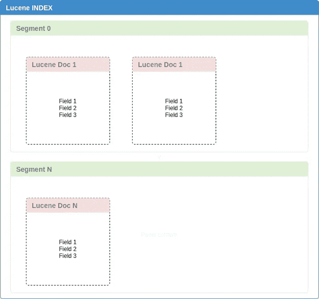

# 了解 Lucene 了解 ElasticSearch

> 原文：<https://blog.devgenius.io/understand-lucene-to-understand-elasticsearch-85037d5b7577?source=collection_archive---------0----------------------->

## 让我们看看 Elasticsearch 的核心

本文的目的是促进对 ElasticSearch 内部工作方式的更好理解。如果你正在阅读这篇文章，你可能已经知道 ElasticSearch 是如何工作的，如果不是这样，你可以通过阅读下面的文章了解更多:

 [## 什么是弹性搜索，为什么你应该尝试它

### 这篇文章的想法是根据我的个人经历带来一个弹性研究的愿景。

medium.com](https://medium.com/@antunesleo/what-is-elasticsearch-and-why-you-should-try-it-f23585eaced8) 

**Lucene。**

Lucene 是 ElasticSearch 的基础，但你不会直接与他互动，就像你开车一样，但你不会直接要求你的引擎启动。但是如果你的车坏了怎么办，你不认为了解你的发动机是如何工作的是个好主意吗？

> **Lucene 索引**

你有大量的文件，你需要找到一个特定的文件，其中包含某个单词，如何快速做到这一点？如何做到可扩展？这就是索引的用武之地:要快速搜索大量文本，首先必须对文本进行索引，并将其转换成可以快速搜索的格式。这个转换过程称为索引，其输出称为索引。

> **Lucene 指数。**

索引由一个或多个段组成，每个段又由几个索引组成，混淆了吧？当它被创建时，它被分成更小的片段，或者你可以把它看作子索引，其中每个索引不是完全独立的。

> **Lucene 段。**

段是不可变的。每个片段包含一个或多个 Lucene 文档
在您的 ES 之旅中的某个时刻，您可能会遇到不得不删除文档的情况。显然这没有问题，但是幕后发生了什么？
当您删除一个文档时，它仅被“标记”为已删除，并且该文档的一个新版本被添加到该段。它的真正执行只是在更大的段“连接”发生时才不时地进行。
与此同时，文档继续占用磁盘空间。

> **Lucene 合并。**

随着时间的推移，索引将累积许多段。周期性地，段被合并成单个新段，并移除旧段。

但是，等等，合并我的细分市场有什么好处？

基本上，因为两件重要的事情，丢弃旧的文件，结果减少了我们在磁盘上的索引空间，第二件是旧的片段被删除，一个新的更大的片段被创建，增加了你的搜索速度。

# 结论

理解 Lucene 对于理解 Elasticsearch 是必不可少的，当然它们之间有所不同，但是概念和工作原理是相同的。这种概念在 ElasticSearch 文档中很难找到，因为它们为你抽象了所有这些工作。我希望我能解释一些关于 Lucene 核心的东西，来展示 ElasticSearch 是如何真正工作的。

# 参考和启发:

[https://www . manning . com/books/Lucene-in-action-second-edition](https://www.manning.com/books/lucene-in-action-second-edition)