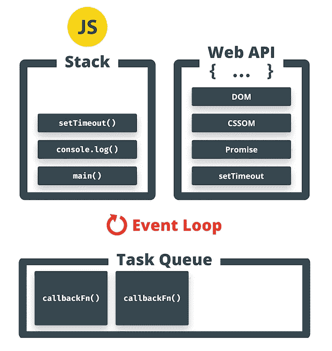
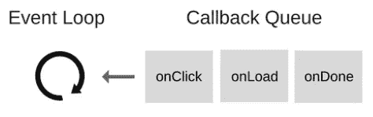
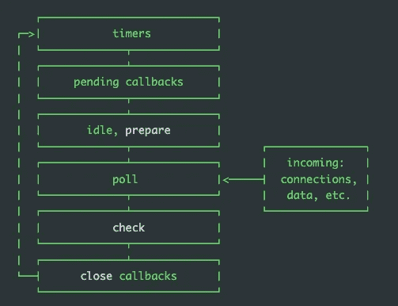

# 了解节点。JS 事件循环在 5 分钟内(或更短时间内…)

> 原文：<https://blog.devgenius.io/understand-node-js-event-loop-in-5-minutes-or-less-f76b2b0115f1?source=collection_archive---------5----------------------->

大家都知道 Node。JS 应用程序是一个单线程的应用程序，这意味着你在任何时候都只能执行一个“命令”。
那么**怎么可能**使用一个**单线程**还能提供如此高的性能呢？

让我们试着从一个不同的角度，一个简单得多的角度，来弄清楚 HTTP 服务器是如何工作的，以及它们是如何参与的，直到发明了点**事件循环**。



> 一个 **HTTP 服务器**是一个[计算机](https://en.wikipedia.org/wiki/Computer) ( [软件](https://en.wikipedia.org/wiki/Software) ) [程序](https://en.wikipedia.org/wiki/Computer_program)(甚至是一个[软件组件](https://en.wikipedia.org/wiki/Software_component)包含在另一个程序中)，它通过实现 [HTTP](https://en.wikipedia.org/wiki/HTTP) 和/或[HTTPS](https://en.wikipedia.org/wiki/HTTPS)[的*服务器部分*，在](https://en.wikipedia.org/wiki/HTTPS)[客户机-服务器模型](https://en.wikipedia.org/wiki/Client%E2%80%93server_model)中扮演[服务器](https://en.wikipedia.org/wiki/Server_(computing))的角色
> 
> HTTP 服务器等待传入的客户端请求(由[用户代理](https://en.wikipedia.org/wiki/User_agent)发送，如[浏览器](https://en.wikipedia.org/wiki/Web_browser)、[网络爬虫](https://en.wikipedia.org/wiki/Web_crawler)等)。)并且对于每一个请求，它通过回复所请求的信息来回答，包括发送所请求的 [web 资源](https://en.wikipedia.org/wiki/Web_resource)，或者回复 [HTTP 错误消息](https://en.wikipedia.org/wiki/List_of_HTTP_status_codes)。

# 基本 HTTP 服务器:

考虑下面一个 HTTP 服务器的简单实现，它是一个没有事件循环的*单线程* **。**

```
while(true){
   socket_connection = listen to the next TCP connection
   http_request =      read from socket
   web_page =          read from Disk
   ...
                       set response_headers
                       stream the response to client
                       close the socket connection
}
```

这种方法的问题是，我们要等到**每个**变量赋值都**完成**后，才能移动到下一个变量，所以如果**需要一段时间**来读取 HTTP 请求或从磁盘获取 web_page，主线程就会**被卡住**。

# 高级 HTTP 服务器:

同上，但是现在我们为每个 HTTP 请求生成一个新线程。

```
function process_request(socket){
     socket_connection = listen to the next TCP connection
     http_request =      read from socket
     web_page =          read from Disk
     ...
                         set response_headers
                         stream the response to client
                         close the socket connection
}while(true){
   socket_connection =   listen to the next TCP connection
   spawn a new background thread using 'process_request' logic
}
```

那么，你觉得这个解决方案怎么样？听起来不错，对吧？让我们试着理解我们在这里有什么。由于这种编程模式，主线程可以自由地处理任何新的请求，我们的客户端可以快速获得 http 响应。

> 大多数网络服务器都是这样工作的(IIS、Apache 等)

但是现在让我们来评价这个解决方案，如果它远非完美，它只有一个缺点，那就是一个大缺点。
因为我们产生了如此多的线程，对于有大量连接的工作负载，每个连接只需要偶尔关注一次，所以这种多线程模式的性能不会很好。
那么我们能做什么呢？让我们使用事件循环！

# 事件驱动与轮询**编程**

> **事件驱动编程**是一种编程范式，其中程序的[流程由](https://en.wikipedia.org/wiki/Control_flow)[事件](https://en.wikipedia.org/wiki/Event_(computing))决定，例如用户动作([鼠标](https://en.wikipedia.org/wiki/Computer_mouse)点击、按键)[传感器](https://en.wikipedia.org/wiki/Sensor)输出，或者来自其他程序或[线程](https://en.wikipedia.org/wiki/Thread_(computer_science))的[消息传递](https://en.wikipedia.org/wiki/Message_passing)。事件驱动编程是在[图形用户界面](https://en.wikipedia.org/wiki/Graphical_user_interface)和其他应用程序(例如，JavaScript [web 应用程序](https://en.wikipedia.org/wiki/Web_application))中使用的主要范例，这些应用程序集中于响应[用户输入](https://en.wikipedia.org/wiki/Input/output)而执行某些动作。对于[设备驱动](https://en.wikipedia.org/wiki/Device_driver)的编程也是如此(例如 USB 设备驱动栈[【1】](https://en.wikipedia.org/wiki/Event-driven_programming#cite_note-1)中的 [P](https://en.wikipedia.org/wiki/P_(programming_language)) )。
> 
> 在事件驱动的应用中，通常有一个[主循环](https://en.wikipedia.org/wiki/Event_loop)监听事件，然后在检测到其中一个事件时触发一个[回调函数](https://en.wikipedia.org/wiki/Callback_(computer_programming))。事件驱动的程序可以用任何一种[编程语言](https://en.wikipedia.org/wiki/Programming_language)编写，尽管在提供[高级抽象](https://en.wikipedia.org/wiki/Abstraction_(computer_science))的语言中任务更容易，比如[等待](https://en.wikipedia.org/wiki/Async/await)和[关闭](https://en.wikipedia.org/wiki/Closure_(computer_programming))。
> 
> **轮询编程**是一种编程范例，其中程序的[流程通过不断检查变量赋值的准备状态或状态来确定。 **轮询，或轮询操作**，在计算机科学中，指的是客户端程序主动采样外部设备的状态，作为一个**同步**活动
> 这样想:你的代码**等待**一个同步代码块(网络请求、从磁盘获取文件等……)，以检查其就绪或状态。](https://en.wikipedia.org/wiki/Control_flow)

```
while(true){
   sync_operation = //some **synchronous** activity
   if(sync_operation)
     ...
```

> 例如，想象一个代码块，它有一个 while(true)循环，就像上面的例子一样，我们不断地检查一个动作(sync_operation)的状态，看它是否完成。

# 事件比投票好吗？

一般来说，轮询架构比事件驱动架构更容易实现。然而，尽管复杂，LabVIEW 中的事件驱动程序，加上状态机架构，提供了更好的性能。

# 处理输入的轮询和基于事件的模型之间有什么区别？

在事件驱动的情况下，当用户在某物上点击鼠标或键入一个键时，一个方法被调用来处理事件。在轮询驱动的情况下，为了响应用户操作，程序员将 if 语句放入一个更新方法中，该方法在每一帧被调用以轮询输入。

# 事件驱动和轮询架构的主要区别是什么？

中断驱动代码和事件驱动代码都在运行代码之前等待事件，而轮询将试图查询事件是否实际存在。

# 基于事件循环的 HTTP 服务器:

```
while(true){
   event = listen to the next event to happen
   switch(event){ case NEW_TCP_CONNECTION:
           //handle new connection case FINISHED_READING_FROM_SOCKET:
           //start fetching web_page content from disk case FINISHED_READING_FROM_DISK:
           //start streaming the web_page case FINISHED_WRITING_TO_SOCKET:
           //close the socket connection }}
```

希望我的伪代码是可理解的。事情是这样的:我们等待事情发生。每当一个新的连接被创建或者一个现有的连接需要我们注意时，我们就去处理它，然后回去等待。这样，当有许多联系，而每一个都很少需要注意时，我们表现得很好。

# 示例:我们的浏览器事件循环看起来怎么样？



```
while(true){
   ui_event = listen to the next ui event to happen
   switch(ui_event){ case onclick:
           //handle mouse click on an element case onfocus:
           //handle element gets focus event case onkeypress:
           //handle when user presses a key case onload:
           //handle when page has been loaded}
```

# 奖金:节点。JS 事件循环的操作顺序。



# 阶段概述

*   **定时器**:该阶段执行`setTimeout()`和`setInterval()`安排的回调。
*   **待定回调**:执行推迟到下一次循环迭代的 I/O 回调。
*   **闲置**、**准备**:仅供内部使用。
*   **轮询**:检索新的 I/O 事件；执行与 I/O 相关的回调(除了关闭回调、计时器调度的回调和`setImmediate()`之外的几乎所有回调)；节点将在适当的时候阻塞这里。
*   **检查** : `setImmediate()`这里调用了回调。
*   **关闭回调**:一些关闭回调，如`socket.on('close', ...)`。

# 事件循环按以下顺序执行:

*   JS 引擎中有两个任务队列:宏任务队列和微任务队列
*   整个脚本最初作为宏任务执行
*   执行过程中，同步代码直接执行，宏任务进入宏任务队列，微任务进入微任务队列
*   当当前宏任务完成时，检查微任务队列，并依次执行所有的微任务
*   执行浏览器 UI 线程的呈现(在本文中可以忽略这一点)
*   如果存在任何 Web Worker 任务，就执行它(在本文中可以忽略这一点)
*   检查宏任务队列，如果它不为空，返回到步骤 2 并执行下一个宏任务。

值得注意的是，第四步:当一个宏任务完成后，先依次执行其他所有的微任务，然后执行下一个宏任务。

微任务包括:`MutationObserver`、`Promise.then()`和`Promise.catch()`，其他基于 Promise 的技术如 fetch API、V8 垃圾收集过程、节点环境中的`process.nextTick()`。

宏任务包括:初始脚本、`setTimeout`、`setInterval`、`setImmediate`、I/O、UI 渲染。

# 包裹

感谢阅读这篇文章，如果你有所收获，不要忘记鼓掌！

如果你对这篇文章有任何问题或者有什么改进的想法，请不要犹豫，尽管来找我。

谢谢你。

# 伊兰·佩莱德写的《✍️》👨🏻‍💻 🤓 🏋️‍🏸 🚀 🚲[🎸](https://emojipedia.org/guitar/)

https://www.linkedin.com/in/eran-peled/