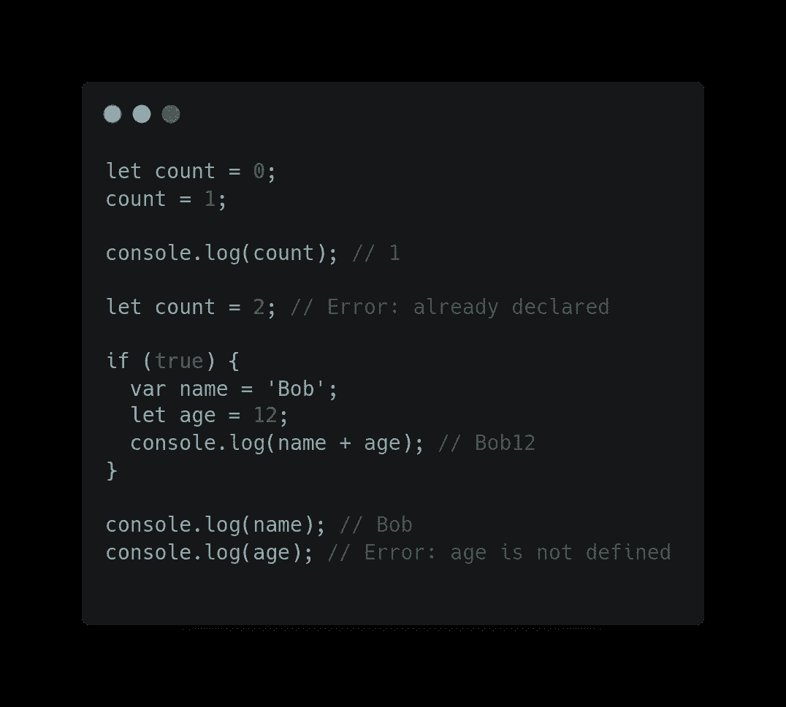

# 理解 JavaScript 中 Var、Let 和 Const 的区别

> 原文：<https://blog.devgenius.io/understand-the-difference-between-var-let-and-const-in-javascript-fdf19e18efd0?source=collection_archive---------4----------------------->


迷茫！对吗？

JavaScript 最大的转变发生在 ECMAScript 第 6 版发布的时候，许多闪亮的新特性出现了。现在，因为已经是 2022 年了，所以假设大多数开发者已经熟悉了这些特性。我知道我写一篇关于这个主题的文章有点晚了，因为 let 和 const 是在 ES6 中引入的，现在是 2022 年，但仍然有很多开发者不知道为什么我们使用 let 和 const 而不是 var？他们只是为了声明而使用这些变量。

**变量声明的一点历史:**

在 JavaScript 的开始，只有一种方法来声明一个变量，那就是使用 var 关键字。在 ES6 中，let 和 const 引入了两种定义变量的新方法。现在，所有主流浏览器都兼容 let 和 const 关键字，现在大多数开发者都在使用 let 和 const。

问题是，它们与我们最初使用的 var 有何不同？有什么大想法？为什么定义一个变量有三种不同的方法？

在我们理解它们之间的区别之前，我们需要理解什么是 JavaScript 中的作用域和提升。我不会在这里讨论这两个话题，但是你可以看看这篇关于[范围和提升](https://javascript.plainenglish.io/understanding-scoping-and-hoisting-in-javascript-with-examples-c51e5612d52e?source=friends_link&sk=6d283a0cbc2ee788d3d43d8be0de61d5)的文章。

## 定义变量

之前只有 var，他是变量声明之王。但是用 var 声明的变量也有一些问题。这就是为什么 let 和 const 推出。

Var 声明是全局作用域或函数作用域。这意味着如果一个变量在函数外用 var 声明，那么它就在全局范围内(在任何地方都可以访问)。否则，如果它们在函数内部，我们只能在函数内部访问它们。

让我们看一下这个例子来进一步理解，


带有“var”关键字的变量

这里的“car”是全局范围的，因为它存在于函数之外，而“bike”是在函数中声明的，所以我们不能在函数之外访问“bike”变量，这就是为什么我们得到一个错误，因为它在函数范围内。

**var 关键字的问题**

var 关键字的一个问题是它们可以在同一个范围内被重新声明。var 的另一个问题是这些变量不是块作用域，这意味着如果在任何{}(块语句)中声明 var，它们的作用域不是该块，而是整个全局作用域。

让我们看一个例子来说明 var 的这些问题:


var 关键字的问题

这里重新声明了“car ”,我们可以看到 count 变量可以在 for 循环之外访问，这是一个块语句。为了克服这些问题，let 和 const 推出了。

## 让

这是 var 的增强版，它解决了 var 关键字带来的所有问题。比如，let 是一个块范围的变量，我们不能重新声明，但是可以更新(重新赋值)。你会在下面的例子中看到，let 比 var 更好。



用 let 声明的变量

在这里我们可以看到，我们可以更新变量，但不能重新声明，这就是为什么它抛出一个错误和变量声明与 let 和 const 在块语句(如果-否则，而，for 循环等)..)在任何地方都无法访问。

这些事实使 let 成为比 var 更好的选择。因为它解决了 var 带来的两个问题。

## 常数

Const 声明与 let 声明有一些相似之处，但是 const 变量不能被更新或重新声明。它保持恒定值。与 var 和 let 不同，如果我们使用 const，那么它必须在我们声明变量的同时被初始化。
让我们看一个例子


const 应该同时声明和初始化

除此之外，const 的行为和 let 完全一样。我个人更喜欢 let 和 const 而不是 var。但是在某些情况下，var 也是有用的，因为它被提升到顶部并用“未定义”的值初始化。

# 结论:

让我们总结一下这篇文章

*   虽然 var 和 let 可以在不初始化的情况下重新声明，但 const 应该在声明期间初始化。
*   它们都被放在顶部，但是 var 是用默认值初始化的，不像 let 和 const 是不初始化的。
*   对于范围和重新声明，请参见下表以获得更好的清晰度


var 与 let 和 const 的主要区别

```
We should make an habit to use const and let over var to avoid unnecessary confusion/errors.
```

> 这就是这篇文章的全部内容，如果你有任何疑问，请在评论区分享。为了更好地理解，请阅读关于提升和界定这些变量的文章，这将消除所有的困惑。
> 查看我的其他文章于——[**https://medium.com/@aayushtibra1997**](https://medium.com/@aayushtibra1997) **感谢阅读:)**