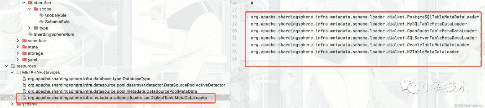

# 理解 Apache ShardingSphere 的 SPI，以及为什么它比 Dubbo 的简单

> 原文：<https://blog.devgenius.io/understanding-apache-shardingspheres-spi-and-why-it-s-simpler-than-dubbo-s-dac57b0cf98a?source=collection_archive---------15----------------------->


## **为什么要学习**[](https://shardingsphere.apache.org)****的 SPI？****

**你可能已经熟悉了 [Java](https://www.java.com/en/) 和 [Dubbo](https://dubbo.apache.org/en/) 的 [SPI(服务提供者接口)](https://en.wikipedia.org/wiki/Service_provider_interface)机制，所以你可能会问“为什么我要学习 [ShardingSphere](https://shardingsphere.apache.org) 的 SPI 机制？“原因很简单:**

1.  **ShardingSphere 的源代码更简单，也更容易适应。**
2.  **ShardingSphere 的 SPI 机制的执行相当流畅，日常操作所需的代码较少。与 Dubbo 的 SPI 机制及其与 [IoC](https://medium.com/@amitkma/understanding-inversion-of-control-ioc-principle-163b1dc97454) 相关的附加功能不同，ShardingSphere 中的机制只保留了基本结构，使用起来毫不费力。**

## ****了解 ShardingSphere 的 SPI****

**我们还必须提到在 [Java SPI](https://docs.oracle.com/javase/tutorial/sound/SPI-intro.html) 机制中发现的一些缺点:**

1.  **使用具有多个并发线程的 [ServiceLoader](https://docs.oracle.com/javase/8/docs/api/java/util/ServiceLoader.html) 类的实例是不安全的。**
2.  **每次获取一个元素，都需要迭代所有元素，不能按需加载。**
3.  **当实现类加载失败时，会提示一个异常，但没有指出真正的原因，这使得错误很难定位。**
4.  **获取实现类的方式不够灵活。只能通过[迭代器](https://docs.oracle.com/javase/8/docs/api/java/util/Iterator.html)形式获得，而不是基于一个参数获得对应的实现类。**

**有鉴于此，让我们看看 [ShardingSphere](https://shardingsphere.apache.org) 如何以一种简单的方式解决这些问题。**

## ****加载 SPI 类****

**Dubbo 是直接重写自己的 SPI，包括 SPI 文件名和文件配置方式，与 [JDK](https://www.oracle.com/java/technologies/downloads/) 形成鲜明对比。下面我们简单比较一下这两者的用法区别:**

****Java SPI****

**在`META-INF/services`文件夹下添加接口实现类**

```
optimusPrime = org.apache.spi.OptimusPrime
bumblebee = org.apache.spi.Bumblebee
```

****杜博 SPI****

**将接口的实现类添加到文件夹`META-INF/services`中，通过`key`、`value`进行配置，如下例:**

```
optimusPrime = org.apache.spi.OptimusPrime
bumblebee = org.apache.spi.Bumblebee
```

**我们现在可以看到，Dubbo 的 Java SPI 与 JDK 的 SPI 完全不同。**

## **【ShardingSphere 如何轻松扩展 JDK SPI？**

**与 Dubbo 实现概念不同，ShardingSphere 用更少的代码扩展了 JDK SPI。**

1.  **该配置与 Java SPI 中的配置完全相同。**

**让我们以`DialectTableMetaDataLoader`接口实现类为例:**

*   **`DialectTableMetaDataLoader.class`**

```
public interface DialectTableMetaDataLoader extends StatelessTypedSPI { /**
     * Load table meta data.
     *
     * @param dataSource data source
     * @param tables tables
     * @return table meta data map
     * @throws SQLException SQL exception
     */
    Map<String, TableMetaData> load(DataSource dataSource, Collection<String> tables) throws SQLException;
}public interface TypedSPI { /**
     * Get type.
     * 
     * @return type
     */
    String getType(); /**
     * Get type aliases.
     *
     * @return type aliases
     */
    default Collection<String> getTypeAliases() {
        return Collections.emptyList();
    }
}
```

**`StatelessTypedSPI`接口取自`TypedSPI`，使用多个接口以满足单一接口负责的原则。`TypedSPI`是`Map`的键，其中子类需要指定自己的 SPI。**

**这里你不需要关心什么方法是由`DialectTableMetaDataLoader` 接口定义的，你只需要关注子类是如何被 SPI 加载的。如果是 Java SPI，要加载子类，只需在`META-INF/services`中用完整的类名定义它。**

****

**如您所见，它与原生 java SPI 配置完全相同。那么它的缺点怎么样呢？**

## ****使用工厂方法模式****

**对于每个需要由 SPI 扩展和创建的接口，通常都有一个类似的`xxDataLoaderFactory`来创建和获取指定的 SPI 扩展类。**

**`**DialectTableMetaDataLoaderFactory**`**

```
@NoArgsConstructor(access = AccessLevel.PRIVATE)
public final class DialectTableMetaDataLoaderFactory { static {
        ShardingSphereServiceLoader.register(DialectTableMetaDataLoader.class);
    } /**
     * Create new instance of dialect table meta data loader.
     * 
     * @param databaseType database type
     * @return new instance of dialect table meta data loader
     */
    public static Optional<DialectTableMetaDataLoader> newInstance(final DatabaseType databaseType) {
        return TypedSPIRegistry.findRegisteredService(DialectTableMetaDataLoader.class, databaseType.getName());
    }
}
```

**这里你可以看到使用了一个静态块，所有的`DialectTableMetaDataLoader` 实现类都是在类加载过程中通过`ShardingSphereServiceLoader.register` 注册的。通过使用`TypedSPIRegistry.findRegisteredService`，我们可以得到我们指定的 spi 扩展类。**

```
TypedSPIRegistry.findRegisteredService(final Class<T> spiClass, final String type)
```

**所以我们只需关注`ShardingSphereServiceLoader.register```和`ypedSPIRegistry.findRegisteredService`途径。**

**`**ShardingSphereServiceLoader**`**

```
@NoArgsConstructor(access =AccessLevel.PRIVATE)
public final class ShardingSphereServiceLoader { private static final Map<Class<?>, Collection<object>> SERVICES = new ConcurrentHashMap<>(); /**
     *Register service.
     *
     *@param serviceInterface service interface
     */
    public static void register(final Class<?> serviceInterface){
        if (!SERVICES.containsKey(serviceInterface)) {
            SERVICES.put(serviceInterface, load(serviceInterface) ) ;
        }
    }

    private static <T> Collection<Object> load(final Class<T> serviceInterface) {
        Collection<Object> result = new LinkedList<>();
        for (T each: ServiceLoader. load(serviceInterface)) {
        result.add(each);
        }
        return result;
    }

    /**
     *Get singleton service instances.
     *
     *@param service service class
     * @param <T> type of service
     *@return service instances
     */
    @SuppressWarnings("unchecked")
    public static <T> Collection<T> getSingletonServiceInstances(final Class<T> service) {
        return (Collection<T>) SERVICES.getorDefault(service,Collections.emptyList());
    }

    /**
     *New service instances.
     *
     * eparam service service class
     *@param <T> type of service
     *@return service instances
     */
    @SuppressWarnings ("unchecked" )
    public static <T> Collection<T> newserviceInstances(final Class<T> service){
        if(!SERVICES.containskey(service)) {
           return Collections.emptyList();
        }
        Collection<object> services = SERVICES.get(service);
        if (services.isEmpty()){
            return Collections.emptyList();
        }
        Collection<T> result = new ArrayList<>(services.size());
        for (Object each: services) {
            result.add((T) newServiceInstance(each.getClass()));
        }
        return result;
    }

    private static Object newServiceInstance(final Class<?> clazz) {
        try{
           return clazz.getDeclaredConstructor( ) . newInstance( ) ;
        } catch (final ReflectiveOperationException ex) {
            throw new ServiceLoaderInstantiationException(clazz, ex);
        }
    }
}
```

**我们可以看到所有的 SPI 类都放在这个`SERVICES`属性中。**

```
private static final Map<Class<?>, Collection<Object>> SERVICES = new ConcurrentHashMap<>();
```

**注册也很简单，只需使用嵌入在 java 中的 SPI api。**

```
public static void register(final Class<?> serviceInterface) {
        if (!SERVICES.containsKey(serviceInterface)) {
            SERVICES.put(serviceInterface, load(serviceInterface));
        }
    }private static <T> Collection<Object> load(final Class<T> serviceInterface) {
        Collection<Object> result = new LinkedList<>();
        for (T each : ServiceLoader.load(serviceInterface)) {
            result.add(each);
        }
        return result;
    }
```

**`**TypedSPIRegistry**`**

**`TypedSPIRegistry`中的`findRegisteredService`方法本质上是对`ShardingSphereServiceLoader`的`getSingletonServiceInstances`方法的调用。**

```
public static <T extends StatelessTypedSPI> Optional<T> findRegisteredService(final Class<T> spiClass, final String type) {
        for (T each : ShardingSphereServiceLoader.getSingletonServiceInstances(spiClass)) {
            if (matchesType(type, each)) {
                return Optional.of(each);
            }
        }
        return Optional.empty();
    }private static boolean matchesType(final String type, final TypedSPI typedSPI) {
        return typedSPI.getType().equalsIgnoreCase(type) || typedSPI.getTypeAliases().contains(type);
    }
```

**这里你可以看到类扩展正在使用`TypedSPI`中的`getType`或`getTypeAliases`来获得匹配，这就是为什么每个 SPI 都需要实现`TypedSPI`接口。**

**现在让我们看看`ShardingSphereServiceLoader`中的`newServiceInstances`方法**

```
public static <T> Collection<T> newServiceInstances(final Class<T> service) {
        if (!SERVICES.containsKey(service)) {
            return Collections.emptyList();
        }
        Collection<Object> services = SERVICES.get(service);
        if (services.isEmpty()) {
            return Collections.emptyList();
        }
        Collection<T> result = new ArrayList<>(services.size());
        for (Object each : services) {
            result.add((T) newServiceInstance(each.getClass()));
        }
        return result;
    }
```

**你可以看到，在通过静态代码块注册的`SERVICES`中直接找到接口的所有实现类返回也非常简单。**

**虽然很短，但这个简短的演练基本上介绍了 ShardingSphere 的 SPI 源代码。我们确信你已经注意到使用 ShardingSphere 的 SPI 比 Dubbo 的 SPI 机制要容易和简单得多。**

## ****总结****

**ShardingSphere 和 Dubbo 的 SPI 都满足了按键查找指定实现类的要求，不用每次使用都重新加载所有实现类，解决了并发加载问题。然而，与 Dubbo 相比，ShardingSphere SPI 更精简，更易于使用。**

**您可以在以后编写自己的 SPI 扩展时参考 ShardingSphere 实现，因为它实现起来更简单，使用起来也很优雅。您可以基于 SPI 编写一个可扩展的配置文件解析器，这样我们就可以了解 SPI 的能力及其应用场景。**

# **Apache ShardingSphere 项目链接:**

**[ShardingSphere Github](https://github.com/apache/shardingsphere/issues?page=1&q=is%3Aopen+is%3Aissue+label%3A%22project%3A+OpenForce+2022%22)**

**推特**

**[切割球松弛度](https://join.slack.com/t/apacheshardingsphere/shared_invite/zt-sbdde7ie-SjDqo9~I4rYcR18bq0SYTg)**

**[投稿指南](https://shardingsphere.apache.org/community/cn/contribute/)**