# 理解 JS 中的箭头函数

> 原文：<https://blog.devgenius.io/understanding-arrow-functions-in-js-6a8893115cb1?source=collection_archive---------10----------------------->

箭头函数是 javascript 世界的 tiktok，似乎每个人都在使用它。它比 Javascript 中的传统函数表达式更漂亮、更短，并且提高了代码的可读性。如果箭头函数如此伟大，那么为什么不是每个人都只使用它们，为什么我们没有完全抛弃旧的传统函数表达式？众所周知，“权力越大，责任越大”，从外面看，一切都闪闪发光，但箭头功能有自己的黑暗秘密，我们将逐一探索这些秘密。在本文中，我们将首先了解如何定义箭头函数，并将其定义与传统函数进行比较。然后，我们将移动到黑暗的秘密，即箭头函数的限制和优势。让我们开始吧。

# 箭头功能

顾名思义，箭头函数表达式在其定义中使用箭头“= >”。差不多就是这样。让我们通过比较箭头函数与传统函数的定义，来理解与箭头函数相关的一些规则以及它们之间的区别。
- >传统函数表达式

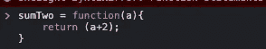

让我们把这个转换成 arrow 函数，我们要做的就是在参数和开始的花括号之间插入一个箭头，然后去掉 function 关键字。

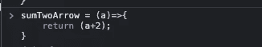

记住，函数表达式中不能同时有函数关键字和箭头。让我们也删除返回语句和花括号。

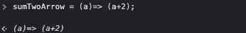

这是相当小的权利！，让我们更进一步，去掉所有的圆括号。

我们已将函数缩减为一行语句。很漂亮对吧！在结束定义部分之前，我们需要了解一些与箭头函数相关的附加规则。我们采取了许多步骤，删除了函数关键字，删除了返回关键字，花括号，然后圆括号，这是每次都适用吗？不，我们移除这些元素是有条件的。让我们看看那些。

1.  如果函数中有多个参数或者没有参数，我们需要指定一个圆括号，如果没有圆括号，我们会看到一个错误。

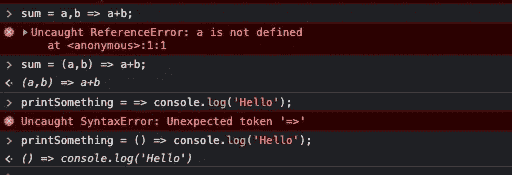

2.如果函数体中有多个语句，那么需要指定花括号和返回语句。如果我们不指定 return 语句，我们不会看到任何语法错误，但是我们会看到我们期望的值。

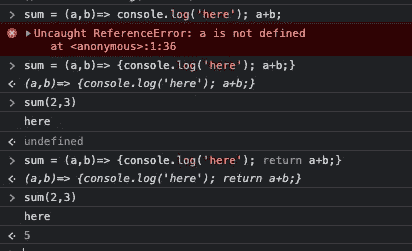

以上总结了我们对如何定义一个箭头函数的讨论，让我们继续讨论这个黑暗的秘密，好吗？

# 一些指示

箭头函数给等式带来了一些额外的功能或限制。在开始之前，理解相关元素的基本功能是很重要的。在每一点上，首先我们将探索元素的基本功能，然后箭头函数如何给它们带来变化。

## 箭头函数没有自己的绑定

这到底是什么意思？绑定到这个？在理解它之前，我认为理解它是什么，以及它在传统函数表达式中的功能是很重要的。
在 Javascript 中，这是指对象。它可以是当前对象，也可以是全局对象。在对象方法中，这指的是对象，在传统函数中，“这”指的是全局对象。让我们试着用一个例子来理解。

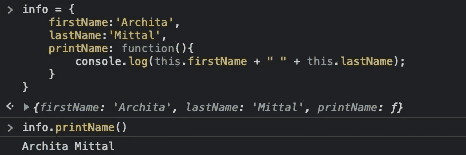

当我们在对象信息中使用它时，我们引用它(信息对象)。让我们看看箭头函数如何改变这里的行为。

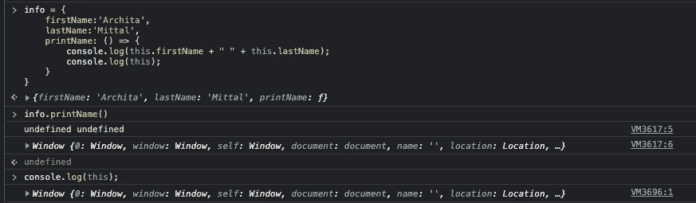

如果你看到，在定义' printName '函数为一个箭头表达式时，我们得到了两个变量的未定义。如果你看到我们也在打印“这个”,我们会看到什么？这个好像挺眼熟的，是不是窗口对象！
这就是我们所说的箭头函数没有自己的绑定。它们继承其父级的范围。这个“inside info”对象引用了 window 对象，这也是 printName 所继承的，因为它们不像传统表达式那样有任何作用域条件。因为全局对象无法访问“firstName”和“lastName ”,所以出现了错误。综上所述，传统函数有自己的上下文，而箭头函数继承了父函数的上下文。不要假设它总是全局对象，这是一个常见的误解，即箭头函数中的“this”是指全局对象，它继承了父对象的范围，如果父对象的范围是全局的，那么它就是全局的，否则不管父对象的范围是什么。不信！？让我们看一个例子。

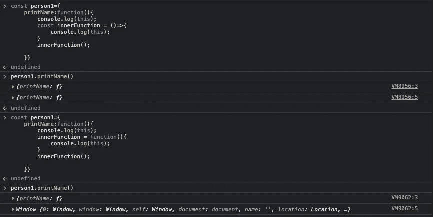

在第一个例子中，我们看到对于两者来说，printName 是一个传统的函数，它引用对象 person1，而 person 1 只包含 printName，但是 innerFunction 也是如此，因为它继承了父函数的范围。当这个内部函数被定义为传统函数时，我们看到它绑定到全局对象，这是引用全局对象范围的传统函数的预期行为。

# 调用、绑定和应用的不同行为

调用、绑定和应用也显示出与传统函数不同的行为。使用这些函数我们可以操纵这个在其他函数中使用的范围。

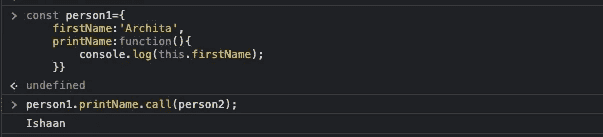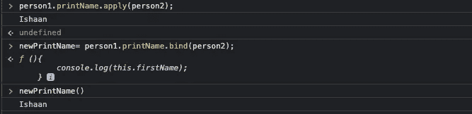

“call”让我们用传递的对象范围调用另一个对象的方法。“bind”返回一个绑定到传递的对象的方法。“应用”表现出与呼叫相似的行为。但是在箭头函数中能观察到类似的行为吗？嗯，从我们以前看到的情况来看，在这一点上很难达成一致。因为在一个对象的方法中指向窗口对象，这种行为在应用、绑定和调用中也会持续。

# 返回对象时要小心

到目前为止，我们已经看到了一种从 arrow 函数返回数据的非常简单直接的方法。让我们看一个例子。

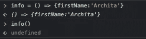

起初，这可能看起来令人困惑，因为我们正在按照书本做每一件事，并且仍然没有定义函数的输出。好吧，我们遗漏了一件事，如果我们从 arrow 函数返回对象文字，我们必须确保在 para streams 中包含相应的语句，否则这些值将被视为花括号中的语句，而不是对象文字。

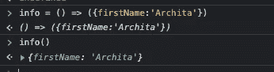

开始了。以上总结了我们对 arrow 函数的讨论，希望对您有所帮助。如果是，别忘了鼓掌。