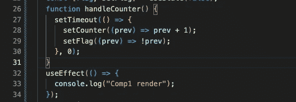
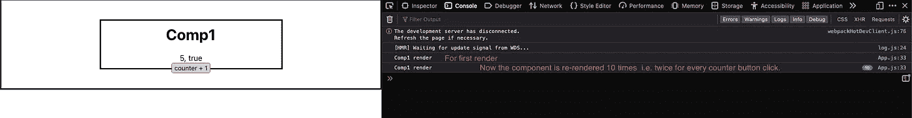

# 了解 React 18 中的自动批处理

> 原文：<https://blog.devgenius.io/understanding-automatic-batching-in-react-18-fb5b8fdf062d?source=collection_archive---------2----------------------->

在这篇文章中，我们将了解每个人都在谈论的 react 18 中的自动批处理，然后在后面的文章中，我们将讨论 react 18 中的一些其他功能，如新的 API 和新的流媒体服务器渲染器。

要理解这一点，我们首先要知道 react 17 在这方面的问题。

## react 17 中的问题:

为了理解这一点，我们将首先在 react 17 中创建一个 react 应用程序。

下面是用好的老 ReactDOM.render API 定义 app 的根的 app。

现在，在带有一些基本边框样式的 **App** 组件中，我们将创建一个新组件(comp1)。
我们将初始化组件“”中的两个状态。

一个是跟踪计数器，另一个是布尔值。

这段代码将为我们提供这样一个用户界面:

现在我们将在 comp1 组件中添加一个 useEffect 钩子，它将在每次组件渲染时记录控制台日志。

现在，在 comp1 ' *handleCounter* '函数中，您可以看到我们正在一个接一个地更新两个状态变量，并且我们知道每次更新一个状态时都会呈现一个 react 组件。但是在这种情况下，react 知道我们在同一个函数中更新状态。所以它会自动批处理两个状态更新，并且只重新呈现组件一次。

但是，如果我们必须在' *handleCounter* '函数中使用一些 web APIs 和接口，如 setTimeout 或事件侦听器，或者我们从 API 中获取一些数据，因此在' *handleCounter* '函数中使用了 Promise，在这种情况下，react 17 不会批量处理状态更新，因此会为每个状态更新重新呈现组件。

为了演示这一点，我们必须对我们的' *handleCounter* '函数进行一些更改。

我们用 0 毫秒的延迟将状态更新包装在 setTimeout 中。

现在，让我们看看这一变化的影响。

我希望你明白我们现在面临的问题。

在 react 17 的情况下，为了解决这个问题，我们必须手动将我们想要批处理的状态更新包装在 react-dom 提供的'*unstable _ batched updates*' API 的回调函数中。

## 我们在 React 18 中得到什么:

我们将首先在 react 18 中创建一个 react 应用程序。

在 react 18 中，我们使用'*react DOM . create root*' API，它会自动为我们批量更新所有状态。

首先，我们可以去掉' *React。strict mode*’。

然后，我们可以使用与上面相同的 App 和 comp1 组件继续前进。

这是结果…

所以现在我们可以看到 react 18 可以自动批处理应用程序中的每个状态更新，这意味着更少的渲染和更多的优化。

但是如果我们不想批量更新，我们可以使用由 react-dom 提供的 API。我们只需将我们的状态更新(一次一个)包装在 flushSync 的回调函数中，就这样，我们的状态更新现在不进行批处理。

## 结论:

通过所有这些讨论，我们可以总结出，react 18 将为我们批量处理状态更新，无论它是包含多个状态更新的简单函数，还是包含多个状态更新的 web API 和接口，如 setTimeout、fetch 或 promise。

谢谢你的时间😄