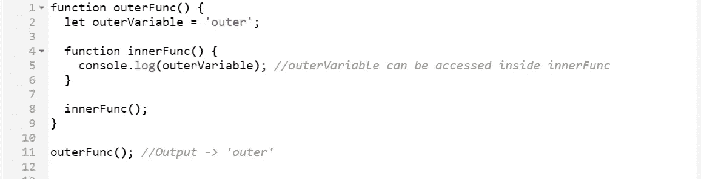
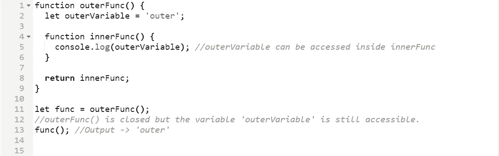

# 理解 Javascript 中的闭包

> 原文：<https://blog.devgenius.io/understanding-closures-in-javascript-2d9d09f97b4b?source=collection_archive---------5----------------------->

一个相当常见的 JS 面试问题，因为它无处不在。

阿诺·弗朗西斯卡在 [Unsplash](https://unsplash.com?utm_source=medium&utm_medium=referral) 上的照片

闭包的概念是 Javascript 中的基本概念之一，因为它无处不在。根据 MDN web 文档(参考文献中给出了链接)，**闭包是一个函数与对其周围状态(词法环境/作用域)的引用捆绑在一起(封闭)的组合。**换句话说**，**闭包是函数和声明该函数的词法环境的组合。在 JavaScript 中，闭包是在每次创建函数时创建的。这里有几件事情需要解开，主要是词法范围。词汇范围的概念本身就是一个面试问题。这里有一篇全面的文章来理解一般的作用域和词法作用域。当我们看这个例子的时候，我们会深入了解什么是词法范围，以及它与闭包有什么关系。

 [## JavaScript 中的词法范围——JS 中的范围到底是什么？

### 术语“词法范围”乍一看似乎很难理解。但是理解每个单词的意思是有帮助的…

www.freecodecamp.org](https://www.freecodecamp.org/news/javascript-lexical-scope-tutorial/) 

闭包的定义听起来比实际更复杂。简单来说，如果有两个函数，一个外部函数和一个内部函数，闭包基本上是让你从内部函数访问外部函数的作用域。因此，如果外部函数有某个变量，可以从内部函数中访问该变量。这可以用一个例子来更好的理解。

代码示例

首先，我们来看看什么是词法范围。根据我上面链接的文章，**词法范围是表达式的定义区域。换句话说，一个项的词法范围是该项被创建的地方。**以变量`outerVariable` 为例。`outerVariable` 的词法范围是它被创建的地方，也就是`outerFunc`。所以`outerVariable`的词法范围将是函数`outerFunc`的范围。类似地，函数`innerFunc`的词法范围也将是函数`outerFunc`的范围。当`innerFunc` 被创建时，一个闭包也随之创建，这使得`innerFunc`可以访问其词法范围内的所有属性。由于`outerVariable`在`innerFunc`的词法范围内，所以可以在`innerFunc`内部访问。

这里要注意的另一件重要的事情是，即使在父函数关闭之后，子函数(内部函数)也可以访问父函数(外部函数)的属性。

考虑稍有改动的同一个例子。

代码示例

这里，不是在`outerFunc`内部调用`innerFunc`，而是返回。现在，`outerFunc`返回`innerFunc`并且`innerFunc`正在尝试访问`outerVariable`，它存在于`outerFunc`中。理论上，问题是我们已经不在里面了。所以我们应该无法访问`outerVariable`。这就是闭包的魔力所在。 *func* 保存对函数`innerFunc`实例的引用，因为当`outerFunc`被执行时`innerFunc`被返回(第 11 行)。这个`innerFunc`实例维护了一个对其词法环境的引用，变量`outerVariable`存在于该环境中。因此，当调用`func`时(第 13 行)，变量`outerVariable`仍然可用。

这是理解闭包概念的一个简单例子。涉及到的所有术语可能会很棘手，但是当您查看代码示例时，事情会变得更清楚。

## 参考

 [## 闭包- JavaScript | MDN

### 闭包是一个函数的组合，它被捆绑在一起(封闭),并引用其周围的状态(…

developer.mozilla.org](https://developer.mozilla.org/en-US/docs/Web/JavaScript/Closures#lexical_scoping)  [## JavaScript 中的词法范围——JS 中的范围到底是什么？

### 术语“词法范围”乍一看似乎很难理解。但是理解每个单词的意思是有帮助的…

www.freecodecamp.org](https://www.freecodecamp.org/news/javascript-lexical-scope-tutorial/)