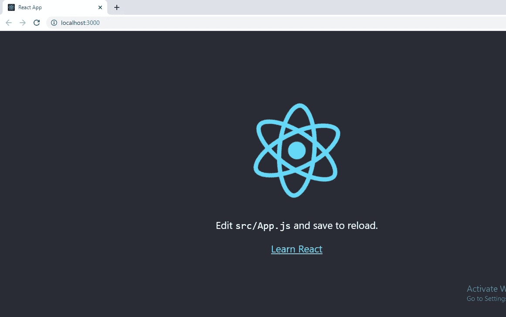
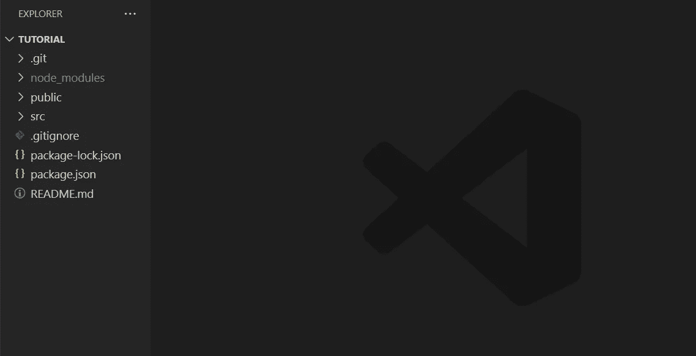
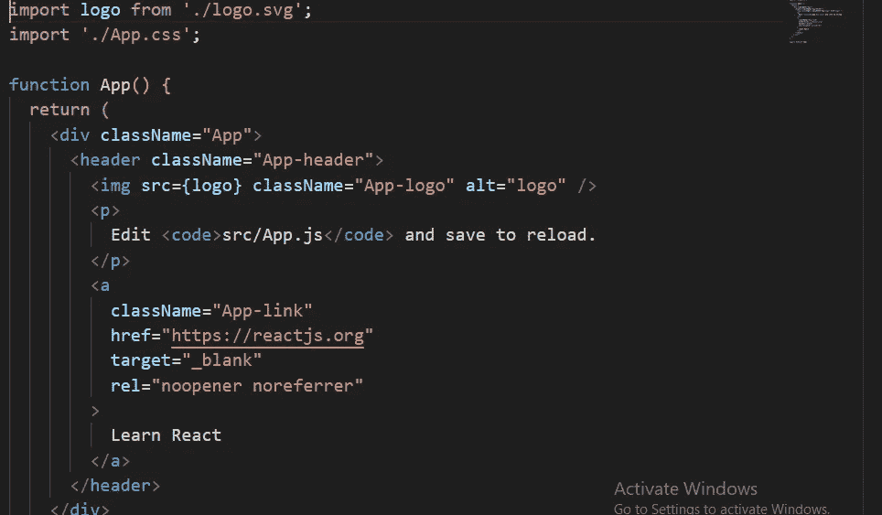

# 理解 ReactJS 中的组件(讨论了属性和状态，以及事件处理)

> 原文：<https://blog.devgenius.io/understanding-components-in-reactjs-props-and-state-discussed-with-event-handling-9f55ceedc344?source=collection_archive---------7----------------------->

在 React 中，组件是一个非常重要的讨论话题，React 开发人员了解如何在 React 中使用组件是至关重要的。组件是每个 React 应用程序的构建块，它们创建应用程序应该是什么样子的模板。因此，在 react 应用程序中，你看到的一切，从导航栏、侧栏到页脚，甚至主要内容本身都是一个组件。

在本文中，我们将讨论基本主题，如组件的状态和属性，组件的类型，因此在本文中，您将看到以下部分:

**概要**

1)什么是组件

2)功能组件

3)类别组件

React 组件中的状态和属性

5)类别与功能组件

**什么是组件**

每个 React 应用程序都是由组件组成的，你在典型的 React 应用程序中看到的一切都是组件。从导航栏、侧栏、页脚，甚至是主要内容，你看到的一切都是组件。可以说组件是 React 应用程序用户界面的每一部分。

在我们深入理解什么是组件之前，让我们创建第一个 React 应用程序。使用 create-react-app 包创建 React 应用程序有两种方法。第一种方法是使用以下命令在系统中全局安装 create-react-app 包

上面的命令将在您的系统中全局安装 create-react-app，所以您现在要做的就是使用下面的命令直接创建项目

其中上面的*项目名称*是您希望为 React 项目指定的相应名称。但是这个过程对于初学者来说并不是一个很好的方法，因为它有时可能会很棘手。例如，如果您应用这个过程，您将需要不断地更新 create-react-app 包。因此，让我们讨论下一种方法和全局安装软件包的替代方法。

不用全局安装 create-react-app 包，您可以使用 *npx* 来创建 react 应用程序，方法是运行

与 create-react-app 的全局安装相比，这种方法非常友好和直接。 *npx* 是一个 *npm* 包运行器，它允许我们直接运行包而不必安装它们，这解释了为什么我们可以用 create-react-app 包创建 React 项目，而不必先安装它。当我们安装 nodejs 时, *npx* 和 *npm* 都会安装在我们的系统中。因此，如果您的系统中正确安装了一个节点，那么您的系统中也应该有 *npm* 和 *npx* 。要检查系统中是否安装了节点，请运行

上面的命令将在您的系统中生成 node 的版本(如果您已经安装了一个的话)。但是如果您系统中没有安装 node，您将会收到一条错误消息。你可以从 nodejs.org 官方网站[这里下载 node，](https://nodejs.org/en/)记得总是下载最新版本。

现在您已经在系统中安装了 node，您可以继续运行以下命令来检查您是否安装了 *npx* 和 *npm*

和

分别是。这两个命令都会给出您所拥有的 npx 和 npm 的版本。

现在，您已经拥有了这个旅程所需的所有必要工具，让我们直接开始创建我们的第一个 React 应用程序。

为了创建我们的第一个 React 应用程序，我们必须进入命令提示符，然后导航到我们希望存储项目的目录。出于本教程的考虑，我希望 React 项目位于桌面上，所以我需要做的只是通过运行以下命令导航到桌面文件夹目录

这将把我们带到计算机的桌面，因此您应该会看到类似这样的内容:

现在，我们在桌面目录中，运行以下命令创建 React 应用程序

这里是我选择的 React 应用程序的名字。注意，如果您想选择其他名称作为项目名称，React 有一些严格的命名约定，您必须遵守。例如，命名项目文件夹时不能使用大写字母，因此不允许使用 camel case 命名约定，也不允许在两个单词之间插入空格，如果两个单词连在一起成为一个单词，则需要用小写字母一起使用，而不是作为单独的单词使用。还要注意，您必须在线才能正确创建 react 应用程序，因此您需要一个强大的互联网连接。满足这些要求后，现在可以继续运行*“npx create-react-app”*命令，后跟项目名称。这将需要几分钟的时间来完成，但是最后，您会看到命令行中显示一条成功的消息，以及一些关于如何运行该应用程序的说明。

如果您看到这条祝贺消息，那么您已经创建了您的第一个 React 应用程序。现在让我们尝试在浏览器中渲染它，看看它看起来怎么样。奔跑

在命令行上，如果您为 React 项目选择了*教程*名称或*“CD”*后跟您为应用程序选择的名称。这将把您带到 react 项目目录，现在您可以运行

在浏览器上显示您的项目。您应该会在浏览器中看到类似这样的渲染

您在这里看到的一切都是一个组件，默认情况下，它是由 React 开发人员的团队在名为 App.js 的组件文件中创建的，该文件位于 React 项目文件夹的 *src* 文件夹中。组件放在 JavaScript 文件中。因此，我们有了带有。js 扩展。你也可以有一个带有*的组件文件。jsx* 扩展，但是我们不打算在本教程中应用它。

让我们继续检查这个组件，以便更好地理解它。所以回到命令提示符下运行

要取消和停止 React application development server 的运行，将提示您回答一个问题，只需键入 y 并按 enter 键。现在在项目文件夹目录下运行

这将在您选择的任何代码编辑器中打开 React 项目。对于本教程，我们将使用 VScode。因此，它将在 VScode 编辑器中打开，您应该会看到类似下面这样的内容

这是我们的项目文件结构。在里面，你可以看到我们有几个文件和文件夹，但我们现在对它们不感兴趣，我要你做的是转到 *src* 文件夹，打开它。在其中，您会看到一些文件，如 App.js 文件、App.test.js 文件、index.js 文件、index.css 文件等。所有这些文件都有其不同的功能，但目前我们对它们不感兴趣，我们需要的是 App.js 文件，因此打开它，您应该会看到如下所示的内容:

这是我们第一个组件。它是在我们创建 React 应用程序时自动创建的。你在这里看到的一切都是我们在浏览器上显示的。你可以在这里看到我们浏览器里的一些文字，比如“学习反应”。如果您向下移动一点，您会注意到 App 函数(我们的组件)是如何导出的。这一点很重要，因为稍后必须将其导入 index.js 文件并进行渲染，以便可以在浏览器中显示。在 React 中创建组件有两种方法。您可以使用任何 JavaScript 函数创建一个组件，它被称为功能组件，或者您可以使用 ES6 类创建一个组件。这被称为类组件。默认情况下，在每个 react 应用程序中创建的第一个组件是功能组件。从上面的例子中可以看出，我们将在下面的两个部分中讨论这两种方法。因此，只需清除应用程序组件的 return 语句中的所有内容，您的代码应该如下所示

**功能组件**

到目前为止，我们已经创建了我们的第一个 React 应用程序，我们已经看到了我们的第一个组件，尽管它不是由我们创建的。现在让我们看看如何创建组件。首先，我们将创建一个功能组件。

React 中的一个功能组件只是一个 JavaScript 函数，它接受在浏览器中呈现为描述用户界面的 HTML 的属性。这些属性通过一种叫做 JSX 的东西传递到组件中。

JSX 是 JavaScript XML 的缩写，是一种 JavaScript 语法扩展，允许 React 开发人员编写看起来像 HTML 但不是 HTML 的代码，然后将它们作为属性传递给组件。如果你在 App.js 文件中查找 App 组件，你会看到一些看起来像 HTML 的代码，但它们不是，它们是 JSX。

虽然你会看到一些标签，如 div 标签，h1 标签，p 标签，JSX 是非常不同于 HTML 的。例如，在 HTML 中，如果你想给一个标签一个类，你可以使用" class "属性，但是在 JSX 中，如果你想给一个标签一个类，你可以使用 *"className"* 属性，而且它必须在 camel 中。同样，JavaScript 代码可以直接写入 JSX，也就是说，您可以创建一个简单的 JavaScript 变量，并将其传递给 JSX，以显示其值。有如此多的差异，但如果有机会，我们会在进展中谈论它们。

首先，在创建我们的功能组件的过程中，让我们在 *src* 文件夹中创建一个文件，并将其命名为“functional.js ”,这是我选择的名称，您可以随意命名。因此，在 functional.js 文件中，我们将创建我们的功能组件，它将在浏览器中呈现。首先，我们将从“react”导入“React”。如果您使用 React 版本 17 及更高版本，您可以决定跳过这一部分，但为了正确的程序，我决定将它包括在内。接下来，我们将创建一个 JavaScript 函数，这个函数可以是任何类型，您可以决定使用 ES6 arrow 函数，但是现在，我使用普通的 JavaScript 函数。在这个函数中，我们将传递一些 HTML 或者更好的 JSX 来显示在浏览器中。在我们的例子中，它仅仅是“Hello world！”。因此，在“functional.js”文件中写下以下代码行:

但是等一下，如果你保存文件并移动到浏览器，你会发现你还没有“Hello world ”,这是因为我们的组件文件根本没有连接到应用程序的其余部分。因此，要将我们的组件文件连接到应用程序的其余部分，我们必须从中导出组件，将其导入 App.js 文件，然后最终将其呈现到 DOM。首先，通过在 functional.js 文件下添加以下代码行，用 export 关键字导出 Greet 组件

因此，您的代码看起来很像这样:

接下来移动到 App.js 文件，并像这样导入 Greet 组件:

请注意，在引用组件文件时，不需要添加。js 扩展名，你只需要使用文件名。因此，现在您可以通过将组件作为应用程序函数中的 Html 标记返回来将组件呈现给 DOM，如下所示:

注意，这里我们使用了一个自结束标记，但是如果你想在组件标记之间写一些东西，你可以使用开始和结束标记。因此，总的来说，App.js 文件中的代码将如下所示，并添加了这两行代码

现在，如果您同时保存 App.js 文件和 functional.js 文件，您应该会看到浏览器中显示“Hello world ”,如下所示。

这样，你就创建了你的第一个功能组件。在我们结束这里的工作时，我希望您注意两件事。首先，请注意我们是如何使用默认方法导出组件的，在导出组件时，我们可以应用两种不同的方法，无论是功能组件还是类组件。第一种是默认导出，我们刚才已经这样做了，第二种是通过命名方法导出。要按名称导出组件，您所要做的就是在创建组件之前，在组件名称后面添加导出。因此，在我们的代码中，我们没有在组件下面添加导出代码行，而是在创建组件之前添加 export 关键字，然后通过将组件放在一对花括号内将其导入 App.js 文件中。因此，清除 functional.js 文件中的导出代码行，并添加 export 关键字，如下所示:

现在转到 App.js 文件，并在导入它的“Greet”组件周围包含一对花括号，您的导入代码现在应该如下所示:

最后，您现在可以保存文件并检查浏览器，您应该仍然会看到“Hello world”。

我想让你注意的第二件事是，我们在创建组件时使用了自定义 JavaScript 函数，如果我们愿意，你也可以使用 ES6 arrow 函数，你会得到相同的结果。

**类组件**

正如我们在功能组件中看到的，我们也可以使用 ES6 类在 React 中创建一个组件。类组件在某些方面与功能组件非常不同，但是我们将在本文稍后讨论 React 中的属性和状态时讨论这一点，但是现在，让我们专注于创建类组件。首先，让我们创建一个文件，并再次将其命名为“ClassComp.js ”,这只是我为本教程选择的一个名称，所以您可以随意命名。

因此，在 ClassComp.js 文件中，我们将导入两件事情，首先，我们将导入 React，然后接下来我们将从 React 导入组件类。然后创建一个 ES6 类，该类将扩展 React 组件类。要将属性传递到我们的类组件中，我们必须创建一个 render 方法，该方法返回 null 或一些 JSX，在我们的示例中，我们希望传递“Welcome Gang ”,然后在将组件导入 App.js 文件并呈现它之前导出组件。因此，在刚刚创建的 ClassComp.js 文件中写下以下代码:

现在转到 App.js 文件，添加以下代码行

因此，您的 App.js 文件现在应该是这样的

如果您保存这两个文件并检查浏览器，您应该看到“Hello world”和“Welcome gang”显示。现在，这就是如何在 React 中创建一个类组件。另外，记住总是使用 extends 关键字从 React 扩展组件类，并且不要忘记导入 React 和组件类。

**反应组件中的道具和状态**

作为开发人员，您应该了解组件的一个重要特性是组件是可重用的，也就是说，您可以创建一个组件，传入您想要的任何 JSX，并将其包含在应用程序的任何部分中。左侧导航也可以用作右侧导航。例如，假设我们想要重用欢迎组件，也就是说，我们想要在浏览器中多次呈现欢迎组件中的 JSX，我们所要做的就是在我们呈现它的应用程序组件中复制欢迎组件。但是像这样的情况并不那么有用，让事情变得更有趣的是，我们能够在组件的每个实例中传递我们想要问候的人的名字，而不是一遍又一遍地问候特定的人。这就是 props 的用武之地，props properties 的缩写是一个用户定义的组件可以接受的可选输入，这个可选输入允许组件是动态的。

为了理解道具是如何工作的，我们将一个接一个地使用类和功能组件。所以，让我们从类组件开始。

我们要做的是传递一个名称，该名称将显示在 welcome 组件的每个实例中，因此，我们希望显示不同的内容，而不是每次呈现 Welcome 组件时都有一个 welcome gang，为了实现这一点，我们将首先向呈现 Welcome 组件的每个实例传递一个 name 属性，然后将该属性作为 prop 传递到 Welcome 组件中。在之前呈现 Welcome 组件的 App 组件中，分别添加 name 属性以及“student”、“neighbor”和“Gang”的值，如下所示:

这样，我们就可以在 Welcome 组件中使用 name 属性作为道具，包括构造函数并调用其中的 super 函数，这将帮助我们调用 *this.props* 方法，因此回到 Welcome 组件中，清除 return 语句中的内容并进行以下修改:

如果您保存 App.js 文件和 classComp.js 文件并打开浏览器，您应该会看到显示“欢迎学生”、“欢迎邻居”和“欢迎帮派”，这样我们就成功地重用了 Greet 组件来问候所有三个人。该方法与功能组件的方法非常相似，唯一的区别是功能组件在访问 props 时不使用“this”关键字。让我们看看功能组件的例子。在 app.js 文件中复制 Greet 组件，为每个组件添加 name 属性，并为您要问候的人的姓名赋值，如下所示:

然后，我们必须在 Greet 组件中将 prop 作为参数传递，然后使用 prop 在浏览器中显示每个名字。因此，在 Greet 组件中，修改您的代码，如下所示:

不要忘记导出 Greet 组件，因此，如果您保存这两个文件并检查浏览器，您应该看到“我问候了 Brue”、“我问候了 Bishop”和“我问候了 Clara”。请注意，在上面的代码中，我们使用 props 名称将 prop 作为参数添加到 Greet 组件中，但是您可以使用您喜欢的任何名称来访问它，但是请记住始终使用您在参数中给定的名称来访问它。

这就是我们在功能组件中使用道具的方式。请注意，属性不一定总是“名称”，它可以是您想要的任何内容。您所要做的就是使用您所调用的名称来访问这些属性。

我们已经看到了如何使用单个组件来处理 props 并在浏览器上显示动态值，但是如果我们希望根据用户与应用程序的交互来显示不同的内容呢？那么，在这种情况下，使用道具将不会有帮助，这是因为道具是不可变的，不能在组件内修改，这就是使用状态发挥作用的地方。状态是我们可以用来影响应用程序 UI 的第二种方式，组件的状态是在组件内部管理的，并且是可变的，也就是说可以在组件内部改变。功能组件中的状态被声明为函数体内的变量，因为状态是由组件管理的，所以组件具有改变其状态的完全控制权。状态的使用在类组件和函数组件中也是不同的，我们将从类组件开始，分别研究每种情况。因此，在 Welcome 组件中，让我们清除 return 语句中的内容，并在构造函数中定义一个状态，注意，构造函数是唯一可以在类组件中直接定义状态的地方。我们将定义一个状态名，然后在 return 语句中返回该状态的值。因此，将欢迎组件的代码修改为如下所示:

如果你保存文件，你会看到“欢迎克兰西”显示三次。我们可以通过点击按钮来改变浏览器中显示的内容。要做到这一点，我们只需声明一个 Onclick 事件处理程序来更改组件的状态，并将其分配给按钮标记中的 onClick 属性，因此在 render 方法之前添加下面的代码来定义 onClick 事件处理程序:

下一步是侦听该事件并执行必要的更改，因此创建一个按钮标记，并在按钮标记和 onClick 属性中侦听该处理程序

记住在开始和结束 div 标签中添加按钮标签，这是因为您需要在单个 div 标签中包含多个 JSX 代码。

如果您保存文件并打开浏览器，您会看到 Welcome 组件的每个项目现在都有一个按钮，单击每个按钮时，消息会从“欢迎 Clancy”更改为“欢迎未知”。

这就是我们如何通过使用状态来修改应用程序的 UI 并与之交互。嗯，功能组件中状态的使用和类组件中的有点不同。在一个功能组件中，你需要使用“useState”钩子，并将状态声明为一个变量，让我们用一个例子来试试。回到 Greet 组件，添加下面的代码以从 react 导入 useState 挂钩:

在 return 语句之前，要定义状态和更改状态的方法，请添加以下代码:

现在，您必须在 JSX 中返回状态，然后在按钮元素中，您需要包含一个 onClick 事件，该事件将设置人名。但是这一次，我们已经创建了设置组件状态的方法(setName ),所以我们现在需要做的就是在 onClick 事件中传递这个方法，并在其中设置一个值。返回状态并用下面的代码定义 set state 方法:

如果你保存文件并打开浏览器，你会发现“我问候罗斯”出现了三次，点击每一个按钮，信息都会变成“我问候卢卡斯”。这样，我们可以直接从浏览器中与应用程序的状态进行交互。

**类组件 vs 功能组件**

现在，您已经了解了 React 中的组件，并且了解了如何创建函数组件和类组件，我知道您可能会问自己，这两个组件之间有什么区别，以及何时应该使用其中一个组件。好吧，我将在这一节中谈到这一点，但我应该让你知道，我们将在这里谈到的一些事情我们没有在本文中涉及，但不要担心，我将很快发布一篇文章来讨论它们。

I)功能组件只是接收属性并返回声明的 JavaScript 函数，而类组件是可以拥有并维护其私有属性(也称为状态)的 ES6 类。尽管通过使用钩子，功能组件可以有它们的状态

ii)在功能组件中，您不需要使用“this”关键字，而在类组件中，“this”关键字是访问道具所必需的

iii)功能组件有时被称为无状态或哑组件，但是随着最近钩子的引入，这样说就不合适了。

尽管类组件包含了更多的特性，我还是建议你尽可能地使用功能组件，因为你不会因为使用“this”关键字而感到困惑，这在大多数情况下是很棘手的

**结论**

React 用于创建单页面应用程序，但是如果您想使用 react 创建多页面 web 应用程序，您可以借助我们称之为路由的工具来实现。我们将在随后的文章中讨论这个问题，但这是我们目前关于组件的全部内容。组件是你在 React 应用程序的 UI 中看到的一切，如果你能理解 React 组件的基本操作，那么你就可以开始了。

因此，在本文中，我们能够涵盖 React 中的组件是什么，我们创建了我们的第一个 React 应用程序，在其中我们探索了不同的文件和文件夹。我们还讨论了函数组件和类组件，并研究了它们之间的相似之处和不同之处。

我们还看了一下 props 和 state，以及它们在类和函数组件中是如何工作的，在这里我们看到了钩子的使用，我们还没有讲到。

非常感谢您跟进这一点。如果这篇文章对你有帮助，请发表评论，如果你有任何问题，请提出来。