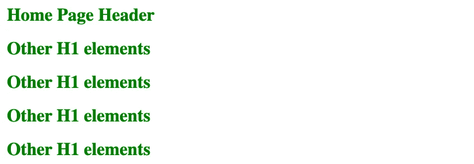
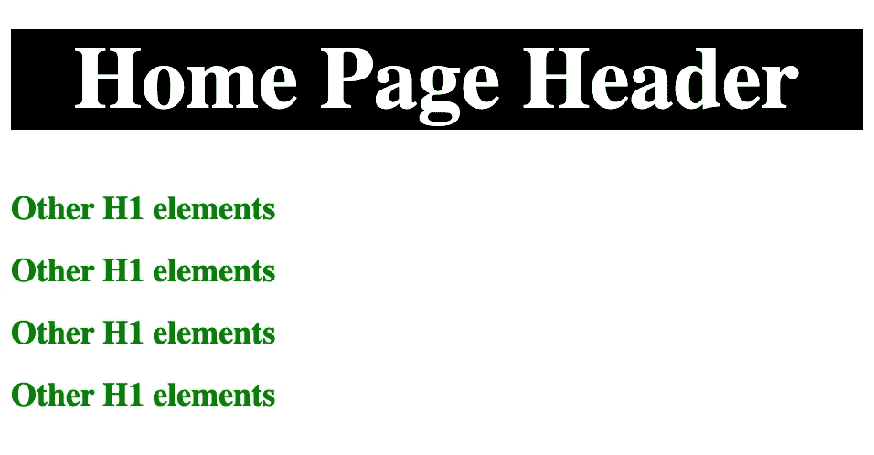
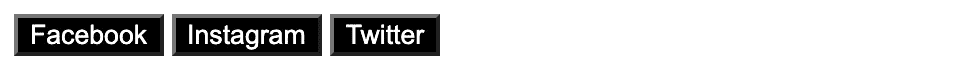
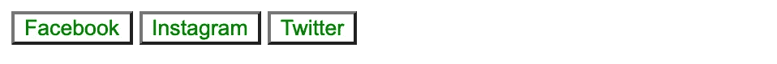
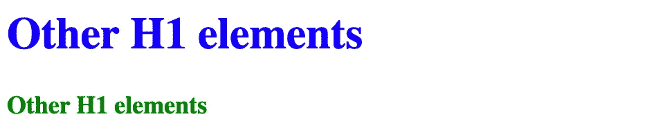
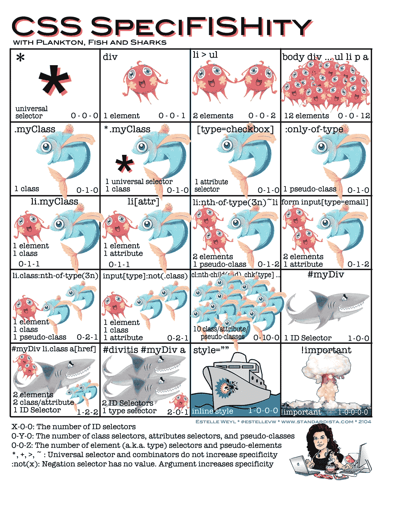

# 理解 CSS 特异性

> 原文：<https://blog.devgenius.io/understanding-css-specificity-ca5a747d94e1?source=collection_archive---------5----------------------->


Branko Stancevic 在 [Unsplash](https://unsplash.com/s/photos/css-specificity?utm_source=unsplash&utm_medium=referral&utm_content=creditCopyText) 上拍摄的照片

# WCSS 是什么？

> 层叠样式表是一种用来设计网页样式的语言。CSS 在描述 HTML 元素如何在台式机、笔记本电脑、平板电脑、手机或任何其他媒体的屏幕上显示方面起着至关重要的作用。

> 现在我们来谈谈 **CSS 特异性**

顾名思义，**特殊性**是指“属于或与某一特定主题唯一相关的性质”[牛津语言](https://languages.oup.com/google-dictionary-en/)。通过将**特异性的定义与 CSS** 相结合，我们可以参考 CSS 声明的得分或权重来决定将哪种样式应用于元素。

分数或权重基于匹配选择器中每个选择器类型的数量。以下是具有特异性的选择器类型列表，按升序排列:

1.  [类型选择器](https://developer.mozilla.org/en-US/docs/Web/CSS/Type_selectors)(如`h1`)和伪元素(如`::before`)。
2.  [类选择器](https://developer.mozilla.org/en-US/docs/Web/CSS/Class_selectors)(如`.example`)、属性选择器(如`[type="radio"]`)和伪类(如`:hover`)。
3.  [ID 选择器](https://developer.mozilla.org/en-US/docs/Web/CSS/ID_selectors)(例如`#example`)。
4.  样式属性又称为内联样式(如`style="color: red;"`)总是覆盖外部样式表中的任何样式(具有最高特异性的*)。*

> ***注**:通用选择器(`[*](https://developer.mozilla.org/en-US/docs/Web/CSS/Universal_selectors)`)、组合子(`[+](https://developer.mozilla.org/en-US/docs/Web/CSS/Adjacent_sibling_combinator)`、`[>](https://developer.mozilla.org/en-US/docs/Web/CSS/Child_combinator)`、`[~](https://developer.mozilla.org/en-US/docs/Web/CSS/General_sibling_combinator)`、 ['](https://developer.mozilla.org/en-US/docs/Web/CSS/Descendant_combinator) 、 ['](https://developer.mozilla.org/en-US/docs/Web/CSS/Descendant_combinator) 、`[||](https://developer.mozilla.org/en-US/docs/Web/CSS/Column_combinator)`)和否定伪类(`[:not()](https://developer.mozilla.org/en-US/docs/Web/CSS/:not)`)对特异性没有影响。*

*C **特异性最高的 SS 获胜！！！***

*让我们举个例子，在我们的博客网站上有多个 H1 元素，下面的 CSS 使用类选择器来应用。*

**H1 元素*:*

```
*<h1 class="header">Home Page Header</h1>
<h1 class="header">Other H1 elements</h1>
<h1 class="header">Other H1 elements</h1>
<h1 class="header">Other H1 elements</h1>
<h1 class="header">Other H1 elements</h1>*
```

**带有类选择器的 CSS:**

```
*.header {
    font-size: large;
    color: green;
}*
```

**输出:**

**

*所有 H1 元素具有相同的类样式*

*但现在我们的 UX 建议应用 style 来区分主页上的 header 元素，即**font-size:XXX-large；文本对齐:居中；颜色:白色；背景色:黑色；***

*为了解决这个问题，我们可以使用特殊性规则，并使用比类选择器优先级更高的 id。*

**H1 元素*:*

```
*<h1 class="header" **id="hpHeader"**>Home Page Header</h1>
<h1 class="header">Other H1 elements</h1>
<h1 class="header">Other H1 elements</h1>
<h1 class="header">Other H1 elements</h1>
<h1 class="header">Other H1 elements</h1>*
```

**带有类和 id 选择器的 CSS:**

```
*#hpHeader {
    font-size: xxx-large;
    text-align: center;
    color: white;
    background-color: black;
}.header {
    font-size: large;
    color: green;
}*
```

**输出:**

**

*通过 id 选择器应用的主页标题元素样式*

*L*

*另一个场景，我们有一个博客网站，在我们的主页上有社交媒体按钮，如脸书、Instagram、Twitter 等。当我们将多个选择器应用于这些社交媒体按钮时，将应用最后读取的选择器。因此，CSS 的顺序在这里很重要。*

**按钮:**

```
*<button class="socialMedia">Facebook</h1>
<button class="socialMedia">Instagram</h1>
<button class="socialMedia">Twitter</h1>*
```

**带单选择器的 CSS:**

```
*.socialMedia {
    text-align: center;
    color: white;
    background-color: black;
}*
```

**输出:**

**

*社交媒体按钮样式*

*如果我们应用另一个具有相同名称的选择器，如下所示:*

```
*.socialMedia {
    text-align: center;
    color: white;
    background-color: black;
}
.socialMedia {
    text-align: center;
    color: green;
    background-color: white;
}*
```

*因此，根据顺序，最后一个选择器将应用于按钮元素。*

**输出:**

**

*我是明显的赢家！！！*

*在应用 CSS 的不同方式中，内联风格是明显的赢家，比如在 head 标签中，或者使用 class/id 选择器或外部 CSS 文件。内联样式是针对单个元素编写的，不会应用于任何其他元素。因此，在定义应用哪种样式时，这种样式是最具体的，并且得到最高的分数/权重。*

*让我们看一个例子，我们有两个 H1 元素，两个都有类选择器样式，只有一个元素应用了内联样式。*

**H1 元素:**

```
*h1 {
    font-size: large;
    color: green;
}*
```

**CSS:**

```
*<h1 class="header" style="font-size: xx-large; color: blue;">Other H1 elements</h1><h1 class="header">Other H1 elements</h1>*
```

**输出:**

**

*首款直列式 H1*

*H **帮助指定***

*下图提供了一个非常好的视觉表现，有助于理解 CSS 的视觉特性。如果需要的话，该网站还提供了 PDF 版本的图表供下载。*

**

*照片由[https://specifishity.com/](https://specifishity.com/)拍摄*

*R参考文献*

*   *[https://developer . Mozilla . org/en-US/docs/Web/CSS/specification #规范](https://developer.mozilla.org/en-US/docs/Web/CSS/Specificity#specifications)*
*   *[https://www.w3schools.com/css/css_specificity.asp](https://www.w3schools.com/css/css_specificity.asp)*
*   *[https://www.w3.org/TR/selectors-3/#specificity](https://www.w3.org/TR/selectors-3/#specificity)*
*   *[https://specifishity.com/](https://specifishity.com/)*

*U **直到下次***

*希望这篇文章对你有用，感谢你阅读它。如果您有任何反馈，也请分享。*

*我在@buymeacoffee 上。如果你喜欢我的作品，你可以给我买一幅☕，分享你的想法🎉[https://www.buymeacoffee.com/nikhilwali2](https://www.buymeacoffee.com/nikhilwali2)*