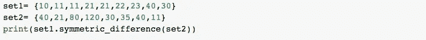

# 理解 Python 中的数据结构

> 原文：<https://blog.devgenius.io/understanding-data-structures-in-python-c7ca8cf80d97?source=collection_archive---------6----------------------->

Python 是数据科学中必不可少的编程语言。它为我们提供了不同的功能和库，以我们认为合适的方式操作数据。为了实现这一点，需要高效地存储数据并实时访问数据。为了实现这一点，Python 编程为我们提供了数据结构。

对数据结构的良好理解对于编程和数据分析非常重要。作为一名数据分析师，您将经常操作数据，因此对数据类型及其结构的深入理解将有助于您编写高效的代码。

**什么是数据结构？**

数据结构是以不同方式组织和分组数据类型的容器。它允许您组织数据，使您能够存储数据集合，关联它们，并相应地对它们执行操作。

**数据结构的类型**

这些是 Python 内置的数据结构，它们使编程更容易，并帮助程序员使用它们更快地获得解决方案，它们如下

LISTS

它是 Python 中的一种数据结构，是可变的有序元素序列。列表是用方括号定义的，并且总是包含用逗号分隔的其他数据。该数据可以是任何数据类型的混合。

列表是有序的，因此它们有分配给列表中每个元素的地址，这被称为索引。索引值从 0 开始，一直到最后一个元素，这称为正索引。还有负索引，它从-1 开始，使我们能够从最后到第一个访问元素。

*   **创建列表:**

要创建列表，可以使用方括号并相应地声明数据或元素。如果元素没有传入方括号中，它将返回一个空列表。

创建列表

**输出:**

*   **索引**:如前所述，列表地址被分配给每个元素。索引允许我们访问列表中的每个元素。

列表中的索引

**输出:**

*   **添加和删除元素**:可以在列表中添加或删除元素。

在列表中添加元素

**输出:**

**删除一个元素**:

删除列表中的元素

*   **切片符号**:这仅仅意味着使用索引来切片列表中的部分元素。

**输出:**

在本例中，下限(0)被包括在内，而上限(3)被排除在外。

**【:3】**从头开始切片，即零索引**【周一】**然后停在索引**【3】**，记住:上界除外。而[3:]从索引**【3】**即**【星期四】**开始切片，并继续到列表的末尾。

**访问列表数据结构的其他方法有**:

**len()** —返回列表中元素的个数。

**max()** —返回列表中最大的元素。最大元素取决于数据类型。数字列表中的最大元素是列表中的最大数字。，而字符串列表中的最大元素是列表按字母顺序排序时最后出现的元素。

**min()** —是 max()的反义词

更多关于[**的列表及其方法**](https://docs.python.org/3/library/stdtypes.html#list)

Tuples

它是一个 Python 数据结构，用于存储相关的信息，如经度、纬度、维度等。它们是不可变的、有序的元素序列。它们类似于列表，在列表中它们是有序的，并且可以通过它们的索引来访问，但是与列表不同，元组是不可变的。也就是说，不能添加或删除它们。

注意:如果一个可变数据类型在一个元组中，那么只有在元组数据可以被改变的时候。

**输出:**

**type()** 告诉我们元素的数据类型。在元组中，定义元组时括号是可选的。如果括号不能阐明代码，程序员就省略它们。

元组使用 **"+"** 添加元素。

**输出**:

更多关于 [**元组及其方法**](https://docs.python.org/3/c-api/tuple.html#)

ST42ets

集合是唯一的无序元素的容器。可以从列表中创建集合，因为它们是唯一的元素，所以它们会删除列表中包含的重复元素。它们类似于我们在数学中学习的集合，算术集合与这里的运算符相同。

*   **创建集合:**使用花括号或花括号创建集合，并将元素传递给它们。

**输出:**

集合是唯一的值，请注意，重复的元素已被删除，而且因为它们没有排序，所以它们不是分配给元素的地址。

*   **添加和删除元素:**

要将元素添加到集合中，需要使用 add()函数并传递值。

在集合中添加元素

输出:

***【pop()】***用于从集合中移除随机元素，由于它不是有序的，你可能不知道哪些元素会被移除。

从集合中删除元素

*   **成套操作:**

***【union()***:顾名思义就是将两个集合中的数据进行组合。

**输出:**

***【交集()*** :此方法查找两个集合中的公共数据。

**输出:**

***difference()*** :返回两个集合的差值。这仅仅意味着它返回第一个集合中不包含在另一个集合中的数据。

**输出:**

***symmetric _ difference()***:这个方法和 difference()类似，只是去掉了两个集合中的公共数据，返回剩下的数据。

**输出:**

**注**:在示例中，删除了重复值。只返回了一个，记住集合是唯一的元素。

更多关于 [**集合及其方法**](https://docs.python.org/3/c-api/set.html)

D强音:

字典被定义为一系列的键，用冒号标记并用逗号分隔的值对。字典是无序和可变的(键是不可变的，但值是可变的)。

**创建字典**:它们可以使用花括号{}或使用 dict()函数来创建。创建字典时，必须添加键值。

示例:

**输出:**

**添加和更改键、值对**:字典通过键访问，可以添加和更改值。我们可以使用键值对来访问元素。

***添加数值***

**输出:**

**改变数值:**

**输出:**

**删除键，值对 *:*** 删除值，字典使用 pop()函数。

***删除/移除数值*** :

**输出:**

## 访问元素

您只能使用键来访问元素。您可以使用 get()函数或者只传递键值，然后您将检索这些值。

**输出:**

## 其他功能

您有不同的函数，这些函数根据相应的 keys()、values()、items()函数向我们返回键或键-值对的值。

**输出:**

更多关于 [**字典及其方法**](https://docs.python.org/3/c-api/dict.html)

这些是 Python 编程中常用的主要数据结构。希望这些解释对你有帮助。如果你有任何问题，请放下你的问题。