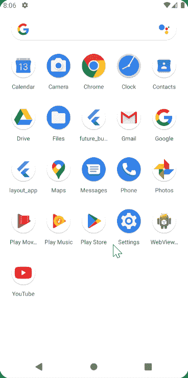

# 了解颤振中的未来建筑

> 原文：<https://blog.devgenius.io/understanding-futurebuilder-in-flutter-491501526373?source=collection_archive---------3----------------------->

## 因为您的构建方法不能是异步的


Emile Perron 在 [Unsplash](https://unsplash.com?utm_source=medium&utm_medium=referral) 上的照片

在这篇文章中，我们将看看 Flutter 中的 FutureBuilder 小部件。在我们开始之前，让我们后退一步，了解一下 Flutter 的未来，以及如何使用异步编程。

# 异步编程

在其最基本的形式中，异步方法允许程序在等待另一个操作完成时继续执行。这不同于同步编程，在同步编程中，操作会阻止其他操作执行，直到它完成。这些例子有:

*   通过网络获取数据(想想无限滚动)
*   数据库操作
*   文件输入输出操作

如果你以前使用过 JavaScript，你会熟悉 [*承诺*](https://developer.mozilla.org/en-US/docs/Web/JavaScript/Reference/Global_Objects/Promise) *的概念。*在 dart 中，我们有 Future 类，并使用 async 和 await 关键字。借助 ECMAScript 2017 规范，async/await 模式也可用于 JavaScript 以及 C#等其他编程语言。

在本文中，我们将制作一个简单的联系人列表应用程序，并模拟使用 FutureBuilder 异步加载列表。

# 第一部分

在我们开始研究如何使用 FutureBuilders 之前，让我们先完成一些任务，比如制作模型、UI 和创建一些虚拟数据。

## 模型

首先，让我们定义我们的*联系人*模型。为了简单起见，我们将采集有限的数据。

```
*class* Contact {
  *final* String firstName;
  *final* String lastName;
  *final* String imageUrl;
  *final* String phone;

  Contact({
    *this*.firstName,
    *this*.lastName,
    *this*.imageUrl,
    *this*.phone,
  });
}
```

## 联系卡

完成后，让我们为联系人卡片创建一个 UI:

```
*import* 'package:flutter/material.dart';
*import* 'model/contact.dart';

*class* ContactCard *extends* StatelessWidget {
  *final* Contact contact;

  ContactCard(*this*.contact);
  @override
  Widget build(BuildContext context) {
    *return* Container(
      padding: *const* EdgeInsets.symmetric(horizontal: 10),
      decoration: BoxDecoration(
        border: Border(
          bottom: BorderSide(
            color: Colors.*grey*[500],
            width: 0.5,
          ),
        ),
      ),
      child: Row(
        crossAxisAlignment: CrossAxisAlignment.center,
        children: [
          Container(
            padding: *const* EdgeInsets.only(top: 10, right: 15, bottom: 10),
            child: ClipOval(
              child: Image.network(
                contact.imageUrl,
                width: 50,
                height: 50,
              ),
            ),
          ),
          Expanded(
            child: Column(
              crossAxisAlignment: CrossAxisAlignment.start,
              children: [
                Text('${contact.firstName} ${contact.lastName}'),
                SizedBox(height: 2),
                Text('${contact.phone}'),
              ],
            ),
          ),
          Row(
            mainAxisSize: MainAxisSize.min,
            children: [
              Icon(
                Icons.*create*,
                color: Colors.*grey*[600],
              ),
              SizedBox(width: 15.0),
              Icon(
                Icons.*message*,
                color: Colors.*grey*[600],
              ),
              SizedBox(width: 15.0),
              Icon(
                Icons.*call*,
                color: Colors.*grey*[600],
              ),
            ],
          ),
        ],
      ),
    );
  }
}
```

## 虚拟数据

关于虚拟数据，请参考[虚拟数据. dart](https://github.com/stef0296/future_builder/blob/main/lib/dummy-data.dart) 文件。现在，我们已经完成了与创建数据和部分 UI 相关的次要任务，让我们开始手头的主要任务，即构建显示联系人的 ListView。

# 第二部分

现在我们已经完成了应用程序的所有构建模块，让我们把它们放在一起，看看我们的应用程序是什么样子的。

来源: [Giphy](https://giphy.com/gifs/Bi6FcO7UoutWM)

现在让我们从定义我们的未来开始，这将获取我们的联系人数据。

```
Future<List<Contact>> _getContacts() async {
  List<Contact> contacts = dummyData;
  await Future.delayed(Duration(seconds: 10));
  return Future.value(contacts);
}
```

我们从前面定义的虚拟数据中获取联系人。在下一行中，您将看到我使用了 Future.delayed()方法。这可用于在定义的时间内暂停代码执行。这有助于我们模拟从服务器获取数据时通常会观察到的缓冲区。完成延迟值后，我们使用 Future.value()方法返回联系人列表。

接下来要做的是定义一个变量，这个变量将包含我们刚刚定义的未来。

```
Future<List<Contact>> _contacts;
```

我们将我们的 *_getContacts()* 未来分配给 initState()中的 *_contacts* 变量。

```
@override
void initState() {
  super.initState();
  _contacts = _getContacts();
}
```

现在你一定想知道为什么我们这样做是对的？难道不能直接把 *_getContacts()* 直接赋给 FutureBuilder，而不是引入另一个变量吗？

来源: [Giphy](https://giphy.com/gifs/reaction-1X7lCRp8iE0yrdZvwd)

如果您通读了 Flutter 文档，您会注意到 build 方法可以在任何时候被调用。这将包括 setState()或设备方向更改。这意味着设备配置或小部件重建的任何变化都将多次触发您的未来。为了防止这种情况，我们确保未来是在 *initState()* 中获得的，而不是在 *build()* 方法本身中获得的。这是你可能在很多在线教程中注意到的，他们把未来方法直接分配给未来建造者，这实际上是错误的。

现在我们已经解决了这个问题，让我们看看我们的 *build()* 方法:

```
@override
Widget build(BuildContext context) {
  return FutureBuilder<List<Contact>>(
    future: _contacts,
    builder: (ctx, snapshot) {
      List<Contact> contacts = snapshot.data;
      switch (snapshot.connectionState) {
        case ConnectionState.done:
        return _buildListView(contacts);
        default:
        return _buildLoadingScreen();
      }
    },
  );
}Widget _buildListView(List<Contact> contacts) {
  return ListView.builder(
    itemBuilder: (ctx, idx) {
      return ContactCard(contacts[idx]);
    },
    itemCount: contacts.length,
  );
}Widget _buildLoadingScreen() {
  return Center(
    child: Container(
    width: 50,
    height: 50,
    child: CircularProgressIndicator(),
    ),
  );
}
```

我们用列表类型<联系人类型>来定义我们的 *FutureBuilder()* 。虽然这不是绝对必要的，但在我们的构建器方法中，这对于类型推断是有帮助的。我们将 *_contacts* 未来交给未来的建造者。

FutureBuilders 的一个优点是我们有可用的 ConnectionState 枚举。根据快照的连接状态，我们可以显示不同的小部件，如加载屏幕或错误屏幕。

我们基本上有四种状态。

1.  [无](https://api.flutter.dev/flutter/widgets/ConnectionState-class.html)，可能有一些初始数据。
2.  [等待](https://api.flutter.dev/flutter/widgets/ConnectionState-class.html)，表示异步操作已经开始，通常数据为空。
3.  [激活](https://api.flutter.dev/flutter/widgets/ConnectionState-class.html)，数据不为空，可能随时间变化。
4.  [完成](https://api.flutter.dev/flutter/widgets/ConnectionState-class.html)，数据非空。

现在我们已经准备好了所有的部分，让我们看看我们的应用程序是什么样子的:



获取数据时显示加载屏幕

我们最初有一个 10 秒钟可见的加载屏幕，随后，它被替换为 *ListView.builder()。*根据不同的连接状态，我们可以有额外的屏幕，但是，为了简单起见，我们将坚持使用 2 个屏幕。

# 包裹

我们了解了异步编程是如何工作的，并设计和构建了一个简单的联系人应用程序来演示 *FutureBuilder* 方法是如何工作的。我们也了解了为什么我们应该在 *initState()* 中而不是在 build 方法中获得我们的*未来*。最后，我们看到了 ConnectionState 枚举以及如何在我们的构建器中使用它。

如果你喜欢这个，请通过鼓掌和评论让我知道。此外，请随意评论您希望我在下一篇文章中涵盖的主题。在那之前，编码快乐！

你可以在这里查看完整的代码:

[](https://github.com/stef0296/future_builder) [## stef 0296/未来建造者

### 这个项目是一个 Flutter 应用程序的起点。一些资源来…

github.com](https://github.com/stef0296/future_builder) 

参考:

[https://API . flutter . dev/flutter/widgets/future builder/future . html](https://api.flutter.dev/flutter/widgets/FutureBuilder/future.html)

[https://API . flutter . dev/flutter/widgets/future builder-class . html](https://api.flutter.dev/flutter/widgets/FutureBuilder-class.html)

[https://API . flutter . dev/flutter/widgets/connection state-class . html](https://api.flutter.dev/flutter/widgets/ConnectionState-class.html)