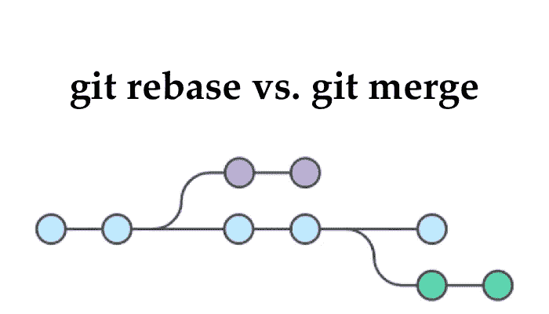
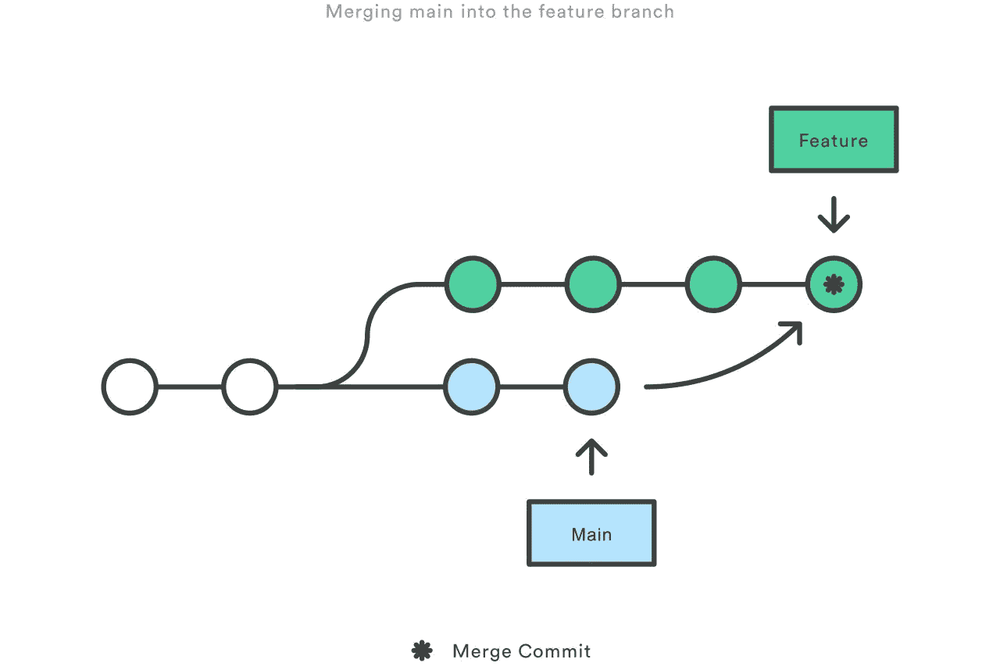
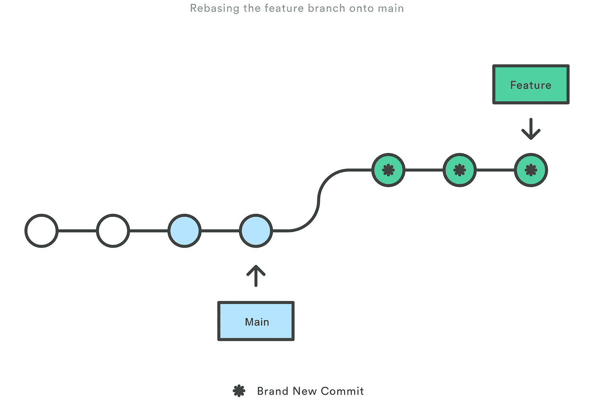

# 理解 Git 合并和 Git Rebase

> 原文：<https://blog.devgenius.io/understanding-git-merge-and-git-rebase-ae8bccf50829?source=collection_archive---------2----------------------->



Git Rebase 和 Git Merge

作为一名开发人员，我们中的许多人不得不在 **git merge** 和 **git rebase 之间做出选择。**在这篇博客中，我将让你清楚这两个命令的一切，然后你将能够自己决定何时使用和使用哪个命令。

首先要理解的是，命令 **git rebase** 和 **git merge** 的目的是一样的。这两个命令都旨在将一个分支的变更集成到另一个分支中——它们只是以非常不同的方式完成。

假设你正在一个专门的分支上从事**特性**的工作。与此同时，有人提交了对主**分支**的一些更改，这导致了分叉的历史，这对于使用过 Git 作为协作工具的人来说应该很熟悉。


现在让我们假设新的提交在某种程度上与您正在处理的特性相关。您有两种选择来将新的提交合并到您的特性分支中:合并或重新定基。

## **Git 合并**



git 合并

对于使用版本控制系统的开发人员来说，合并是一种常见的做法。无论分支是为了测试、错误修复还是其他原因而创建的，合并都会将更改提交到另一个位置。更具体地说，合并获取源分支的内容，并将它们与目标分支集成在一起。在这个过程中，只有目标分支被改变。源分支历史保持不变。

## **怎么做？**

```
**$ git checkout feature****$ git merge master**
```

或者在一条线上你可以做

```
**$ git merge master feature**
```

**使用 git merge 的利弊？**

**优点:**

*   合并很好，因为这是一种非破坏性的 T21 操作。
*   现有的分支不会以任何方式改变。这避免了重定基数的所有潜在缺陷(下面讨论的**)。**
*   **保存完整的历史和时间顺序。**

****缺点:****

*   **如果**主分支**非常活跃，这可能会对你的特征分支的历史造成相当大的影响。虽然有可能通过高级的 git log 选项来缓解这个问题，但是这会让其他开发人员很难理解项目的历史。**

## ****Git Rebase****

****

**git rebase**

**Rebase 是将变更从一个分支整合到另一个分支的另一种方式。Rebase 将所有更改压缩到一个“补丁”中然后，它将补丁集成到目标分支上。与合并不同，重定基础使历史变平，因为它将完成的工作从一个分支转移到另一个分支。在这个过程中，不需要的历史被删除。**

****怎么做？****

```
**$ git checkout feature****$ git rebase master**
```

****使用 git rebase 的利弊？****

****优点:****

*   **重定基础的主要好处是你可以得到一个更加清晰的项目历史。**
*   **在具有繁忙分支的繁忙存储库中避免**合并**提交“噪音”。**
*   **操作单个提交很容易(例如，恢复它们)。**
*   **重定基础还会产生一个完美的线性项目历史——你可以跟随**特性**的提示一直到项目的开始，而不需要任何分叉。**

****缺点:****

*   **将该特性压缩为少量的提交可以隐藏上下文。**
*   **在团队工作时，改变公共存储库的基础是很危险的**
*   **这需要更多的工作:使用 rebase 来保持你的特性分支总是更新的。**
*   **你不正确地改变了基础，无意中改写了历史，这可能会导致严重的问题，所以请确保你知道你在做什么！**

## ****用哪个？****

**在将 Git 设置为 rebase vs. merge 策略时，需要考虑几个问题。因为事实证明，一种工作流策略并不比另一种更好。这取决于你和你的团队。**

**根据我的个人经验，我建议在团队工作时避免使用 git rebase。**

## ****结论****

**我希望这篇博客对 **git merge** 和 **git rebase 给出了一些见解。**了解更多关于 git 命令请查看此 [**文章**](/basic-git-commands-every-developer-should-know-9b947d56bd37) **。****

**如果你有任何问题或反馈，请在下面的评论区告诉我。我们还可以通过**[**Twitter**](https://twitter.com/ApoorvD72358398)和 [**LinkedIn**](https://www.linkedin.com/in/apoorv-dubey-8a3a31191/) 了解更多我的科技之旅。****