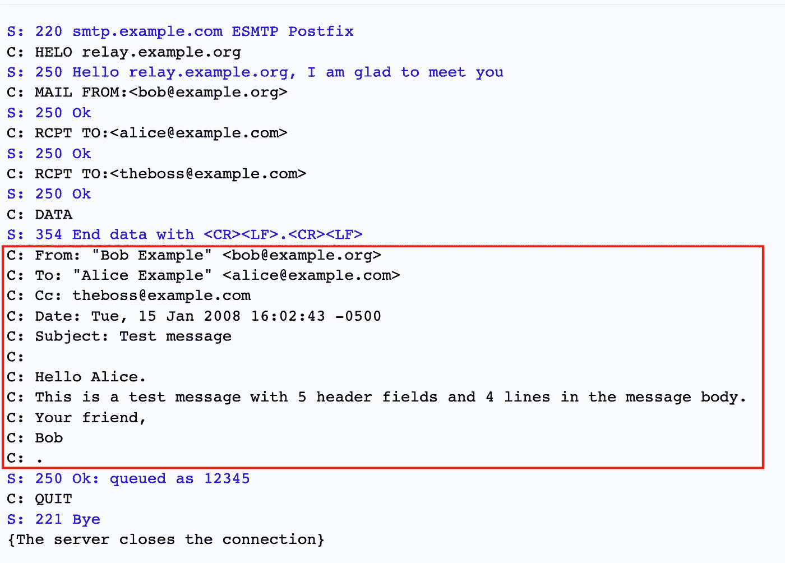

# 了解 Golang net/textproto

> 原文：<https://blog.devgenius.io/understanding-golang-net-textproto-d179591d2dae?source=collection_archive---------3----------------------->


在进入 [**textproto**](https://pkg.go.dev/net/textproto@go1.19) 包和它的一些用途之前，让我们写一个简单的客户机和服务器代码来理解客户机和服务器之间是如何执行读写的。

标准的 [**net**](https://pkg.go.dev/net) 包提供了一个类型 [**Conn 接口**](https://pkg.go.dev/net#Conn) ，可用于向连接写入数据和从连接读取数据。

```
type Conn interface {
   Read(b []byte) (n int, err error)
   Write(b []byte) (n int, err error)
   ....
}
```

在本例中，客户端使用 **Write** 方法将数据写入连接，服务器使用 **Read** 方法读取连接上写入的数据。

注意:为了简单起见，我忽略了代码中返回的错误检查。

使用**读取**的服务器代码

客户端代码使用**编写**

另一种读写方式可以是使用 [**bufio**](https://pkg.go.dev/bufio) 读取器和写入器来实现对 **io 的缓冲。阅读器**和 **io。分别写入**对象。

```
func [NewReader](https://pkg.go.dev/bufio#NewReader)(rd io.Reader) *Reader
NewReader returns a new Reader whose buffer has the default size.func [NewWriter](https://pkg.go.dev/bufio#NewWriter)(w io.Writer) *Writer
NewWriter returns a new Writer whose buffer has the default size.
```

让我们看一个例子。

服务器代码使用 **bufio 读取**

客户端代码使用 **bufio 写**

这是来自标准文档页面的 textproto 的概述。

> Package textproto 实现了对 HTTP、NNTP 和 SMTP 风格的基于文本的请求/响应协议的一般支持。

为了更好的理解，我举一个 **SMTP** 协议的例子。在 SMTP 协议中，电子邮件的正文部分在**数据**命令后从客户端逐行传输到服务器。正文由一系列以`\r\n`结尾的行组成。该序列在仅包含一个点的行结束:`.\r\n`。



[SMTP 维基百科](https://en.wikipedia.org/wiki/Simple_Mail_Transfer_Protocol#:~:text=An%20SMTP%20transaction%20consists%20of,times%2C%20one%20for%20each%20recipient.)

textproto 的 [**DotWriter**](https://pkg.go.dev/net/textproto@go1.19#Writer.DotWriter) 返回一个可以用来编写上述格式的编写器，[**dot reader**](https://pkg.go.dev/net/textproto@go1.19#Reader.DotReader)**提供了一个方便的方法来读取它。它还支持代表 MIME 风格头映射的 [**类型 MimeHeader**](https://pkg.go.dev/net/textproto@go1.19#MIMEHeader) 。它提供了添加新的键-值标题对、获取与标题键相关的值等功能。**

**下面是一个使用 textproto 包的客户端和服务器的例子。**

**我们使用 textproto 的 [**NewReader**](https://pkg.go.dev/net/textproto@go1.19#NewReader) ，它采用 ***bufio。阅读器**阅读器和返回***阅读器****

```
type Reader struct {
	R *[bufio](https://pkg.go.dev/bufio).[Reader](https://pkg.go.dev/bufio#Reader)
}
```

**使用 textproto DotReader 和 MIMEHeader 的服务器代码**

**textproto 的 [**拨**](https://pkg.go.dev/net/textproto@go1.19#Dial) 用网。内部拨号并返回一个新的**型**连接器**用于连接****

```
type Conn struct {
	[Reader](https://pkg.go.dev/net/textproto@go1.19#Reader)
	[Writer](https://pkg.go.dev/net/textproto@go1.19#Writer)
	[Pipeline](https://pkg.go.dev/net/textproto@go1.19#Pipeline)
}
```

**使用 textproto DotWriter 的客户端代码**

**现在就这些了。希望这有所帮助:-)**