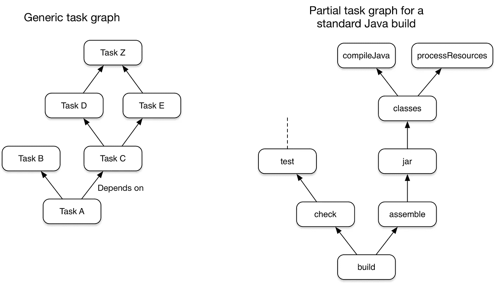

# 了解 Gradle 和构建自动化工具

> 原文：<https://blog.devgenius.io/understanding-gradle-and-build-automation-tools-4d2fa7d09d20?source=collection_archive---------6----------------------->

当我开始使用 Gradle 时，我只是讨厌它，因为我发现它不必要的复杂。不喜欢它的一个很好的理由是不知道构建自动化工具的概念。

一旦我理解了构建工具的用例，以及它是如何让开发人员轻松构建和部署项目的！就是这样！，对格雷尔的尊重越来越多，我决定读更多关于它的书。


# 什么是构建工具，它如何使开发人员的生活变得简单？

我们大多数开始使用或可能使用过 java 之类的语言的人都知道，要运行任何 java 文件，我们需要做的第一件事就是编译 java 文件并生成 Java 类，最后使用`javac`命令运行它。

只对一两个文件这样做似乎没问题，也没有太大的负担，但是如果您想到有几十个甚至几百个文件，并且您必须通过手动完成所有编译任务来创建项目和 jar，那该怎么办呢？

另外，如果你还需要在你的项目中使用第三方库，这又增加了一层复杂性。

这些构建工具为你做的是通过在幕后做艰苦的工作，编译、打包、发布、运行等来自动化所有这些过程。

构建自动化工具为项目提供结构，编译并制作包/罐子，这样开发人员就可以专注于功能而不是构建过程。

此外，它还提供了许多有用的命令来**构建**、**测试**、**包以及更多的**，如果没有构建自动化工具，很难想象当今任何规模的项目开发。

图中列出了几个构建自动化工具—


## 格拉德是什么？

我是从 gradle 开始的，对 **Maven** 或 **Ant** 了解不多，所以我主要是从其他人那里听说这些工具，不同的人根据他们的经验和工作时间喜欢不同的工具，有些人说 Maven 是一个很棒且容易使用的工具，有些人说 Gradle 就像 Maven 一样，有一些额外的功能等等。

所有这些都是真实的，适用于不同的场景，我们现在就来谈谈 gradle

> 定义
> 
> Gradle 是一个开源的构建自动化工具，专注于灵活性和性能。Gradle 构建脚本是使用一个 [Groovy](https://groovy-lang.org/) 或 [Kotlin](https://kotlinlang.org/) DSL 编写的。阅读 [Gradle 特性](https://gradle.org/features/)了解 Gradle 的潜力。—文档

Gradle 只是另一个具有大量功能和灵活性的构建自动化工具，不仅适用于 java，也适用于许多其他语言，如 Scala、C++、Groovy、Kotlin。

它有很棒的特性，如**高性能、Jvm 基础、可扩展性、惯例、IDE 支持和扫描**，我们也将看到 gradle 如何承诺这些功能。

## 格拉德内部是如何工作的？

Gradle 是一个通用的构建工具，允许你构建几乎任何软件，因为它的内部工作假设你的项目的结构和它应该如何构建。

一般来说，像这样的工具被认为是某种结构中的项目，gradle 也不例外。

**渐变任务**

*任务本身包括:*

*   **动作:**做一些事情的工作，比如复制文件或编译源代码
*   **输入:**动作使用或操作的值、文件和目录
*   **输出:**操作修改或生成的文件和目录

Gradle build 只不过是一组任务，每个任务都是由一组指令定义的。Gradle 将其构建建模为任务(工作单元)的 ***有向无环图(Dag)***。Build 根据依赖关系将多组任务组合在一起以使其工作，gradle 有很好的依赖关系管理技术，它可以根据依赖关系结构知道哪个任务需要运行。

此图显示了两个示例任务图，一个是抽象的，另一个是具体的，任务之间的依赖关系用箭头表示:



*来源-分级文档*

在任务图中模拟任何构建过程的能力使得 gradle 同时具有很大的灵活性和可扩展性。

使它更加灵活的是使用它们的构建脚本和构建 DSL 来创建您自己的定制任务。

## 探索 build.gradle

```
plugins {
    id("org.jetbrains.kotlin.jvm") version "1.5.31"

    application
}

repositories {
    mavenCentral() 
}

dependencies {
    implementation(platform("org.jetbrains.kotlin:kotlin-bom")) 

    implementation("org.jetbrains.kotlin:kotlin-stdlib-jdk8") 

    implementation("com.google.guava:guava:30.1.1-jre") 

    testImplementation("org.jetbrains.kotlin:kotlin-test") 

    testImplementation("org.jetbrains.kotlin:kotlin-test-junit") 
}

application {
    mainClass.set("demo.AppKt") 
}
```

1.  **插件**

Gradle 的核心是有意为现实世界的自动化提供很少的东西。所有有用的特性，比如编译 Java 代码的能力，都是由*插件*添加的。插件增加新任务(如 [JavaCompile](https://docs.gradle.org/current/dsl/org.gradle.api.tasks.compile.JavaCompile.html) )、领域对象(如 [SourceSet](https://docs.gradle.org/current/dsl/org.gradle.api.tasks.SourceSet.html) )、约定(如 Java 源代码位于`src/main/java`)以及扩展核心对象和其他插件的对象。

将插件应用到项目允许插件扩展项目的功能

在这种情况下，是为了支持科特林。

插件中的 ***应用*** 只是为了让 gradle 知道这是一个应用，gradle 应该能够使用 CLI 命令构建它。

**2。储存库**

Gradle 可以从一个或多个基于 Maven、Ivy 或平面目录格式的存储库中解析依赖关系。

构建软件的组织可能希望利用公共二进制存储库来下载和使用开源依赖项，或者可能还希望使用私有存储库。

在这种情况下，它是 mavenCentral。

**3。依赖性**

在这里，您可以定义项目中要使用的依赖项，gradle 中的每个依赖项都有一个范围，这意味着您希望在哪个位置使用它，可能是在执行期间，也可能是在测试阶段，这些都是使用实现和测试实现技术定义的。

许多 Gradle 插件将预定义的配置添加到您的项目中。例如，Java 插件添加了配置来表示源代码编译、执行测试等所需的各种类路径。


资料来源:Gradle docs

4.**应用**

在当前的例子中，它被用来定义项目的主类，gradle 可以选择它并从中启动项目，在这种情况下，它是 demo.AppKt。

此外，gradle 还免费提供了一些命令，比如，clean，run，test，build 等等，所有这些命令都可以根据需要和需求进行修改。

这里要注意的是，构建文件的定义语言就像任何其他编程语言一样，这意味着你可以做几乎任何你可以在编程语言中做的事情，并且你应该非常小心地使用这个特性，确保不要在构建文件中添加任何复杂或不必要的东西，这会使它变慢。

# 通过 CLI 创建 gradle 项目

作为先决条件，你需要安装最新的 gradle 发行版，你可以在这里找到这个——[https://gradle.org/install/](https://gradle.org/install/)

安装完毕后，请按照以下步骤操作

1.  创建项目目录并转到该目录


2.使用`gradle init`命令初始化项目


让 gradle 知道您想要创建哪种类型的项目，指定您选择的语言，并构建脚本 DSL，后跟项目和包名，在本例中我使用了默认的名称。

3.探索项目


**项目结构**
├──build . grad le . kts
├──grad le
│└──wrapper
│├──grad le-wrapper . jar
│└──grad le-wrapper . properties
├──grad le
├──grad le . bat
├──settings . grad le . kts
└──src
├──main
│├──主

**13 个目录，8 个文件**

在这里，我们已经准备好了我们的示例项目，我们可以使用 gradle 命令来运行它，一旦项目启动并运行，现在就轮到您来探索更多关于定制和其他 suffs 的基础工作了。

总的来说，我觉得在进行 gradle 项目之前必须有基本的理解，因为大多数时候，人们可能只是从不同的地方复制粘贴命令和脚本，而不知道实际的工作，这可能会使调试变得困难，也可能会减慢您的构建。

其中一个例子是每次都使用 ***清理构建*** 而不知道它的实际用途以及 gradle 如何使用缓存来使您的后续构建更快使用缓存，如果每次都使用清理构建功能都没有用，总体上至少知道您在执行什么。