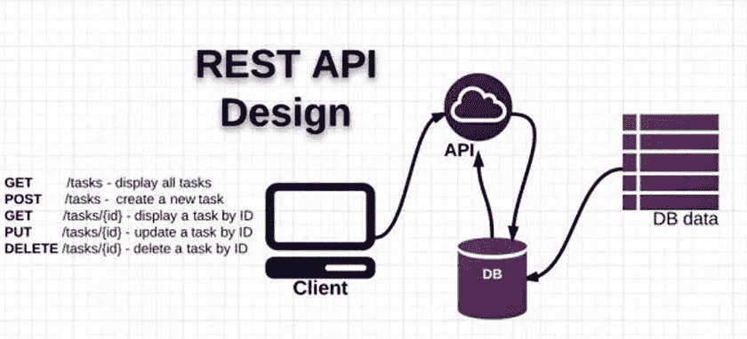

# 了解如何命名 RESTful API 端点

> 原文：<https://blog.devgenius.io/understanding-how-to-naming-restful-api-endpoints-c6d2b58360a9?source=collection_archive---------3----------------------->

## 我们会知道如何解决这个问题

嗨，伙计们，欢迎来到我的博客。今天，我将讨论 RESTful API 端点命名的标准化。

# 当创建一个端点时，它是否已经是标准的？

如果你还不明白，你仍然困惑，或者不管是什么，也许在你读完这篇文章后，我可以打开你的思路。让您的所有端点都标准化。



[https://sudusoftware . com/standar isasi-pengembangan-rest-API/](https://sudusoftware.com/standarisasi-pengembangan-rest-api/)

在我们开始之前，我告诉你**它有什么好处？**

*   资源将是一致的
*   这将是具体和明确的
*   了解它的用途(端点/资源)

那么，秘诀在哪里呢？开始了…

## 作为资源的 URIs 应该是名词

首先，我们有基本 url `https://api-pandhuwibowo.medium.com`。我们将在这个环节中使用的已经结束。

> ESTful URI 应该指的是一个事物(名词)的资源，而不是指一个动作(动词)，因为名词有动词没有的属性——同样，资源也有属性。—[https://restfulapi.net/resource-naming/](https://restfulapi.net/resource-naming/)

在你了解标准之前

```
GET https://api-pandhuwibowo.medium.com/getUser/all
GET https://api-pandhuwibowo.medium.com/getUser/detail/1
POST https://api-pandhuwibowo.medium.com/createUser/new
```

在你了解了标准之后

```
GET https://api-pandhuwibowo.medium.com/customers/
GET https://api-pandhuwibowo.medium.com/customers/{id}
POST https://api-pandhuwibowo.medium.com/customers/create
```

## 使用复数

当我们创建一个 API 时，请在基本 url 后使用复数格式。

例，`before`

```
GET https://api-pandhuwibowo.medium.com/user
DELETE https://api-pandhuwibowo.medium.com/user/{id}/delete
```

`after`

```
GET https://api-pandhuwibowo.medium.com/users
DELETE https://api-pandhuwibowo.medium.com/users/{id}/delete
```

如果多了一个参数，比如我想删除找到的任何类别的子类别。

```
DELETE https://api-pandhuwibowo.medium.com/categories/{categoriesId}/subcategories/{id}
```

## 使用小写字母

尽可能不要使用除小写以外的任何东西。正如他们所说，

> 这主要是因为 URI 标准的 RFC 3986 规范表示 URIs 是区分大小写的(除了 URL 的 scheme 和 host 组件)。小写字母代表 URIs 被广泛使用，也有助于避免大小写不一致的混乱。如果你添加了大写字母，你应该意识到这将会引起混乱，并经常导致用户出错。— [梦工厂](https://blog.dreamfactory.com/best-practices-for-naming-rest-api-endpoints/)

## 使用带连字符的单词

如果端点包含多个单词，可以使用破折号/连字符。

```
POST https://api-pandhuwibowo.medium.com/users/forgot-password
POST https://api-pandhuwibowo.medium.com/sea-cargo
PUT https://api-pandhuwibowo.medium.com/users/{id}/pending-orders
```

## 不要使用特殊字符

为了避免混淆，尽可能不要在 URI 中使用特殊字符。

> 特殊字符不仅是不必要的，它们可能会使熟悉 API 设计和命名的用户感到困惑。它们不是每个人都能轻易得到的，而且技术上很复杂。因为 URL 只能使用 ASCII 字符集发送和接收，所以所有的 API URLs 都应该只包含 ASCII 字符。
> 
> 此外，尽量避免使用“不安全”的 ASCII 字符，为了防止混淆和安全问题，这些字符通常被编码为(例如，空格字符为“%20”)。URL 的“不安全”ASCII 字符包括空格字符(" ")，以及方括号("[]")、尖括号("< >")、大括号(" {} ")和竖线(" | ")。尽可能保持你的名字简单，你不应该有任何问题。在大多数情况下，这些方法与 HTTP 方法相同。— [梦工厂](https://blog.dreamfactory.com/best-practices-for-naming-rest-api-endpoints/)

## 从不使用文件扩展名

文件扩展名看起来很糟糕，没有增加任何优势。移除它们也减少了 URIs 的长度。没有理由留着它们。

除了上述原因之外，如果您想使用文件扩展名突出显示 API 的媒体类型，那么您应该依赖于通过`Content-Type`头传递的媒体类型来确定如何处理主体的内容。

不要这样做

```
GET https://api-pandhuwibowo.medium.com/users/download.csv
```

做这个

```
GET https://api-pandhuwibowo.medium.com/users/download
```

## 使用查询组件过滤 URI 集合

如果需要任何过滤器，我们可以使用查询参数。例子，

```
GET https://api-pandhuwibowo.medium.com/users?firstname=Pandhu
GET https://api-pandhuwibowo.medium.com/users?firstname=Pandhu&lastname=Wibowo
GET https://api-pandhuwibowo.medium.com/users?firstname=Pandhu&lastname=Wibowo&age=20
```

## 支持版本控制

当您的系统是现有的 API 时所使用的版本控制不支持业务，所以这就是您应该重建的原因。从头开始创建，然后是下一个版本。

```
GET https://api-pandhuwibowo.medium.com/v1/users
GET https://api-pandhuwibowo.medium.com/v2/users
```

## 使用英语

最后但同样重要的是，请使用英语，以便人们了解我们使用什么。

我想这些都是社区用的，希望对你有帮助。如果将来有任何更新，我会更新它。谢谢你。干杯。

# 多读我的文章

[](https://pandhuwibowo.medium.com/ngomongin-kenapa-harus-menulis-4a3a492266a1) [## 恩戈蒙金:肯纳帕·哈鲁斯·梅努利斯？

### 嗨，欢迎来到我的博客。我的名字叫 Pandhu，是一个人的名字。

pandhuwibowo.medium.com](https://pandhuwibowo.medium.com/ngomongin-kenapa-harus-menulis-4a3a492266a1) [](https://medium.easyread.co/ngomongin-seberapa-penting-code-yang-mudah-dibaca-260e74805a3) [## Ngomongin:这是什么意思？

### 嗨，赛拉马特大唐迪博客 saya。我叫潘杜·维博沃，是一个被保护的人。

medium.easyread.co](https://medium.easyread.co/ngomongin-seberapa-penting-code-yang-mudah-dibaca-260e74805a3)  [## 人们为成为一名优秀的软件工程师做了什么？

### 嗨，欢迎来到我的博客，今天我将谈论一些不同的，但仍然有趣的东西

pandhuwibowo.medium.com](https://pandhuwibowo.medium.com/what-people-do-for-being-a-good-software-engineer-434c74955d9e) [](https://javascript.plainenglish.io/what-is-void-0-in-javascript-bdd4b3eb19a7) [## JavaScript 中的“void 0”是什么？

### 类似于未定义吗？到底该不该回避？

javascript.plainenglish.io](https://javascript.plainenglish.io/what-is-void-0-in-javascript-bdd4b3eb19a7) [](https://javascript.plainenglish.io/how-to-use-as-const-in-typescript-const-assertions-4ed34921ac51) [## 如何在 TypeScript 中使用“as const ”( const 断言)

### 我们应该什么时候使用它？

javascript.plainenglish.io](https://javascript.plainenglish.io/how-to-use-as-const-in-typescript-const-assertions-4ed34921ac51) 

# 参考

[](https://blog.dreamfactory.com/best-practices-for-naming-rest-api-endpoints/) [## 命名 REST API 端点的最佳实践| DreamFactory 软件-博客

### REST APIs 是将多个应用程序整合在一起的强大工具。它们允许这些应用程序或系统…

blog.dreamfactory.com](https://blog.dreamfactory.com/best-practices-for-naming-rest-api-endpoints/) [](https://betterprogramming.pub/10-best-practices-for-naming-rest-api-endpoints-442ae592a3a0) [## 命名 REST API 端点的 10 个最佳实践

### 避免特殊字符，使用小写名称，等等

better 编程. pub](https://betterprogramming.pub/10-best-practices-for-naming-rest-api-endpoints-442ae592a3a0) [](/best-practice-and-cheat-sheet-for-rest-api-design-6a6e12dfa89f) [## REST API 设计的最佳实践和备忘单

### 下面是完整的图表，便于理解 REST API 的原理、方法和最佳实践。

blog.devgenius.io](/best-practice-and-cheat-sheet-for-rest-api-design-6a6e12dfa89f) [](https://sudusoftware.com/standarisasi-pengembangan-rest-api/) [## API-sudus 软件开发标准

### sudusoftware.com 标准应用程序开发接口(应用程序编程接口)

sudusoftware.com](https://sudusoftware.com/standarisasi-pengembangan-rest-api/) [](https://www.ics.uci.edu/~fielding/pubs/dissertation/rest_arch_style.htm#sec_5_2_1_1) [## 表征状态转移(REST)

### 本章介绍并阐述了表述性状态转移(REST)体系结构…

www.ics.uci.edu](https://www.ics.uci.edu/~fielding/pubs/dissertation/rest_arch_style.htm#sec_5_2_1_1) [](https://restfulapi.net/resource-naming/) [## REST 资源命名指南

### 在 REST 中，主要的数据表示称为资源。拥有一致且健壮的 REST 资源命名…

restfulapi.net](https://restfulapi.net/resource-naming/) [](https://senoritadeveloper.medium.com/rest-api-naming-standards-best-practices-d70ad9b58c66) [## REST API 命名标准和最佳实践

### REST API 命名标准和最佳实践的总结

senoritadeveloper.medium.com](https://senoritadeveloper.medium.com/rest-api-naming-standards-best-practices-d70ad9b58c66)