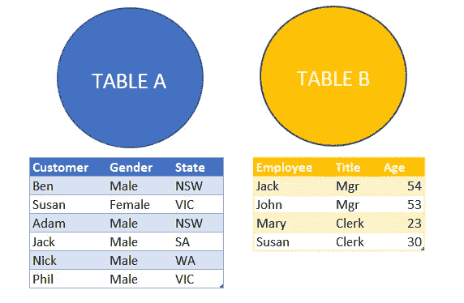
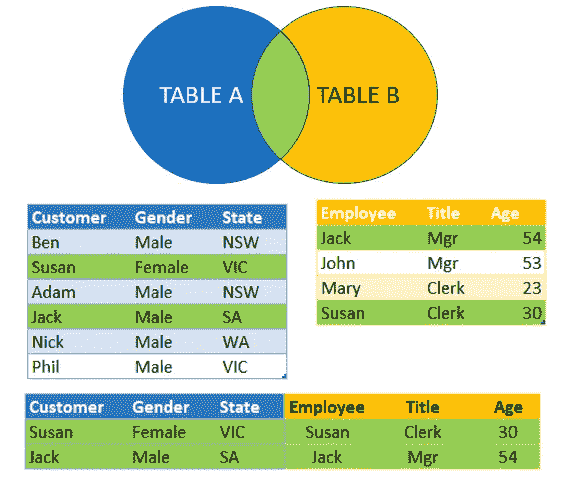
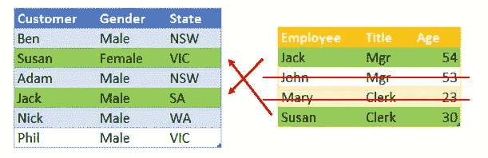
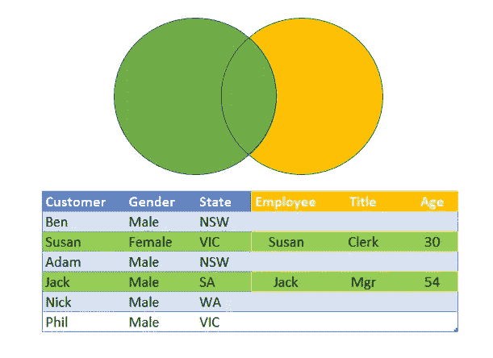
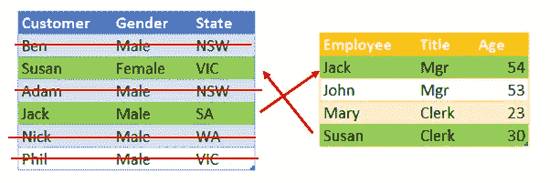
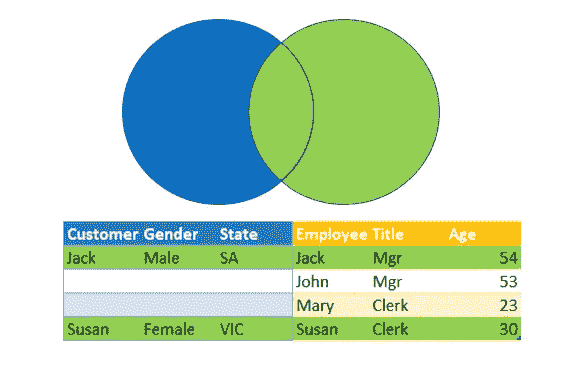
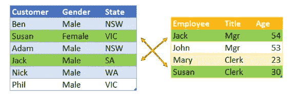
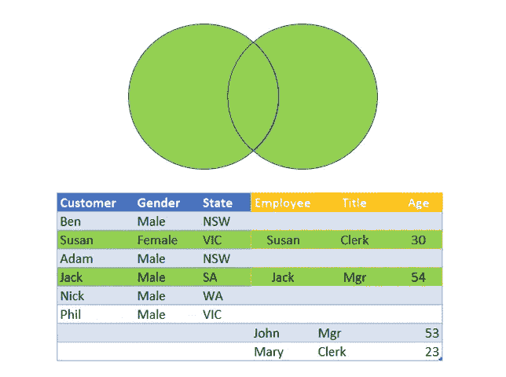
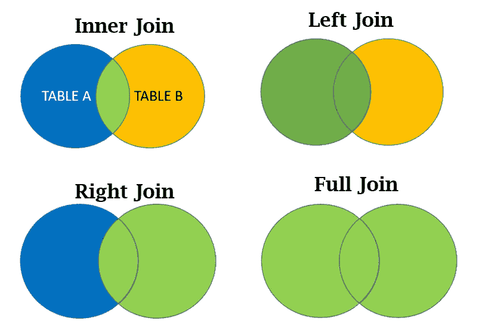

# 了解数据中的连接

> 原文：<https://blog.devgenius.io/understanding-joins-in-your-data-67b458b14157?source=collection_archive---------23----------------------->

> MySql、TSql、Oracle、PLSql 连接类型

图片:克劳斯·维德费尔特|盖蒂图片社

理解两个表之间的不同连接有时会非常混乱。在这篇文章中，我列出了不同类型的连接，以便可视化。

基本上，JOIN 子句用于根据两个或多个表之间的相关列来组合它们中的行。让我们分别来看。

# 连接的类型

假设我们有两个表——表 A 和表 B。基本上，表 A 存储客户数据，表 B 存储雇员数据。

# 内部连接

我们将从查看内部连接开始。从这里我们可以看到，Jack 和 Susan 同时出现在 customer 和 employee 表中。匹配的 2 行被保留，其余不匹配的行被丢弃。

内部连接的结果非常简单。

> **内部联接只查看匹配的行。**

内部连接表

# 左外部连接

对于左外部连接，**左表是主行**。因此，我们将连接客户表的第一个表和雇员表的第一个表。此外，不能从左表中丢弃行。只能从非主表中丢弃行。

左边的桌子将与右边桌子上的杰克相匹配，对苏珊来说也是如此。当有匹配项时，这些行被组合在一起，没有匹配项的行以及相关的列被留空。

总之，左外连接的主要内容是左连接是主表，不应该省略任何内容。

左外部连接

# 右外部联接

右外连接的工作方式与左外连接类似，只是现在右表是主表，而不是左表。

该表的结果将是，当存在匹配时，这些行被组合在一起，而不存在匹配的行，相关的列保留为空白。在这种情况下，左 customer 表为空。

右外部联接

# 完全外部连接

在完全外连接中，两个表都不允许丢弃任何一方表中的任何行。

在最终结果中，如果没有与右表中的行匹配，则左表中会有空格，反之亦然。

完全外部连接

# 摘要

这里总结了连接来自两个数据源的数据表的数据时可以使用的四种连接。

在你的作品中，你很可能会更频繁地使用内连接和左连接。右连接类似于左连接。