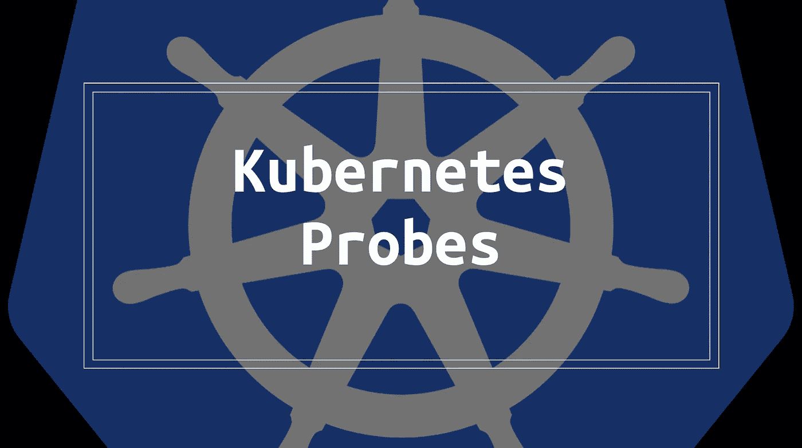
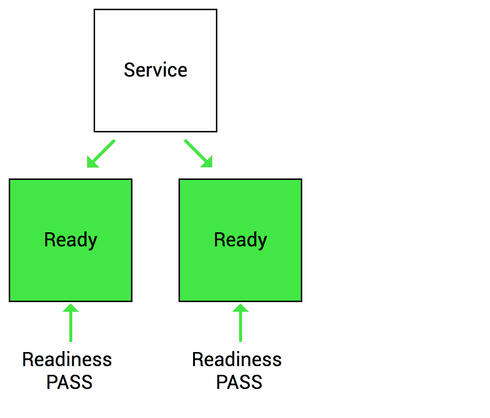
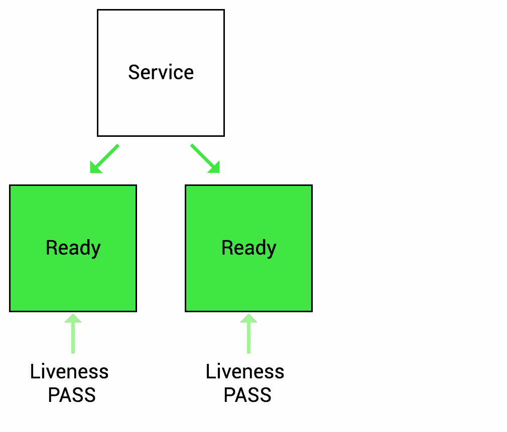

# 了解 Kubernetes 探头

> 原文：<https://blog.devgenius.io/understanding-kubernetes-probes-5daaff67599a?source=collection_archive---------0----------------------->

配置就绪、活动和启动探测器，以检测和处理不正常的 pod。



分布式系统和微服务架构的挑战之一是自动检测不健康的应用程序，将请求重新路由到其他可用系统，并恢复损坏的组件。健康检查是应对这一挑战并确保可靠性的一种方式。使用 Kubernetes，通过探针配置健康检查，以确定每个 pod 的状态。

默认情况下，Kubernetes 只是观察 pod 的生命周期，并在容器从`Pending`状态转移到`Succeeded`状态时开始将流量路由到 pod。Kubelet 还监视应用程序崩溃，并重启 pod 进行恢复。许多开发人员认为这种基本设置已经足够了，尤其是当 pod 内部的应用程序配置了守护进程管理器(例如 Node.js 的 PM2)时。但是，由于 Kubernetes 认为一个 pod 是健康的，只要所有容器启动，就可以接受请求，所以应用程序可能在实际准备好之前就接收流量。如果应用程序需要在处理应用程序逻辑之前初始化某些状态、建立数据库连接或加载数据，就会发生这种情况。当部署开始扩展，未准备好的应用程序接收流量并发回 500 个错误时，应用程序实际准备好的时间与 Kubernetes 认为准备好的时间之间的差距就成了一个问题。

这就是 Kubernetes 探测器用来定义容器何时准备好接受流量以及容器何时应该重新启动的地方。从 Kubernetes 1.16 开始，现在支持三种类型的探针。在本帖中，我们将回顾不同类型的探测、最佳实践和工具，以检测具有潜在配置问题的部署。

# Kubernetes 探针

Kubernetes 支持≤ 1.15 版本的就绪性和活性探测。启动探针是在 1.16 中作为 alpha 特性添加的，并在 1.18 中升级为 beta 特性(*警告:1.16 不赞成使用几个 Kubernetes APIs。使用本* [*迁移指南*](https://medium.com/dev-genius/upgrading-to-kubernetes-1-16-ad977933694d) *检查兼容性*。

所有探头都有以下参数:

*   `initialDelaySeconds`:启动活动或就绪探测前等待的秒数
*   `periodSeconds`:多久检查一次探头
*   `timeoutSeconds`:将探头标记为超时(运行状况检查失败)前的秒数
*   `successThreshold`:探针通过的最小连续成功检查次数
*   `failureThreshold`:将探头标记为失败前的重试次数。对于活性探针，这将导致 pod 重新启动。对于就绪探测，这将把 pod 标记为未就绪。

## 就绪探测

准备就绪探测器用于让 kubelet 知道应用程序何时准备好接受新的流量。如果应用程序在流程开始后需要一些时间来初始化状态，那么可以配置就绪探测来告诉 Kubernetes 在发送新流量之前等待。就绪性探测的一个主要用例是将流量导向服务背后的部署。



图片来源: [GCP 博客](https://cloud.google.com/blog/products/gcp/kubernetes-best-practices-setting-up-health-checks-with-readiness-and-liveness-probes)

准备就绪探测器需要注意的一件重要事情是，它**会在 pod 的整个生命周期**中运行。这意味着准备就绪探测器不仅会在启动时运行，而且会在 pod 运行期间反复运行。这是为了处理应用程序暂时不可用的情况(即加载大量数据、等待外部连接)。在这种情况下，我们不一定要终止应用程序，而是等待它恢复。准备就绪探测器用于检测这种情况，并且不会向这些 pod 发送流量，直到它再次通过准备就绪检查。

## 活性探针

另一方面，活性探测用于重启不健康的容器。kubelet 定期向活性探测器发出 pings 命令，确定其健康状况，如果活性检查失败，就会杀死 pod。活性检查可以帮助应用程序从死锁状态中恢复。在没有活性检查的情况下，Kubernetes 认为死锁的 pod 是健康的，因为从 Kubernetes 的角度来看，底层进程继续运行。通过配置活跃度探测器，kubelet 可以检测到应用程序处于不良状态，并重启 pod 以恢复可用性。



图片来源: [GCP 博客](https://cloud.google.com/blog/products/gcp/kubernetes-best-practices-setting-up-health-checks-with-readiness-and-liveness-probes)

## **启动探针**

启动探测类似于就绪探测，但只在启动时执行。它们针对启动缓慢的容器或初始化过程不可预测的应用程序进行了优化。通过准备就绪探测，我们可以配置`initialDelaySeconds`来确定在探测准备就绪之前要等待多长时间。现在考虑一个应用程序，它偶尔需要下载大量数据或在进程开始时执行一个昂贵的操作。由于`initialDelaySeconds`是一个静态数字，我们被迫总是采取最坏的情况(或者扩展可能影响长时间运行行为的`failureThreshold`)并等待很长时间，即使该应用程序不需要执行长时间运行的初始化步骤。使用启动探测器，我们可以配置`failureThreshold`和`periodSeconds`来更好地模拟这种不确定性。例如，将`failureThreshold`设置为 15，将`periodSeconds`设置为 5，这意味着应用程序在失败前需要 15 x 5 = 75s 才能启动。

# 配置探测操作

现在我们已经了解了不同类型的探测器，我们可以研究配置每个探测器的三种不同方式。

## **HTTP**

kubelet 向一个端点发送一个 HTTP GET 请求，并检查 2xx 或 3xx 响应。您可以重用现有的 HTTP 端点，或者设置一个轻量级 HTTP 服务器用于探测目的(例如，带有`/healthz`端点的 Express 服务器)。

HTTP 探测器接受额外的参数:

*   `host`:要连接的主机名(默认:pod 的 IP)
*   `scheme` : HTTP(默认)或 HTTPS
*   `path`:HTTP/S 服务器上的路径
*   `httpHeaders`:自定义标题，如果您需要用于验证、CORS 设置等的标题值
*   `port`:访问服务器的端口名称或端口号

```
livenessProbe:
   httpGet:
     path: /healthz
     port: 8080
```

## 传输控制协议（Transmission Control Protocol）

如果您只需要检查是否可以建立 TCP 连接，您可以指定一个 TCP 探测器。如果可以建立 TCP 连接，则 pod 标记为健康。对于不适合 HTTP 调用的 gRPC 或 FTP 服务器，使用 TCP 探测可能很有用。

```
readinessProbe:
   tcpSocket:
     port: 21
```

## 命令

最后，可以将探测器配置为运行 shell 命令。如果命令返回退出代码 0，则检查通过；否则，该 pod 被标记为不健康。如果不希望公开 HTTP 服务器/端口，或者如果通过命令检查初始化步骤更容易(例如，检查是否创建了配置文件，运行 CLI 命令)，这种类型的探测器可能会很有用。

```
readinessProbe:
   exec:
     command: ["/bin/sh", "-ec", "vault status -tls-skip-verify"]
```

# 最佳实践

探测器的确切参数取决于您的应用程序，但这里有一些开始使用的一般最佳实践:

*   对于较旧的(≤ 1.15) Kubernetes 集群，使用具有初始延迟的就绪探测器来处理容器启动阶段(为此使用 p99 次)。但是要让这个检查变得轻量级，因为准备就绪探测将在 pod 的整个生命周期中执行。我们不希望探测超时，因为就绪检查需要很长时间来计算。
*   对于较新的(≥ 1.16) Kubernetes 集群，对启动时间不可预测或可变的应用程序使用启动探测器。启动探针可以与准备就绪和活性探针共享相同的端点(例如`/healthz`),但是将`failureThreshold`设置得比其他探针高，以考虑更长的启动时间，但是对于活性和准备就绪检查来说更合理的故障时间。
*   如果准备就绪探测不用于其他信令目的，则准备就绪探测和活性探测可以共享同一个端点。如果只有一个 pod(即使用垂直 Pod 自动缩放器)，请设置就绪探测器来处理启动行为，并使用活性探测器来确定健康状况。在这种情况下，将 pod 标记为不健康意味着停机。
*   准备就绪检查可以以各种方式用于发出系统降级的信号。例如，如果应用程序失去了与数据库的连接，可以使用就绪探测来暂时阻止新的请求，并允许系统重新连接。还可以通过将繁忙的 pod 标记为未就绪来将工作负载平衡到其他 pod。

简而言之，定义良好的探针通常会带来更好的弹性和可用性。确保观察启动时间和系统行为，以便随着应用程序的变化调整探头设置。

# 工具

最后，考虑到 Kubernetes 探针的重要性，您可以使用 Kubernetes 资源分析工具来检测缺失的探针。这些工具可以针对现有集群运行，或者嵌入到 CI/CD 流程中，以便在没有正确配置资源的情况下自动拒绝工作负载。

*   [**【北极星】**](https://github.com/FairwindsOps/polaris) :一个资源分析工具，有一个漂亮的仪表盘，也可以用作验证 webhook 或 CLI 工具。
*   [**kube-score**](https://github.com/zegl/kube-score) :一个静态代码分析工具，可以处理 Helm、Kustomize 和标准 YAML 文件。
*   [**Popeye**](https://github.com/derailed/popeye)**:**只读实用工具，用于扫描 Kubernetes 集群并报告配置的潜在问题。