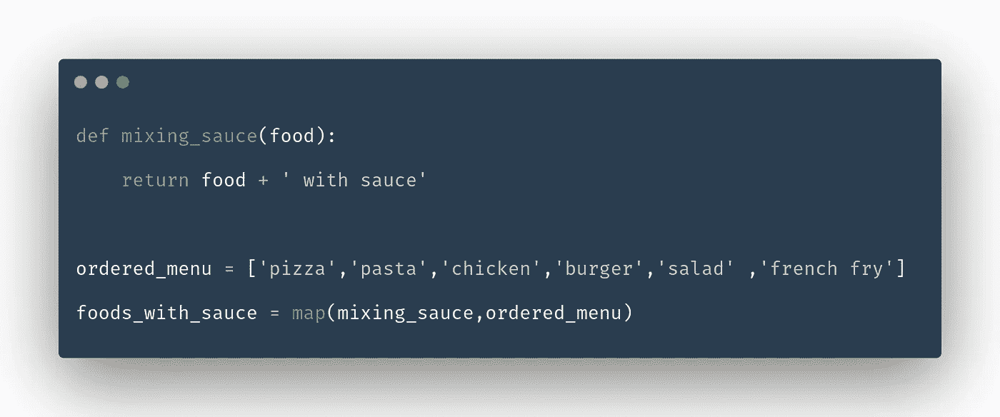

# 通过实例理解 Python 中的 Lambda、Map、Filter 和 Reduce 函数

> 原文：<https://blog.devgenius.io/understanding-lambda-map-filter-and-reduce-function-in-python-by-examples-eda4e6865f7?source=collection_archive---------12----------------------->

**L** et me 介绍我胖乎乎的小伙伴[***Eric Cartman***](https://en.wikipedia.org/wiki/Eric_Cartman)*来自 [**南园**](https://southpark.cc.com/) 。 ***卡特曼*** 可爱，聪明，爱吃！他谈到了自己*

> *我不胖，我只是骨架大*

*今天他将帮助我们了解这些锋利的瑞士军刀在 Python 中的用法。*

**

*南方公园的埃里克·卡特曼带着他的食物和肚子😊*

*在 Python 中，我们更多地使用循环来处理像(列表、数组、元组)这样的可迭代对象。但是事情不只是简单的遍历一个 iterable，我们需要扫描或聚集 iterable 中的数据，并使它们如我们所期望的那样可用。当我们不得不处理更大的 Python 脚本或代码库时，它们可能是重复的和令人不知所措的。*

*这三个功能*

*   ***地图***
*   ***滤镜***
*   ***减少***

*帮助我们减少对 for 循环的依赖。*

*让我们回到我们的朋友卡特曼，他去了一家餐馆，点了一些他喜欢的食物。我们可以在列表中显示它们-*

```
*ordered_menu = ['pizza','pasta','chicken','burger','salad' ,'french fry']*
```

*因此，首先我们将使用 for 循环进行不同的操作*

**

*你可以看到卡特曼使用了*

*   *扫描菜单中蔬菜项目的第一个 for 循环*
*   *第二个是用来把酱汁和菜单上的每一道菜混合在一起*
*   *第三个用于计算项目的总价*

*现在我们将帮助 Cartman 用**映射、过滤、减少**功能替换循环。*

# *过滤器*

*过滤函数基本上是这样写的*

```
*filter(function, iterable)*
```

*所以我们需要一个函数和一个 iterable。把这个函数想象成一个验证器。它将检查 iterable 的单个元素的某些标准，并返回 **True 或 False。** 所以我们的第一个 for 循环会是这样的*

**

*请注意，filter 返回一个值为 **True** 的对象，因此 **veg_foods** 是一个可迭代对象！*

# ***地图***

***map** 函数将给定的函数应用于 iterable 的每一项，并返回结果列表。**映射**功能的语法是如下*

```
*map(function, iterable)*
```

*所以卡特曼的第二个循环现在会像这样*

**

***Map** 函数也产生一个 iterable 对象，我们用 iterable 做了一些改变。*

# *减少*

*我们计算总价的最后一个循环可以用 **reduce** 函数代替。****减少**功能可以写成和**贴图**和**滤镜几乎一样。**但是我们无法访问 reduce 函数，如 map 或 filter，因为它是由 Python 中的 **functiontools** 模块提供的***

```
***reduce(function, iterable)***
```

***所以 **reduce** 函数需要两个参数，一个是**函数**，另一个是 iterable。这个函数需要两个参数。第一个是`iterable`中的第一个元素(如果`initial`未提供)，第二个是`iterable`中的第二个元素。如果提供了`initial`，那么它将成为`func`的第一个参数，而`iterable`中的第一个元素将成为第二个元素。***

*****减少**功能减少(我知道，原谅我)`iterable`成单一值。这就是它如此命名的原因！***

***所以卡特曼的第三个循环看起来像这样***

******

# *****λ函数*****

*****Lambda** 函数是匿名函数，可以支持一个或多个参数，声明后可以立即调用。我们可以用 **lambda 函数**来重写 **map、filter、**和 **reduce** 函数，以更加 Pythonic 化的方式。让我们写吧***

******

***这使得我们的代码更短更干净。***

# ***结论***

***上述函数将帮助我们减少代码中重复循环的依赖性。当你需要循环的时候就使用它们，但是当涉及到过滤项目或者聚合或者对一个 iterable 中的所有元素进行操作的时候，你为什么不利用 Python 提供的这些功能呢！***

> ******为什么我有翅膀能飞还需要脚*** *？
> —* 墨西哥艺术家弗里达·卡罗***

***是的，但是你仍然需要脚走路😆
当你需要走路时，只需使用环即可！当你有了飞翔的环境，你可以使用**贴图、过滤、减少和 lambda 函数**作为你的翅膀！***