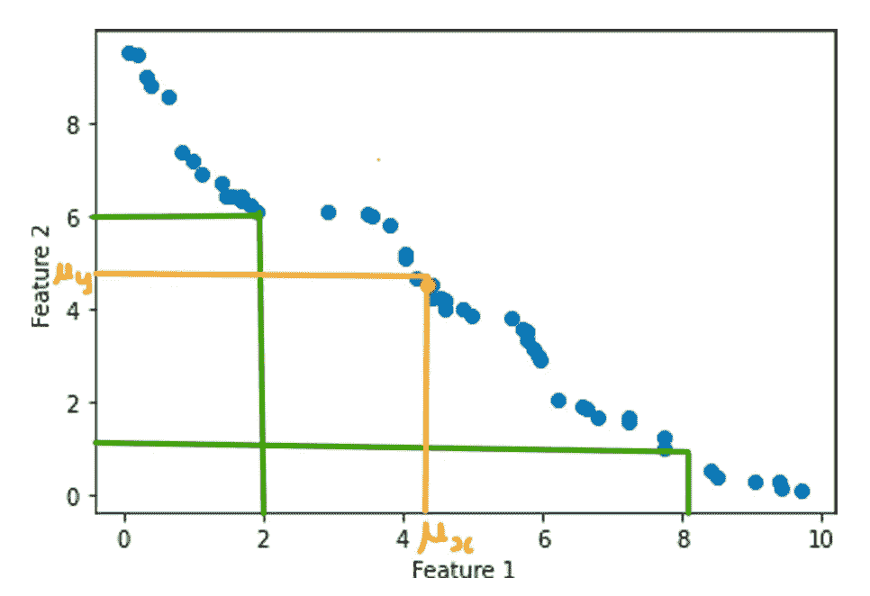

# 什么是协变

> 原文：<https://blog.devgenius.io/understanding-maths-behind-covariance-and-implementation-using-numpy-6014811b44d4?source=collection_archive---------12----------------------->

协变是指两个随机变量之间的系统关系，其中另一个变量的变化反映了一个变量的变化。

协方差值的范围从-∞到+∞，负值表示负相关，正值表示正相关。

这个数字越大，关系就越可靠。

## 让我们先看看有哪些应用:-

*   协方差矩阵有助于找到大多数数据点出现的方向，这也是 PCA 在降维中的目的。
*   协方差在投资组合理论中用于确定投资组合中包含哪些资产。
*   它在生物学中用于计算遗传关系矩阵(GRM)
*   在信号处理中，它用于捕捉信号的频谱变化。

## 协方差背后的数学

在进入协方差公式之前。首先了解什么是方差公式。

差异如下所示:-


现在，如果我们简化这个，


这里对于秒 s(x)如果我们用 y 代替 x，


这个等式被称为协方差

```
import numpy as np
feature1 = np.random.rand(50)*10feature2 = np.random.rand(50)*10
```

## 1.线性增长关系

如图，我们以特征 1 和特征 2 线性增加为例。橙色点代表 X-Y 平面中 f1 和 f2 特征的平均值。

```
import matplotlib.pyplot as plt

ascending_f1 = np.sort(feature1)
ascending_f2 = np.sort(feature2)

plt.scatter(ascending_f1,ascending_f2)
plt.scatter([np.mean(ascending_f1)],[np.mean(ascending_f2)])
plt.xlabel('Feature 1') ; plt.ylabel('Feature 2')
plt.show()
```


上述上升特征的协方差将在 numpy 中计算如下

```
N = ascending_f1.shape[0]
diff1 = ascending_f1 - np.mean(ascending_f1)
diff2 = ascending_f2 - np.mean(ascending_f2)
covariance = np.sum(diff1*diff2) / N-1
print(covariance)6.181944719813141
```

**理解工作数学:-**
现在，让我们来理解，为什么我们得到正值。
为此，让我们考虑上图中的两点对(4，4)和(6，6)。平均值大致在(4.5，4.5)左右。

你可以在下图中看到它


那么，当你对第一个(4，4)点求差时

*   diff 1(4–4.5)它将是负的，因为 4 小于 x 轴上的平均值。
*   diff 2(4–4.5)也将是负的，因为 4 再次小于 y 轴上的平均值。

因此，结果乘积为(-ve) * (-ve) = (+ve)。

同样，当我们寻找(6，6)并求差时

*   diff 1(6–4.5)将为正，因为 6 大于 x 轴上的平均值。
*   diff 2(6–4.5)也将是正的，因为 6 再次大于 y 轴上的平均值。

因此，结果乘积将再次为(+ve) * (+ve) = (+ve)。

因此，当存在线性增加的关系时，我们总是得到正号。

## 2.线性递减关系

现在，让我们考虑当特征 1 增加时，特征 2 减少。

为了更清楚，让我们考虑一个产品是 1 天前的，那么它的销售额是 10 美分，而 10 天前的产品的销售额是 2 美分。因此，产品的年龄和销售额之间存在线性递减关系。

```
import matplotlib.pyplot as plt

ascending_f1 #Feature1#
descending_f2 = ascending_f2[-1::-1] #Feature2#

plt.scatter(ascending_f1,descending_f2)
plt.scatter([np.mean(ascending_f1)],[np.mean(descending_f2)])
plt.xlabel('Feature 1') ; plt.ylabel('Feature 2')
plt.show()
```


协方差的计算方法如下

```
N = descending_f1.shape[0]
diff1 = ascending_f1 - np.mean(ascending_f1)
diff2 = descending_f2 - np.mean(descending_f2)
covariance = np.sum(diff1*diff2) / N-1
print(covariance)-8.102113499370311
```

所以，这里你可以看到，我们得到了负值。因为，我们有线性递减关系。

让我们了解一下，符号是如何计算的:-

我们考虑两个点(2，6)和(8，1 ),平均值大约位于(4，5)



因此，对于点(2，6)和(4，5)处的平均值

*   diff1 将是(2–4)将是负数。
*   diff2 将是(6–5)将是正数。
*   因此，diff1*diff2 将为负。表示为线性递减关系

点(8，1)和(4，5)处的平均值也是如此

*   diff1 将是(8–4)将是正数。
*   diff2 将是(1–5)将是负数。
*   因此，diff1*diff2 将为负。同样，表示为线性递减关系

总之，对于所有低于平均值的 x 点，diff 将为负，而对于所有低于平均值的 y 点，diff 将为正。导致消极的关系。

类似地，对于所有高于平均值的 x 点，diff 将为正，而对于所有高于平均值的 y 点，diff 将为负。导致消极的关系。

## 协变的问题:-

*   当存在大量点簇且具有高偏斜度时，协方差不正确地确定关系。因为，存在偏态时，均值并不代表合适的值。例如在下图中，


*   这可以通过使用关联技术来解决，这将在下一篇博客中讨论。

谢谢你阅读我的故事😊