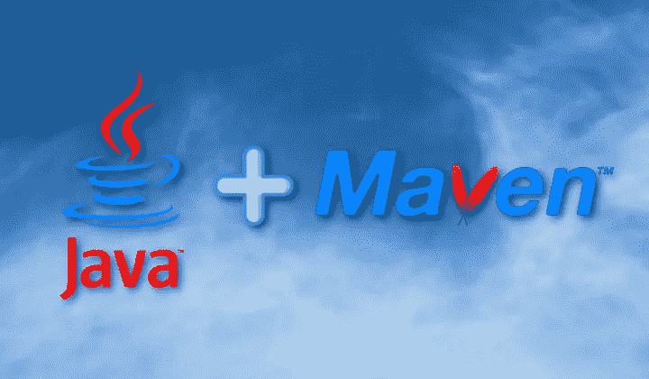
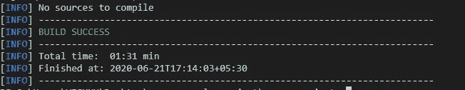
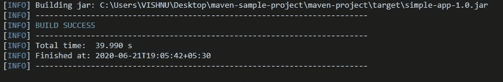
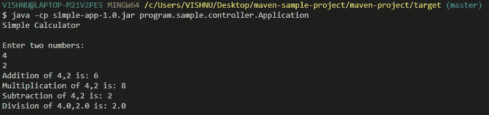
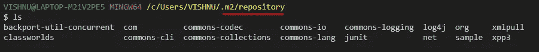
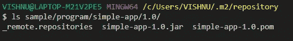
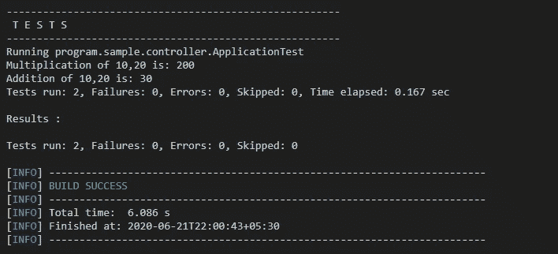
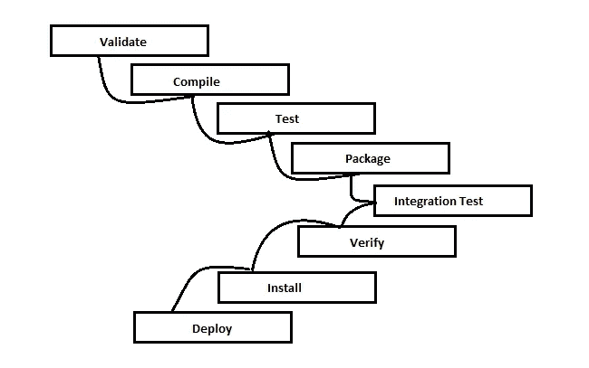

# 通过创建一个简单的 java 项目来理解 Maven

> 原文：<https://blog.devgenius.io/understanding-maven-by-creating-a-simple-java-project-2b432ca635c8?source=collection_archive---------4----------------------->

使用 Maven 项目管理工具创建简单的计算器应用程序



Maven + Java

# Maven 是什么？

Maven 是用于构建和管理任何基于 Java 的项目的工具。它用于项目构建、依赖和文档编制。它像 ANT 一样简化了构建过程。但是比蚂蚁高级太多了。Maven 使 Java 开发人员的日常工作变得更加容易，并且通常有助于理解任何基于 Java 的项目。

# 先决条件

在本地计算机上，安装

1.  Java 语言(一种计算机语言，尤用于创建网站)
2.  专家
3.  饭桶

# 创建 git 仓库

首先，创建一个空的 git 存储库。一定要把 Maven 加进去。创建存储库时忽略文件。

创建之后，将该存储库克隆到您的本地机器上，并在您首选的文本编辑器中打开它。

# POM 是什么？

项目对象模型或 POM 是 Maven 中的基本工作单元。它是一个 XML 文件，包含 Maven 用来构建项目的项目信息和配置细节。它包含大多数项目的默认值。

首先创建一个项目目录。在其中，我们要创建一个 ***pom.xml*** 文件。

下面的代码是该文件的一个锅炉模板。将项目标记、模型版本、属性标记保留为默认值。将您的 jar 文件名添加到 artifactId 标记中，并在 version 标记中给出您的版本。groupId 标记是 java 项目的反向域名

```
**<project 
   ae nd" href="http://maven.apache.org/POM/4.0.0" rel="noopener ugc nofollow" target="_blank">**http://maven.apache.org/POM/4.0.0****" 
   xmlns:xsi="**[**http://www.w3.org/2001/XMLSchema-instance**](http://www.w3.org/2001/XMLSchema-instance)**"
   xsi:schemaLocation="**[**http://maven.apache.org/POM/4.0.0**](http://maven.apache.org/POM/4.0.0)[**http://maven.apache.org/maven-v4_0_0.xsd**](http://maven.apache.org/maven-v4_0_0.xsd)**">******<modelVersion>4.0.0</modelVersion>
  <groupId>clinic.programmming</groupId>
  <artifactId>simple-app</artifactId>
  <version>1.0</version>
  <properties>
    <maven.compiler.source>1.6</maven.compiler.source>
    <maven.compiler.target>1.6</maven.compiler.target>
  </properties>
</project>**
```

要检查一切是否正常，请运行下面的命令。

```
**mvn compile**
```

这将检查 pom.xml 文件并编译它。



如您所见，我们还没有任何源代码，所以它显示没有要编译的源代码。尽管没有源代码，因为没有错误，我们的构建是成功的。

# 标准目录模板

Maven 在 **src/main/java** 目录中寻找源代码，并在 **src/main/resource** s 目录中寻找任何资源，比如属性文件。Maven 将为单元测试文件寻找 **src/test/java** ，为测试资源文件寻找 **src/test/resources**

对于 web 应用程序，maven 查找 **src/java/webapp** 文件夹。

在这里，我们可能不使用一些目录，但对于标准目的是需要的。因此，为了跟踪所有空的存储库，我们添加了 ***。gitkeep* 到它的**文件。

Maven 会将编译好的 Java 类放到**目标/类**文件夹中。

Maven 还将构建一个. jar 或。war 文件，取决于您的项目，它位于“目标”文件夹中。

```
**+ myproject
    + -- src
        + -- main
            + -- java
                 Application.java
        + -- test
            + -- java
                 ApplicationTest.java** **+ -- target
        + -- classes (upon mvn compile)
             Application.class

        myproject.jar (upon mvn package or mvn install)

    pom.xml**
```

# Java 源代码

这是一个简单的 java 代码，计算两个数的加、减、乘、除。

我们在 src/main/java/ directory 中创建一个路径目录/program/sample/controller，并在 Application.java 文件中编写一个简单的计算器代码

```
**package program.sample.controller;****import java.util.*;****class Calculator {****public int add(int i, int j) {
        System.out.println("Addition of " + i + "," + j + " is: " + (i + j));
        return i + j;
    }****public int mul(int i, int j) {
        System.out.println("Multiplication of " + i + "," + j + " is: " + (i * j));
        return i * j;
    }****public int sub(int i, int j) {
        System.out.println("Subtraction of " + i + "," + j + " is: " + (i - j));
        return i - j;
    }****public double div(double i, double j) {
        if (j != 0) {
            System.out.println("Division of " + i + "," + j + " is: " + (i / j));
            return i / j;
        } else {
            System.out.println("Division with 0 is not possible");
            return 0;
        }
    }
}****public class Application {
    public static void main(String[] args) {
        System.out.println("Simple Calculator");
        System.out.println();
        Calculator cal = new Calculator();
        Scanner sc = new Scanner(System.in);
        System.out.println("Enter two numbers: ");
        int a, b;
        a = sc.nextInt();
        b = sc.nextInt();
        cal.add(a, b);
        cal.mul(a, b);
        cal.sub(a, b);
        cal.div(a, b);** **sc.close();
    }
}**
```

要创建包，请运行以下命令

```
**mvn package**
```



它在目标文件夹中创建 jar 文件。

要检查它是否正常工作，请转到目标文件夹并运行应用程序。

```
**java -cp simple-app-1.0.jar program.sample.controller.Application**
```



对于删除以前的构建，我们使用 ***mvn clean*** 命令。它删除目标文件夹。

```
**mvn clean**
```

要删除以前的构建并同时创建包(这里是 jar 文件),请运行以下命令

```
**mvn clean package**
```

为了创建 maven 本地存储库，我们运行

```
**mvn clean install**
```

它创建一个包含 jar 文件及其所有插件和依赖项的本地存储库。

Maven 本地库位于主目录下的 **.m2** 文件夹中。在 windows 中，它的 C:/Users/{您的姓名}/.m2



您可以在**sample/program/simple-app/1.0/**位置找到您的 jar 文件



要获得项目中使用的所有依赖项的列表，我们可以运行

```
**mvn dependency:tree**
```

# 用 junit 测试我们的代码

首先，我们需要 **junit 依赖**。所以我们将 junit 依赖项添加到 pod.xml 中

在依赖关系中，我们将范围声明为 test，因为我们在生产阶段不需要这种依赖关系。

更新的 pod.xml 代码为:

```
**<project 
 ae nd" href="http://maven.apache.org/POM/4.0.0" rel="noopener ugc nofollow" target="_blank">**http://maven.apache.org/POM/4.0.0****" 
 xmlns:xsi="**[**http://www.w3.org/2001/XMLSchema-instance**](http://www.w3.org/2001/XMLSchema-instance)**"
 xsi:schemaLocation="**[**http://maven.apache.org/POM/4.0.0**](http://maven.apache.org/POM/4.0.0)[**http://maven.apache.org/maven-v4_0_0.xsd**](http://maven.apache.org/maven-v4_0_0.xsd)**">
  <modelVersion>4.0.0</modelVersion>
  <groupId>sample.program</groupId>
  <artifactId>simple-app</artifactId>
  <version>1.0</version>
  <properties>
    <maven.compiler.source>1.6</maven.compiler.source>
    <maven.compiler.target>1.6</maven.compiler.target>
  </properties>******<dependencies>
  <dependency>
   <groupId>junit</groupId>
   <artifactId>junit</artifactId>
   <version>3.8.1</version>
   <scope>test</scope>
  </dependency>
 </dependencies>

</project>**
```

接下来，我们在位于 src/**test**/Java/program/sample/controller 目录下的 ApplicationTest.java 文件中编写一个简单的单元测试代码。

```
**package program.sample.controller;****import junit.framework.Assert;
import junit.framework.TestCase;****public class ApplicationTest extends TestCase {
    Calculator cal = new Calculator();

    public void testAdd() {
        Assert.assertEquals(cal.add(10, 20), 30);
    }
    public void testMultiply() {
        Assert.assertEquals(cal.mul(10, 20), 200);
    }
}**
```

要运行我们的测试，在主项目目录中运行 **mvn test** 命令。



> 最后，再次运行 **mvn 全新安装。**
> 
> 这一次，它删除以前的构建，编译代码，运行测试代码，创建 jar 文件并更新 maven 本地存储库。

# 最后，让我们看看 Maven 构建生命周期:阶段



当您调用 mvn deploy 时，mvn 将在部署前执行每个生命周期阶段，顺序为:验证、编译、测试、打包、验证、安装。所有其他阶段都一样。

由于 clean 不是 Maven 默认生命周期的一部分，所以您最终会得到类似 mvn clean install 或 mvn clean package 这样的命令。安装或打包将触发前面的所有阶段，但是您还需要指定 clean。

最后，我们完成了一个简单的 Maven 项目。

Github 链接:-[https://github.com/Vishnukvsvk/maven-project](https://github.com/Vishnukvsvk/maven-project)